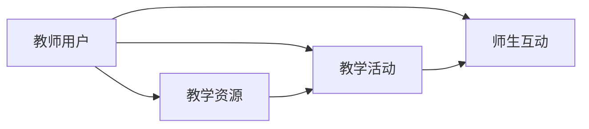

# 网络教学平台-教师子系统设计与实现

## 1.背景介绍

在现代教育领域,网络教学平台已成为不可或缺的重要工具。它打破了传统课堂教学的时空限制,为教师和学生提供了更加灵活、便捷的教学和学习方式。作为网络教学平台的核心组成部分之一,教师子系统在整个平台中扮演着至关重要的角色。本文将深入探讨教师子系统的设计与实现,分析其核心概念、算法原理、数学模型,并结合实际项目经验,给出详细的代码实例和应用场景。

### 1.1 网络教学平台的发展现状
#### 1.1.1 在线教育的兴起
#### 1.1.2 网络教学平台的普及 
#### 1.1.3 教师角色的转变

### 1.2 教师子系统的重要性
#### 1.2.1 教学资源管理
#### 1.2.2 教学活动组织
#### 1.2.3 师生互动交流

### 1.3 教师子系统设计与实现的挑战
#### 1.3.1 用户体验优化
#### 1.3.2 系统性能保证
#### 1.3.3 数据安全防护

## 2.核心概念与联系

在设计教师子系统时,我们需要明确几个核心概念,并理解它们之间的联系。

### 2.1 教师用户
教师用户是教师子系统的主要使用者,具有管理教学资源、组织教学活动、与学生互动等权限。

### 2.2 教学资源
教学资源包括课程大纲、教学视频、课件、作业、试卷等,是教师开展教学活动的基础。

### 2.3 教学活动 
教学活动是教师用户利用教学资源,组织学生开展的一系列教学任务,如在线授课、作业布置、考试测评等。

### 2.4 师生互动
师生互动是教师与学生之间的交流与反馈,包括答疑解惑、讨论交流、成绩评价等。

以下是这些核心概念之间的关系图:



## 3.核心算法原理具体操作步骤

教师子系统的实现离不开一些核心算法的支持,下面我们以推荐算法为例,详细讲解其原理和操作步骤。

### 3.1 协同过滤推荐算法
协同过滤是一种常用的推荐算法,通过分析用户的历史行为,发现用户的兴趣偏好,从而给出个性化的推荐结果。

#### 3.1.1 用户-项目矩阵构建
收集用户对不同项目(如教学资源)的偏好数据,构建用户-项目矩阵。矩阵中的元素表示用户对项目的偏好程度,通常用数值来量化,如1-5分。

#### 3.1.2 用户相似度计算
计算不同用户之间的相似度,常用的方法有欧几里得距离、皮尔逊相关系数等。以皮尔逊相关系数为例,公式如下:

$$
sim(u,v) = \frac{\sum_{i \in I_{uv}}(r_{ui}-\bar{r}_u)(r_{vi}-\bar{r}_v)}{\sqrt{\sum_{i \in I_{uv}}(r_{ui}-\bar{r}_u)^2}\sqrt{\sum_{i \in I_{uv}}(r_{vi}-\bar{r}_v)^2}}
$$

其中,$u$和$v$表示两个用户,$I_{uv}$表示他们共同评分的项目集合,$r_{ui}$和$r_{vi}$分别表示用户$u$和$v$对项目$i$的评分,$\bar{r}_u$和$\bar{r}_v$则表示两个用户的平均评分。

#### 3.1.3 生成推荐结果
根据用户相似度,为目标用户找到最相似的K个用户,然后对这K个用户评分较高但目标用户未评分的项目,计算预测评分,最终得到Top-N推荐列表。预测评分的计算公式为:

$$
P_{ui} = \bar{r}_u + \frac{\sum_{v \in S^K_u}sim(u,v)(r_{vi}-\bar{r}_v)}{\sum_{v \in S^K_u}|sim(u,v)|}
$$

其中,$P_{ui}$表示用户$u$对项目$i$的预测评分,$S^K_u$表示与用户$u$最相似的K个用户集合。

### 3.2 推荐算法的应用
在教师子系统中,我们可以利用协同过滤推荐算法,为教师用户推荐优质的教学资源、教学活动方案等,提高教学效率和质量。同时,也可以根据学生的学习行为和反馈,为教师提供个性化的教学指导建议。

## 4.数学模型和公式详细讲解举例说明

除了推荐算法,教师子系统中还涉及一些其他的数学模型和公式,如学生成绩评估模型、教学质量评价模型等。下面我们以学生成绩评估模型为例进行详细讲解。

### 4.1 加权平均成绩模型
学生的总成绩通常由多个评分项目组成,如平时作业、期中考试、期末考试等。我们可以用加权平均的方法来计算总成绩,公式如下:

$$
G = \sum_{i=1}^n w_i g_i
$$

其中,$G$表示学生的总成绩,$g_i$表示第$i$个评分项目的得分,$w_i$表示第$i$个评分项目的权重,且满足$\sum_{i=1}^n w_i = 1$。

举例说明:假设某门课程的总成绩由平时作业(30%)、期中考试(30%)和期末考试(40%)三部分组成,某学生的得分分别为85分、90分和92分,则他的总成绩为:

$$
G = 0.3 \times 85 + 0.3 \times 90 + 0.4 \times 92 = 89.1
$$

### 4.2 成绩分布模型
为了更好地了解学生成绩的整体情况,我们还可以对成绩分布进行建模分析。常见的成绩分布模型有正态分布、指数分布等。以正态分布为例,其概率密度函数为:

$$
f(x) = \frac{1}{\sqrt{2\pi}\sigma}e^{-\frac{(x-\mu)^2}{2\sigma^2}}
$$

其中,$\mu$和$\sigma$分别表示成绩分布的均值和标准差。通过对成绩数据进行统计分析,我们可以估计出这两个参数,从而刻画出整个班级的成绩分布情况。

### 4.3 数学模型在教师子系统中的应用
利用这些数学模型,教师可以更加科学、准确地评估学生的学习情况,调整教学策略。同时,系统也可以根据成绩分布情况,自动生成学情报告,为教师提供决策支持。

## 5.项目实践：代码实例和详细解释说明

下面我们结合实际项目,给出教师子系统中的一些核心功能的代码实例,并进行详细解释说明。

### 5.1 教学资源管理模块
教学资源管理是教师子系统的重要功能之一,包括资源的上传、下载、编辑、删除等操作。以下是一个简单的资源上传的代码示例(基于Python Flask框架):

```python
@app.route('/upload', methods=['POST'])
def upload_resource():
    if 'file' not in request.files:
        return jsonify({'error': 'No file part'})
    
    file = request.files['file']
    if file.filename == '':
        return jsonify({'error': 'No selected file'})
    
    if file and allowed_file(file.filename):
        filename = secure_filename(file.filename)
        file.save(os.path.join(app.config['UPLOAD_FOLDER'], filename))
        return jsonify({'success': 'File uploaded successfully'})
    
    return jsonify({'error': 'File type not allowed'})
```

这段代码定义了一个`/upload`路由,用于处理教学资源的上传请求。它首先检查请求中是否包含文件,如果没有则返回错误信息。然后获取上传的文件对象,进行文件名和类型的验证,如果通过则将文件保存到指定目录,并返回上传成功的消息。

### 5.2 在线授课模块
在线授课是教师子系统的核心功能,它需要集成视频直播、文档展示、互动答疑等多种功能。以下是一个基于WebRTC的视频直播的简单实现(基于JavaScript):

```javascript
// 获取本地视频流
navigator.mediaDevices.getUserMedia({ video: true, audio: true })
    .then(stream => {
        localStream = stream;
        localVideo.srcObject = stream;
    })
    .catch(err => {
        console.error('Failed to get local stream', err);
    });

// 创建WebRTC连接
function createPeerConnection() {
    peerConnection = new RTCPeerConnection(null);
    
    peerConnection.onicecandidate = handleIceCandidate;
    peerConnection.onaddstream = handleRemoteStreamAdded;
    
    peerConnection.addStream(localStream);
}

// 发起视频通话
function call() {
    createPeerConnection();
    
    const offerOptions = {
        offerToReceiveAudio: 1,
        offerToReceiveVideo: 1
    };
    
    peerConnection.createOffer(offerOptions)
        .then(desc => {
            peerConnection.setLocalDescription(desc)
                .then(() => {
                    sendMessage(desc);
                })
        })
}
```

这段代码首先通过`getUserMedia`方法获取本地的音视频流,然后创建一个WebRTC的`PeerConnection`对象,设置好相关的事件处理函数。在发起通话时,调用`createOffer`方法创建一个通话请求,并将其发送给对方。对方接收到请求后,可以选择接受或拒绝。

### 5.3 师生互动模块
师生互动模块主要包括在线答疑、讨论区等功能,可以使用即时通讯技术来实现。以下是一个简单的聊天室的代码示例(基于Node.js Socket.IO):

```javascript
const express = require('express');
const app = express();
const http = require('http').Server(app);
const io = require('socket.io')(http);

app.get('/', (req, res) => {
    res.sendFile(__dirname + '/index.html');
});

io.on('connection', (socket) => {
    console.log('a user connected');
    
    socket.on('chat message', (msg) => {
        io.emit('chat message', msg);
    });
    
    socket.on('disconnect', () => {
        console.log('user disconnected');
    });
});

http.listen(3000, () => {
    console.log('listening on *:3000');
});
```

这段代码使用Express框架创建了一个Web服务器,并集成了Socket.IO库用于实时通信。当用户连接到服务器时,会触发`connection`事件,服务器可以为其分配一个唯一的Socket对象。当用户发送消息时,会触发`chat message`事件,服务器将消息广播给所有连接的用户。

## 6.实际应用场景

教师子系统在实际教学中有广泛的应用,下面列举几个典型场景:

### 6.1 在线备课
教师可以通过子系统上传和管理各种教学资源,如教案、课件、视频等,方便备课和教学内容的更新迭代。

### 6.2 直播授课
利用子系统的视频直播功能,教师可以开展在线授课,并与学生进行实时互动,突破时空限制,扩大教学覆盖面。

### 6.3 作业和测试
教师可以通过子系统布置和批改作业,组织在线测试,并自动生成成绩报告,大大提高了教学效率和质量。

### 6.4 答疑和辅导
借助子系统的即时通讯工具,教师可以为学生提供在线答疑和辅导服务,及时解决学生的问题,加强师生交流。

## 7.工具和资源推荐

在教师子系统的设计与开发过程中,我们可以借鉴一些优秀的开源项目和工具,提高开发效率和质量。以下是一些推荐:

### 7.1 Moodle
Moodle是一个开源的在线学习平台,提供了丰富的教学管理功能,可以作为教师子系统的参考和二次开发的基础。

### 7.2 BigBlueButton
BigBlueButton是一个开源的Web会议系统,支持音视频互动、文档共享、白板演示等功能,非常适合用于在线教学场景。

### 7.3 Open edX
Open edX是一个开源的在线课程平台,由MIT和Harvard大学共同开发