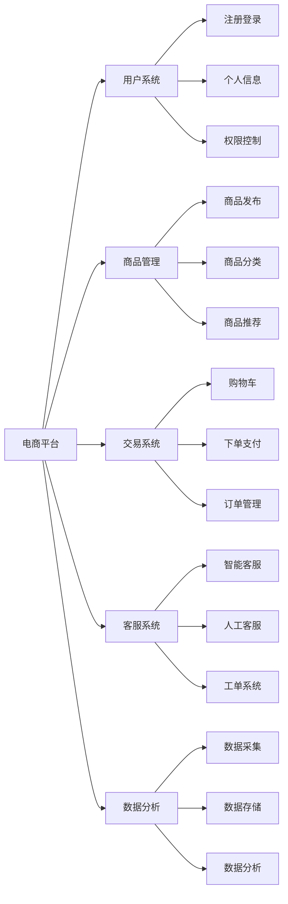

# 网络陶瓷城系统详细设计与具体代码实现

## 1.背景介绍
### 1.1 电子商务发展现状
在当前互联网时代,电子商务已成为商业活动的重要组成部分。据统计,2022年中国电子商务交易额达43.8万亿元,同比增长8.1%。电商平台的蓬勃发展为消费者提供了更加便捷的购物体验,也为商家开拓了更广阔的市场空间。

### 1.2 传统陶瓷行业面临的挑战
作为中国传统产业之一,陶瓷行业虽然历史悠久、工艺精湛,但在互联网时代面临诸多挑战:
- 销售渠道单一,线下门店覆盖有限
- 营销手段落后,难以触达年轻消费群体
- 供应链效率低下,库存管理不善
- 产品同质化严重,缺乏个性化定制服务

### 1.3 网络陶瓷城的发展机遇  
在此背景下,开发一个专业的网络陶瓷城系统,将为陶瓷行业带来新的发展机遇:
- 打通线上线下渠道,拓宽销售网络
- 利用互联网营销,提升品牌影响力 
- 优化供应链管理,降低运营成本
- 引入个性化定制,提高产品附加值

因此,建设一个功能完善、体验优秀的网络陶瓷城系统势在必行。本文将从需求分析、架构设计、核心算法、代码实现等方面进行详细阐述。

## 2.核心概念与联系
### 2.1 电商平台
电商平台是整个网络陶瓷城系统的基础,它连接了买家、卖家、支付、物流等各个环节,是交易撮合与完成的核心载体。一个优秀的电商平台需要具备以下特点:
- 界面友好,布局合理,方便用户浏览与操作
- 商品信息详实,支持多样化的展示方式
- 搜索功能强大,能快速匹配用户需求
- 交易流程顺畅,确保资金与商品安全交付

### 2.2 用户系统
用户系统是电商平台的重要组成部分,它管理着买家和卖家的注册、登录、个人信息等数据。同时,用户系统还承担着认证、授权的职责,是系统安全的重要保障。一个完善的用户系统需要做到:
- 注册登录便捷,支持多种验证方式
- 个人信息完善,满足业务需求
- 权限控制严密,保障账户与交易安全
- 隐私保护到位,杜绝信息泄露

### 2.3 商品管理 
商品管理是商家运营的核心,它涉及商品的发布、编辑、分类、推荐等诸多方面。一个优秀的商品管理模块需要具备以下特点:
- 发布流程清晰,引导商家规范操作 
- 分类体系合理,方便用户检索浏览
- 商品信息丰富,包含图片、视频、参数等多种形式
- 推荐策略多样,能够匹配用户偏好

### 2.4 交易系统
交易系统是电商平台的核心功能,它涵盖了从商品选购到支付完成的整个闭环。一个可靠的交易系统需要做到:
- 购物车功能完善,支持修改、删除等操作
- 下单流程顺畅,确认订单信息无误
- 支付渠道丰富,保障资金安全
- 订单状态同步,让用户实时掌握进度

### 2.5 客服系统
客服系统是提升用户体验的关键一环,它为买卖双方提供了沟通渠道,能够及时处理交易中的问题与纠纷。一个有温度的客服系统需要做到:
- 智能客服机器人,解答常见问题
- 人工客服支持,提供专业服务
- 工单系统完善,跟踪问题解决过程
- 评价体系健全,重视用户反馈

### 2.6 数据分析
数据分析是电商平台持续优化的重要手段,通过收集和挖掘用户行为数据,可以洞察用户需求,指导运营策略。一个有效的数据分析系统需要做到:
- 数据采集全面,覆盖用户各个行为环节
- 数据存储安全,防止泄露与损毁
- 数据分析及时,形成可视化报表
- 数据应用到位,优化产品与运营

### 概念联系图

## 3.核心算法原理具体操作步骤
### 3.1 个性化商品推荐
个性化商品推荐可显著提高网站的转化率和用户粘性,其核心是根据用户历史行为,预测其可能感兴趣的商品。常见的推荐算法包括:
#### 3.1.1 协同过滤算法
- 基于用户的协同过滤:根据用户相似度,推荐相似用户喜欢的商品
- 基于物品的协同过滤:根据商品相似度,推荐同类商品

具体步骤如下:
1. 收集用户行为数据,如点击、购买、评分等
2. 计算用户(或商品)之间的相似度,常用余弦相似度、皮尔逊相关系数等
3. 选取与目标用户(或商品)最相似的Top N用户(或商品) 
4. 推荐相似用户喜欢(或购买)的商品

#### 3.1.2 基于内容的推荐
基于内容的推荐根据商品本身的属性特征,向用户推荐相似的商品。

具体步骤如下:  
1. 对商品进行属性标注,如类别、风格、材质等
2. 提取用户的偏好特征,如历史浏览、购买的商品属性
3. 计算候选商品与用户偏好的相似度
4. 推荐相似度最高的商品

#### 3.1.3 组合推荐
实际系统中常采用多种算法组合,以达到更好的推荐效果。如可以先用协同过滤生成候选集,再用基于内容的方法进行排序。

### 3.2 智能搜索
智能搜索让用户能够快速精准地找到所需商品,提升购物体验。其关键是对商品信息进行合理的分词、抽取、索引,构建高效的检索系统。

#### 3.2.1 分词与特征提取
- 中文分词:将商品标题、描述等文本信息切分成有意义的词语,常用jieba等工具
- 特征提取:从文本中抽取商品属性、类别等结构化信息,可使用正则、词典等方法

#### 3.2.2 索引构建
- 倒排索引:对分词结果建立倒排索引,提高检索效率
- 索引优化:采用合适的数据结构(如B+树),并定期合并、删除过期索引

#### 3.2.3 查询解析与检索
- 查询解析:对用户输入的搜索词进行分词、纠错、扩展等处理,生成标准查询
- 相关度计算:根据查询词与商品的相关度进行打分排序,常用TF-IDF、BM25等算法
- 多途径检索:除文本检索外,还可支持图像搜索、语音搜索等多种方式

### 3.3 智能客服
智能客服可代替人工解答常见问题,提高客服效率。其本质是通过自然语言处理技术,理解用户问题并给出合适的答复。

#### 3.3.1 意图识别
意图识别就是判断用户问题所属的类别,如商品咨询、物流查询、售后服务等。常用方法包括:
- 关键词匹配:预设关键词及对应意图,匹配用户问题中的关键词
- 文本分类:将问题看做文本分类任务,用SVM、朴素贝叶斯等机器学习模型判别

#### 3.3.2 槽位填充
槽位填充是从用户问题中提取关键信息,如商品名称、订单号等,以便查询数据库或调用相关接口。常用方法包括:
- 命名实体识别:用BiLSTM-CRF等序列标注模型识别问题中的实体
- 正则匹配:用正则表达式匹配订单号、日期等格式化信息

#### 3.3.3 答案生成
根据意图和槽位,从知识库中检索合适的答案,或调用相应的API获取所需信息,并组织成自然语言回复用户。知识库可以通过以下方式构建:
- 人工编写:预设常见问题及答案,人工录入知识库
- 自动爬取:定期爬取FAQ页面、用户评价等,自动更新知识库
- 机器学习:从历史对话数据中学习对话策略,生成回复

## 4.数学模型和公式详细讲解举例说明
### 4.1 协同过滤算法
协同过滤算法的核心是计算用户(或商品)之间的相似度,常用的相似度度量包括:

#### 4.1.1 余弦相似度
余弦相似度计算两个向量夹角的余弦值,取值范围为[-1,1],值越大表示越相似。设用户$u$和$v$的评分向量分别为$\mathbf{r}_u$和$\mathbf{r}_v$,则其余弦相似度为:

$$
\text{sim}(u,v) = \cos(\mathbf{r}_u,\mathbf{r}_v) = \frac{\mathbf{r}_u \cdot \mathbf{r}_v}{||\mathbf{r}_u|| \times ||\mathbf{r}_v||}
$$

其中$\cdot$表示向量点积,$||\cdot||$表示向量的模长。

举例说明:假设用户$u$对商品$A$、$B$、$C$的评分为(4,5,2),用户$v$对商品$A$、$B$、$D$的评分为(3,4,1),则:

$$
\begin{aligned}
\mathbf{r}_u &= (4,5,2) \\
\mathbf{r}_v &= (3,4,1) \\
\mathbf{r}_u \cdot \mathbf{r}_v &= 4 \times 3 + 5 \times 4 + 2 \times 0 = 32 \\
||\mathbf{r}_u|| &= \sqrt{4^2 + 5^2 + 2^2} \approx 6.71 \\ 
||\mathbf{r}_v|| &= \sqrt{3^2 + 4^2 + 1^2} \approx 5.10 \\
\text{sim}(u,v) &= \frac{32}{6.71 \times 5.10} \approx 0.935
\end{aligned}
$$

可见用户$u$和$v$的兴趣非常相似。

#### 4.1.2 皮尔逊相关系数
皮尔逊相关系数衡量两个变量的线性相关程度,取值范围为[-1,1],绝对值越大表示相关性越强。设$I_{uv}$为用户$u$和$v$共同评分的商品集合,$r_{ui}$为用户$u$对商品$i$的评分,$\bar{r}_u$为$u$的平均评分,则皮尔逊相关系数为:

$$
\text{sim}(u,v) = \frac{\sum_{i \in I_{uv}}(r_{ui} - \bar{r}_u)(r_{vi} - \bar{r}_v)}{\sqrt{\sum_{i \in I_{uv}}(r_{ui} - \bar{r}_u)^2} \sqrt{\sum_{i \in I_{uv}}(r_{vi} - \bar{r}_v)^2}}
$$

相比余弦相似度,皮尔逊相关系数还考虑了用户评分的平均值,减少了用户评分尺度不同带来的影响。

### 4.2 TF-IDF算法
TF-IDF(Term Frequency-Inverse Document Frequency)用于衡量一个词语对一篇文档的重要程度。直观上,一个