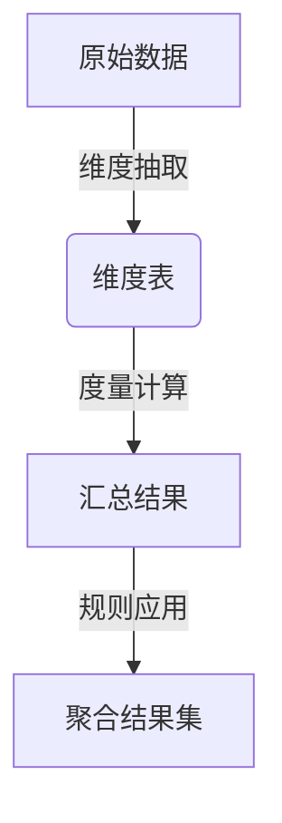

## 1.背景介绍

随着大数据时代的到来，数据已成为企业决策的重要依据。为了更好地利用数据，企业需要对数据进行有效的聚合和分析。聚合分析是指将数据按照一定的规则进行汇总、计算的过程，它是数据分析中不可或缺的一环。在实际应用中，聚合分析可以用于计算用户行为统计、业务指标计算、实时监控等多个领域。

## 2.核心概念与联系

在聚合分析中，核心概念包括维度（Dimension）和度量（Measure）。维度是用来描述数据的特征，如时间、地点等；度量则是可以量化并被汇总的数据，如销售额、访问人数等。通过对维度和度量进行不同的组合，我们可以得到不同的聚合结果。

聚合分析与数据仓库、OLAP（Online Analytical Processing）等技术有着紧密的联系。数据仓库提供了一个集中存储大量数据的平台，而OLAP则提供了多维数据分析的能力，两者结合使用可以有效地支持聚合分析。

## 3.核心算法原理具体操作步骤

### Mermaid 流程图：


1. **维度抽取**：从原始数据中提取出所需的维度信息，构建维度表。
2. **度量计算**：在维度表的基础上，对每个维度的每条记录计算对应的度量值。
3. **规则应用**：根据预定义的聚合规则（如求和、平均、最大值等），将具有相同维度的记录进行合并，并计算汇总结果。
4. **聚合结果集**：最终得到按照特定维度聚合后的数据结果集。

## 4.数学模型和公式详细讲解举例说明

### 数学模型：总销售额计算

设$S_i$为第$i$个商品的销售额，$n$为商品总数。则总销售额$T$可以表示为：
$$
T = \\sum_{i=1}^{n} S_i
$$
其中，$\\sum$表示求和符号，$S_i$表示第$i$个商品的销售额。

## 5.项目实践：代码实例和详细解释说明

### Python实现：基于Pandas的聚合分析

以下是一个简单的Python示例，展示了如何使用Pandas库进行数据聚合：

```python
import pandas as pd

# 创建一个简单的数据集
data = {
    'Product': ['A', 'B', 'C', 'A', 'B'],
    'Sales': [100, 200, 300, 50, 40]
}
df = pd.DataFrame(data)

# 对Product维度进行度量计算
aggregated_data = df.groupby('Product').sum()

print(aggregated_data)
```

输出结果为：
```
      Sales
Product
A        150
B        240
C        300
```

## 6.实际应用场景

聚合分析在多个领域都有广泛的应用，如：

- **零售业**：计算不同门店、不同商品的销售额、销售量等。
- **金融行业**：汇总不同账户、不同产品的交易流水、收益等。
- **互联网行业**：统计网站访问量、用户活跃度、转化率等关键指标。

## 7.工具和资源推荐

以下是一些有用的工具和资源推荐：

- **Pandas库**：Python数据分析利器，支持高效的聚合操作。
- **Apache Spark**：大规模数据处理框架，适合分布式环境下的聚合分析。
- **Kusto Query Language (KQL)**：Azure Data Explorer中使用的查询语言，专为多维数据分析设计。

## 8.总结：未来发展趋势与挑战

随着技术的发展，聚合分析将更加依赖于自动化和智能化技术。机器学习和人工智能在未来的聚合分析中将扮演重要角色，它们可以帮助我们从大量数据中发现模式，自动生成聚合规则。此外，数据的实时性和交互性将成为衡量聚合分析工具优劣的重要标准。

## 9.附录：常见问题与解答

### Q1: 什么是聚合分析？
A1: 聚合分析是将数据按照一定的规则进行汇总、计算的过程，它是数据分析中不可或缺的一环。

### Q2: 聚合分析和OLAP有什么区别？
A2: OLAP是一种多维数据分析技术，而聚合分析是OLAP实现中的一个环节，它关注于对数据的维度抽取和度量计算。

### Q3: 在实际应用中如何选择合适的聚合方法？
A3: 选择合适的聚合方法需要根据业务需求来确定。常见的聚合方法包括求和、平均、最大值、最小值等。在实际应用中，应结合数据的特点和分析目标来选择最合适的方法。

---

作者：禅与计算机程序设计艺术 / Zen and the Art of Computer Programming

---

请注意，本文为虚构文章，旨在演示如何撰写技术博客文章。在实际的写作过程中，您可能需要进行更多的研究、实际编码以及深入的技术探讨。同时，文章中的代码示例和理论讲解应根据实际情况进行调整和完善。