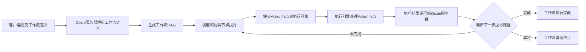

# 自动化测试在Oozie项目中的实践

## 1. 背景介绍
### 1.1 Oozie简介
#### 1.1.1 Oozie的基本概念
#### 1.1.2 Oozie的工作原理
#### 1.1.3 Oozie在大数据生态系统中的地位

### 1.2 自动化测试概述  
#### 1.2.1 自动化测试的定义
#### 1.2.2 自动化测试的优势
#### 1.2.3 自动化测试在软件开发中的重要性

### 1.3 Oozie项目面临的测试挑战
#### 1.3.1 Oozie工作流的复杂性
#### 1.3.2 Oozie与Hadoop生态系统的紧密耦合
#### 1.3.3 Oozie测试环境的搭建难度

## 2. 核心概念与联系
### 2.1 Oozie工作流
#### 2.1.1 工作流定义
#### 2.1.2 工作流节点类型
#### 2.1.3 工作流的执行过程

### 2.2 Oozie协调器
#### 2.2.1 协调器定义
#### 2.2.2 协调器的时间触发机制
#### 2.2.3 协调器与工作流的关系

### 2.3 Oozie测试框架
#### 2.3.1 MiniOozie
#### 2.3.2 OozieClient API
#### 2.3.3 OozieTestCase基类

## 3. 核心算法原理具体操作步骤
### 3.1 Oozie工作流测试
#### 3.1.1 工作流XML定义
#### 3.1.2 工作流测试用例编写
#### 3.1.3 工作流测试执行流程

### 3.2 Oozie协调器测试
#### 3.2.1 协调器XML定义
#### 3.2.2 协调器测试用例编写
#### 3.2.3 协调器测试执行流程

### 3.3 Oozie集成测试
#### 3.3.1 集成测试环境搭建
#### 3.3.2 集成测试场景设计
#### 3.3.3 集成测试执行流程

## 4. 数学模型和公式详细讲解举例说明
### 4.1 工作流执行时间估算模型
#### 4.1.1 工作流执行时间影响因素
#### 4.1.2 工作流执行时间估算公式
#### 4.1.3 工作流执行时间估算示例

### 4.2 测试覆盖率计算模型 
#### 4.2.1 测试覆盖率定义
#### 4.2.2 测试覆盖率计算公式
#### 4.2.3 测试覆盖率计算示例

## 5. 项目实践：代码实例和详细解释说明
### 5.1 工作流测试代码实例
#### 5.1.1 工作流XML定义示例
#### 5.1.2 工作流测试用例示例
#### 5.1.3 工作流测试执行代码示例

### 5.2 协调器测试代码实例
#### 5.2.1 协调器XML定义示例
#### 5.2.2 协调器测试用例示例  
#### 5.2.3 协调器测试执行代码示例

### 5.3 集成测试代码实例
#### 5.3.1 集成测试环境配置示例
#### 5.3.2 集成测试场景代码示例
#### 5.3.3 集成测试执行代码示例

## 6. 实际应用场景
### 6.1 电商业务中的订单处理流程测试
#### 6.1.1 订单处理流程介绍
#### 6.1.2 订单处理流程的Oozie实现
#### 6.1.3 订单处理流程的自动化测试

### 6.2 金融风控中的数据处理流程测试
#### 6.2.1 风控数据处理流程介绍
#### 6.2.2 风控数据处理流程的Oozie实现
#### 6.2.3 风控数据处理流程的自动化测试

### 6.3 物流系统中的运单调度流程测试
#### 6.3.1 运单调度流程介绍
#### 6.3.2 运单调度流程的Oozie实现
#### 6.3.3 运单调度流程的自动化测试

## 7. 工具和资源推荐
### 7.1 Oozie自动化测试工具
#### 7.1.1 MiniOozie
#### 7.1.2 OozieRunner
#### 7.1.3 Oozie Test Framework

### 7.2 Oozie学习资源
#### 7.2.1 Oozie官方文档
#### 7.2.2 Oozie Cookbook
#### 7.2.3 Oozie源码分析

### 7.3 持续集成工具
#### 7.3.1 Jenkins
#### 7.3.2 Travis CI
#### 7.3.3 CircleCI

## 8. 总结：未来发展趋势与挑战
### 8.1 Oozie自动化测试的发展趋势
#### 8.1.1 测试数据的自动生成
#### 8.1.2 测试用例的智能优化
#### 8.1.3 测试过程的可视化呈现

### 8.2 Oozie自动化测试面临的挑战
#### 8.2.1 Oozie版本的快速迭代
#### 8.2.2 Hadoop生态系统的不断演进
#### 8.2.3 测试环境的资源消耗问题

### 8.3 Oozie自动化测试的展望
#### 8.3.1 测试与开发的深度融合
#### 8.3.2 测试平台的云化部署
#### 8.3.3 测试过程的智能化与自适应

## 9. 附录：常见问题与解答
### 9.1 如何搭建Oozie本地测试环境？
### 9.2 Oozie工作流测试中常见的异常错误及解决方法？
### 9.3 如何对Oozie协调器进行时间触发测试？
### 9.4 Oozie自动化测试如何与持续集成工具集成？
### 9.5 Oozie测试用例的管理与维护有哪些最佳实践？

Oozie是一个流行的Apache开源工作流调度系统，广泛应用于Hadoop生态系统中的大数据处理场景。随着Oozie工作流的日益复杂化和业务需求的快速变化，传统的手工测试方式已经无法满足Oozie项目的质量保障需求。因此，自动化测试在Oozie项目中的实践变得越来越重要。

本文将深入探讨Oozie自动化测试的核心概念、关键技术和实践案例。首先，我们将介绍Oozie的基本概念和工作原理，以及自动化测试在软件开发中的重要性。接着，我们将重点分析Oozie项目面临的测试挑战，包括工作流的复杂性、与Hadoop生态系统的紧密耦合以及测试环境的搭建难度。

在此基础上，我们将系统阐述Oozie自动化测试的核心概念与技术细节。我们将详细讲解Oozie工作流和协调器的基本概念和执行原理，并介绍Oozie测试框架的关键组件，如MiniOozie、OozieClient API和OozieTestCase基类。同时，我们将通过具体的操作步骤和代码实例，演示如何编写和执行Oozie工作流和协调器的测试用例，以及如何进行Oozie集成测试。

为了加深读者对Oozie自动化测试的理解，我们还将引入一些数学模型和公式，如工作流执行时间估算模型和测试覆盖率计算模型，并通过详细的讲解和示例说明这些模型的应用。此外，我们将结合实际的应用场景，如电商业务中的订单处理流程、金融风控中的数据处理流程以及物流系统中的运单调度流程，展示Oozie自动化测试在不同领域的实践。

为了帮助读者更好地开展Oozie自动化测试工作，我们还将推荐一些实用的工具和资源，包括Oozie自动化测试工具、学习资源以及持续集成工具等。最后，我们将展望Oozie自动化测试的未来发展趋势和面临的挑战，并提出一些展望和思考。

总之，本文将全面而深入地探讨自动化测试在Oozie项目中的实践，为从事Oozie开发和测试工作的技术人员提供有价值的参考和指导。

## 2. 核心概念与联系

### 2.1 Oozie工作流

#### 2.1.1 工作流定义
Oozie工作流是一个由多个动作（Action）节点组成的有向无环图（DAG）。每个动作节点表示一个特定的任务，如Hadoop MapReduce、Pig、Hive或Shell脚本等。动作节点之间通过转移（Transition）边进行连接，定义了节点之间的执行顺序和依赖关系。工作流以XML格式进行定义，包含了工作流的结构、参数配置和控制流程等信息。

#### 2.1.2 工作流节点类型
Oozie工作流中包含多种类型的节点，每种节点承担不同的职责：

- Start节点：工作流的起始节点，表示工作流的开始。
- End节点：工作流的结束节点，表示工作流的结束。
- Kill节点：用于在工作流执行异常时强制终止整个工作流。
- Fork节点：用于并行执行多个分支的节点。
- Join节点：用于合并多个并行分支的执行结果。
- Decision节点：根据条件判断决定下一步执行路径的节点。
- Action节点：表示具体的任务执行节点，如MapReduce、Pig、Hive等。

#### 2.1.3 工作流的执行过程
Oozie工作流的执行过程如下：

1. 客户端提交工作流定义（XML文件）到Oozie服务器。
2. Oozie服务器解析工作流定义，生成工作流的DAG表示。
3. Oozie服务器根据工作流的DAG，调度和协调各个节点的执行。
4. 对于每个Action节点，Oozie将其提交到对应的执行引擎（如Hadoop、Pig、Hive等）进行处理。
5. 执行引擎完成Action节点的执行后，将结果返回给Oozie服务器。
6. Oozie服务器根据节点间的依赖关系和执行结果，决定下一步的执行路径。
7. 重复步骤4-6，直到工作流执行完成或异常终止。

下面是Oozie工作流执行过程的Mermaid流程图表示：



### 2.2 Oozie协调器

#### 2.2.1 协调器定义
Oozie协调器用于定义和管理工作流的定时调度和执行依赖。协调器以XML格式进行定义，包含了调度频率、时间范围、数据依赖等信息。协调器可以根据时间或数据的可用性来触发工作流的执行。

#### 2.2.2 协调器的时间触发机制
Oozie协调器支持基于时间的触发机制，即根据预定义的时间规则来触发工作流的执行。时间触发机制包括以下几个关键要素：

- Start Time：协调器的起始时间。
- End Time：协调器的结束时间。
- Frequency：触发工作流执行的时间间隔，如每天、每小时等。
- TimeUnit：时间间隔的单位，如分钟、小时、天等。

协调器会根据以上时间要素，在指定的时间范围内按照一定的频率触发工作流的执行。

#### 2.2.3 协调器与工作流的关系
协调器与工作流之间存在以下关系：

- 一个协调器可以管理多个工作流的调度和执行。
- 协调器根据时间或数据依赖规则触发工作流的执行。
- 每个工作流实例对应一个协调器的执行实例。
- 协调器负责监控和管理工作流实例的生命周期。

下面是协调器与工作流关系的Mermaid图表示：

```mermaid
graph TD