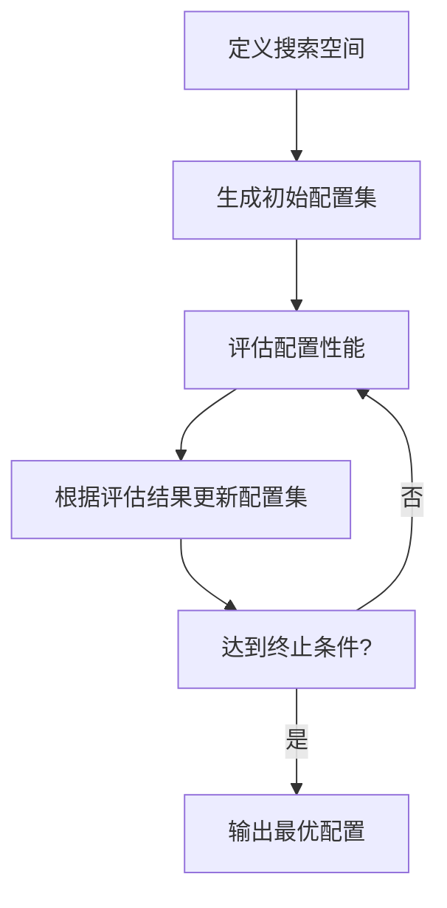

# 自动机器学习AutoML原理与代码实战案例讲解

## 1.背景介绍

### 1.1 机器学习的挑战

在过去几年中,机器学习取得了令人瞩目的进展,并被广泛应用于各个领域。然而,构建高质量的机器学习模型仍然是一个巨大的挑战。这个过程需要数据科学家具备深厚的领域知识、算法理解能力以及大量的时间和计算资源。

传统的机器学习流程包括数据预处理、特征工程、模型选择、超参数调优和模型评估等步骤。每一个步骤都需要专业知识和经验,而这些步骤又是相互依赖的,导致了机器学习的复杂性和效率低下。

### 1.2 AutoML的兴起

为了解决上述挑战,自动机器学习(AutoML)应运而生。AutoML旨在通过自动化的方式,简化和优化机器学习流程,从而提高模型的性能和效率。它利用先进的优化算法和大量的计算资源,自动搜索最优的数据预处理方法、特征工程策略、模型架构和超参数组合。

AutoML的核心思想是将机器学习视为一个复杂的优化问题,并使用自动化技术来解决这个问题。它可以大大减轻数据科学家的工作负担,使他们能够将更多精力集中在问题本身和业务需求上。

## 2.核心概念与联系

### 2.1 AutoML的核心概念

AutoML包含以下几个核心概念:

1. **搜索空间(Search Space)**: 定义了所有可能的数据预处理方法、特征工程策略、模型架构和超参数组合。搜索空间的大小直接影响AutoML的效率和性能。

2. **配置(Configuration)**: 指搜索空间中的一个具体实例,包含了数据预处理、特征工程、模型架构和超参数的特定选择。

3. **评估指标(Evaluation Metric)**: 用于评估配置性能的指标,如准确率、F1分数、AUC等。AutoML的目标是找到在评估指标上表现最好的配置。

4. **优化算法(Optimization Algorithm)**: 用于高效搜索最优配置的算法,如贝叶斯优化、进化算法、强化学习等。

### 2.2 AutoML与机器学习的关系

AutoML并不是要取代传统的机器学习,而是作为一种辅助工具,自动化和优化机器学习流程的某些步骤。它可以看作是一个更高层次的抽象,将机器学习建模视为一个复杂的优化问题。

在AutoML中,人工智能技术被用于指导和加速机器学习模型的构建过程。但是,AutoML并不能完全取代人工专家的作用。数据科学家仍然需要提供高质量的数据、定义合适的评估指标,并对AutoML生成的模型进行解释和调整。

AutoML旨在提高机器学习的可访问性和效率,使更多的人能够从机器学习中受益。它为传统的机器学习流程提供了自动化和优化的能力,从而缩短了模型开发周期并提高了模型性能。

## 3.核心算法原理具体操作步骤

AutoML的核心算法原理可以概括为以下几个步骤:



### 3.1 定义搜索空间

第一步是定义搜索空间,即确定所有可能的数据预处理方法、特征工程策略、模型架构和超参数组合。搜索空间的设计直接影响AutoML的效率和性能,因此需要根据具体问题和领域知识进行合理的设置。

### 3.2 生成初始配置集

接下来,AutoML会生成一组初始配置,作为优化算法的起点。这些配置可以是随机生成的,也可以基于先验知识或经验进行选择。

### 3.3 评估配置性能

对于每个配置,AutoML会构建相应的机器学习管道,包括数据预处理、特征工程和模型训练。然后,使用预定义的评估指标(如准确率、F1分数、AUC等)来评估该配置在验证集或测试集上的性能。

### 3.4 根据评估结果更新配置集

根据配置的评估结果,AutoML会使用优化算法(如贝叶斯优化、进化算法、强化学习等)来更新配置集。优化算法的目标是找到在评估指标上表现最好的配置。

具体来说,优化算法会根据之前的评估结果,智能地生成新的配置,并将这些新配置添加到配置集中。同时,它也可能会删除或修改一些性能较差的配置。

### 3.5 达到终止条件

上述步骤会重复进行,直到达到预定义的终止条件。终止条件可以是最大迭代次数、预算限制(如计算时间或资源)或性能收敛等。

### 3.6 输出最优配置

当达到终止条件时,AutoML会输出在评估指标上表现最好的配置,作为最终的机器学习模型。

需要注意的是,AutoML并不能保证找到全局最优解,因为搜索空间通常是非凸的,并且存在许多局部最优解。但是,AutoML可以通过智能搜索策略和大量计算资源,找到一个相对较优的解。

## 4.数学模型和公式详细讲解举例说明

在AutoML中,常用的数学模型和公式主要来自于贝叶斯优化、高斯过程和多臂老虎机等领域。下面将详细介绍其中的一些核心概念和公式。

### 4.1 贝叶斯优化

贝叶斯优化是AutoML中广泛使用的优化算法之一。它将优化问题建模为一个高斯过程,并通过对目标函数进行有效的采样和更新,逐步缩小搜索空间。

在贝叶斯优化中,我们假设目标函数 $f(x)$ 服从一个高斯过程:

$$
f(x) \sim \mathcal{GP}(m(x), k(x, x'))
$$

其中 $m(x)$ 是均值函数,通常设置为0; $k(x, x')$ 是核函数,用于描述输入之间的相似性。

在每一次迭代中,贝叶斯优化会根据已有的观测值 $\mathcal{D} = \{(x_i, y_i)\}_{i=1}^n$,计算后验分布:

$$
p(f(x) | \mathcal{D}, x) = \mathcal{N}(\mu(x), \sigma^2(x))
$$

其中 $\mu(x)$ 和 $\sigma^2(x)$ 分别表示均值和方差。

接下来,贝叶斯优化会使用一个采集函数(Acquisition Function)来平衡探索(Exploration)和利用(Exploitation)。常用的采集函数包括期望改善(Expected Improvement, EI)和上确信bound(Upper Confidence Bound, UCB)等。

以期望改善为例,其公式如下:

$$
\alpha_\text{EI}(x) = \mathbb{E}[\max(0, f(x) - f(x^+))]
$$

其中 $x^+$ 是当前最优解,期望改善表示在 $x$ 处采样,相对于当前最优解能够获得的期望改善量。

贝叶斯优化会选择具有最大采集函数值的 $x$ 作为下一个采样点,并重复上述过程,直到达到预定义的终止条件。

### 4.2 多臂老虎机

多臂老虎机是一种经典的强化学习问题,也被广泛应用于AutoML中。在多臂老虎机问题中,我们需要在 $K$ 个不同的行动(拉动不同的老虎机手柄)中选择一个,以最大化累积回报。

这个问题可以形式化为:在每一个时间步 $t$,选择一个行动 $a_t \in \{1, 2, \ldots, K\}$,并获得相应的回报 $r_t$。目标是最大化累积回报 $\sum_{t=1}^T r_t$。

多臂老虎机问题的一个著名算法是 UCB1 算法,它的核心思想是在探索和利用之间寻求平衡。具体来说,UCB1 算法会为每个行动 $a$ 维护一个置信区间 $[L_a, U_a]$,其中 $U_a$ 是该行动的上确信bound:

$$
U_a = \bar{x}_a + \sqrt{\frac{2 \log n}{n_a}}
$$

其中 $\bar{x}_a$ 是行动 $a$ 的平均回报, $n_a$ 是行动 $a$ 被选择的次数, $n$ 是总的时间步数。

在每一个时间步,UCB1 算法会选择具有最大上确信bound的行动:

$$
a_t = \arg\max_a U_a
$$

这样可以在探索(选择未被充分尝试的行动)和利用(选择当前看起来最优的行动)之间达成平衡。

多臂老虎机算法在AutoML中的应用包括超参数优化、神经架构搜索等,其核心思想是将这些优化问题建模为一个多臂老虎机问题,并使用相应的算法来解决。

## 5.项目实践:代码实例和详细解释说明

为了更好地理解AutoML的原理和应用,我们将通过一个实际的代码示例来演示如何使用AutoML库 Auto-Sklearn 进行自动机器学习。

Auto-Sklearn 是一个基于 Scikit-Learn 的 AutoML 库,它提供了自动数据预处理、特征工程、模型选择和超参数优化等功能。我们将使用著名的 UCI 机器学习数据集"Adult Census Income"作为示例。

### 5.1 导入所需库

```python
import autosklearn.classification
from sklearn.model_selection import train_test_split
from sklearn.metrics import accuracy_score
```

### 5.2 加载数据集

```python
from sklearn.datasets import fetch_openml
data = fetch_openml(data_id=1590, as_frame=True)
X = data.data
y = data.target.astype('category')
X_train, X_test, y_train, y_test = train_test_split(X, y, test_size=0.2, random_state=42)
```

### 5.3 创建 AutoML 分类器

```python
automl = autosklearn.classification.AutoSklearnClassifier(
    time_left_for_this_task=600,  # 总时间限制为 10 分钟
    per_run_time_limit=30,  # 每个模型的训练时间限制为 30 秒
    tmp_folder='/tmp/autosklearn_tmp',  # 临时文件夹
    delete_tmp_folder_after_terminate=False,
    n_jobs=4,  # 使用 4 个进程进行并行计算
    memory_limit=8192,  # 内存限制为 8GB
)
```

在上面的代码中,我们创建了一个 `AutoSklearnClassifier` 对象,并设置了一些参数:

- `time_left_for_this_task`: 总的时间限制,单位为秒。
- `per_run_time_limit`: 每个模型的训练时间限制,单位为秒。
- `tmp_folder`: 临时文件夹的路径。
- `delete_tmp_folder_after_terminate`: 是否在结束时删除临时文件夹。
- `n_jobs`: 并行计算的进程数。
- `memory_limit`: 内存限制,单位为 MB。

### 5.4 训练 AutoML 模型

```python
automl.fit(X_train, y_train)
```

在这一步,Auto-Sklearn 会自动进行数据预处理、特征工程、模型选择和超参数优化,并训练出一个优化后的机器学习模型。

### 5.5 评估模型性能

```python
y_pred = automl.predict(X_test)
accuracy = accuracy_score(y_test, y_pred)
print(f"Accuracy on test set: {accuracy:.4f}")
```

我们使用 `predict` 方法在测试集上进行预测,并计算预测的准确率。

### 5.6 查看最优模型

```python
print(f"Best model: {automl.show_models()}")
```

Auto-Sklearn 会输出在优化过程中找到的最优模型。

### 5.7 保存和加载模型

```python
# 保存模型
automl.save_model("automl_model.pkl")

# 加载模型
loaded_automl = autosklearn.classification.AutoSklearnClassifier()
loaded_automl.load_model("automl_model.pkl")
```

我们可以使用 `save_model` 和 `loa