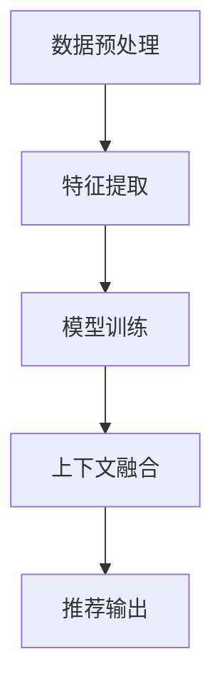

# 自动点歌系统详细设计与具体代码实现

## 1. 背景介绍

随着音乐流媒体服务的兴起,人们越来越倾向于在线收听音乐。传统的点歌方式已无法满足用户的需求,因此自动点歌系统应运而生。自动点歌系统能够根据用户的音乐偏好,自动推荐合适的歌曲,提高用户的音乐体验。

### 1.1 发展历程

早期的自动点歌系统主要基于协同过滤算法,通过分析用户的历史播放记录和其他用户的相似偏好来推荐音乐。随着深度学习技术的发展,自动点歌系统开始采用神经网络模型,能够更精准地捕捉用户的音乐偏好。

### 1.2 应用场景

自动点歌系统广泛应用于音乐流媒体平台、智能音箱、车载音响系统等场景。它能够根据用户的情绪、活动状态等上下文信息,推荐合适的音乐,提升用户体验。

## 2. 核心概念与联系

### 2.1 协同过滤算法

协同过滤算法是自动点歌系统中最常用的推荐算法之一。它基于用户之间的相似性,推荐那些与目标用户有相似偏好的其他用户喜欢的音乐。常见的协同过滤算法包括基于用户的协同过滤和基于项目的协同过滤。

### 2.2 嵌入技术

嵌入技术是将高维数据映射到低维空间的一种方法,常用于自动点歌系统中的特征提取。通过嵌入技术,可以将用户、音乐等高维数据映射到低维向量空间,便于后续的模型训练和推理。

### 2.3 序列建模

自动点歌系统需要考虑用户的历史播放序列,因此序列建模技术非常重要。常见的序列建模模型包括循环神经网络(RNN)、长短期记忆网络(LSTM)和transformer等。这些模型能够捕捉序列数据中的时序依赖关系。

### 2.4 上下文感知

上下文感知是自动点歌系统的一个重要特性。系统需要考虑用户的情绪、活动状态、天气等上下文信息,才能推荐合适的音乐。常见的上下文感知技术包括多任务学习、注意力机制等。

### 2.5 核心流程

自动点歌系统的核心流程包括:

1. 数据预处理:处理用户历史记录、音乐元数据等原始数据。
2. 特征提取:使用嵌入技术等方法提取用户、音乐的特征向量。
3. 模型训练:基于协同过滤、序列建模等算法训练推荐模型。
4. 上下文融合:融合用户的上下文信息,调整推荐结果。
5. 推荐输出:输出最终的音乐推荐列表。

## 3. 核心算法原理具体操作步骤

### 3.1 协同过滤算法

#### 3.1.1 基于用户的协同过滤

基于用户的协同过滤算法的核心思想是:对于目标用户,找到与其有相似音乐偏好的其他用户,然后推荐这些相似用户喜欢的音乐。具体步骤如下:

1. 计算用户之间的相似度:常用的相似度计算方法有皮尔逊相关系数、余弦相似度等。
2. 找到与目标用户最相似的 K 个用户,称为最近邻用户。
3. 根据最近邻用户的历史播放记录,为目标用户生成推荐列表。

#### 3.1.2 基于项目的协同过滤

基于项目的协同过滤算法的核心思想是:对于目标音乐,找到与其相似的其他音乐,然后推荐给喜欢目标音乐的用户。具体步骤如下:

1. 计算音乐之间的相似度:常用的相似度计算方法有余弦相似度、调整余弦相似度等。
2. 找到与目标音乐最相似的 K 个音乐,称为最近邻音乐。
3. 根据喜欢目标音乐的用户,推荐最近邻音乐给这些用户。

### 3.2 嵌入技术

嵌入技术是将高维数据映射到低维空间的一种方法,常用于自动点歌系统中的特征提取。常见的嵌入技术包括Word2Vec、Node2Vec等。以Word2Vec为例,其具体步骤如下:

1. 构建语料库:将用户历史播放记录、音乐元数据等数据构建成语料库。
2. 建立词袋模型:将每个用户、音乐等实体视为"词",构建词袋模型。
3. 训练嵌入模型:使用Word2Vec等嵌入算法,在词袋模型上训练嵌入向量。
4. 特征提取:将训练好的嵌入向量作为用户、音乐的特征向量,输入到推荐模型中。

### 3.3 序列建模

自动点歌系统需要考虑用户的历史播放序列,因此序列建模技术非常重要。常见的序列建模模型包括循环神经网络(RNN)、长短期记忆网络(LSTM)和transformer等。以LSTM为例,其具体步骤如下:

1. 数据预处理:将用户的历史播放记录转换为序列数据。
2. 嵌入层:使用嵌入技术将用户、音乐等实体映射为低维向量。
3. LSTM层:将嵌入向量输入到LSTM层,捕捉序列数据中的时序依赖关系。
4. 输出层:LSTM层的输出经过全连接层,生成对每首音乐的打分,作为推荐的依据。
5. 模型训练:使用监督学习方法,在历史数据上训练LSTM模型。

### 3.4 上下文感知

上下文感知是自动点歌系统的一个重要特性。常见的上下文感知技术包括多任务学习、注意力机制等。以多任务学习为例,其具体步骤如下:

1. 构建多任务模型:除了主任务(音乐推荐)外,增加辅助任务,如情绪识别、活动识别等。
2. 共享表示学习:主任务和辅助任务共享底层的表示学习模块,如嵌入层、LSTM层等。
3. 多任务训练:同时在主任务和辅助任务的数据上训练模型,使模型学习到更加通用的表示。
4. 上下文融合:在推荐时,将辅助任务的输出(如情绪、活动等)作为上下文信息,融合到推荐结果中。

## 4. 数学模型和公式详细讲解举例说明

### 4.1 相似度计算

在协同过滤算法中,计算用户或项目之间的相似度是一个关键步骤。常用的相似度计算方法包括皮尔逊相关系数和余弦相似度。

#### 4.1.1 皮尔逊相关系数

皮尔逊相关系数用于计算两个向量之间的相似程度,取值范围为 [-1, 1]。公式如下:

$$r_{xy} = \frac{\sum_{i=1}^{n}{(x_i - \overline{x})(y_i - \overline{y})}}{\sqrt{\sum_{i=1}^{n}{(x_i - \overline{x})^2}}\sqrt{\sum_{i=1}^{n}{(y_i - \overline{y})^2}}}$$

其中,$ x $和$ y $分别表示两个向量,$ \overline{x} $和$ \overline{y} $分别表示它们的均值。

举例:假设用户 A 和用户 B 对三首音乐的评分分别为 (5, 4, 3) 和 (4, 5, 4),计算它们的皮尔逊相关系数:

$$\overline{x} = \frac{5 + 4 + 3}{3} = 4, \overline{y} = \frac{4 + 5 + 4}{3} = 4.33$$
$$r_{xy} = \frac{(5 - 4)(4 - 4.33) + (4 - 4)(5 - 4.33) + (3 - 4)(4 - 4.33)}{\sqrt{(5 - 4)^2 + (4 - 4)^2 + (3 - 4)^2}\sqrt{(4 - 4.33)^2 + (5 - 4.33)^2 + (4 - 4.33)^2}} \approx 0.82$$

#### 4.1.2 余弦相似度

余弦相似度用于计算两个向量之间的夹角余弦值,取值范围为 [0, 1]。公式如下:

$$\text{sim}(x, y) = \cos(\theta) = \frac{x \cdot y}{\|x\|\|y\|} = \frac{\sum_{i=1}^{n}{x_iy_i}}{\sqrt{\sum_{i=1}^{n}{x_i^2}}\sqrt{\sum_{i=1}^{n}{y_i^2}}}$$

其中,$ x $和$ y $分别表示两个向量,$ \theta $表示它们的夹角。

举例:假设音乐 A 和音乐 B 的特征向量分别为 (2, 3, 5) 和 (4, 0, 3),计算它们的余弦相似度:

$$\text{sim}(x, y) = \frac{2 \times 4 + 3 \times 0 + 5 \times 3}{\sqrt{2^2 + 3^2 + 5^2}\sqrt{4^2 + 0^2 + 3^2}} \approx 0.67$$

### 4.2 嵌入技术

嵌入技术是将高维数据映射到低维空间的一种方法,常用于自动点歌系统中的特征提取。Word2Vec 是一种常用的嵌入技术,它的核心思想是通过上下文预测目标词,从而学习词向量。

Word2Vec 包括两种模型:连续词袋模型(CBOW)和跳元模型(Skip-Gram)。以 CBOW 为例,其目标是根据上下文词预测目标词,公式如下:

$$P(w_t|w_{t-n}, \dots, w_{t-1}, w_{t+1}, \dots, w_{t+n}) = \frac{\exp(v_{w_t}^{\top}v_c)}{\sum_{w=1}^{V}{\exp(v_w^{\top}v_c)}}$$

其中,$ w_t $表示目标词,$ w_{t-n}, \dots, w_{t-1}, w_{t+1}, \dots, w_{t+n} $表示上下文词,$ v_{w_t} $和$ v_c $分别表示目标词和上下文的向量表示,$ V $表示词汇表的大小。

在自动点歌系统中,可以将用户、音乐等实体视为"词",构建词袋模型,然后使用 Word2Vec 等嵌入算法训练实体的嵌入向量,作为特征向量输入到推荐模型中。

### 4.3 序列建模

自动点歌系统需要考虑用户的历史播放序列,因此序列建模技术非常重要。长短期记忆网络(LSTM)是一种常用的序列建模模型,它能够有效捕捉长期依赖关系。

LSTM 的核心思想是通过门控机制来控制信息的流动,从而解决传统 RNN 的梯度消失和梯度爆炸问题。LSTM 的计算公式如下:

$$\begin{aligned}
f_t &= \sigma(W_f \cdot [h_{t-1}, x_t] + b_f) &\text{(遗忘门)} \\
i_t &= \sigma(W_i \cdot [h_{t-1}, x_t] + b_i) &\text{(输入门)} \\
\tilde{C}_t &= \tanh(W_C \cdot [h_{t-1}, x_t] + b_C) &\text{(候选细胞状态)} \\
C_t &= f_t \odot C_{t-1} + i_t \odot \tilde{C}_t &\text{(细胞状态)} \\
o_t &= \sigma(W_o \cdot [h_{t-1}, x_t] + b_o) &\text{(输出门)} \\
h_t &= o_t \odot \tanh(C_t) &\text{(隐藏状态)}
\end{aligned}$$

其中,$ f_t $、$ i_t $、$ o_t $分别表示遗忘门、输入门和输出门,$ C_t $表示细胞状态,$ h_t $表示隐藏状态,$ \