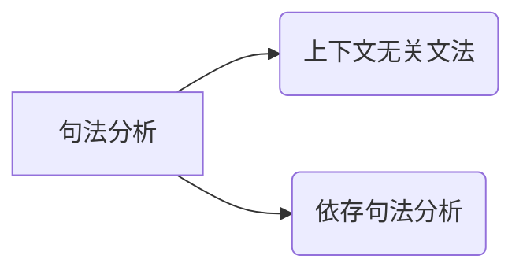
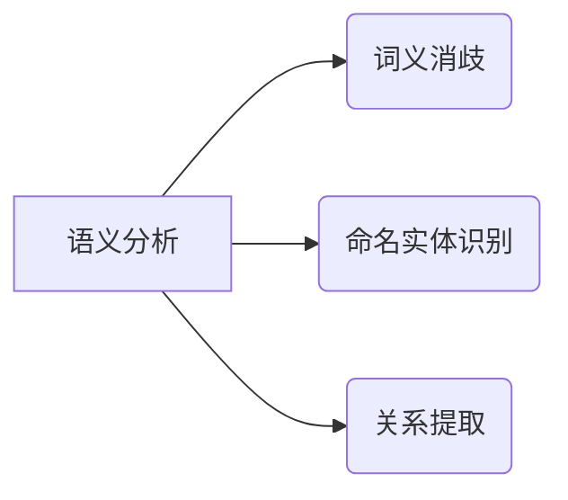
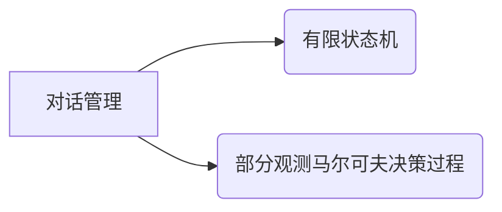

# 自然语言交互与对话系统原理与代码实战案例讲解

## 1. 背景介绍

### 1.1 自然语言处理的重要性

在当今信息时代,人机交互已经成为了日常生活中不可或缺的一部分。随着人工智能技术的不断发展,自然语言处理(Natural Language Processing,NLP)作为一门跨学科的技术,其重要性日益凸显。自然语言处理旨在使计算机能够理解和生成人类语言,从而实现人机之间自然、流畅的交互。

### 1.2 对话系统的应用场景

对话系统是自然语言处理技术的一个重要应用领域,它能够模拟人与人之间的对话交互,为用户提供个性化的服务和信息获取。对话系统已经广泛应用于智能助手、客服系统、教育辅导、医疗诊断等多个领域,极大地提高了人机交互的效率和体验。

## 2. 核心概念与联系

### 2.1 自然语言理解

自然语言理解(Natural Language Understanding,NLU)是对话系统的核心组成部分之一,它负责将人类的自然语言输入转换为计算机可以理解的形式。这一过程包括以下几个关键步骤:

1. **词法分析(Lexical Analysis)**: 将输入的自然语言文本分割成单词、标点符号等最小语义单元。
2. **句法分析(Syntactic Analysis)**: 根据语言的语法规则,确定每个单词在句子中的语法角色,构建句子的句法树。
3. **语义分析(Semantic Analysis)**: 从句法树中提取语义信息,确定每个单词的实际含义以及它们之间的关系。
4. **语境理解(Contextual Understanding)**: 结合对话历史和背景知识,理解用户的真实意图。

#### 2.1.1 词法分析

词法分析是自然语言理解的第一步,它将输入的文本流拆分为一个个有意义的单词或标点符号,这些单词和标点符号被称为词素(Token)。常用的词法分析技术包括正则表达式匹配、有限状态自动机等。

#### 2.1.2 句法分析

句法分析的目标是确定每个单词在句子中的语法角色,并构建出句子的句法结构树。常用的句法分析算法有上下文无关文法(Context-Free Grammar,CFG)、依存句法分析(Dependency Parsing)等。

#### 2.1.3 语义分析

语义分析旨在从句法结构树中提取语义信息,确定每个单词的实际含义以及它们之间的关系。常用的语义分析技术包括词义消歧(Word Sense Disambiguation)、命名实体识别(Named Entity Recognition)、关系提取(Relation Extraction)等。

#### 2.1.4 语境理解

语境理解是自然语言理解的最高层次,它需要结合对话历史和背景知识,理解用户的真实意图。常用的语境理解技术包括对话状态跟踪(Dialogue State Tracking)、意图识别(Intent Recognition)、情感分析(Sentiment Analysis)等。

### 2.2 自然语言生成

自然语言生成(Natural Language Generation,NLG)是对话系统的另一个核心组成部分,它负责将计算机内部表示的信息转换为人类可以理解的自然语言输出。这一过程通常包括以下几个关键步骤:

1. **内容规划(Content Planning)**: 确定需要表达的信息内容。
2. **句子规划(Sentence Planning)**: 将内容组织成合理的句子结构。
3. **实现(Realization)**: 将句子结构转换为自然语言文本。

#### 2.2.1 内容规划

内容规划的目标是确定需要表达的信息内容,包括选择相关的事实、概念和关系等。常用的内容规划技术包括知识库查询、信息提取等。

#### 2.2.2 句子规划

句子规划的目标是将内容组织成合理的句子结构,包括确定句子的主语、谓语、宾语等语法成分,以及它们之间的关系。常用的句子规划技术包括句法生成、参考消解等。

#### 2.2.3 实现

实现的目标是将句子结构转换为自然语言文本,包括选择合适的词汇、应用语法规则等。常用的实现技术包括模板填充、统计语言模型等。

### 2.3 对话管理

对话管理(Dialogue Management)是对话系统的另一个重要组成部分,它负责控制对话的流程,决定系统的响应策略。常用的对话管理技术包括有限状态机(Finite State Machine)、部分观测马尔可夫决策过程(Partially Observable Markov Decision Process,POMDP)等。

## 3. 核心算法原理具体操作步骤

### 3.1 序列标注算法

序列标注算法是自然语言处理中一类常见的算法,它将输入的序列(如文本)映射为另一个序列(如标签序列)。常用的序列标注算法包括隐马尔可夫模型(Hidden Markov Model,HMM)、条件随机场(Conditional Random Field,CRF)等。

#### 3.1.1 隐马尔可夫模型

隐马尔可夫模型是一种基于统计的序列标注算法,它假设观测序列是由一个隐藏的马尔可夫链生成的。HMM算法的核心思想是通过观测序列来估计隐藏状态序列的概率,从而实现序列标注。

HMM算法的具体操作步骤如下:

1. **定义HMM模型**: 确定观测符号集合、隐藏状态集合、初始状态概率分布、状态转移概率矩阵和观测概率矩阵。
2. **前向算法**: 计算观测序列的概率,用于模型评估和参数估计。
3. **维特比算法**: 求解最可能的隐藏状态序列,用于序列标注。
4. **后向算法**: 计算观测序列的概率,用于参数估计。
5. **Baum-Welch算法**: 使用前向-后向算法和期望最大化(EM)算法,对HMM模型的参数进行无监督估计。

#### 3.1.2 条件随机场

条件随机场是一种基于统计的序列标注算法,它直接对条件概率进行建模,避免了隐马尔可夫模型中的独立性假设。CRF算法的核心思想是最大化条件概率,从而实现序列标注。

CRF算法的具体操作步骤如下:

1. **定义CRF模型**: 确定特征函数集合,包括转移特征和状态特征。
2. **前向-后向算法**: 计算规范化因子,用于模型评估和参数估计。
3. **维特比算法**: 求解最可能的标签序列,用于序列标注。
4. **quasi-Newton方法**: 使用数值优化算法,对CRF模型的参数进行有监督估计。

### 3.2 神经网络算法

近年来,深度学习技术在自然语言处理领域取得了巨大的成功,神经网络算法成为了自然语言处理的主流方法之一。常用的神经网络算法包括循环神经网络(Recurrent Neural Network,RNN)、长短期记忆网络(Long Short-Term Memory,LSTM)、门控循环单元(Gated Recurrent Unit,GRU)等。

#### 3.2.1 循环神经网络

循环神经网络是一种用于处理序列数据的神经网络模型,它通过在隐藏层中引入循环连接,能够捕捉序列数据中的长期依赖关系。RNN算法的核心思想是在每个时间步上更新隐藏状态,从而实现序列建模。

RNN算法的具体操作步骤如下:

1. **初始化隐藏状态**: 将初始隐藏状态设置为全0向量。
2. **前向传播**: 在每个时间步上,根据当前输入和上一时间步的隐藏状态,计算当前时间步的隐藏状态和输出。
3. **反向传播**: 计算损失函数,并通过反向传播算法更新网络参数。

#### 3.2.2 长短期记忆网络

长短期记忆网络是一种改进的循环神经网络,它通过引入门控机制和记忆单元,能够更好地捕捉长期依赖关系。LSTM算法的核心思想是使用门控单元来控制信息的流动,从而实现有效的序列建模。

LSTM算法的具体操作步骤如下:

1. **初始化状态**: 将初始隐藏状态和记忆单元状态设置为全0向量。
2. **前向传播**: 在每个时间步上,根据当前输入、上一时间步的隐藏状态和记忆单元状态,计算当前时间步的门控值、记忆单元状态和隐藏状态。
3. **反向传播**: 计算损失函数,并通过反向传播算法更新网络参数。

#### 3.2.3 门控循环单元

门控循环单元是另一种改进的循环神经网络,它与长短期记忆网络类似,但使用了更简单的门控机制。GRU算法的核心思想是使用重置门和更新门来控制信息的流动,从而实现有效的序列建模。

GRU算法的具体操作步骤如下:

1. **初始化隐藏状态**: 将初始隐藏状态设置为全0向量。
2. **前向传播**: 在每个时间步上,根据当前输入和上一时间步的隐藏状态,计算当前时间步的重置门、更新门和隐藏状态。
3. **反向传播**: 计算损失函数,并通过反向传播算法更新网络参数。

### 3.3 注意力机制

注意力机制(Attention Mechanism)是一种用于加强神经网络模型的技术,它允许模型在处理序列数据时,动态地关注序列中的不同部分。注意力机制在自然语言处理中有广泛的应用,如机器翻译、阅读理解、对话系统等。

注意力机制的核心思想是计算一个注意力分数向量,表示模型对输入序列中每个元素的关注程度。然后,根据注意力分数向量对输入序列进行加权求和,得到一个注意力向量。注意力向量与模型的其他部分进行交互,从而实现对输入序列的选择性关注。

注意力机制的具体操作步骤如下:

1. **计算注意力分数**: 对于输入序列中的每个元素,计算一个注意力分数,表示模型对该元素的关注程度。
2. **计算注意力权重**: 将注意力分数通过softmax函数转换为注意力权重。
3. **计算注意力向量**: 将输入序列中的每个元素乘以对应的注意力权重,然后求和得到注意力向量。
4. **模型交互**: 将注意力向量与模型的其他部分进行交互,实现对输入序列的选择性关注。

注意力机制有多种变体,如加性注意力(Additive Attention)、点积注意力(Dot-Product Attention)、多头注意力(Multi-Head Attention)等。不同的注意力机制在计算注意力分数和注意力向量的方式上有所不同,但核心思想是相同的。

## 4. 数学模型和公式详细讲解举例说明

### 4.1 隐马尔可夫模型

隐马尔可夫模型(Hidden Markov Model,HMM)是一种统计模型,它描述了一个由隐藏的马尔可夫链随机生成的观测序列的联合分布。HMM由以下五个部分组成:

1. **隐藏状态集合 $Q$**: 表示隐藏的状态集合,即 $Q = \{q_1, q_2, \dots, q_N\}$。
2. **观测符号集合 $V$**: 表示可观测到的符号集合,即 $V = \{v_1, v_2, \dots, v_M\}$。
3. **初始状态概率分布 $\pi$**: 表示初始状态的概率分布,即 $\pi = \{\pi_i\}$,其中 $\pi_i = P(q_i)$。
4. **状态转移概率矩阵 $A$**: