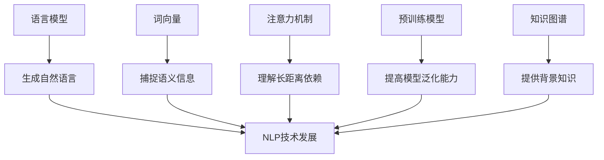

# 自然语言处理 (Natural Language Processing)

## 1.背景介绍

自然语言处理(Natural Language Processing, NLP)是人工智能领域的一个重要分支,旨在使计算机能够理解和生成人类自然语言。随着大数据时代的到来和人工智能技术的快速发展,NLP已经广泛应用于机器翻译、智能问答、情感分析、自动摘要等诸多领域。

NLP的主要挑战在于自然语言的复杂性和多义性。与计算机可直接理解的形式化语言不同,自然语言存在着词义的歧义、语法的模糊性、上下文的影响等问题,这使得计算机难以准确理解和生成自然语言。因此,NLP需要综合运用多种技术,包括语言学、统计学、机器学习等,来解决这些挑战。

## 2.核心概念与联系

### 2.1 语言模型(Language Model)

语言模型是NLP中一个核心概念,它描述了一种语言中单词序列出现的概率分布。语言模型可以用于预测下一个单词、评估句子的流畅程度等任务。常见的语言模型包括N-gram模型、神经网络语言模型等。

### 2.2 词向量(Word Embedding)

词向量是将单词映射到连续的向量空间中的一种技术,使得语义相似的单词在向量空间中彼此接近。词向量可以捕捉单词之间的语义和句法关系,是深度学习在NLP中取得突破性进展的关键因素之一。常见的词向量模型包括Word2Vec、GloVe等。

### 2.3 注意力机制(Attention Mechanism)

注意力机制是一种允许深度学习模型selectively关注输入数据不同部分的技术。在NLP中,注意力机制可以帮助模型更好地捕捉长距离依赖关系,提高模型的性能。注意力机制在机器翻译、阅读理解等任务中发挥着重要作用。

### 2.4 预训练模型(Pre-trained Model)

预训练模型是在大规模语料库上预先训练好的模型,可以用于下游NLP任务的微调。预训练模型可以有效地利用大量的无标注数据,提高模型的泛化能力。著名的预训练模型包括BERT、GPT、XLNet等。

### 2.5 知识图谱(Knowledge Graph)

知识图谱是一种结构化的知识表示形式,它将实体和关系以图的形式组织起来。知识图谱可以为NLP任务提供丰富的背景知识,提高模型的理解能力。知识图谱在问答系统、关系抽取等任务中发挥着重要作用。

### 2.6 核心概念关系

上述核心概念相互关联、相辅相成,共同推动了NLP技术的发展。语言模型为生成自然语言提供了基础;词向量捕捉了单词的语义信息;注意力机制帮助模型更好地理解长距离依赖关系;预训练模型利用大数据提高了模型的泛化能力;知识图谱为NLP任务提供了丰富的背景知识。这些概念的融合和创新将推动NLP技术向前发展。

## 3.核心算法原理具体操作步骤

### 3.1 N-gram语言模型

N-gram语言模型是基于统计学原理的传统语言模型,它根据历史上N-1个单词来预测下一个单词的概率。N-gram模型的核心思想是马尔可夫假设,即一个单词的出现只与前面有限个单词相关。

N-gram模型的训练步骤如下:

1. **语料预处理**:对训练语料进行分词、去除停用词等预处理操作。
2. **计数**:统计语料中所有长度为N的连续单词序列(N-gram)及其出现次数。
3. **平滑**:由于数据稀疏性问题,某些N-gram在训练集中可能没有出现过,此时需要使用平滑技术(如加法平滑、回退平滑等)为它们分配一个小概率。
4. **概率计算**:根据N-gram出现次数及平滑后的总计数,计算每个N-gram的概率。

在预测阶段,N-gram模型根据历史单词序列查找对应的N-gram概率,选择概率最大的单词作为预测结果。

### 3.2 Word2Vec词向量

Word2Vec是一种流行的词向量表示模型,它使用浅层神经网络来学习单词的向量表示。Word2Vec包含两个主要模型:连续词袋模型(CBOW)和Skip-gram模型。

**CBOW模型**的训练步骤如下:

1. **输入层**:将目标单词的上下文单词(窗口大小为m)的one-hot向量相加,作为输入。
2. **投影层**:将输入向量与输入权重矩阵相乘,得到投影向量。
3. **输出层**:将投影向量与输出权重矩阵相乘,得到对每个单词的打分,使用softmax函数将打分转换为概率分布。
4. **反向传播**:以目标单词的one-hot向量为标签,计算损失函数,并使用梯度下降法更新权重矩阵。

**Skip-gram模型**的训练步骤与CBOW类似,不同之处在于它以目标单词为输入,预测上下文单词。

通过上述步骤,Word2Vec可以学习出能够捕捉单词语义关系的词向量表示。

### 3.3 Transformer注意力机制

Transformer是一种基于注意力机制的序列到序列模型,广泛应用于机器翻译、文本生成等任务。它的核心是多头自注意力(Multi-Head Attention)机制。

**多头自注意力**的计算步骤如下:

1. **线性投影**:将输入序列$X$分别与三个不同的权重矩阵$W_Q$、$W_K$、$W_V$相乘,得到查询(Query)、键(Key)和值(Value)矩阵。
2. **缩放点积注意力**:计算查询和所有键的缩放点积,得到注意力分数,然后使用softmax函数将其转换为注意力权重。
   $$\text{Attention}(Q, K, V) = \text{softmax}(\frac{QK^T}{\sqrt{d_k}})V$$
3. **多头注意力**:将多个注意力头的结果拼接起来,再经过一个线性变换,得到最终的注意力表示。
4. **残差连接与层归一化**:将注意力表示与输入相加,并进行层归一化,得到多头自注意力的输出。

Transformer通过自注意力机制捕捉输入序列中任意距离的依赖关系,避免了RNN的长距离依赖问题,同时支持并行计算,提高了训练效率。

### 3.4 BERT预训练模型

BERT(Bidirectional Encoder Representations from Transformers)是一种基于Transformer的预训练语言模型,可以有效地学习上下文语义表示,在多个NLP任务上取得了state-of-the-art的表现。

BERT的预训练过程包括两个任务:

1. **掩码语言模型(Masked Language Model, MLM)**:随机掩码输入序列的某些单词,模型需要根据上下文预测被掩码的单词。
2. **下一句预测(Next Sentence Prediction, NSP)**:判断两个句子是否为连续的句子对。

通过上述两个任务的联合预训练,BERT可以学习到双向的语义表示,捕捉单词与单词之间、句子与句子之间的关系。

在下游任务中,BERT的微调过程如下:

1. **添加任务特定的输出层**:根据具体任务(如文本分类、序列标注等)添加相应的输出层。
2. **微调所有参数**:在标注数据上对BERT的所有参数(包括预训练参数)进行微调,使模型适应目标任务。

BERT的出色表现证明了大规模无监督预训练对于NLP任务的重要性,开启了预训练语言模型的新时代。

## 4.数学模型和公式详细讲解举例说明

### 4.1 N-gram语言模型

在N-gram语言模型中,我们需要计算一个句子$S$的概率$P(S)$。根据链式法则,我们有:

$$P(S) = P(w_1, w_2, \dots, w_n) = \prod_{i=1}^{n}P(w_i|w_1, \dots, w_{i-1})$$

其中$w_i$表示句子中的第$i$个单词。

由于计算上述精确概率是不可行的,因此N-gram模型引入了马尔可夫假设,即一个单词的出现只与前面有限个单词相关。对于N-gram模型,我们有:

$$P(w_i|w_1, \dots, w_{i-1}) \approx P(w_i|w_{i-N+1}, \dots, w_{i-1})$$

因此,句子概率可以近似为:

$$P(S) \approx \prod_{i=1}^{n}P(w_i|w_{i-N+1}, \dots, w_{i-1})$$

在训练阶段,我们需要从语料库中统计每个N-gram的计数$C(w_{i-N+1}, \dots, w_i)$和历史计数$C(w_{i-N+1}, \dots, w_{i-1})$,然后使用最大似然估计计算条件概率:

$$P(w_i|w_{i-N+1}, \dots, w_{i-1}) = \frac{C(w_{i-N+1}, \dots, w_i)}{C(w_{i-N+1}, \dots, w_{i-1})}$$

为了解决数据稀疏问题,我们需要使用平滑技术(如加法平滑)为未见过的N-gram分配一个小概率。

### 4.2 Word2Vec词向量

Word2Vec使用浅层神经网络来学习词向量表示。以Skip-gram模型为例,给定一个目标单词$w_t$及其上下文窗口大小$m$,我们需要最大化目标单词预测上下文单词的条件概率:

$$\max_{\theta} \prod_{-m \leq j \leq m, j \neq 0} P(w_{t+j}|w_t; \theta)$$

其中$\theta$表示模型参数。

在Skip-gram模型中,上述条件概率由softmax函数给出:

$$P(w_O|w_I; \theta) = \frac{\exp(u_O^Tv_I)}{\sum_{w=1}^{V}\exp(u_w^Tv_I)}$$

其中$v_I$和$u_O$分别表示输入单词$w_I$和输出单词$w_O$的向量表示,也是需要学习的模型参数;$V$是词表大小。

由于softmax的计算复杂度为$O(V)$,对于大型词表来说是不可行的。因此Word2Vec采用了层序softmax或负采样等技术来加速训练。

通过最大化上述目标函数,Word2Vec可以学习出能够捕捉单词语义关系的词向量表示。

### 4.3 Transformer注意力机制

在Transformer的多头自注意力机制中,关键步骤是计算缩放点积注意力:

$$\text{Attention}(Q, K, V) = \text{softmax}(\frac{QK^T}{\sqrt{d_k}})V$$

其中$Q$、$K$、$V$分别表示查询(Query)、键(Key)和值(Value)矩阵,它们是通过线性投影得到的;$d_k$是缩放因子,用于防止内积过大导致softmax函数梯度较小。

具体来说,对于一个长度为$l$的输入序列$X$,我们首先计算其查询、键和值矩阵:

$$\begin{aligned}
Q &= XW_Q \\
K &= XW_K \\
V &= XW_V
\end{aligned}$$

其中$W_Q$、$W_K$、$W_V$是可学习的权重矩阵。

然后,我们计算查询和所有键的缩放点积,得到注意力分数矩阵$S$:

$$S = \frac{QK^T}{\sqrt{d_k}}$$

对$S$的每一行做softmax操作,得到注意力权重矩阵$A$:

$$A = \text{softmax}(S)$$

最后,将注意力权重$A$与值矩阵$V$相乘,得到注意力表示$Z$:

$$Z = AV$$