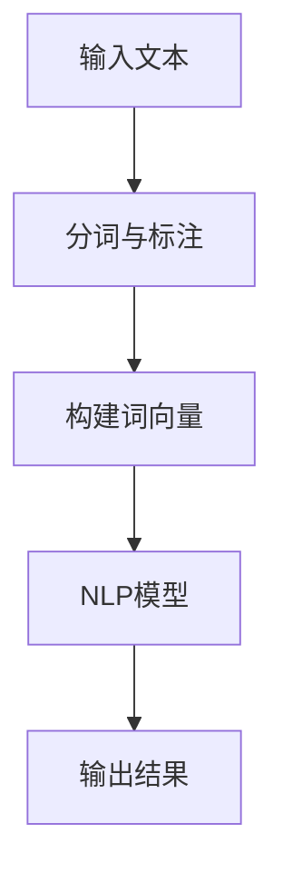
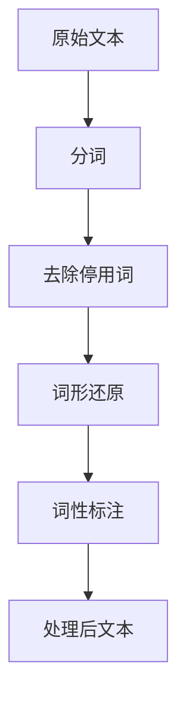

# 自然语言处理(Natural Language Processing) - 原理与代码实例讲解

## 1.背景介绍

### 1.1 什么是自然语言处理?

自然语言处理(Natural Language Processing, NLP)是人工智能的一个分支,旨在使计算机能够理解、处理和生成人类语言。它涉及各种技术,包括计算机科学、语言学和机器学习等领域。NLP的目标是开发能够与人类进行自然交互的智能系统,实现人机无缝对话。

### 1.2 自然语言处理的重要性

随着信息时代的到来,海量的文本数据不断产生,对于高效处理和利用这些数据迫在眉睫。自然语言处理技术为解决这一问题提供了强有力的支持。NLP技术已广泛应用于机器翻译、智能问答系统、文本挖掘、情感分析等领域,极大地提高了信息处理效率,为人类生产生活带来了巨大便利。

### 1.3 自然语言处理的挑战

尽管取得了长足进步,但自然语言处理仍面临着诸多挑战:

1. 语言的复杂性和多样性
2. 语义歧义和上下文依赖性
3. 领域知识的获取和表示
4. 算法性能和可解释性的平衡
5. 数据质量和标注的困难

只有不断突破这些挑战,自然语言处理技术才能获得进一步发展。

## 2.核心概念与联系

### 2.1 语言模型

语言模型是自然语言处理中的基础概念,旨在捕捉语言的统计规律。常用的语言模型包括N-gram模型、神经网络语言模型等。语言模型可用于多种NLP任务,如机器翻译、语音识别、文本生成等。

### 2.2 词向量表示

将词语映射到连续的向量空间中是NLP的一个关键步骤。常用的词向量表示方法有One-hot编码、Word2Vec、GloVe等。好的词向量表示能够捕捉词与词之间的语义和句法关系,为后续的NLP任务提供有价值的输入特征。

### 2.3 序列建模

由于语言本质上是一个序列信号,因此序列建模是NLP的核心问题之一。常用的序列建模方法有隐马尔可夫模型(HMM)、递归神经网络(RNN)、长短期记忆网络(LSTM)、门控循环单元(GRU)等。这些模型能够有效捕捉序列数据中的长期依赖关系。

### 2.4 注意力机制

注意力机制是近年来在NLP中获得巨大成功的关键技术之一。它允许模型在编码序列时,对不同位置的输入词语赋予不同的权重,从而更好地捕捉长期依赖关系。注意力机制广泛应用于机器翻译、阅读理解、文本摘要等任务中。

### 2.5 预训练语言模型

预训练语言模型(Pre-trained Language Model,PLM)是近年来NLP领域的一个重大突破。PLM通过在大规模无标注语料上进行预训练,获得通用的语言表示能力,然后将这些表示能力迁移到下游的NLP任务中,极大地提高了模型的性能。著名的PLM有BERT、GPT、XLNet等。

## 3.核心算法原理具体操作步骤

### 3.1 文本预处理

文本预处理是NLP任务的基础步骤,包括分词、去除停用词、词形还原、词性标注等操作。分词算法有基于规则的方法和基于统计的方法,常用的有最大正向匹配、最大概率分词等。词性标注则常采用隐马尔可夫模型或条件随机场等序列标注模型。

### 3.2 词向量表示

将词语映射到向量空间是NLP任务的关键步骤。常用的词向量表示方法有:

1. **One-hot编码**: 将每个词语用一个长度为词典大小的向量表示,向量中只有一个位置为1,其余全为0。缺点是维度过高且无法捕捉词与词之间的关系。

2. **Word2Vec**: 通过神经网络模型从大规模语料中学习词向量表示,包括CBOW和Skip-gram两种模型。能够很好地捕捉词与词之间的语义关系。

3. **GloVe**: 在Word2Vec的基础上,结合全局词共现统计信息,进一步提高了词向量表示的质量。

4. **FastText**: 在Word2Vec的基础上,引入了子词(n-gram)信息,能够更好地表示生僻词和新词。

### 3.3 序列建模算法

#### 3.3.1 隐马尔可夫模型(HMM)

隐马尔可夫模型是一种常用的生成式序列模型,广泛应用于词性标注、命名实体识别等序列标注任务。HMM由一个隐藏的马尔可夫链和一个观测序列组成,通过动态规划算法(如前向-后向算法)进行概率计算和序列解码。

#### 3.3.2 递归神经网络(RNN)

RNN是一种常用的序列模型,能够处理变长序列输入。RNN在每个时间步上对当前输入和上一时间步的隐藏状态进行计算,从而捕捉序列数据中的动态行为。但是,由于梯度消失/爆炸问题,RNN难以学习长期依赖关系。

#### 3.3.3 长短期记忆网络(LSTM)

LSTM是RNN的一种改进版本,通过引入门控机制和记忆单元,能够更好地捕捉长期依赖关系。LSTM在机器翻译、语音识别等序列建模任务中取得了卓越的成绩。

#### 3.3.4 门控循环单元(GRU)

GRU是另一种改进版的RNN,相比LSTM结构更加简单。GRU通过重置门和更新门,控制记忆单元的信息流动,同样能够有效捕捉长期依赖关系。

### 3.4 注意力机制

注意力机制是序列建模中的一种重要技术,它允许模型在编码序列时,对不同位置的输入赋予不同的权重,从而更好地捕捉长期依赖关系。

常用的注意力机制包括:

1. **加性注意力(Additive Attention)**
2. **点积注意力(Dot-Product Attention)**
3. **多头注意力(Multi-Head Attention)**

注意力机制广泛应用于机器翻译、阅读理解、文本摘要等NLP任务中。

### 3.5 预训练语言模型

预训练语言模型(PLM)是近年来NLP领域的一个重大突破。PLM通过在大规模无标注语料上进行预训练,获得通用的语言表示能力,然后将这些表示能力迁移到下游的NLP任务中,极大地提高了模型的性能。

常用的PLM包括:

1. **BERT**: 基于Transformer的双向编码器,通过掩码语言模型和下一句预测任务进行预训练。
2. **GPT**: 基于Transformer的单向解码器,通过语言模型任务进行预训练。
3. **XLNet**: 采用排列语言模型,避免了BERT的双向编码器的缺陷。
4. **ALBERT**: 通过参数化因子分解和跨层参数共享,降低了BERT的参数量。

预训练语言模型极大地提升了NLP任务的性能,成为当前NLP研究的主流范式。

## 4.数学模型和公式详细讲解举例说明

### 4.1 N-gram语言模型

N-gram语言模型是统计语言模型的一种常用形式,它通过计算n个连续词的共现概率来估计一个句子的概率:

$$P(w_1, w_2, ..., w_n) = \prod_{i=1}^{n}P(w_i|w_1, ..., w_{i-1})$$

由于计算复杂度的原因,通常采用马尔可夫假设,即一个词的概率只与前面n-1个词相关:

$$P(w_i|w_1, ..., w_{i-1}) \approx P(w_i|w_{i-n+1}, ..., w_{i-1})$$

这样,我们可以通过计数的方式估计n-gram概率:

$$P(w_i|w_{i-n+1}, ..., w_{i-1}) = \frac{C(w_{i-n+1}, ..., w_{i-1}, w_i)}{C(w_{i-n+1}, ..., w_{i-1})}$$

其中,C(·)表示计数函数。

### 4.2 Word2Vec

Word2Vec是一种广泛使用的词向量表示方法,它通过神经网络模型从大规模语料中学习词向量表示。Word2Vec包括两种模型:CBOW(连续词袋模型)和Skip-gram。

#### CBOW模型

CBOW模型的目标是基于上下文词预测当前词,其目标函数为:

$$\underset{\theta}{\mathrm{max}} \frac{1}{T}\sum_{t=1}^{T}\log P(w_t|w_{t-c}, ..., w_{t-1}, w_{t+1}, ..., w_{t+c}; \theta)$$

其中,$\theta$是模型参数,$c$是上下文窗口大小,$T$是语料库中的词数。

#### Skip-gram模型

Skip-gram模型的目标是基于当前词预测上下文词,其目标函数为:

$$\underset{\theta}{\mathrm{max}} \frac{1}{T}\sum_{t=1}^{T}\sum_{j=-c,j\neq 0}^{c}\log P(w_{t+j}|w_t; \theta)$$

通过优化上述目标函数,我们可以获得词向量表示。

### 4.3 注意力机制

注意力机制是序列建模中的一种重要技术,它允许模型在编码序列时,对不同位置的输入赋予不同的权重。

假设我们有一个查询向量$q$和一系列键值对$(k_1, v_1), (k_2, v_2), ..., (k_n, v_n)$,注意力机制的计算过程如下:

1. 计算查询向量与每个键向量的相似度得分:

$$s_i = f(q, k_i)$$

其中,$f$是一个相似度函数,如点积或加性函数。

2. 通过softmax函数将得分归一化为注意力权重:

$$\alpha_i = \frac{\exp(s_i)}{\sum_{j=1}^{n}\exp(s_j)}$$

3. 根据注意力权重对值向量进行加权求和,得到注意力输出:

$$\mathrm{attn}(q, (k_1, v_1), ..., (k_n, v_n)) = \sum_{i=1}^{n}\alpha_i v_i$$

注意力机制能够自适应地为不同位置的输入赋予不同的权重,从而更好地捕捉长期依赖关系,在机器翻译、阅读理解等任务中表现出色。

### 4.4 BERT预训练语言模型

BERT(Bidirectional Encoder Representations from Transformers)是一种基于Transformer的预训练语言模型,它通过掩码语言模型(Masked Language Model, MLM)和下一句预测(Next Sentence Prediction, NSP)两个任务进行预训练。

#### 掩码语言模型

掩码语言模型的目标是基于上下文预测被掩码的词。具体来说,对于一个输入序列$X = (x_1, x_2, ..., x_n)$,我们随机将其中一些词替换为特殊的[MASK]标记,得到掩码序列$X^{mask}$。模型的目标是最大化掩码词的条件概率:

$$\underset{\theta}{\mathrm{max}} \mathbb{E}_{X \sim \mathcal{D}}\left[\sum_{i=1}^{n}\log P(x_i|X^{mask}_{-i}; \theta)\right]$$

其中,$\mathcal{D}$是语料库的数据分布,$X^{mask}_{-i}$表示除掩码位置$i$外的其他位置。

#### 下一句预测

下一句预测任务的目标是判断两个句子是否相邻。具体来说,对于一对句子$(X^A, X^B)$,模型需要预测它们是否为连续的句子对,即最大化:

$$\log P(y|X^A, X^B; \theta)$$