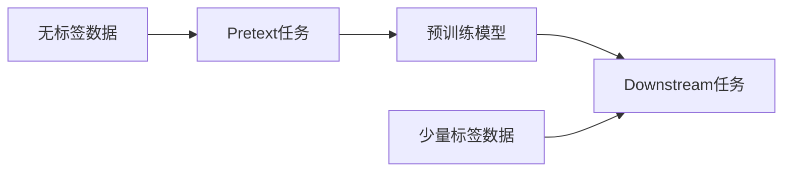
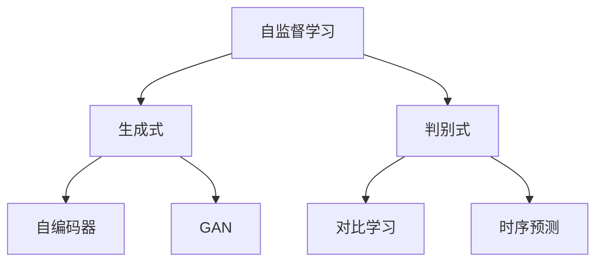
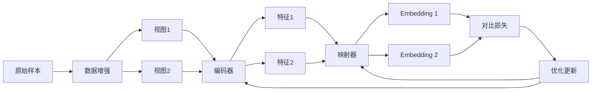

# 自监督学习Self-Supervised Learning原理与代码实例讲解

## 1.背景介绍

自监督学习(Self-Supervised Learning,SSL)是近年来机器学习和深度学习领域的一个研究热点。它是一种无需人工标注大量数据,而是利用数据本身的信息自动生成监督信号来训练模型的方法。自监督学习可以充分利用大量无标签数据,在标注数据稀缺的情况下也能学到有用的特征表示,因此在计算机视觉、自然语言处理等领域得到了广泛应用。

### 1.1 监督学习的局限性

传统的监督学习需要大量人工标注的数据作为训练集,存在以下局限:

- 人工标注成本高,耗时长。特别是医疗影像、自动驾驶等专业领域,标注需要专家参与。  
- 很多任务缺乏足够的标注数据,如视频理解、3D重建等。
- 人工标注可能引入噪声和错误,影响模型性能。
- 标注数据的分布可能与真实场景不一致,导致模型泛化性差。

### 1.2 无监督学习的不足

无监督学习如聚类、降维等不需要标签,但学到的特征表示通用性不够,难以应用到下游任务。而且缺乏明确的优化目标,难以评估模型的优劣。

### 1.3 自监督学习的优势

自监督学习在无监督学习的基础上,利用数据本身的结构信息构建监督信号,兼具无监督和监督学习的优点:

- 不需要人工标注,可充分利用无标签数据
- 学到的特征具有更好的通用性,可迁移到下游任务
- 具有明确的学习目标,更容易优化模型
- 一定程度上缓解了数据分布不一致的问题

## 2. 核心概念与联系

### 2.1 Pretext任务与Downstream任务

自监督学习分为两个阶段:

- Pretext任务:利用数据本身的信息生成监督信号,在大规模无标签数据上训练模型。如图像着色、上下文预测等。
- Downstream任务:将Pretext任务训练好的模型迁移到具体的目标任务,进行微调。如分类、检测、分割等。



### 2.2 自监督信号的构建方式

根据自监督信号的构建方式,可分为:

- 生成式:学习数据的生成过程,如自编码器、GAN等。
- 判别式:学习数据内在的结构信息,如对比学习、时序预测等。



### 2.3 自监督学习与迁移学习、半监督学习、元学习的关系

- 迁移学习:自监督学习可看作一种特殊的迁移学习,将无标签数据上学到的特征迁移到下游任务。
- 半监督学习:半监督学习利用少量标签数据和大量无标签数据,而自监督学习可作为半监督的预训练步骤。
- 元学习:自监督学习到的通用特征可加速元学习的快速适应过程。

## 3. 核心算法原理与步骤

以对比学习(Contrastive Learning)为例介绍自监督学习的核心算法。

### 3.1 对比学习的基本思想

对比学习的核心是通过最大化"正样本"的相似度和最小化"负样本"的相似度,来学习数据的内在结构。其中"正样本"是同一实例的不同视角,"负样本"是不同实例。

### 3.2 对比学习的一般步骤

1. 数据增强:对每个样本生成两个互为正样本的增强视图。
2. 特征提取:用编码器(如CNN)提取两个视图的特征。
3. 特征映射:将特征映射到对比学习的embedding空间。
4. 对比损失:最大化正样本相似度,最小化负样本相似度。常用InfoNCE损失函数。
5. 优化更新:反向传播,优化编码器和映射器的参数。



### 3.3 常见的对比学习算法

- MoCo:使用动量更新编码器,并维护一个队列存储负样本的embedding。
- SimCLR:使用更强的数据增强,并在大batch下直接比较样本间的相似度。
- BYOL:不使用负样本,而是引入一个随机初始化的online网络和target网络。
- SwAV:将对比学习与聚类结合,避免了显式定义正负样本。

## 4. 数学模型与公式推导

以InfoNCE损失函数为例,介绍对比学习的数学模型。

### 4.1 相似度度量

对于两个样本的embedding $z_i$和$z_j$,其相似度可用内积来度量:

$$
s(z_i,z_j)=z_i^Tz_j
$$

为了得到归一化的相似度,可以在embedding后加L2归一化层,再做内积:

$$
s(z_i,z_j)=\frac{z_i^T}{\Vert z_i \Vert_2} \cdot \frac{z_j}{\Vert z_j \Vert_2}
$$

### 4.2 InfoNCE损失函数

假设一个batch中有N个样本,每个样本生成两个视图,则共有2N个视图。对于第i个视图,令其另一个视图为正样本,其余2(N-1)个视图为负样本。则第i个视图的InfoNCE损失为:

$$
\mathcal{L}_i=-\log \frac{\exp(s(z_i,z_{i'}) / \tau)}{\sum_{k=1}^{2N} \mathbb{1}_{[k \neq i]} \exp(s(z_i, z_k) / \tau)}
$$

其中$\tau$是温度超参数,$\mathbb{1}$是指示函数。将所有视图的损失取平均,得到最终的损失函数:

$$
\mathcal{L}=\frac{1}{2N}\sum_{i=1}^{2N} \mathcal{L}_i
$$

最小化该损失函数,就可以学到有意义的特征表示。

### 4.3 损失函数的解释

InfoNCE可以看作是最小化正样本的交叉熵损失,同时最大化负样本的交叉熵损失。这等价于最大化下界互信息(InfoNCE定理):

$$
I(z_i,z_{i'}) \geq \log(2N) - \mathcal{L}_i
$$

其中$I(z_i,z_{i'})$是两个视图特征的互信息。因此InfoNCE损失的优化本质上是在最大化同一样本不同视图特征的互信息,学到与任务无关的通用特征。

## 5. 代码实例与详解

以下是用PyTorch实现SimCLR的简化版代码。

```python
import torch
import torch.nn as nn
import torchvision.transforms as T

# 数据增强
class TransformsSimCLR:
    def __init__(self, size):
        s = 1
        color_jitter = T.ColorJitter(0.8 * s, 0.8 * s, 0.8 * s, 0.2 * s)
        self.train_transform = T.Compose([
            T.RandomResizedCrop(size=size),
            T.RandomHorizontalFlip(),
            T.RandomApply([color_jitter], p=0.8),
            T.RandomGrayscale(p=0.2),
            T.GaussianBlur(kernel_size=int(0.1 * size)),
            T.ToTensor(),
        ])

    def __call__(self, x):
        return self.train_transform(x), self.train_transform(x)

# 编码器
class ResNetSimCLR(nn.Module):
    def __init__(self, base_model, out_dim):
        super().__init__()
        self.resnet_dict = {"resnet18": models.resnet18(pretrained=False),
                            "resnet50": models.resnet50(pretrained=False)}

        resnet = self._get_basemodel(base_model)
        num_ftrs = resnet.fc.in_features

        self.features = nn.Sequential(*list(resnet.children())[:-1])

        # projection head
        self.head = nn.Sequential(
            nn.Linear(num_ftrs, num_ftrs),
            nn.ReLU(inplace=True),
            nn.Linear(num_ftrs, out_dim)
        )

    def _get_basemodel(self, model_name):
        try:
            model = self.resnet_dict[model_name]
        except KeyError:
            raise InvalidBackboneError(
                "Invalid backbone architecture. Check the config file and pass one of: resnet18 or resnet50")
        else:
            return model

    def forward(self, x):
        h = self.features(x)
        h = h.view(h.size(0), -1)
        return self.head(h)

# 对比损失    
class ContrastiveLoss(nn.Module):
    def __init__(self, batch_size, temperature=0.5):
        super().__init__()
        self.batch_size = batch_size
        self.register_buffer("temperature", torch.tensor(temperature))
          
    def forward(self, emb_i, emb_j):
        """
        emb_i and emb_j are batches of embeddings, where corresponding indices are pairs
        z_i, z_j as per SimCLR paper
        """
        z_i = F.normalize(emb_i, dim=1)
        z_j = F.normalize(emb_j, dim=1)

        representations = torch.cat([z_i, z_j], dim=0)
        similarity_matrix = F.cosine_similarity(representations.unsqueeze(1), representations.unsqueeze(0), dim=2)
        
        sim_ij = torch.diag(similarity_matrix, self.batch_size)
        sim_ji = torch.diag(similarity_matrix, -self.batch_size)
        positives = torch.cat([sim_ij, sim_ji], dim=0)
        
        nominator = torch.exp(positives / self.temperature)
        denominator = similarity_matrix.sum(dim=1) - torch.diag(similarity_matrix) 

        loss_partial = -torch.log(nominator / (denominator + 1e-8))
        loss = loss_partial.sum() / (2 * self.batch_size)
        return loss

# 训练
def train(net, data_loader, train_optimizer, criterion, epoch):
    net.train()
    total_loss, total_num = 0.0, 0
    for pos_1, pos_2 in data_loader:
        pos_1, pos_2 = pos_1.to(device), pos_2.to(device)
        
        feature_1 = net(pos_1)
        feature_2 = net(pos_2)
        
        loss = criterion(feature_1, feature_2)

        train_optimizer.zero_grad()
        loss.backward()
        train_optimizer.step()

        total_num += batch_size
        total_loss += loss.item() * batch_size

    return total_loss / (total_num)

# 主函数
def main():
    train_data = datasets.ImageFolder(data_path, transform=TransformsSimCLR(224))
    train_loader = DataLoader(train_data, batch_size=batch_size, shuffle=True, num_workers=16, pin_memory=True, drop_last=True)
    
    simclr_model = ResNetSimCLR("resnet18", 128).to(device)
    criterion = ContrastiveLoss(batch_size=batch_size).to(device)
    optimizer = torch.optim.Adam(simclr_model.parameters(), lr)
    
    for epoch in range(epochs):
        loss = train(simclr_model, train_loader, optimizer, criterion, epoch)
        print(f"Epoch {epoch+1} - Loss: {loss}")
        
if __name__ == "__main__":
    main()        
```

代码说明:

1. 定义了一个强大的数据增强`TransformsSimCLR`,包括随机裁剪、翻转、颜色变换、灰度化、高斯模糊等。每个样本生成两个互为正样本的视图。
2. 编码器`ResNetSimCLR`使用ResNet18作为骨干网,并在最后加了一个projection head,将特征映射到128维的embedding空间。
3. 对比损失`ContrastiveLoss`以一个batch内的所有样本为负样本,仅以另一视图为正样本,基于内积相似度和InfoNCE定义损失函数。
4. 训练函数`train`每次从loader中取出一个batch的两个视图,前向传播得到embedding,计算对比损失并反向传播优化编码器。
5. 主函数定义了ImageFolder数据集和DataLoader,并实例化SimCLR模型、损失函数和优化器,调用train函数进行训