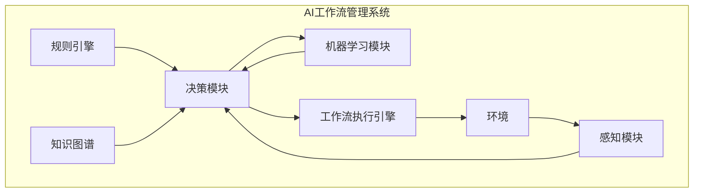

# 自适应与智能调整：AI 代理工作流的动态管理

## 1. 背景介绍

### 1.1 AI 代理与工作流自动化的重要性

在当今快节奏的数字化世界中,工作流自动化已经成为提高效率和降低运营成本的关键驱动力。传统的工作流系统虽然可以执行预定义的流程,但往往缺乏灵活性和适应性,难以应对复杂、动态的业务环境。这就催生了将人工智能 (AI) 技术与工作流自动化相结合的需求,以创建自适应、智能的工作流管理系统。

AI 代理作为智能软件实体,具备感知环境、学习和自主决策的能力,可以根据实时情况动态调整工作流,提高工作流执行的效率和质量。通过将 AI 代理融入工作流管理,我们可以实现真正的智能工作流自动化,有望显著提升业务敏捷性、降低人工干预需求,并为员工腾出更多时间专注于高价值的工作。

### 1.2 AI 工作流管理的挑战

尽管 AI 代理在工作流自动化中具有巨大潜力,但也面临着一些重大挑战:

1. **复杂性**: 工作流往往涉及多个步骤、条件分支和异常处理,需要 AI 代理具备足够的推理和决策能力来动态管理这些复杂流程。

2. **异构环境整合**: 现代企业通常拥有多种异构系统和数据源,AI 代理需要能够与这些不同系统无缝集成并访问所需数据。

3. **可解释性和可信度**: AI 决策过程通常被视为"黑箱",缺乏透明度。为确保 AI 工作流管理系统的可靠性和可信度,需要提高 AI 决策的可解释性。

4. **隐私和安全**: 在处理敏感数据时,必须确保 AI 代理遵守隐私和安全法规,防止数据泄露或被滥用。

5. **持续学习和自我完善**: AI 代理需要持续从新数据和经验中学习,并自我完善其决策模型,以适应不断变化的业务需求。

### 1.3 本文概述

本文将探讨 AI 代理在工作流动态管理中的应用,包括核心概念、算法原理、实现方法和实际案例。我们将介绍一种基于规则引擎、机器学习和知识图谱的综合方法,以构建自适应、智能的 AI 工作流管理系统。最后,我们还将讨论该领域的发展趋势、挑战及未来展望。

## 2. 核心概念与联系

在深入探讨 AI 工作流管理的技术细节之前,我们先来了解一些核心概念及它们之间的关系。

### 2.1 工作流 (Workflow)

工作流是为了完成特定业务目标而按特定顺序执行的一系列任务或活动。它定义了谁在什么时候执行什么任务,以及不同任务之间的依赖关系和控制流程。工作流通常可视化为工作流图,其中节点表示任务,边表示控制流或数据流。

### 2.2 工作流自动化 (Workflow Automation)

工作流自动化是使用软件系统来管理、执行和监控工作流的过程。它旨在减少人工干预,提高效率和一致性。传统的工作流自动化系统通常基于预定义的规则和流程模型,缺乏灵活性和适应性。

### 2.3 AI 代理 (AI Agent)

AI 代理是一种具备感知、学习、推理和行动能力的软件实体。它可以感知环境状态,基于其知识库和决策模型做出智能决策,并在环境中执行相应的行动。在工作流管理中,AI 代理可以动态监控和调整工作流的执行,以适应变化的情况。

### 2.4 规则引擎 (Rule Engine)

规则引擎是一种软件系统,用于执行一组预定义的业务规则。它根据输入数据评估规则条件,并执行与满足条件相关的动作。在 AI 工作流管理中,规则引擎可用于编码已知的业务逻辑和最佳实践,为 AI 代理提供初始决策基础。

### 2.5 机器学习 (Machine Learning)

机器学习是一种使计算机系统能够从数据中自动学习和改进的方法。通过构建数学模型并在训练数据上优化模型参数,机器学习算法可以捕获数据中的模式和规律,并对新数据做出预测或决策。在 AI 工作流管理中,机器学习可用于从历史工作流执行数据中学习最优策略。

### 2.6 知识图谱 (Knowledge Graph)

知识图谱是一种结构化的知识表示形式,它将实体及其关系以图形的方式组织起来。知识图谱可以捕获领域知识,支持复杂查询和推理。在 AI 工作流管理中,知识图谱可用于建模业务概念、流程和规则,为 AI 代理提供丰富的背景知识。

### 2.7 核心关系

上述核心概念之间存在紧密的联系,它们共同构建了一个自适应、智能的 AI 工作流管理系统:

1. **工作流**定义了需要自动化和优化的业务流程。

2. **AI 代理**作为智能控制器,负责动态监控和调整工作流执行。

3. **规则引擎**提供了初始的决策逻辑,编码了已知的最佳实践。

4. **机器学习**使 AI 代理能够从历史数据中学习,持续优化其决策模型。

5. **知识图谱**为 AI 代理提供了丰富的领域知识,支持复杂推理和决策。

这些概念相互配合,共同实现了自适应、智能的 AI 工作流动态管理。

## 3. 核心算法原理与具体操作步骤

### 3.1 AI 工作流管理系统架构

在探讨核心算法原理之前,让我们先了解一下 AI 工作流管理系统的整体架构。如下图所示,该系统由多个关键组件组成:

1. **规则引擎**: 存储预定义的业务规则和最佳实践,为决策提供初始逻辑基础。

2. **知识图谱**: 以结构化形式表示领域知识,包括业务概念、流程和规则,支持 AI 代理的复杂推理和决策。

3. **机器学习模块**: 基于历史工作流执行数据,使用机器学习算法持续优化 AI 代理的决策模型。

4. **决策模块**: 系统的大脑,集成规则引擎、知识图谱和机器学习模型,根据当前环境状态做出智能决策,指导工作流执行。

5. **工作流执行引擎**: 负责执行工作流,根据决策模块的指令动态调整工作流。

6. **感知模块**: 从环境(如业务系统、传感器等)收集相关数据,为决策提供信息输入。

7. **环境**: 工作流所在的运行环境,包括业务系统、数据源等。

该架构的核心思想是将规则引擎、知识图谱和机器学习有机结合,构建一个综合的 AI 决策系统,用于指导和优化工作流执行。接下来,我们将详细探讨其中的核心算法原理。

### 3.2 规则引擎

规则引擎是 AI 工作流管理系统的基础组件之一。它根据预定义的业务规则和条件,对工作流执行做出初步决策。规则引擎的工作原理如下:

1. **规则表示**: 规则通常用 IF-THEN 形式表示,例如 "IF 条件 A 和条件 B 满足,THEN 执行动作 X"。规则可以使用领域特定语言或通用规则语言(如 Drools 规则语言)定义。

2. **规则评估**: 在工作流执行过程中,规则引擎会评估每一条规则的条件部分是否满足。条件可以基于工作流上下文数据(如任务状态、数据值等)或外部数据源。

3. **规则执行**: 对于条件满足的规则,规则引擎会触发相应的动作部分,例如更新工作流状态、分配任务、调用外部服务等。

4. **规则优先级和冲突解决**: 如果多条规则同时满足,规则引擎需要根据预定义的优先级来确定执行顺序。它还需要处理规则之间的冲突,例如使用规则遮蔽(Rule Shadowing)或规则拼合(Rule Merging)等策略。

5. **规则管理**: 规则引擎通常提供规则管理功能,允许用户定义、修改和维护规则库,确保规则与业务需求的一致性。

规则引擎为 AI 工作流管理系统提供了初始的决策逻辑,并且易于编码和维护已知的最佳实践。然而,它也存在一些局限性,例如难以处理复杂的决策情况,并且需要手动更新规则以适应变化的需求。为了克服这些限制,我们需要引入机器学习和知识图谱等技术。

### 3.3 机器学习

机器学习算法赋予了 AI 工作流管理系统自主学习和优化决策模型的能力。以下是一些常用的机器学习技术及其在工作流优化中的应用:

#### 3.3.1 监督学习

监督学习算法通过学习已标记的训练数据,构建一个能够对新数据做出预测的模型。在工作流优化中,我们可以使用监督学习来预测工作流执行的结果或性能指标,例如:

- **分类算法**:  预测工作流是否会按时完成、是否会出现异常等。
- **回归算法**: 预测工作流的执行时间、成本等连续值指标。

通过分析历史工作流数据和相关特征(如任务类型、资源分配等),监督学习算法可以学习到影响工作流执行的关键因素,并基于这些因素做出预测。然后,AI 代理可以根据预测结果,提前采取优化措施,如调整资源分配、修改执行路径等。

#### 3.3.2 强化学习

强化学习算法通过与环境交互并获得反馈(奖励或惩罚),自主学习如何做出最优决策。在工作流优化中,我们可以将工作流执行过程建模为一个马尔可夫决策过程 (MDP),其中:

- **状态**: 工作流的当前执行状态,包括已完成任务、数据上下文等。
- **动作**: AI 代理可以采取的决策,如选择执行路径、分配资源等。
- **奖励**: 根据工作流执行的效率、质量等指标计算得到的奖励或惩罚分数。

强化学习算法(如 Q-Learning、策略梯度等)通过不断尝试不同的动作并观察其带来的奖励,逐步学习到一个最优策略,指导 AI 代理在每个状态下采取何种动作,以最大化工作流执行的总体奖励。

#### 3.3.3 无监督学习

无监督学习算法从未标记的数据中发现内在模式和结构。在工作流优化中,我们可以使用无监督学习进行以下任务:

- **聚类算法**: 根据工作流特征(如任务类型、执行时间等)对工作流进行聚类,发现存在共性的工作流群组,为定制优化策略提供依据。

- **异常检测**: 通过建模正常工作流执行的模式,检测异常情况(如执行时间过长、资源浪费等),为故障排查和优化提供线索。

- **关联规则挖掘**: 从历史数据中发现工作流执行中的频繁模式,例如"如果任务 A 和任务 B 同时出现,则很可能导致延迟"。这些规则可以补充规则引擎,丰富决策逻辑。

通过结合监督学习、强化学习和无监督学习等技术,AI 工作流管理系统可以从数据中自主学习,持续优化其决