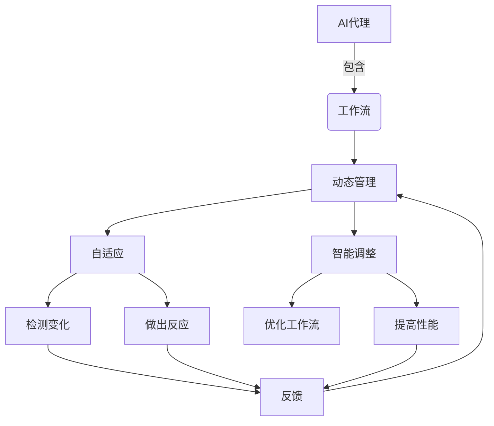
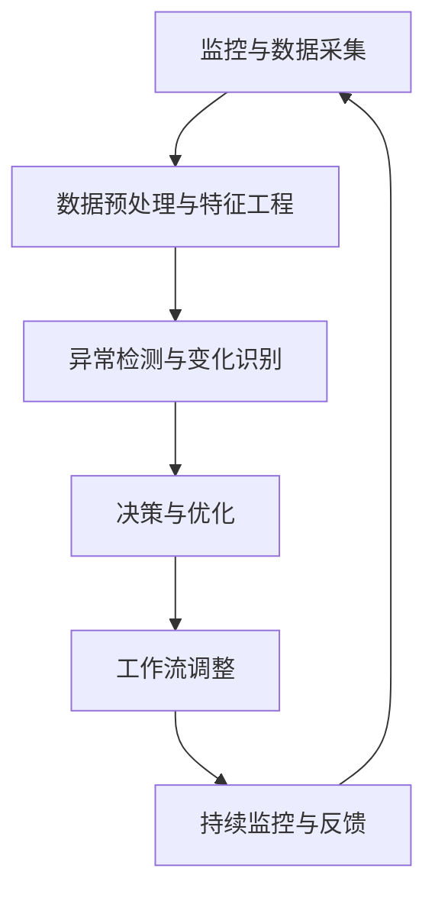
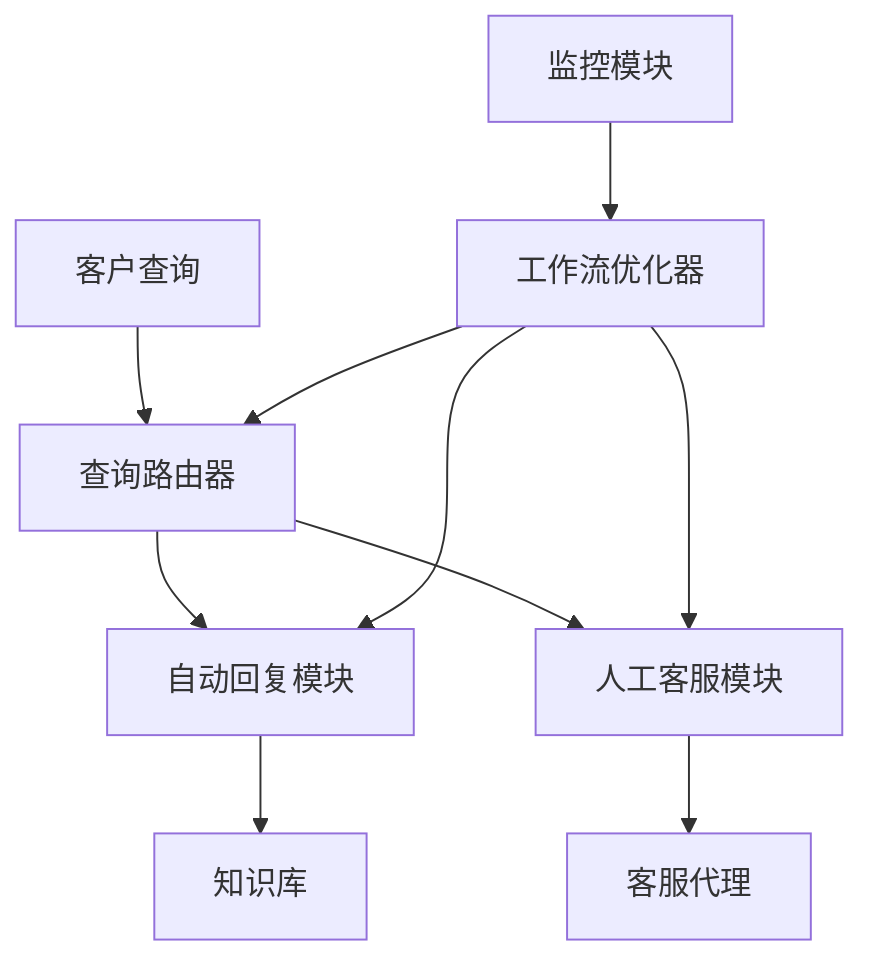

# 自适应与智能调整：AI代理工作流的动态管理

## 1.背景介绍

### 1.1 人工智能系统的复杂性

在当今快节奏的数字化世界中,人工智能(AI)系统已经无处不在,从智能助手到自动驾驶汽车,从推荐系统到金融交易决策系统。然而,这些系统的复杂性正在与日俱增。它们需要处理大量的数据输入、满足各种约束条件、适应不断变化的环境,并做出实时决策。

传统的软件系统通常是静态的,按照预定义的逻辑执行。但是,AI系统需要动态地调整其行为,以适应新的情况和需求。这就需要一种自适应和智能调整的机制,使AI代理能够优化其工作流程,提高效率和性能。

### 1.2 AI代理工作流动态管理的重要性

AI代理工作流的动态管理对于确保系统的稳健性、可扩展性和高效运行至关重要。它可以帮助系统:

- 自动检测和响应环境变化
- 优化资源分配和任务调度
- 动态调整决策策略和算法参数
- 实现自我修复和自我优化
- 提高整体系统的适应性和灵活性

通过智能调整工作流,AI代理可以做出更好的决策,提高任务完成效率,降低运营成本,并提供更好的用户体验。

## 2.核心概念与联系

### 2.1 AI代理

AI代理是一个自主的软件实体,能够感知环境、处理信息、做出决策并采取行动。它可以是一个智能助手、机器人、游戏AI或任何具有一定智能的系统。

### 2.2 工作流

工作流是一系列有序的活动或任务,旨在实现特定的目标或产出结果。AI代理的工作流包括数据采集、预处理、特征提取、模型训练、决策和执行等步骤。

### 2.3 动态管理

动态管理是指在运行时根据环境变化、系统状态和性能反馈,自适应地调整AI代理的工作流程。这可能涉及重新分配资源、更改决策策略、调整算法参数或重新安排任务优先级等操作。

### 2.4 自适应与智能调整

自适应是指AI代理能够根据新的情况和需求自动调整其行为。智能调整则是指利用机器学习、优化算法和规则引擎等技术,对工作流进行有意义的调整,以提高整体性能和效率。

### 2.5 核心关系

AI代理工作流的动态管理需要将自适应和智能调整机制相结合。自适应确保系统能够检测到变化并做出反应,而智能调整则提供了优化工作流的方法和策略。它们共同构成了一个闭环反馈系统,使AI代理能够持续学习和改进。



## 3.核心算法原理具体操作步骤

AI代理工作流的动态管理涉及多种算法和技术,包括监控、优化、规则引擎和机器学习等。下面是一个典型的核心算法流程:

1. **监控与数据采集**
    - 持续监控系统状态、性能指标和环境变量
    - 收集相关数据,如CPU/内存利用率、响应时间、错误率等

2. **数据预处理与特征工程**
    - 清理和转换原始数据
    - 提取有意义的特征,如统计特征、时间序列特征等

3. **异常检测与变化识别**
    - 使用统计模型(如高斯模型)或机器学习模型(如隔离森林)检测异常
    - 将异常情况与正常模式进行比较,识别环境或工作流的变化

4. **决策与优化**
    - 基于监控数据和变化识别结果,评估当前工作流效率
    - 利用规则引擎、优化算法(如遗传算法、模拟退火)或机器学习模型(如强化学习)决定如何调整工作流
    - 考虑各种约束(如资源限制、SLA要求等)

5. **工作流调整**
    - 根据优化决策,动态调整工作流的各个组件和参数
    - 可能的调整包括:重新分配资源、更改决策策略、调整算法超参数、重新排列任务优先级等

6. **持续监控与反馈**
    - 监控调整后的工作流性能
    - 将新的监控数据输入到模型中,形成闭环反馈
    - 根据新数据继续优化和调整

该算法流程可以在线实时执行,也可以定期离线执行(如每天/周),具体取决于系统需求和约束。通过持续的监控、优化和调整,AI代理的工作流可以动态适应变化,提高整体效率。



## 4.数学模型和公式详细讲解举例说明

在AI代理工作流的动态管理中,数学模型和公式扮演着重要角色。下面是一些常用的模型和公式,以及它们在不同阶段的应用:

### 4.1 异常检测

异常检测旨在识别与正常模式显著不同的数据点或事件。常用的异常检测模型包括:

1. **高斯模型**

   假设数据服从高斯(正态)分布,可以使用均值$\mu$和标准差$\sigma$来描述正常模式。对于一个新的数据点$x$,如果$|x-\mu|>k\sigma$(其中$k$是阈值常数),则将其视为异常。

   $$p(x) = \frac{1}{\sqrt{2\pi\sigma^2}}e^{-\frac{(x-\mu)^2}{2\sigma^2}}$$

2. **核密度估计**

   核密度估计(KDE)使用核函数(如高斯核)来估计数据的概率密度函数(PDF)。如果一个新数据点的PDF值低于给定阈值,则视为异常。

   $$\hat{f}_h(x) = \frac{1}{nh}\sum_{i=1}^nK\left(\frac{x-x_i}{h}\right)$$

   其中$K$是核函数,$h$是带宽参数。

### 4.2 特征重要性评估

在优化决策阶段,需要评估各个特征对工作流性能的影响程度。常用的特征重要性评估方法包括:

1. **相关系数**

   计算特征与目标变量(如响应时间)之间的相关性,如皮尔逊相关系数:

   $$r_{xy} = \frac{\sum_{i=1}^n(x_i - \bar{x})(y_i - \bar{y})}{\sqrt{\sum_{i=1}^n(x_i - \bar{x})^2\sum_{i=1}^n(y_i - \bar{y})^2}}$$

2. **互信息**

   互信息衡量两个随机变量之间的相关性,常用于评估非线性关系:

   $$I(X;Y) = \sum_{y\in Y}\sum_{x\in X}p(x,y)\log\frac{p(x,y)}{p(x)p(y)}$$

### 4.3 优化算法

优化算法用于寻找最佳的工作流配置,以最大化性能指标(如吞吐量)或最小化成本(如延迟)。常用的优化算法包括:

1. **遗传算法**

   遗传算法模拟生物进化过程,通过选择、交叉和变异操作来生成新的解决方案。适应度函数用于评估每个候选解的质量。

2. **模拟退火**

   模拟退火算法通过随机扰动当前解,并以一定概率接受较差的解,从而逃离局部最优。温度参数控制搜索过程。

   $$P(\Delta E) = \begin{cases}
   e^{-\Delta E/T}, & \text{if }\Delta E > 0\\
   1, & \text{if }\Delta E \leq 0
   \end{cases}$$

   其中$\Delta E$是能量变化,$T$是温度参数。

### 4.4 机器学习模型

除了传统的数学模型,机器学习模型也可以应用于工作流优化,特别是在存在复杂非线性关系时。常用的模型包括:

1. **决策树与随机森林**

   决策树通过对特征进行分割来进行预测。随机森林是多个决策树的集成,可以提高准确性和鲁棒性。

2. **人工神经网络**

   神经网络能够近似任意复杂的函数,可用于建模复杂的工作流优化问题。例如,可以使用监督学习训练一个神经网络,输入为系统状态特征,输出为优化决策。

3. **强化学习**

   强化学习通过与环境交互来学习最优策略,非常适合于工作流动态调整场景。智能体(AI代理)根据当前状态做出行动,并从环境中获得奖励信号,目标是最大化累积奖励。

通过将这些数学模型和机器学习技术相结合,AI代理可以更好地理解复杂的工作流行为,做出智能的调整决策。

## 5. 项目实践: 代码实例和详细解释说明

为了更好地理解AI代理工作流的动态管理,我们将通过一个实际项目案例来演示相关技术和算法的应用。

### 5.1 项目背景

假设我们需要开发一个智能客户服务系统,能够自动处理来自多个渠道(如电话、电子邮件、在线聊天等)的客户查询。该系统需要具备以下功能:

- 自动分类和路由查询
- 提供智能回复或将查询转发给人工客服
- 动态调整工作流以优化响应时间和资源利用率

### 5.2 系统架构



该系统包括以下主要组件:

1. **查询路由器**: 根据查询内容和优先级将其路由到自动回复模块或人工客服模块。
2. **自动回复模块**: 利用自然语言处理和知识库提供自动回复。
3. **人工客服模块**: 将无法自动解决的查询分配给人工客服代理。
4. **监控模块**: 收集系统状态和性能指标数据。
5. **工作流优化器**: 基于监控数据,动态调整工作流以优化性能。

### 5.3 关键技术

该项目涉及多种技术,包括:

- **自然语言处理(NLP)**: 用于查询分类、意图识别和自动回复生成。
- **机器学习**: 用于构建查询分类模型、响应时间预测模型等。
- **规则引擎**: 用于编写工作流优化规则。
- **优化算法**: 如遗传算法、模拟退火等,用于搜索最佳工作流配置。
- **消息队列**: 用于在系统组件之间传递查询和数据。
- **分布式计算**: 用于并行处理大量查询。

### 5.4 代码示例

下面是一个简化的Python代码示例,展示了如何使用机器学习和优化算法来动态调整工作流:

```python
import numpy as np
from sklearn.ensemble import RandomForestRegressor
from scipy.stats import norm
from deap import algorithms, base, creator, tools

# 定义工作流配置
num_agents = 10  # 客服代理数量
auto_reply_threshold = 0.8  # 自动回复置信度阈值
max_queue_size = 100  # 最大队列长度

# 监控数据
monitoring_data = [
    # 时间戳, 查询数, 响应时间, CPU利用率, ...
    [1620123456, 200, 15.2, 0.7, ...],
    [1620123457, 180, 12.1, 0.6, ...],
    ...
]

# 特征工程
features = []