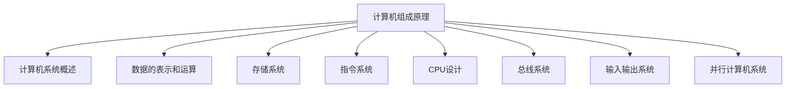
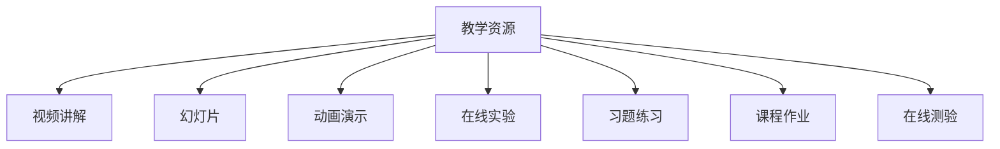
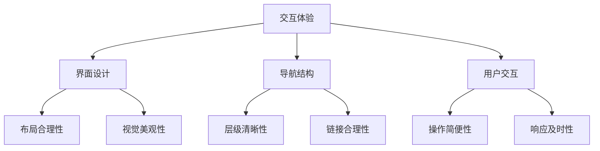
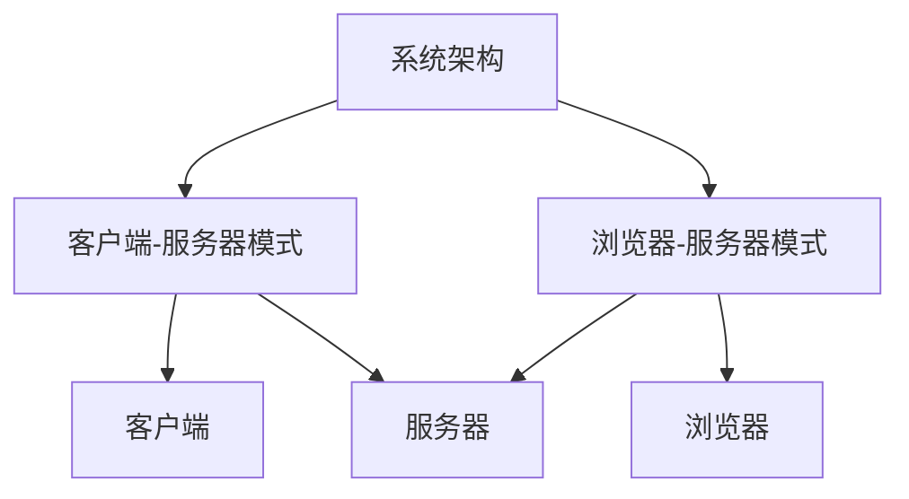

# 计算机组成原理精品课程网站详细设计与具体代码实现

## 1. 背景介绍

计算机组成原理是计算机科学与工程领域的一门核心课程,旨在让学生全面理解现代计算机系统的基本组成、工作原理和设计思想。随着信息技术的飞速发展,计算机组成原理的重要性日益凸显。然而,传统的教学方式往往过于枯燥,难以激发学生的学习兴趣。因此,构建一个精品在线课程网站,将计算机组成原理知识通过生动有趣的方式呈现,无疑是提高教学质量的有效途径。

### 1.1 课程网站的重要性

精品课程网站不仅能够提供系统化的知识框架,还可以融入多种教学资源,如视频讲解、动画演示、在线实验等,使抽象的理论概念形象生动。此外,网站还能为学生提供自主学习、讨论交流的平台,促进师生互动,加深知识理解。对于任课教师而言,网站也是整合优质教学资源、分享教学心得的绝佳渠道。

### 1.2 课程网站设计的挑战

设计一个优秀的计算机组成原理课程网站,需要解决以下几个关键挑战:

1. **知识架构合理性**:课程内容庞杂,知识点之间存在复杂的逻辑关联,如何构建清晰的知识框架,引导学生循序渐进地学习?
2. **教学资源丰富性**:单一的教学形式难以满足不同学习风格的需求,如何整合多种资源,实现理论与实践的有机结合?
3. **交互体验友好性**:网站的可用性直接影响学习效果,如何设计简洁实用的界面,提供良好的用户体验?
4. **系统可扩展性**:随着知识更新和需求变化,网站需要具备良好的可扩展性,以适应未来的发展需求。

## 2. 核心概念与联系

设计精品课程网站的核心,在于合理构建知识架构,并通过多种教学资源将抽象理论转化为具体形象。以下是几个关键概念及其内在联系:

### 2.1 知识树 (Knowledge Tree)

知识树是对课程知识点的合理组织和分层,它将知识按照一定的逻辑关系进行分类和排序,形成一个层次分明的树状结构。知识树的设计直接决定了课程的整体框架,是学习路径的指引。

### 2.2 教学资源 (Teaching Resources)

为了提高教学效果,需要整合多种教学资源,包括理论讲解、动画演示、在线实验等,使抽象概念形象化、可视化。不同类型的资源适用于不同的知识点,需要根据实际情况进行合理配置。

### 2.3 交互体验 (Interactive Experience)

良好的交互体验对于提高学习效率至关重要。网站需要具备简洁实用的界面设计,清晰的导航结构,以及友好的用户交互,为学生提供无缝的学习体验。

### 2.4 系统架构 (System Architecture)

为了确保课程网站的可扩展性和可维护性,需要采用合理的系统架构。常见的架构模式包括客户端-服务器模式、浏览器-服务器模式等,需要根据实际需求进行选择。

上述核心概念相互关联、相辅相成,共同构建了一个完整的课程网站系统。知识树确定了学习路径,教学资源提供了丰富的学习材料,交互体验保证了良好的用户体验,而系统架构则为整个系统提供了坚实的技术基础。

## 3. 核心算法原理具体操作步骤

设计精品课程网站涉及多个核心算法,包括知识树构建算法、推荐系统算法等。下面将详细介绍这些算法的原理和具体操作步骤。

### 3.1 知识树构建算法

知识树的构建是整个课程网站设计的基础,它需要将庞杂的知识点按照一定的逻辑关系进行分类和排序。常见的知识树构建算法包括层次聚类算法、基于关联规则的算法等。

以层次聚类算法为例,其具体操作步骤如下:

1. **确定知识点集合**:首先需要确定课程中所包含的所有知识点,记为 $K = \{k_1, k_2, \ldots, k_n\}$。

2. **计算知识点相似度**:对于任意两个知识点 $k_i$ 和 $k_j$,计算它们之间的相似度 $sim(k_i, k_j)$。相似度可以基于知识点的内容、先修关系等因素计算得到。

3. **构建距离矩阵**:根据知识点相似度,构建一个 $n \times n$ 的距离矩阵 $D$,其中 $D_{ij} = 1 - sim(k_i, k_j)$。

4. **层次聚类**:对距离矩阵 $D$ 进行层次聚类,得到一个树状的层次聚类结构,即知识树的初步形态。

5. **知识树优化**:根据教学经验和专家意见,对知识树进行必要的优化和调整,确保其合理性和实用性。

上述算法的时间复杂度为 $O(n^2 \log n)$,其中 $n$ 为知识点的数量。当知识点数量较大时,可以采用其他更高效的算法,如基于关联规则的算法等。

### 3.2 推荐系统算法

为了提高学习效率,课程网站需要为每位学生推荐合适的学习资源。常见的推荐系统算法包括协同过滤算法、基于内容的推荐算法等。

以基于内容的推荐算法为例,其具体操作步骤如下:

1. **构建知识点向量**:对于每个知识点 $k_i$,根据其内容构建一个 $m$ 维的向量 $\vec{v_i} = (v_{i1}, v_{i2}, \ldots, v_{im})$,其中 $m$ 为特征维度。

2. **计算知识点相似度**:对于任意两个知识点 $k_i$ 和 $k_j$,计算它们对应向量 $\vec{v_i}$ 和 $\vec{v_j}$ 之间的相似度 $sim(\vec{v_i}, \vec{v_j})$,常用的相似度度量包括余弦相似度、欧几里得距离等。

3. **构建用户知识点集合**:对于每个用户 $u$,根据其已学习的知识点构建一个集合 $K_u = \{k_1, k_2, \ldots, k_l\}$。

4. **计算候选知识点分数**:对于每个未学习的知识点 $k_c$,计算其与用户已学习知识点集合 $K_u$ 的平均相似度作为候选分数:

   $$
   score(k_c, u) = \frac{1}{l} \sum_{k_i \in K_u} sim(\vec{v_c}, \vec{v_i})
   $$

5. **推荐排序**:根据候选知识点的分数进行排序,将分数较高的知识点推荐给用户学习。

上述算法的时间复杂度为 $O(n \times l \times m)$,其中 $n$ 为知识点总数,  $l$ 为用户已学习知识点数量,  $m$ 为特征维度。在实际应用中,可以采用各种优化策略来提高算法的效率,如降维、局部敏感哈希等。

## 4. 数学模型和公式详细讲解举例说明

在课程网站的设计过程中,需要使用多种数学模型和公式来描述和求解相关问题。下面将详细介绍其中的几个典型模型和公式。

### 4.1 马尔可夫链模型

马尔可夫链是一种常用的随机过程模型,可以用于描述学生的学习路径。假设学生在时刻 $t$ 处于知识点 $k_i$,那么在时刻 $t+1$ 转移到知识点 $k_j$ 的概率只依赖于当前状态 $k_i$,而与之前的状态无关,即:

$$
P(X_{t+1} = k_j | X_t = k_i, X_{t-1} = k_{i-1}, \ldots, X_0 = k_0) = P(X_{t+1} = k_j | X_t = k_i)
$$

我们可以使用一个 $n \times n$ 的转移概率矩阵 $P$ 来描述马尔可夫链,其中 $P_{ij} = P(X_{t+1} = k_j | X_t = k_i)$ 表示从知识点 $k_i$ 转移到知识点 $k_j$ 的概率。

基于马尔可夫链模型,我们可以预测学生在未来某个时刻处于特定知识点的概率,从而为其推荐合适的学习资源。例如,假设当前时刻学生处于知识点 $k_i$,那么在时刻 $t+m$ 处于知识点 $k_j$ 的概率为:

$$
P(X_{t+m} = k_j | X_t = k_i) = (P^m)_{ij}
$$

其中 $P^m$ 表示转移概率矩阵 $P$ 的 $m$ 次方。

### 4.2 页面rank算法

页面rank算法最初用于网页排名,但也可以应用于课程网站中知识点的重要性评估。该算法基于以下假设:一个知识点如果被许多其他重要知识点所引用,那么它本身也是重要的。

设 $R(k_i)$ 表示知识点 $k_i$ 的重要性分数,  $B(k_j)$ 表示引用知识点 $k_j$ 的所有知识点集合,  $|B(k_j)|$ 表示该集合的大小,  $d$ 为阻尼系数 $(0 < d < 1)$,那么知识点 $k_i$ 的重要性分数可以表示为:

$$
R(k_i) = (1 - d) + d \sum_{k_j \in B(k_i)} \frac{R(k_j)}{|B(k_j)|}
$$

上式表示,一个知识点的重要性分数由两部分组成:一部分来自于固有的重要性 $(1 - d)$,另一部分来自于引用它的其他知识点的重要性分数的加权平均值。

通过迭代计算,我们可以得到每个知识点的稳定重要性分数。这些分数可以用于确定知识点在课程中的权重,从而优化知识树的结构和学习路径。

### 4.3 协同过滤算法

协同过滤算法是推荐系统中常用的一种算法,它基于用户之间的相似性来预测用户对某个项目的喜好程度。在课程网站中,我们可以将用户视为学生,将项目视为知识点或学习资源。

假设有 $m$ 个学生和 $n$ 个知识点,我们可以构建一个 $m \times n$ 的评分矩阵 $R$,其中 $R_{ij}$ 表示第 $i$ 个学生对第 $j$ 个知识点的评分 (或者是否已学习的二值标记)。

对于任意两个学生 $u$ 和 $