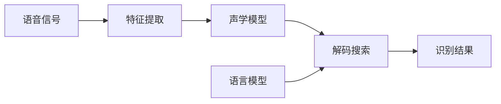

# 语音识别(Speech Recognition) - 原理与代码实例讲解

## 1. 背景介绍
### 1.1 语音识别的定义与发展历程
语音识别(Speech Recognition)是一种利用计算机和信号处理技术将人类语音中的词汇内容转换为相应的文本或命令的技术。它是人机交互的重要手段之一,可以让人类通过自然语言与计算机进行交流。语音识别技术经历了漫长的发展历程,从20世纪50年代首次提出构想,到如今已经成为人工智能领域的一个重要分支。

### 1.2 语音识别的应用场景
语音识别在各个领域都有广泛的应用,例如:

- 智能语音助手:如苹果的Siri、微软的Cortana、亚马逊的Alexa等
- 语音输入法:通过语音来输入文字,提高输入效率
- 智能客服:用户通过语音与系统交互,获取所需服务
- 会议记录:自动将会议内容转换成文本,方便后续处理
- 无障碍辅助:帮助有语言障碍或肢体残疾的人与设备交互

### 1.3 语音识别面临的挑战
尽管语音识别取得了长足进步,但仍然存在许多挑战:

- 语音信号的多样性:不同人的音色、语速、语调差异很大
- 环境噪声干扰:背景噪音会影响语音识别的准确性
- 口音和生僻词:方言口音和专业术语的识别难度大
- 连续语音识别:将连续的语音流转换成正确的文本仍有难度

## 2. 核心概念与联系
### 2.1 语音信号处理
语音信号处理是语音识别的基础,主要包括:  

- 语音采样:将连续的模拟语音信号转换为离散的数字信号
- 预加重:增强高频部分,使信号频谱变得平坦
- 分帧:将语音信号划分为等长的帧,每帧10-30ms
- 加窗:对每帧信号施加汉明窗等窗函数,减少频谱泄漏

### 2.2 特征提取
从语音信号中提取有效的特征是语音识别的关键步骤,常用的特征有:

- MFCC(Mel频率倒谱系数):在Mel频率尺度上,对语音频谱取对数并进行DCT变换 
- LPCC(线性预测倒谱系数):基于线性预测分析得到的倒谱参数
- PLP(感知线性预测):结合了听觉特性和线性预测分析

### 2.3 声学模型
声学模型用于建立语音特征和音素之间的对应关系,常见的声学模型有:

- GMM-HMM(高斯混合-隐马尔可夫模型):用GMM刻画音素的观测概率,HMM描述音素间的转移规律
- DNN-HMM(深度神经网络-隐马尔可夫模型):用DNN取代GMM,提高了声学模型的表达能力

### 2.4 语言模型
语言模型刻画了语言中词与词之间的约束关系,为识别提供先验知识。常用的语言模型有:

- N-gram:估算一个词在给定前N-1个词的条件下出现的概率
- RNN语言模型:用RNN建模词序列,考虑了长距离依赖

### 2.5 解码搜索
解码过程就是在声学模型和语言模型的约束下,寻找与观测特征序列最匹配的词序列,主要方法有:

- Viterbi解码:利用动态规划,寻找概率最大的状态序列
- Beam Search(束搜索):一种启发式图搜索算法,剪枝掉累积概率小的路径

下图展示了语音识别的核心模块以及它们之间的关系:



## 3. 核心算法原理具体操作步骤
### 3.1 MFCC特征提取
MFCC特征提取的主要步骤如下:

1. 预加重:通过一阶高通滤波器 $H(z)=1-az^{-1}, 0.9 < a < 1.0$
2. 分帧:帧长一般为20-30ms,帧移为10ms
3. 加窗:采用汉明窗 $w(n)=0.54-0.46\cos(\frac{2\pi n}{N-1}), 0 \leq n \leq N-1$
4. FFT:对每帧加窗后的信号进行快速傅里叶变换,得到频谱
5. Mel滤波器组:将频谱通过Mel尺度的三角形滤波器,得到Mel频谱
6. 取对数:对Mel频谱取对数,得到对数Mel频谱
7. DCT:对对数Mel频谱进行离散余弦变换,得到MFCC特征

### 3.2 GMM-HMM声学模型训练
GMM-HMM的训练过程通常使用EM算法,分为以下步骤:

1. 初始化:随机初始化模型参数或用K-means聚类得到初始均值
2. E步:根据当前模型参数,计算每个观测属于每个状态的后验概率(软标签)
3. M步:根据软标签,更新模型参数(状态转移概率,GMM均值、方差、权重)
4. 重复E步和M步,直到模型收敛或达到最大迭代次数

### 3.3 Viterbi解码
Viterbi解码的目标是找到最优状态序列 $\hat{S}$,使其概率最大:

$$\hat{S} = \arg\max_S P(O|S)P(S)$$

其中 $O$ 为观测序列,$S$ 为状态序列。Viterbi解码的步骤如下:

1. 初始化:$\delta_1(i)=\pi_i b_i(o_1), \psi_1(i)=0$
2. 递推:对于 $t=2,3,...,T$:
$$\delta_t(j)=\max_{1 \leq i \leq N} [\delta_{t-1}(i)a_{ij}]b_j(o_t)$$
$$\psi_t(j)=\arg\max_{1 \leq i \leq N} [\delta_{t-1}(i)a_{ij}]$$
3. 终止:$P^*=\max_{1 \leq i \leq N} \delta_T(i)$, $q_T^*=\arg\max_{1 \leq i \leq N} \delta_T(i)$
4. 回溯:对于 $t=T-1,T-2,...,1$:
$$q_t^*=\psi_{t+1}(q_{t+1}^*)$$

其中 $\pi_i$ 为初始概率,$a_{ij}$ 为转移概率,$b_j(o_t)$ 为发射概率。

## 4. 数学模型和公式详细讲解举例说明
### 4.1 隐马尔可夫模型(HMM)
HMM是一种用于描述含有隐藏状态的随机过程的统计模型,由初始概率分布、状态转移概率分布和观测概率分布确定。

设 $Q=\{q_1,q_2,...,q_N\}$ 为 $N$ 个隐藏状态的集合,$V=\{v_1,v_2,...,v_M\}$ 为 $M$ 个可能的观测的集合,则HMM可以用三元组 $\lambda=(A,B,\pi)$ 表示:

- 状态转移概率矩阵 $A=[a_{ij}]_{N \times N}$,其中 $a_{ij}=P(i_t=q_j|i_{t-1}=q_i)$
- 观测概率矩阵 $B=[b_j(k)]_{N \times M}$,其中 $b_j(k)=P(o_t=v_k|i_t=q_j)$  
- 初始状态概率向量 $\pi=[\pi_i]$,其中 $\pi_i=P(i_1=q_i)$

例如,考虑一个掷骰子的过程,假设有两个骰子A和B,A是均匀的,B是有偏的。每次掷骰子时,要么用A(概率0.5)要么用B(概率0.5),观测到的是掷出的点数。这可以用一个两状态的HMM来建模:

- 状态集合 $Q=\{A,B\}$
- 观测集合 $V=\{1,2,3,4,5,6\}$
- 转移概率矩阵 $A=\begin{bmatrix} 0.5 & 0.5 \\ 0.5 & 0.5 \end{bmatrix}$
- 观测概率矩阵 $B=\begin{bmatrix} 1/6 & 1/6 & 1/6 & 1/6 & 1/6 & 1/6 \\ 1/10 & 1/10 & 1/10 & 1/10 & 1/10 & 5/10 \end{bmatrix}$
- 初始概率向量 $\pi=[0.5, 0.5]$

### 4.2 高斯混合模型(GMM)
GMM是多个高斯分布的加权和,常用于对连续观测的建模。一个GMM由 $K$ 个高斯分量组成,每个分量由一个均值向量 $\mu_k$、协方差矩阵 $\Sigma_k$ 和混合权重 $\omega_k$ 确定。

GMM的概率密度函数为:

$$p(x)=\sum_{k=1}^K \omega_k N(x|\mu_k,\Sigma_k)$$

其中 $N(x|\mu_k,\Sigma_k)$ 是高斯分布的概率密度函数:

$$N(x|\mu_k,\Sigma_k)=\frac{1}{(2\pi)^{D/2}|\Sigma_k|^{1/2}} \exp(-\frac{1}{2}(x-\mu_k)^T\Sigma_k^{-1}(x-\mu_k))$$

$D$ 是观测向量的维度。

例如,假设我们要用GMM对一组二维数据点建模,其真实分布是两个高斯分布的混合。我们可以用两个分量的GMM来拟合:

- 混合权重 $\omega_1=0.4, \omega_2=0.6$
- 均值向量 $\mu_1=[1,1], \mu_2=[-1,-1]$
- 协方差矩阵 $\Sigma_1=\begin{bmatrix} 1 & 0 \\ 0 & 1 \end{bmatrix}, \Sigma_2=\begin{bmatrix} 2 & 0 \\ 0 & 2 \end{bmatrix}$

那么对于一个新的数据点 $x=[0,0]$,它属于这个GMM的概率为:

$$p(x)=0.4N(x|[1,1],\begin{bmatrix} 1 & 0 \\ 0 & 1 \end{bmatrix}) + 0.6N(x|[-1,-1],\begin{bmatrix} 2 & 0 \\ 0 & 2 \end{bmatrix})$$

## 5. 项目实践:代码实例和详细解释说明
下面我们用Python实现一个简单的基于HMM的语音识别系统。

### 5.1 安装依赖库
首先安装需要的库:numpy用于数值计算,hmmlearn是HMM的工具包,python_speech_features用于提取MFCC特征。

```bash
pip install numpy hmmlearn python_speech_features
```

### 5.2 特征提取
我们使用MFCC作为语音的特征。下面的函数实现了对一个wav文件提取MFCC特征:

```python
import numpy as np
from python_speech_features import mfcc

def extract_features(wav_path):
    signal = np.fromfile(wav_path, dtype=np.int16)
    features = mfcc(signal, samplerate=16000, numcep=13, nfilt=26, nfft=512, lowfreq=0, highfreq=None, preemph=0.97, ceplifter=22, appendEnergy=True, winfunc=np.hamming)
    return features
```

### 5.3 模型训练
我们为每个词训练一个HMM模型。这里假设我们要识别两个词:"hello"和"world",每个词有10个样本。

```python
from hmmlearn import hmm

models = {}

for word in ["hello", "world"]:
    model = hmm.GaussianHMM(n_components=5, covariance_type="diag", n_iter=10)
    
    features = []
    for i in range(10):
        wav_path = f"data/{word}_{i}.wav"
        feature = extract_features(wav_path)
        features.append(feature)
    
    model.fit(features)
    models[word] = model
```

### 5.4 模型评估
对于一个新的语音样本,我们用每个