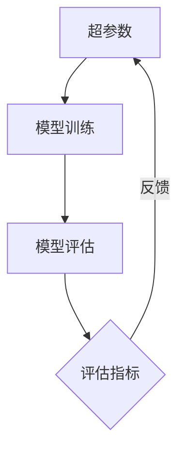

# 超参数调优的评估指标：如何判断调参效果

## 1. 背景介绍
在机器学习和深度学习中,超参数的选择对模型性能有着至关重要的影响。超参数是在模型训练之前设置的参数,例如学习率、批量大小、正则化系数等。不同的超参数组合会导致模型性能的显著差异。因此,如何选择最优的超参数组合,即超参数调优(Hyperparameter Tuning),成为了一个关键问题。

然而,超参数调优是一个复杂的过程,涉及大量的试错和迭代。为了判断不同超参数组合的效果,我们需要选择合适的评估指标。评估指标的选择直接影响了超参数调优的效果和效率。本文将深入探讨超参数调优中的评估指标,介绍常用的评估指标及其特点,并给出实践建议。

### 1.1 超参数调优的重要性
- 超参数对模型性能的影响
- 超参数调优的必要性
- 超参数调优的挑战

### 1.2 评估指标的作用
- 量化模型性能
- 比较不同超参数组合的效果  
- 指导超参数调优过程

### 1.3 评估指标的选择考虑因素
- 任务类型(分类、回归、排序等)
- 数据特点(样本量、类别分布等)  
- 业务需求(精确率、召回率、延迟等)

## 2. 核心概念与联系

### 2.1 超参数
- 定义:在模型训练之前设置的参数
- 常见超参数:学习率、批量大小、层数、激活函数等
- 超参数与模型参数的区别

### 2.2 评估指标
- 定义:用于量化模型性能的指标
- 常见评估指标:准确率、精确率、召回率、F1值、AUC等
- 评估指标与损失函数的区别

### 2.3 超参数调优与评估指标的关系
- 评估指标引导超参数调优方向
- 超参数调优依赖评估指标反馈
- 评估指标的选择影响超参数调优效果



## 3. 核心算法原理与具体操作步骤

### 3.1 网格搜索(Grid Search) 
- 原理:穷举预设的超参数组合
- 步骤:
    1. 确定超参数及其取值范围
    2. 生成所有可能的超参数组合
    3. 对每个超参数组合训练模型并评估性能
    4. 选择性能最优的超参数组合
- 优缺点分析

### 3.2 随机搜索(Random Search)
- 原理:随机采样超参数组合
- 步骤:
    1. 确定超参数及其取值分布  
    2. 从分布中随机采样超参数组合
    3. 对每个超参数组合训练模型并评估性能
    4. 选择性能最优的超参数组合
- 优缺点分析

### 3.3 贝叶斯优化(Bayesian Optimization)
- 原理:基于贝叶斯理论建模超参数与性能的关系
- 步骤:
    1. 选择初始超参数点并评估性能
    2. 建立高斯过程模型拟合超参数与性能的关系
    3. 基于获得函数确定下一个超参数点  
    4. 评估新超参数点性能并更新高斯过程模型
    5. 重复3-4步直到达到预算或收敛
- 优缺点分析

## 4. 数学模型和公式详细讲解举例说明

### 4.1 分类任务评估指标

#### 4.1.1 准确率(Accuracy)
- 定义:预测正确的样本数占总样本数的比例
- 公式:
$$
Accuracy = \frac{TP+TN}{TP+TN+FP+FN}
$$
- 示例:二分类问题中,预测正确90个样本,总样本数100,则准确率为90%

#### 4.1.2 精确率(Precision)
- 定义:预测为正类且真实为正类的样本数占预测为正类的样本数的比例
- 公式:  
$$
Precision = \frac{TP}{TP+FP}
$$
- 示例:二分类问题中,预测为正类10个样本,其中8个为真正类,则精确率为80%

#### 4.1.3 召回率(Recall)
- 定义:预测为正类且真实为正类的样本数占真实为正类的样本数的比例
- 公式:
$$ 
Recall = \frac{TP}{TP+FN}
$$
- 示例:二分类问题中,真实为正类20个样本,预测为正类且真实为正类的有15个,则召回率为75%

#### 4.1.4 F1值(F1 Score)
- 定义:精确率和召回率的调和平均
- 公式:
$$
F1 = 2 \cdot \frac{Precision \cdot Recall}{Precision+Recall}
$$
- 示例:精确率80%,召回率75%,则F1值为77.4%

### 4.2 回归任务评估指标

#### 4.2.1 平均绝对误差(Mean Absolute Error,MAE)
- 定义:预测值与真实值绝对差的平均
- 公式:
$$
MAE = \frac{1}{n}\sum_{i=1}^n |y_i-\hat{y}_i|
$$
- 示例:预测值为[1,2,3],真实值为[1.1,1.9,3.2],则MAE为0.2

#### 4.2.2 均方误差(Mean Squared Error,MSE) 
- 定义:预测值与真实值差值的平方的平均
- 公式:
$$
MSE = \frac{1}{n}\sum_{i=1}^n (y_i-\hat{y}_i)^2
$$
- 示例:预测值为[1,2,3],真实值为[1.1,1.9,3.2],则MSE为0.05

#### 4.2.3 均方根误差(Root Mean Squared Error,RMSE)
- 定义:MSE的平方根
- 公式:  
$$
RMSE = \sqrt{\frac{1}{n}\sum_{i=1}^n (y_i-\hat{y}_i)^2}
$$
- 示例:预测值为[1,2,3],真实值为[1.1,1.9,3.2],则RMSE为0.224

### 4.3 排序任务评估指标

#### 4.3.1 平均准确率(Mean Average Precision,MAP)
- 定义:对每个查询的平均准确率求平均
- 公式:
$$
MAP = \frac{1}{Q}\sum_{q=1}^Q \frac{1}{m_q}\sum_{k=1}^n P(k) \cdot rel(k)
$$
- 示例:3个查询的平均准确率分别为0.8,0.6,0.7,则MAP为0.7

#### 4.3.2 正态化折损累计增益(Normalized Discounted Cumulative Gain,NDCG)
- 定义:考虑位置影响的累计增益与理想情况下最大累计增益之比
- 公式:
$$
NDCG@k = \frac{DCG@k}{IDCG@k}
$$
其中,
$$
DCG@k = \sum_{i=1}^k \frac{2^{rel_i}-1}{\log_2(i+1)}
$$
$$
IDCG@k = \sum_{i=1}^{|REL|} \frac{2^{rel_i}-1}{\log_2(i+1)}
$$
- 示例:对某查询前5个结果的相关性得分为[3,2,3,0,1,2],则NDCG@5=0.9192

## 5. 项目实践：代码实例和详细解释说明

下面以scikit-learn库为例,演示如何进行超参数调优并评估模型性能。

### 5.1 网格搜索示例
```python
from sklearn.datasets import load_iris
from sklearn.model_selection import train_test_split, GridSearchCV
from sklearn.svm import SVC

# 加载数据集
iris = load_iris()
X_train, X_test, y_train, y_test = train_test_split(iris.data, iris.target, test_size=0.2, random_state=42)

# 定义超参数搜索空间
param_grid = {'C': [0.1, 1, 10], 'gamma': [0.01, 0.1, 1], 'kernel': ['rbf']}

# 创建SVM模型
svc = SVC(random_state=42)

# 执行网格搜索
grid_search = GridSearchCV(svc, param_grid, cv=5, scoring='accuracy')
grid_search.fit(X_train, y_train)

# 输出最优超参数组合及其性能
print("Best parameters: ", grid_search.best_params_)
print("Best score: ", grid_search.best_score_)

# 在测试集上评估最优模型性能
best_model = grid_search.best_estimator_
accuracy = best_model.score(X_test, y_test)
print("Test accuracy: ", accuracy)
```

代码解释:
1. 加载iris数据集,并划分训练集和测试集。
2. 定义超参数搜索空间,包括正则化系数C、核函数参数gamma和核函数类型kernel。
3. 创建SVM模型对象。
4. 执行网格搜索,使用5折交叉验证,评估指标为准确率。 
5. 输出最优超参数组合及其交叉验证平均准确率。
6. 使用最优超参数组合在测试集上评估模型性能。

### 5.2 随机搜索示例
```python
from sklearn.datasets import load_boston
from sklearn.ensemble import RandomForestRegressor
from sklearn.model_selection import train_test_split, RandomizedSearchCV
from scipy.stats import randint

# 加载数据集
boston = load_boston()
X_train, X_test, y_train, y_test = train_test_split(boston.data, boston.target, test_size=0.2, random_state=42)

# 定义超参数搜索空间  
param_dist = {'n_estimators': randint(50, 200), 
              'max_depth': [3, 5, 10, 15],
              'min_samples_split': randint(2, 11),
              'min_samples_leaf': randint(1, 11)}

# 创建随机森林模型
rf = RandomForestRegressor(random_state=42)

# 执行随机搜索
random_search = RandomizedSearchCV(rf, param_distributions=param_dist, n_iter=20, cv=5, scoring='neg_mean_squared_error', random_state=42)
random_search.fit(X_train, y_train)

# 输出最优超参数组合及其性能
print("Best parameters: ", random_search.best_params_)
print("Best score: ", -random_search.best_score_)

# 在测试集上评估最优模型性能
best_model = random_search.best_estimator_
mse = -best_model.score(X_test, y_test)
print("Test MSE: ", mse)
```

代码解释:  
1. 加载boston房价数据集,并划分训练集和测试集。
2. 定义超参数搜索空间,包括决策树数量、最大深度、最小分裂样本数和最小叶子样本数。
3. 创建随机森林模型对象。
4. 执行随机搜索,随机采样20组超参数,使用5折交叉验证,评估指标为负均方误差。
5. 输出最优超参数组合及其交叉验证平均负均方误差。
6. 使用最优超参数组合在测试集上评估模型性能。

## 6. 实际应用场景

### 6.1 图像分类
- 任务:对图像进行类别标注
- 评估指标:准确率、精确率、召回率、F1值
- 超参数调优:卷积神经网络的层数、卷积核大小、池化方式等

### 6.2 推荐系统
- 任务:根据用户历史行为预测用户对物品的喜好程度
- 评估指标:MAP、NDCG
- 超参数调优:隐向量维度、正则化系数、学习率等

### 6.3 自然语言处理
- 任务:情感分析、命名实体识别、机器翻译等  
- 评估指标:准确率、F1值、BLEU等
- 超参数调优:词向量维度、循环神经网络层数、Dropout比例等

## 7. 工具和资源推荐

### 7.1 超参数调优工具
- scikit-learn:提供网格搜索和随机搜索等常用超参数调优方法
- Hyperopt:基于贝叶斯优化的超参数调优库
- Optuna:自动化超参数调优框架
- Ray Tune:可扩展的超参数调优库

### 7.2 评估指标计算工具
- scikit-learn:提供分类、回归、聚类等任务的常用评估指标计算函数
- TensorFlow:tf.keras.metrics模块提供常见的评估指标
- PyTorch:torchmetrics库提