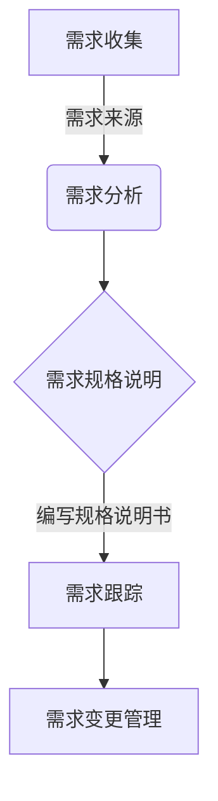
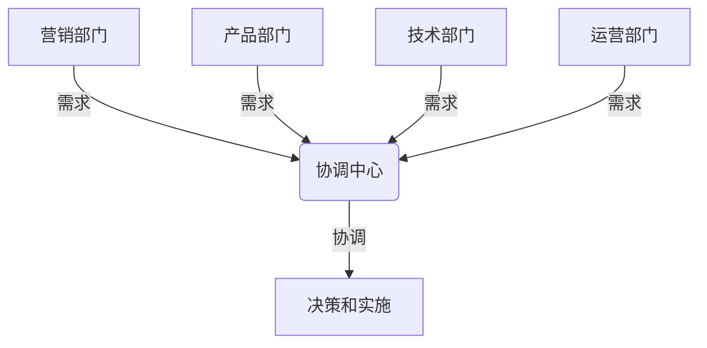
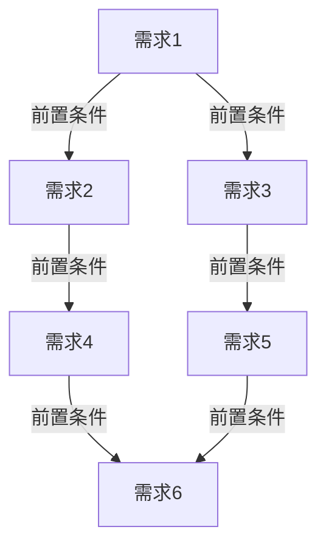
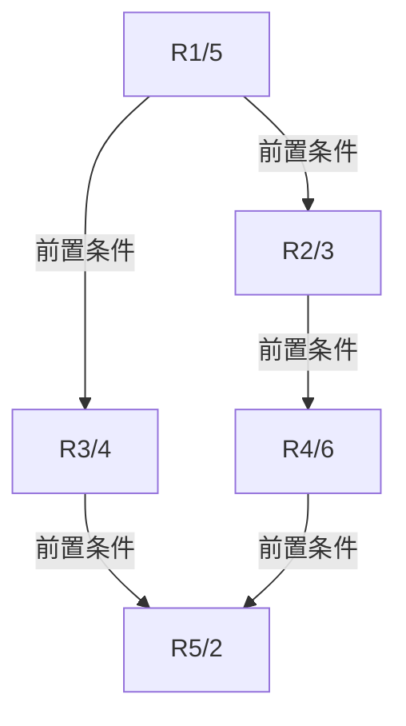

# 跨部门协调资源，依赖对业务的理解对需求进行排序和把控落地节奏

## 1.背景介绍

### 1.1 企业面临的挑战

在当今快节奏的商业环境中，企业面临着来自多方面的挑战。随着市场需求的不断变化和技术的快速发展，企业需要快速响应并适应这些变化。同时,有限的资源和复杂的组织结构也给企业的运营带来了巨大的压力。

因此,有效地协调跨部门资源、理解业务需求并制定合理的实施计划,对于企业的成功至关重要。这需要企业建立一个高效的协作机制,促进各部门之间的沟通和协调,并根据业务优先级对需求进行排序和管理。

### 1.2 需求管理的重要性

需求管理是软件开发生命周期中的一个关键过程,它确保了开发团队能够准确地理解和实现客户和业务的需求。有效的需求管理有助于:

- 减少需求变更和返工,从而降低开发成本
- 提高产品质量和客户满意度
- 加快上市时间,抢占市场先机
- 优化资源分配,提高开发效率

然而,在大型企业中,需求管理面临着诸多挑战,例如需求来源复杂、利益相关方众多、资源分散等。因此,需要建立一个系统化的流程来协调跨部门资源,并根据对业务的深入理解对需求进行排序和管理。

## 2.核心概念与联系

### 2.1 需求管理流程

需求管理流程通常包括以下几个关键步骤:

1. **需求收集**:从各个渠道(如客户、业务部门、市场调研等)收集需求。
2. **需求分析**:对需求进行审查、分类和优先级排序。
3. **需求规格说明**:将需求详细描述为可执行的规格说明书。
4. **需求跟踪**:跟踪需求在整个开发生命周期中的实现情况。
5. **需求变更管理**:评估和控制需求的变更。



### 2.2 跨部门协调

在大型企业中,需求通常来自多个部门,如营销、产品、技术、运营等。每个部门都有自己的目标和优先级,因此需要建立一个协调机制来确保需求的一致性和可行性。

跨部门协调包括以下几个关键方面:

1. **沟通和协作**:促进各部门之间的沟通和协作,建立共同的目标和理解。
2. **利益相关方管理**:识别和管理所有相关利益相关方的需求和期望。
3. **资源协调**:协调各部门的资源分配,确保需求得到及时和高效的实现。
4. **决策机制**:建立一个明确的决策机制,解决需求冲突和优先级问题。



### 2.3 对业务的理解

对业务的深入理解是有效管理需求的关键前提。它包括以下几个方面:

1. **业务目标**:清晰地理解企业的战略目标和业务目标。
2. **业务流程**:熟悉企业的核心业务流程和运营模式。
3. **市场动态**:掌握行业趋势和竞争对手的动向。
4. **客户需求**:深入了解客户的痛点和需求。

只有对业务有深入的理解,才能准确地评估需求的重要性和优先级,制定出符合业务目标的实施计划。

## 3.核心算法原理具体操作步骤

虽然需求管理并不涉及复杂的算法,但是我们可以借鉴一些经典的优先级排序算法,来优化需求排序的过程。

### 3.1 需求优先级排序算法

一种常见的需求优先级排序算法是**加权积分法**。它的基本思路是:

1. 确定优先级评估标准,如业务价值、实现难度、风险等。
2. 为每个标准分配权重,反映其相对重要性。
3. 对每个需求在各个标准下进行打分。
4. 计算每个需求的加权分数,作为优先级的依据。

加权积分法的优点是简单易用,可以根据企业的具体情况调整评估标准和权重。但它也存在一些缺陷,如标准和权重的确定较为主观,难以处理需求之间的相互依赖关系。

### 3.2 需求依赖关系分析

在实际项目中,需求之间往往存在着复杂的依赖关系。例如,某些需求是其他需求的前置条件,或者多个需求共享相同的资源。因此,我们需要对需求的依赖关系进行分析,以确保实施计划的可行性和效率。

一种常见的依赖关系分析方法是**关键路径法**。它的基本思路是:

1. 构建需求依赖关系网络图。
2. 计算每个需求的最早开始时间和最晚开始时间。
3. 确定关键路径,即完成时间最长的路径。
4. 根据关键路径调整需求的实施顺序和资源分配。

关键路径法可以帮助我们识别项目中的关键需求和瓶颈,优化实施计划,缩短总体开发周期。



在上图中,A->B->D->F构成了关键路径,需要优先实施和资源分配。

## 4.数学模型和公式详细讲解举例说明

在需求优先级排序和依赖关系分析中,我们可以借助一些数学模型和公式来量化和优化决策过程。

### 4.1 加权积分法数学模型

加权积分法的数学模型如下:

设有 $n$ 个需求 $R_1, R_2, \dots, R_n$,共有 $m$ 个评估标准 $C_1, C_2, \dots, C_m$,每个标准的权重分别为 $w_1, w_2, \dots, w_m$,且 $\sum_{i=1}^m w_i = 1$。

对于需求 $R_j$,在标准 $C_i$ 下的得分为 $s_{ij}$,则其加权分数为:

$$
S_j = \sum_{i=1}^m w_i \cdot s_{ij}
$$

我们将所有需求按加权分数 $S_j$ 降序排列,得到需求的优先级顺序。

**示例**:假设有 3 个需求和 3 个评估标准,权重和得分如下:

| 需求 | 业务价值(0.5) | 实现难度(0.3) | 风险(0.2) | 加权分数 |
|------|----------------|-----------------|------------|----------|
| R1   | 5              | 3               | 2          | 4.1      |
| R2   | 4              | 4               | 4          | 4.0      |
| R3   | 3              | 2               | 5          | 3.3      |

则需求的优先级顺序为: R1 > R2 > R3。

### 4.2 关键路径法数学模型

关键路径法的数学模型如下:

设有 $n$ 个需求 $R_1, R_2, \dots, R_n$,它们之间存在依赖关系。对于每个需求 $R_i$,我们定义:

- $ES_i$: 最早开始时间
- $LS_i$: 最晚开始时间
- $D_i$: 持续时间

则有以下公式:

$$
\begin{aligned}
ES_i &= \max\limits_{R_j \in \text{前驱}} (ES_j + D_j) \\
LS_i &= \min\limits_{R_k \in \text{后继}} (LS_k - D_k)
\end{aligned}
$$

对于关键路径上的需求,有 $ES_i = LS_i$。我们可以根据这个条件识别出关键路径,并优先实施关键路径上的需求。

**示例**:假设有 5 个需求及其依赖关系和持续时间如下:



则各需求的最早开始时间和最晚开始时间为:

| 需求 | ES | LS | 关键路径 |
|------|----|----|-----------|
| R1   | 0  | 0  | 是        |
| R2   | 5  | 5  | 是        |
| R3   | 5  | 6  | 否        |
| R4   | 8  | 8  | 是        |
| R5   | 14 | 14 | 是        |

因此,关键路径为 R1 -> R2 -> R4 -> R5,需要优先实施这些需求。

## 5.项目实践:代码实例和详细解释说明

为了更好地理解和实践需求管理的相关概念和算法,我们可以编写一些代码示例。这里我们使用 Python 作为编程语言。

### 5.1 加权积分法实现

```python
class Requirement:
    def __init__(self, name, scores):
        self.name = name
        self.scores = scores

    def get_weighted_score(self, weights):
        weighted_sum = 0
        for score, weight in zip(self.scores, weights):
            weighted_sum += score * weight
        return weighted_sum

def prioritize_requirements(requirements, criteria_weights):
    weighted_requirements = []
    for req in requirements:
        weighted_score = req.get_weighted_score(criteria_weights)
        weighted_requirements.append((weighted_score, req))

    weighted_requirements.sort(reverse=True)
    return [req for score, req in weighted_requirements]

# 示例用法
requirements = [
    Requirement("R1", [5, 3, 2]),
    Requirement("R2", [4, 4, 4]),
    Requirement("R3", [3, 2, 5])
]

criteria_weights = [0.5, 0.3, 0.2]  # 业务价值、实现难度、风险

prioritized_requirements = prioritize_requirements(requirements, criteria_weights)
for req in prioritized_requirements:
    print(req.name)
```

在上面的代码中,我们定义了一个 `Requirement` 类来表示需求及其在各个标准下的得分。`prioritize_requirements` 函数实现了加权积分法的算法逻辑,返回按优先级排序后的需求列表。

### 5.2 关键路径法实现

```python
from collections import defaultdict

class Requirement:
    def __init__(self, name, duration, predecessors=None):
        self.name = name
        self.duration = duration
        self.predecessors = predecessors or []
        self.earliest_start = 0
        self.latest_start = 0

def build_dependency_graph(requirements):
    graph = defaultdict(list)
    for req in requirements:
        for pred in req.predecessors:
            graph[pred].append(req)
    return graph

def compute_earliest_start(requirements, graph):
    for req in requirements:
        if not req.predecessors:
            req.earliest_start = 0
        else:
            earliest_start = max(requirements[pred].earliest_start + requirements[pred].duration
                                 for pred in req.predecessors)
            req.earliest_start = earliest_start

def compute_latest_start(requirements, graph):
    for req in reversed(requirements):
        if not graph[req]:
            req.latest_start = req.earliest_start
        else:
            latest_start = min(requirements[succ].latest_start
                               for succ in graph[req])
            req.latest_start = latest_start - req.duration

def find_critical_path(requirements):
    critical_path = []
    for req in requirements:
        if req.earliest_start == req.latest_start:
            critical_path.append(req)
    return critical_path

# 示例用法
requirements = [
    Requirement("R1", 5, []),
    Requirement("R2", 3, ["R1"]),
    Requirement("R3", 4, ["R1"]),
    Requirement("R4", 6, ["R2"]),
    Requirement("R5", 2, ["R3", "R4"])
]

graph = build_dependency_graph(requirements)
compute_earliest_start(requirements, graph)
compute_latest_start(requirements, graph)

critical_path = find_critical_path(requirements