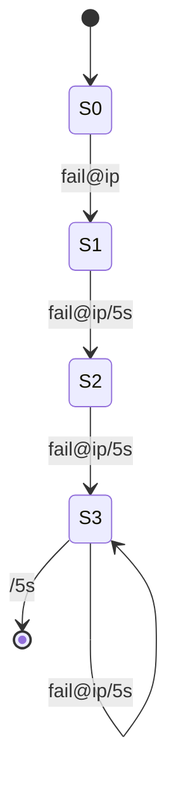

# 迭代条件：捕捉复杂事件模式

## 1.背景介绍

在当今快节奏的数字世界中,事件流数据无处不在。从网络流量到用户交互,从传感器读数到金融交易,各种形式的事件数据源源不断地产生。然而,要从这些原始事件流中提取有价值的信息并非易事,尤其是当我们需要识别复杂的事件模式时。这就是迭代条件(Iterative Conditions)发挥作用的时候。

迭代条件是一种用于复杂事件处理(CEP)的强大技术,它允许我们在事件流中查找特定的模式。通过定义一系列必须满足的条件,我们可以捕获感兴趣的复杂事件序列,从而触发相应的操作或进行进一步的数据分析。

### 1.1 复杂事件处理概述

复杂事件处理(CEP)是一种从大量事件数据中实时识别有意义的事件模式的技术。它结合了数据流处理、模式匹配和事件关联等多种技术,广泛应用于金融服务、网络监控、物联网等领域。

### 1.2 迭代条件在复杂事件处理中的作用

在复杂事件处理中,迭代条件扮演着关键角色。它允许我们定义一系列条件,这些条件必须按特定顺序或在给定时间窗口内得到满足,才能触发相应的复杂事件。通过迭代条件,我们可以捕获诸如模式、趋势、异常等复杂事件模式,从而实现实时监控、预测和决策等功能。

## 2.核心概念与联系

### 2.1 事件流

事件流是指连续的、无边界的事件序列。每个事件都携带着时间戳和相关数据,代表在特定时间发生的动作或状态变化。事件流可以来自各种来源,如网络流量、传感器读数、用户交互等。

### 2.2 事件模式

事件模式是指在事件流中需要识别的特定事件序列或组合。它可以是简单的事件序列,也可以是复杂的条件组合,包括时间约束、数据约束等。定义事件模式是复杂事件处理的核心任务。

### 2.3 迭代条件

迭代条件是用于描述事件模式的一种强大工具。它由一系列条件组成,这些条件必须按特定顺序或在给定时间窗口内得到满足,才能触发相应的复杂事件。

迭代条件通常包括以下几个核心概念:

1. **条件(Condition)**: 描述单个事件或事件属性必须满足的约束。
2. **迭代(Iteration)**: 指定条件必须重复出现的次数或模式。
3. **时间窗口(Time Window)**: 定义条件必须在何种时间范围内得到满足。
4. **逻辑运算符(Logical Operators)**: 用于组合多个条件,如AND、OR、NOT等。

通过灵活组合这些概念,我们可以构建出极其复杂的事件模式,从而捕获感兴趣的复杂事件序列。

### 2.4 迭代条件与复杂事件处理的关系

迭代条件是复杂事件处理不可或缺的组成部分。它为我们提供了一种描述和捕获复杂事件模式的强大语言,使得我们能够从海量事件流中提取有价值的信息。

通过将迭代条件与其他复杂事件处理技术(如事件关联、模式匹配等)相结合,我们可以构建出完整的复杂事件处理系统,实现实时监控、预测、决策等各种应用场景。

## 3.核心算法原理具体操作步骤

迭代条件的核心算法原理是基于有限状态机(Finite State Machine,FSM)。有限状态机是一种数学计算模型,它由一组有限的状态、一个初始状态、一个或多个终止状态,以及一组转移规则组成。

在复杂事件处理中,我们可以将迭代条件转换为有限状态机,每个条件对应一个状态,条件满足时进行状态转移。当达到终止状态时,就触发了相应的复杂事件。

以下是迭代条件算法的具体操作步骤:

1. **定义迭代条件**:首先,我们需要定义要捕获的复杂事件模式,并将其表示为一系列迭代条件。这些条件可以包括事件属性约束、时间窗口约束、逻辑运算符等。

2. **构建有限状态机**:根据定义的迭代条件,我们构建一个对应的有限状态机。每个条件对应一个状态,条件满足时进行状态转移。初始状态和终止状态分别代表模式的开始和结束。

3. **处理事件流**:当新的事件到达时,我们将其与当前状态机的状态进行匹配。如果满足当前状态的条件,则进行状态转移。否则,保持当前状态不变。

4. **管理状态机实例**:对于每个独立的事件流,我们需要维护一个状态机实例。当新事件到达时,我们需要更新所有相关的状态机实例。

5. **检测复杂事件**:当状态机达到终止状态时,我们就捕获到了相应的复杂事件模式。此时,可以触发相应的操作或进行进一步的数据分析。

6. **优化和扩展**:根据具体应用场景,我们可以对算法进行优化和扩展,例如引入部分模式匹配、增量计算等技术,以提高性能和可扩展性。

通过这种基于有限状态机的算法,迭代条件可以高效地捕获复杂的事件模式,为复杂事件处理系统提供强大的模式匹配能力。

## 4.数学模型和公式详细讲解举例说明

迭代条件可以用形式语言和自动机理论进行严格的数学建模和分析。在这一部分,我们将介绍迭代条件的数学模型,并详细讲解相关公式和示例。

### 4.1 形式语言和正则表达式

形式语言是一种用于描述事件序列的数学模型。在复杂事件处理中,我们可以将事件流视为一个字符串,每个事件代表一个字符。因此,我们可以使用正则表达式来描述感兴趣的事件模式。

正则表达式由一系列运算符和元字符组成,用于匹配字符串中的特定模式。常用的正则表达式运算符包括:

- 连接 (concatenation): 表示两个模式必须连续出现,如 `ab` 匹配字符串 "ab"。
- 选择 (alternation): 表示两个模式中的任意一个,如 `a|b` 匹配字符串 "a" 或 "b"。
- 闭包 (closure): 表示一个模式重复出现零次或多次,如 `a*` 匹配字符串中任意个 "a"。

利用正则表达式,我们可以精确地描述复杂的事件模式。例如,正则表达式 `(ab)*c` 匹配字符串 "c"、"abc"、"ababc" 等,描述了一个模式:零个或多个 "ab" 后跟一个 "c"。

### 4.2 有限状态机和自动机理论

虽然正则表达式提供了描述事件模式的方法,但它们无法直接用于实现复杂事件处理算法。相反,我们需要将正则表达式转换为等价的有限状态机,以实现高效的模式匹配。

有限状态机是一种数学计算模型,由以下五个组成部分定义:

- 一个有限的状态集合 $Q$
- 一个有限的输入字母表 $\Sigma$
- 一个转移函数 $\delta: Q \times \Sigma \rightarrow Q$
- 一个初始状态 $q_0 \in Q$
- 一个终止状态集合 $F \subseteq Q$

对于给定的输入字符串 $w = a_1a_2...a_n \in \Sigma^*$,有限状态机从初始状态 $q_0$ 开始,根据转移函数 $\delta$ 进行状态转移。如果最终达到终止状态 $q_f \in F$,则说明该字符串被接受;否则被拒绝。

有限状态机不仅可以识别正则语言,而且具有更强大的表达能力。事实上,任何正则表达式都可以转换为等价的有限状态机,反之亦然。这种等价性为我们提供了在复杂事件处理中使用有限状态机的理论基础。

### 4.3 示例:网络入侵检测

为了更好地理解迭代条件的数学模型,让我们来看一个网络入侵检测的示例。

假设我们需要检测以下模式:在 5 秒钟内,有 3 次或更多次来自同一 IP 地址的失败登录尝试。这种模式可能表明存在暴力破解密码的行为,需要触发相应的安全警报。

我们可以使用正则表达式 `(fail@ip)^3/5s` 来描述这个模式,其中:

- `fail@ip` 表示来自同一 IP 地址的失败登录尝试事件
- `^3` 表示该模式必须重复出现 3 次或更多次
- `/5s` 表示这些事件必须在 5 秒钟的时间窗口内发生

接下来,我们可以将这个正则表达式转换为等价的有限状态机,如下所示:



在这个有限状态机中:

- 初始状态 $S_0$ 表示模式尚未开始匹配
- 状态 $S_1$ 表示已经匹配到第一个 `fail@ip` 事件
- 状态 $S_2$ 表示已经匹配到第二个 `fail@ip` 事件,并且两个事件都在 5 秒钟的时间窗口内
- 状态 $S_3$ 表示已经匹配到三个或更多个 `fail@ip` 事件,并且它们都在 5 秒钟的时间窗口内
- 从 $S_3$ 到 $S_3$ 的自循环表示可以继续匹配更多的 `fail@ip` 事件,只要它们在时间窗口内
- 从 $S_3$ 到终止状态的转移表示时间窗口已经过期,模式匹配结束

通过这个示例,我们可以看到迭代条件的数学模型如何精确地描述复杂的事件模式,并且可以直接转换为有限状态机以实现高效的模式匹配算法。

## 5.项目实践:代码实例和详细解释说明

为了更好地理解迭代条件在实际项目中的应用,我们将提供一个基于 Python 的代码示例,用于实现一个简单的复杂事件处理系统。

在这个示例中,我们将使用 `re` 模块来定义正则表达式,并将其转换为有限状态机。然后,我们将模拟一个事件流,并使用有限状态机来检测感兴趣的事件模式。

### 5.1 定义事件模式

首先,我们需要定义要检测的事件模式。在这个示例中,我们将检测以下模式:在 10 秒钟内,有 3 次或更多次来自同一 IP 地址的失败登录尝试。

我们可以使用正则表达式 `(fail@\d+\.\d+\.\d+\.\d+)^3/10s` 来描述这个模式,其中:

- `fail@\d+\.\d+\.\d+\.\d+` 匹配来自任意 IP 地址的失败登录尝试事件
- `^3` 表示该模式必须重复出现 3 次或更多次
- `/10s` 表示这些事件必须在 10 秒钟的时间窗口内发生

```python
import re

# 定义事件模式
pattern = re.compile(r'(fail@\d+\.\d+\.\d+\.\d+)^3/10s')
```

### 5.2 构建有限状态机

接下来,我们需要将正则表达式转换为等价的有限状态机。在这个示例中,我们将使用一个简单的实现,将正则表达式分解为状态和转移规则。

```python
# 构建有限状态机
states = [
    ('START', None),
    ('MATCH1', None),
    ('