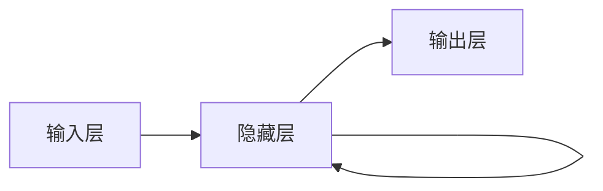

# 递归神经网络 (RNN)

## 1. 背景介绍
### 1.1 神经网络发展历程
### 1.2 递归神经网络的起源与发展
### 1.3 递归神经网络的重要性

## 2. 核心概念与联系
### 2.1 递归神经网络的定义
### 2.2 递归神经网络与传统神经网络的区别
#### 2.2.1 前馈神经网络
#### 2.2.2 卷积神经网络
#### 2.2.3 递归神经网络
### 2.3 递归神经网络的类型
#### 2.3.1 一对一RNN
#### 2.3.2 一对多RNN  
#### 2.3.3 多对一RNN
#### 2.3.4 多对多RNN

## 3. 核心算法原理具体操作步骤
### 3.1 RNN的数学表示
### 3.2 RNN的前向传播
### 3.3 RNN的反向传播与梯度计算
#### 3.3.1 BPTT算法
#### 3.3.2 梯度消失与梯度爆炸问题
### 3.4 RNN的训练过程

## 4. 数学模型和公式详细讲解举例说明
### 4.1 RNN的数学模型
#### 4.1.1 隐藏状态的计算
#### 4.1.2 输出的计算
### 4.2 损失函数与优化算法
#### 4.2.1 交叉熵损失函数
#### 4.2.2 均方误差损失函数  
#### 4.2.3 Adam优化算法
### 4.3 RNN的变体模型
#### 4.3.1 双向RNN
$$ \overrightarrow{h}_t=\sigma(W_{xh}\overrightarrow{x}_t+W_{hh}\overrightarrow{h}_{t-1}+b_h) $$
$$ \overleftarrow{h}_t=\sigma(W_{xh}\overleftarrow{x}_t+W_{hh}\overleftarrow{h}_{t+1}+b_h) $$
#### 4.3.2 深层RNN
#### 4.3.3 LSTM与GRU

## 5. 项目实践：代码实例和详细解释说明
### 5.1 使用Keras实现字符级语言模型
#### 5.1.1 数据预处理
#### 5.1.2 构建模型
#### 5.1.3 训练模型
#### 5.1.4 生成文本
### 5.2 使用PyTorch实现序列标注任务
#### 5.2.1 数据准备
#### 5.2.2 词嵌入
#### 5.2.3 构建模型
#### 5.2.4 训练与评估
### 5.3 使用TensorFlow实现情感分析
#### 5.3.1 数据探索与可视化
#### 5.3.2 文本预处理
#### 5.3.3 构建模型
#### 5.3.4 训练与测试

## 6. 实际应用场景
### 6.1 自然语言处理
#### 6.1.1 语言模型
#### 6.1.2 机器翻译
#### 6.1.3 文本分类
#### 6.1.4 命名实体识别
### 6.2 语音识别
### 6.3 时间序列预测
#### 6.3.1 股票价格预测
#### 6.3.2 天气预报
#### 6.3.3 设备健康监测

## 7. 工具和资源推荐
### 7.1 深度学习框架
#### 7.1.1 TensorFlow
#### 7.1.2 PyTorch
#### 7.1.3 Keras
### 7.2 数据集
#### 7.2.1 Penn Treebank
#### 7.2.2 WikiText
#### 7.2.3 IMDB电影评论数据集
### 7.3 预训练模型
#### 7.3.1 word2vec
#### 7.3.2 GloVe
#### 7.3.3 ELMo
### 7.4 开源项目与教程
#### 7.4.1 Awesome-RNN
#### 7.4.2 RNN教程合集
#### 7.4.3 TensorFlow官方教程

## 8. 总结：未来发展趋势与挑战
### 8.1 RNN的局限性
#### 8.1.1 长期依赖问题
#### 8.1.2 计算效率问题
### 8.2 注意力机制与Transformer
### 8.3 图神经网络
### 8.4 强化学习与RNN
### 8.5 RNN在多模态学习中的应用

## 9. 附录：常见问题与解答
### 9.1 如何选择合适的RNN变体？
### 9.2 如何解决梯度消失和梯度爆炸问题？
### 9.3 如何处理可变长度的输入序列？ 
### 9.4 如何加速RNN的训练过程？
### 9.5 如何解释RNN的预测结果？

作者：禅与计算机程序设计艺术 / Zen and the Art of Computer Programming

递归神经网络(RNN)是一类用于处理序列数据的深度学习模型。不同于传统的前馈神经网络,RNN引入了循环机制,使得网络能够记忆之前的信息,从而更好地捕捉序列数据中的长期依赖关系。RNN在自然语言处理、语音识别、时间序列预测等领域取得了广泛的应用。

RNN的核心思想是在网络中引入一个隐藏状态,用于记忆之前的信息。在每个时间步,隐藏状态不仅接收当前时刻的输入,还接收上一时刻的隐藏状态,从而实现了信息的传递和记忆。数学上,RNN可以表示为:

$$h_t = f(Ux_t + Wh_{t-1} + b)$$
$$y_t = g(Vh_t + c)$$

其中,$x_t$是t时刻的输入,$h_t$是t时刻的隐藏状态,$y_t$是t时刻的输出。$U$,$W$,$V$是可学习的权重矩阵,$b$和$c$是偏置项。$f$和$g$是激活函数,常用的有sigmoid、tanh和ReLU等。

RNN的训练通常采用反向传播算法(BPTT),即将RNN展开成一个深度前馈网络,然后使用反向传播计算梯度并更新参数。但是,由于梯度在时间上的连乘,RNN存在梯度消失和梯度爆炸的问题,导致难以捕捉长期依赖。为了缓解这一问题,研究者提出了一些改进的RNN变体,如LSTM和GRU等。

在实际应用中,RNN被广泛用于自然语言处理任务。例如,在语言模型任务中,RNN可以根据之前的词预测下一个词,从而生成连贯的文本。在机器翻译任务中,RNN可以将源语言序列编码为一个固定长度的向量,然后再解码为目标语言序列。在文本分类任务中,RNN可以将文本序列编码为一个固定长度的向量,然后送入分类器进行预测。

除了自然语言处理,RNN还被用于语音识别和时间序列预测等领域。在语音识别任务中,RNN可以将语音信号序列转换为文本序列。在时间序列预测任务中,RNN可以根据之前的观测值预测未来的趋势,如股票价格预测、天气预报等。

尽管RNN取得了巨大的成功,但它仍然存在一些局限性。首先,RNN难以捕捉长期依赖,即当序列较长时,早期的信息可能会被遗忘。其次,RNN的训练速度较慢,特别是在处理长序列时,因为每个时间步都需要依次计算。为了解决这些问题,研究者提出了一些新的架构,如注意力机制和Transformer等。

总的来说,RNN是一类强大的序列模型,在许多领域取得了巨大的成功。随着深度学习的不断发展,RNN也在不断演进,出现了许多新的变体和架构。未来,RNN有望在更多的领域得到应用,如多模态学习、强化学习等。同时,如何进一步提高RNN的性能和效率,也是一个值得研究的问题。