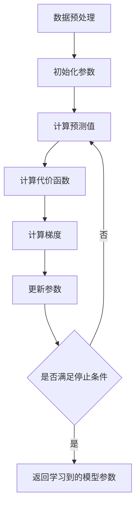

# 逻辑回归 原理与代码实例讲解

## 1.背景介绍
### 1.1 逻辑回归的起源与发展
#### 1.1.1 逻辑回归的诞生
逻辑回归(Logistic Regression)最早由统计学家 D.R.Cox 在1958年提出,是一种广义线性回归(generalized linear model),它是在线性回归的基础上衍生出来的,用来解决二分类问题。20世纪60年代以后,逻辑回归模型在许多社会学和生物医学研究中得到了广泛应用。

#### 1.1.2 逻辑回归的发展历程
随着计算机技术的发展,逻辑回归在机器学习领域得到了广泛应用。1984年,Jerome H. Friedman和 Bogdan Popescu 提出了 L2 正则化的逻辑回归。2000年,Hastie 等人提出了 L1 正则化的逻辑回归。这些正则化技术有效地解决了过拟合问题,提高了模型的泛化能力。如今,逻辑回归已成为机器学习和数据挖掘领域最常用也是最重要的分类算法之一。

### 1.2 逻辑回归的应用场景
#### 1.2.1 金融风控
在银行信贷、保险等金融领域,逻辑回归被广泛用于评估客户的违约风险、信用评分等。通过分析客户的历史数据如收入、负债、信用记录等,建立逻辑回归模型来预测客户是否会违约,从而控制金融风险。

#### 1.2.2 医疗诊断
在医疗领域,逻辑回归常用于疾病诊断和预后分析。比如通过分析患者的症状、体征、化验结果等指标,建立逻辑回归模型来预测患者是否患有某种疾病,或者预测患者的预后情况。

#### 1.2.3 推荐系统
在电商、广告等领域的推荐系统中,逻辑回归被用于预测用户是否会对某个商品或广告产生兴趣。通过用户的历史行为、偏好等数据,训练逻辑回归模型来预测用户的点击或购买意愿。

#### 1.2.4 自然语言处理
在文本分类、情感分析等自然语言处理任务中,逻辑回归是一种常用的机器学习算法。通过对文本特征进行向量化表示,然后用逻辑回归模型来预测文本所属的类别,如垃圾邮件识别、新闻分类等。

## 2.核心概念与联系
### 2.1 Sigmoid 函数
Sigmoid 函数是逻辑回归的核心,它将线性回归的输出映射到 (0,1) 区间,得到一个概率值。Sigmoid 函数的数学表达式为:

$$g(z) = \frac{1}{1+e^{-z}}$$

其中 $z$ 为线性回归 $w^Tx+b$ 的输出。当 $z$ 趋近于正无穷时,g(z) 趋近于1;当 $z$ 趋近于负无穷时,g(z) 趋近于0。Sigmoid 函数的导数为:

$$g'(z) = g(z)(1-g(z))$$

### 2.2 决策边界
逻辑回归通过 Sigmoid 函数将样本映射到 (0,1) 区间,我们需要设定一个阈值来判断样本的类别。通常取阈值为0.5,即若 $g(z)>=0.5$,则预测为正类,否则预测为负类。 $g(z)=0.5$ 所对应的 $z$ 值称为决策边界,可以表示为:

$$w^Tx+b=0$$

决策边界是一个超平面,将特征空间划分为两个区域,分别对应两个类别的预测结果。

### 2.3 代价函数
逻辑回归使用极大似然估计来求解模型参数,引入对数似然函数作为代价函数:

$$J(w,b)=-\frac{1}{m}\sum_{i=1}^m[y^{(i)}log(h_w(x^{(i)}))+(1-y^{(i)})log(1-h_w(x^{(i)}))]$$

其中 $h_w(x)=g(w^Tx+b)$ 为模型的预测函数。代价函数 $J(w,b)$ 表示了预测值与真实值之间的差距,我们的优化目标就是最小化代价函数,求出最优的模型参数 $w$ 和 $b$。

### 2.4 梯度下降法
梯度下降是求解逻辑回归代价函数最小值的常用优化算法。它通过不断迭代,沿着代价函数下降最快的方向更新参数,直到收敛到最小值点。参数的更新公式为:

$$w:=w-\alpha\frac{\partial{J(w,b)}}{\partial{w}} \\
b:=b-\alpha\frac{\partial{J(w,b)}}{\partial{b}}$$

其中 $\alpha$ 为学习率,控制每次迭代的步长。 $\frac{\partial{J(w,b)}}{\partial{w}}$ 和 $\frac{\partial{J(w,b)}}{\partial{b}}$ 分别为代价函数对 $w$ 和 $b$ 的偏导数。

### 2.5 正则化
为了防止模型过拟合,我们通常会在代价函数中加入正则化项,对模型参数进行约束。常用的正则化方法有:

- L1 正则化(Lasso):
$$J(w,b)=-\frac{1}{m}\sum_{i=1}^m[y^{(i)}log(h_w(x^{(i)}))+(1-y^{(i)})log(1-h_w(x^{(i)}))]+\lambda\sum_{j=1}^n|w_j|$$

- L2 正则化(Ridge):  
$$J(w,b)=-\frac{1}{m}\sum_{i=1}^m[y^{(i)}log(h_w(x^{(i)}))+(1-y^{(i)})log(1-h_w(x^{(i)}))]+\frac{\lambda}{2}\sum_{j=1}^nw_j^2$$

其中 $\lambda$ 为正则化系数,控制正则化的强度。L1 正则化倾向于产生稀疏解,L2 正则化倾向于参数取值平滑。

## 3.核心算法原理具体操作步骤
### 3.1 逻辑回归算法步骤
逻辑回归的训练过程可以分为以下步骤:
1. 数据预处理:对数据进行清洗、特征工程等预处理,将数据转化为模型可以接受的格式。
2. 初始化参数:随机初始化模型参数 $w$ 和 $b$ 的值。
3. 计算预测值:根据当前参数值,计算每个样本的预测概率 $h_w(x^{(i)})=g(w^Tx^{(i)}+b)$。
4. 计算代价函数:根据预测值和真实值,计算当前模型的代价函数 $J(w,b)$。
5. 计算梯度:计算代价函数对参数 $w$ 和 $b$ 的梯度 $\frac{\partial{J(w,b)}}{\partial{w}}$ 和 $\frac{\partial{J(w,b)}}{\partial{b}}$。
6. 更新参数:根据梯度下降公式,更新模型参数 $w$ 和 $b$ 的值。
7. 重复步骤3-6,直到满足停止条件(如达到最大迭代次数或代价函数变化小于阈值)。
8. 返回学习到的模型参数 $w$ 和 $b$。

预测阶段时,将新样本的特征向量代入学习到的模型中,计算 Sigmoid 函数值,根据阈值判断其类别。

### 3.2 逻辑回归算法流程图

## 4.数学模型和公式详细讲解举例说明
### 4.1 逻辑回归的概率解释
假设我们有一个二分类问题,样本的特征向量为 $x\in R^n$,类别标签为 $y\in {0,1}$,我们希望建立一个概率模型 $p(y|x)$ 来预测样本属于正类 $(y=1)$ 的概率。一个合理的假设是,样本属于正类的对数几率(log odds)是特征向量 $x$ 的线性函数:

$$log\frac{p(y=1|x)}{p(y=0|x)}=w^Tx+b$$

其中 $w\in R^n$ 和 $b\in R$ 为模型参数。将上式变形可得:

$$p(y=1|x)=\frac{1}{1+e^{-(w^Tx+b)}}=\frac{e^{w^Tx+b}}{1+e^{w^Tx+b}}$$

这就是逻辑回归模型预测正类概率的表达式,也被称为 Sigmoid 函数。相应地,预测为负类的概率为:

$$p(y=0|x)=1-p(y=1|x)=\frac{1}{1+e^{w^Tx+b}}$$

### 4.2 极大似然估计
现在我们有了概率模型,接下来需要估计模型参数 $w$ 和 $b$ 的值。最常用的参数估计方法是极大似然估计。假设训练集 ${(x^{(1)},y^{(1)}),(x^{(2)},y^{(2)}),...,(x^{(m)},y^{(m)})}$ 为 $m$ 个独立同分布的样本,则似然函数为:

$$L(w,b)=\prod_{i=1}^mp(y^{(i)}|x^{(i)};w,b)$$

对数似然函数为:

$$l(w,b)=logL(w,b)=\sum_{i=1}^mlog p(y^{(i)}|x^{(i)};w,b)$$

将逻辑回归的概率模型代入,化简可得:

$$l(w,b)=\sum_{i=1}^m[y^{(i)}log(h_w(x^{(i)}))+(1-y^{(i)})log(1-h_w(x^{(i)}))]$$

其中 $h_w(x)=g(w^Tx+b)=\frac{1}{1+e^{-(w^Tx+b)}}$ 为模型的预测函数。我们的目标是找到一组参数 $w$ 和 $b$ 来最大化对数似然函数 $l(w,b)$,这等价于最小化负对数似然函数 $J(w,b)=-l(w,b)$。

### 4.3 梯度下降推导
为了求解最优参数,我们使用梯度下降法来最小化代价函数 $J(w,b)$。首先求出代价函数对参数 $w$ 和 $b$ 的偏导数:

$$
\begin{aligned}
\frac{\partial{J(w,b)}}{\partial{w_j}}&=-\frac{1}{m}\sum_{i=1}^m[y^{(i)}(1-h_w(x^{(i)}))-(1-y^{(i)})h_w(x^{(i)})]x_j^{(i)} \\
&=\frac{1}{m}\sum_{i=1}^m(h_w(x^{(i)})-y^{(i)})x_j^{(i)} \\
\frac{\partial{J(w,b)}}{\partial{b}}&=-\frac{1}{m}\sum_{i=1}^m[y^{(i)}(1-h_w(x^{(i)}))-(1-y^{(i)})h_w(x^{(i)})] \\
&=\frac{1}{m}\sum_{i=1}^m(h_w(x^{(i)})-y^{(i)})
\end{aligned}
$$

然后根据梯度下降公式更新参数:

$$
\begin{aligned}
w_j&:=w_j-\alpha\frac{\partial{J(w,b)}}{\partial{w_j}}=w_j-\alpha\frac{1}{m}\sum_{i=1}^m(h_w(x^{(i)})-y^{(i)})x_j^{(i)} \\
b&:=b-\alpha\frac{\partial{J(w,b)}}{\partial{b}}=b-\alpha\frac{1}{m}\sum_{i=1}^m(h_w(x^{(i)})-y^{(i)})
\end{aligned}
$$

其中 $\alpha$ 为学习率。不断迭代直到算法收敛,就得到了最优参数值。

## 5.项目实践:代码实例和详细解释说明
下面用 Python 实现一个简单的逻辑回归模型,并应用于乳腺癌数据集