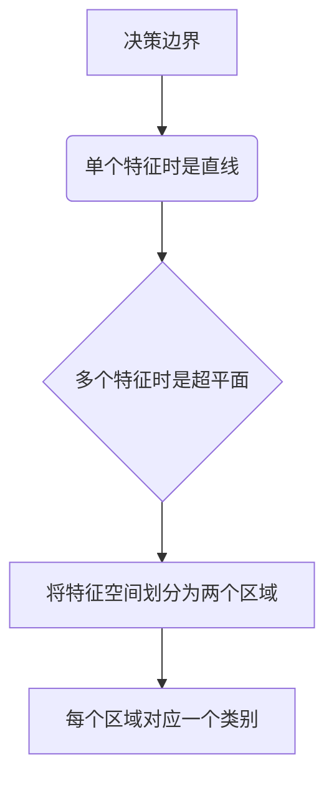
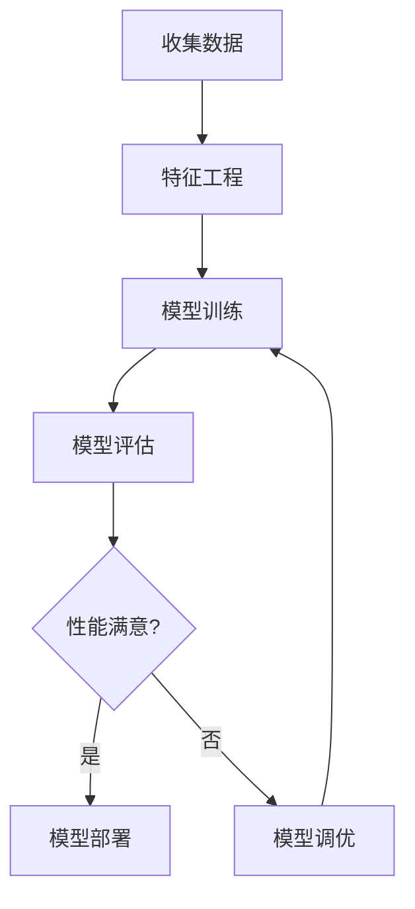

# 逻辑回归：用概率预测未来

## 1.背景介绍

### 1.1 什么是逻辑回归?

逻辑回归(Logistic Regression)是一种广泛使用的机器学习算法,主要用于解决二分类问题。它基于概率估计模型,通过对自变量的线性组合进行逻辑函数转换,来预测因变量的概率。

虽然名称中包含"回归"一词,但逻辑回归实际上是一种分类算法,而不是回归算法。它的目标是找到一个最佳拟合的方程,将连续的自变量值映射到离散的类别变量上。

### 1.2 逻辑回归的应用场景

逻辑回归在现实生活中有着广泛的应用,例如:

- 医疗诊断(患病/健康)
- 信用评分(违约/未违约)
- 垃圾邮件过滤(垃圾/非垃圾)
- 广告点击预测(点击/未点击)
- 客户流失预测(流失/保留)

任何需要对事物进行二元分类的场景,都可以使用逻辑回归模型。

## 2.核心概念与联系

### 2.1 逻辑回归的数学表达式

逻辑回归模型的数学表达式如下:

$$
P(Y=1|X) = \frac{1}{1 + e^{-(\beta_0 + \beta_1X_1 + \beta_2X_2 + ... + \beta_nX_n)}}
$$

其中:

- $P(Y=1|X)$ 表示给定自变量 $X$ 时,因变量 $Y$ 取值为1的概率
- $\beta_0$ 是常数项(偏置项)
- $\beta_1, \beta_2, ..., \beta_n$ 是各自变量的系数
- $X_1, X_2, ..., X_n$ 是自变量
- $e$ 是自然对数的底数

### 2.2 Sigmoid函数

逻辑回归模型中使用Sigmoid函数(也称为logistic函数)将线性回归的输出值映射到(0,1)范围内,从而得到一个概率值。Sigmoid函数的表达式如下:

$$
S(z) = \frac{1}{1 + e^{-z}}
$$

其曲线如下图所示:

```mermaid
graph TD
    A[Sigmoid函数曲线] -->B(输入值z)
    B --> C{S(z) = 1 / (1 + e^-z)}
    C --> D[输出值在(0,1)范围内]
```

当输入值 $z$ 趋近于正无穷时,Sigmoid函数的值趋近于1;当输入值 $z$ 趋近于负无穷时,函数值趋近于0。这种非线性映射特性使得逻辑回归能够将任意值的线性组合转化为(0,1)之间的概率值。

### 2.3 决策边界

逻辑回归模型通过设置一个阈值(通常为0.5)将预测的概率值转换为二元类别输出。当概率值大于等于阈值时,预测为正例(1);否则预测为负例(0)。

对于单个特征的情况,决策边界是一条直线;对于多个特征的情况,决策边界是一个超平面。决策边界将特征空间划分为两个区域,每个区域对应一个类别。



## 3.核心算法原理具体操作步骤

### 3.1 算法原理

逻辑回归算法的目标是找到一个最佳拟合的方程,使得给定自变量时,因变量取值为1的概率最大。这个目标可以通过最大似然估计(Maximum Likelihood Estimation)来实现。

最大似然估计的思想是:对于已知的数据集,找到一个模型参数集合(即系数 $\beta$ 的值),使得在这个模型下观测到该数据集的概率最大。

具体来说,对于二分类问题,我们定义似然函数如下:

$$
L(\beta) = \prod_{i=1}^{N} P(y_i|x_i, \beta)^{y_i} \times (1 - P(y_i|x_i, \beta))^{1-y_i}
$$

其中:

- $N$ 是训练数据集的大小
- $y_i$ 是第 $i$ 个样本的实际标签(0或1)
- $x_i$ 是第 $i$ 个样本的特征向量
- $P(y_i|x_i, \beta)$ 是在给定特征 $x_i$ 和参数 $\beta$ 时,第 $i$ 个样本被分类为正例的概率

我们的目标是找到参数 $\beta$ 的值,使得似然函数 $L(\beta)$ 最大化。由于求解过程需要对似然函数取对数,因此我们通常最大化对数似然函数:

$$
\ell(\beta) = \sum_{i=1}^{N} \big[ y_i \log P(y_i|x_i, \beta) + (1 - y_i) \log (1 - P(y_i|x_i, \beta)) \big]
$$

### 3.2 算法步骤

逻辑回归算法的具体步骤如下:

1. **收集数据**:获取带有正确标签的训练数据集。
2. **特征工程**:对原始数据进行预处理,构造有意义的特征向量。
3. **模型训练**:使用最大似然估计或其他优化算法(如梯度下降)来找到最佳拟合的参数 $\beta$。
4. **模型评估**:在测试数据集上评估模型的性能,计算准确率、精确率、召回率等指标。
5. **模型调优**:根据评估结果,通过调整超参数、特征选择等方式来提高模型性能。
6. **模型部署**:将训练好的模型集成到实际系统中,用于新数据的预测和决策。

整个过程可以用下面的流程图来概括:



## 4.数学模型和公式详细讲解举例说明

### 4.1 最大似然估计

最大似然估计是逻辑回归算法的核心,它通过最大化对数似然函数来找到最佳参数 $\beta$。对数似然函数的表达式如下:

$$
\ell(\beta) = \sum_{i=1}^{N} \big[ y_i \log P(y_i|x_i, \beta) + (1 - y_i) \log (1 - P(y_i|x_i, \beta)) \big]
$$

其中:

- $N$ 是训练数据集的大小
- $y_i$ 是第 $i$ 个样本的实际标签(0或1)
- $x_i$ 是第 $i$ 个样本的特征向量
- $P(y_i|x_i, \beta)$ 是在给定特征 $x_i$ 和参数 $\beta$ 时,第 $i$ 个样本被分类为正例的概率

我们可以使用梯度上升或牛顿法等优化算法来求解对数似然函数的最大值,从而得到最佳参数 $\beta$。

### 4.2 梯度上升法

梯度上升法是一种常用的优化算法,它通过沿着梯度的正方向迭代更新参数值,直到收敛到局部最优解。对于逻辑回归模型,梯度上升法的迭代公式如下:

$$
\beta^{(t+1)} = \beta^{(t)} + \alpha \sum_{i=1}^{N} \big[ (y_i - P(y_i|x_i, \beta^{(t)})) x_i \big]
$$

其中:

- $\alpha$ 是学习率,控制每次迭代的步长
- $t$ 是迭代次数
- $\beta^{(t)}$ 是第 $t$ 次迭代时的参数值
- $y_i$ 是第 $i$ 个样本的实际标签
- $P(y_i|x_i, \beta^{(t)})$ 是在给定特征 $x_i$ 和参数 $\beta^{(t)}$ 时,第 $i$ 个样本被分类为正例的概率

梯度上升法的优点是简单易懂,缺点是收敛速度较慢,需要设置合适的学习率和停止条件。

### 4.3 牛顿法

牛顿法是另一种常用的优化算法,它利用函数的一阶和二阶导数信息来加速收敛。对于逻辑回归模型,牛顿法的迭代公式如下:

$$
\beta^{(t+1)} = \beta^{(t)} - H^{-1} \nabla_\beta \ell(\beta^{(t)})
$$

其中:

- $H$ 是对数似然函数的海森矩阵(二阶导数矩阵)
- $\nabla_\beta \ell(\beta^{(t)})$ 是对数似然函数关于 $\beta$ 的梯度向量

牛顿法的优点是收敛速度快,缺点是计算海森矩阵的逆矩阵比较耗时。在实际应用中,我们通常使用拟牛顿法(Quasi-Newton methods)来近似计算海森矩阵的逆,从而提高效率。

### 4.4 正则化

在训练过程中,我们可以引入正则化项来防止过拟合。常用的正则化方法有L1正则化(Lasso回归)和L2正则化(Ridge回归)。

对于L1正则化,我们在对数似然函数中加入 $\lambda \sum_{j=1}^{n} |\beta_j|$ 项,其中 $\lambda$ 是正则化系数。这种正则化方式会使部分系数 $\beta_j$ 变为0,从而实现自动特征选择。

对于L2正则化,我们在对数似然函数中加入 $\lambda \sum_{j=1}^{n} \beta_j^2$ 项。这种正则化方式会使所有系数 $\beta_j$ 的值变小,但不会变为0。

正则化可以提高模型的泛化能力,防止过拟合,但同时也会增加一些偏差。我们需要在偏差和方差之间寻找一个合适的平衡点。

### 4.5 举例说明

假设我们有一个二分类数据集,包含两个特征 $x_1$ 和 $x_2$,以及对应的标签 $y$。我们希望训练一个逻辑回归模型来预测 $y$ 的值(0或1)。

首先,我们定义逻辑回归模型的表达式:

$$
P(y=1|x_1, x_2) = \frac{1}{1 + e^{-(\beta_0 + \beta_1x_1 + \beta_2x_2)}}
$$

其中 $\beta_0$、$\beta_1$ 和 $\beta_2$ 是需要估计的参数。

接下来,我们构造对数似然函数:

$$
\ell(\beta_0, \beta_1, \beta_2) = \sum_{i=1}^{N} \big[ y_i \log P(y_i|x_{i1}, x_{i2}, \beta_0, \beta_1, \beta_2) + (1 - y_i) \log (1 - P(y_i|x_{i1}, x_{i2}, \beta_0, \beta_1, \beta_2)) \big]
$$

我们可以使用梯度上升法或牛顿法等优化算法来求解对数似然函数的最大值,从而得到最佳参数 $\beta_0$、$\beta_1$ 和 $\beta_2$。

假设经过训练,我们得到了如下参数值:

- $\beta_0 = 0.5$
- $\beta_1 = 1.2$
- $\beta_2 = -0.8$

那么,对于一个新的样本 $(x_1, x_2) = (2, 1)$,它被分类为正例(y=1)的概率为:

$$
P(y=1|x_1=2, x_2=1) = \frac{1}{1 + e^{-(0.5 + 1.2 \times 2 - 0.8 \times 1)}} \approx 0.73
$$

如果我们设置决策阈值为0.5,那么这个样本将被预测为正例。

通过上述示例,我们可以更好地理解逻辑回归模型的工作原理和参数估计过程。

## 5.项目实践:代码实例和详细解释说明

在本节中,我们将使用Python的scikit-learn库来实现一个简单的逻辑回归模型,并在一个二分类数据集上进