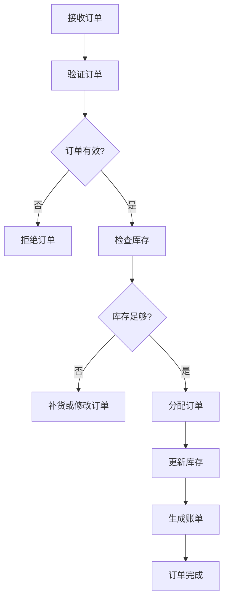
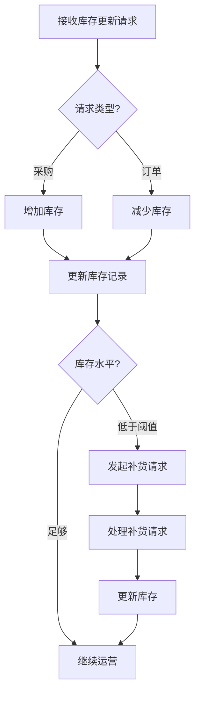
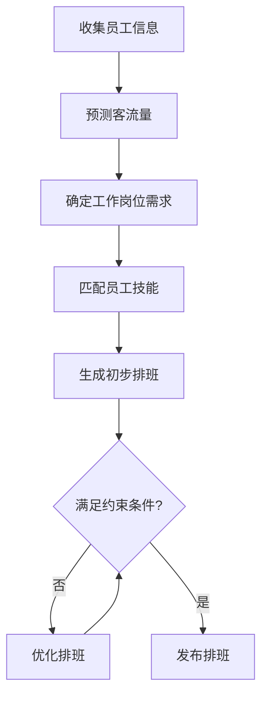
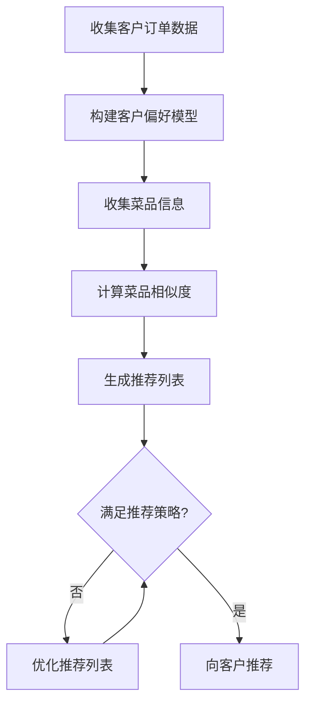

# 酒店餐饮管理系统详细设计与具体代码实现

## 1.背景介绍

在当今快节奏的生活中，酒店业已成为一个不可或缺的服务行业。无论是商务出行还是休闲度假,人们对于舒适的住宿体验和优质的餐饮服务都有着越来越高的期望。为了满足客户的需求,并提高运营效率,许多酒店都开始采用先进的管理系统来规范和优化其餐饮业务。

酒店餐饮管理系统是一种综合性的软件解决方案,旨在简化和自动化酒店内餐厅、酒吧、房间服务等餐饮相关业务的管理流程。该系统通常包括订单处理、库存管理、员工排班、销售统计等多个模块,为酒店经营者提供了一站式的管理平台。

## 2.核心概念与联系

在深入探讨酒店餐饮管理系统的设计和实现之前,我们需要先了解一些核心概念及其相互关系:

### 2.1 订单管理

订单管理是整个系统的核心,包括接受和处理来自不同渠道(如餐厅就餐、房间服务、外卖等)的订单。每个订单都包含了菜品信息、数量、特殊要求等详细内容。

### 2.2 菜品管理

菜品管理模块负责维护酒店提供的所有菜品信息,包括名称、价格、分类、库存等。这些信息对于订单处理和库存控制至关重要。

### 2.3 库存管理

库存管理模块跟踪各种原材料和产品的库存水平,并根据订单和采购情况进行实时更新。它有助于避免库存短缺或过剩的情况发生。

### 2.4 员工管理

员工管理模块负责管理餐厅的所有员工信息,包括职位、工作时间表、薪资等。合理的员工排班安排对于提供高效服务至关重要。

### 2.5 财务管理

财务管理模块记录和汇总所有与餐饮业务相关的收入和支出,为酒店经营者提供关键的财务数据和报告。

### 2.6 客户关系管理

客户关系管理(CRM)模块允许酒店跟踪和分析客户的喜好和消费习惯,从而提供个性化的服务和营销活动。

上述各个模块相互关联、协同工作,共同构建了一个完整的酒店餐饮管理解决方案。接下来,我们将深入探讨系统的核心算法原理和具体实现细节。

## 3.核心算法原理具体操作步骤

### 3.1 订单处理算法

订单处理是整个系统的核心功能,其算法原理如下:

1. **接收订单**: 系统接收来自不同渠道(如餐厅点餐、房间服务、外卖应用程序等)的订单请求。
2. **验证订单**: 系统验证订单的完整性和有效性,包括检查菜品是否存在、数量是否合理等。
3. **订单有效性检查**: 如果订单无效,系统将拒绝该订单。
4. **检查库存**: 对于有效订单,系统检查所需原材料和产品的库存情况。
5. **库存足够性检查**: 如果库存不足,系统可以自动发起补货请求或要求修改订单。
6. **分配订单**: 如果库存足够,系统将订单分配给相应的工作人员进行处理。
7. **更新库存**: 根据订单中的菜品和数量,系统更新相应原材料和产品的库存水平。
8. **生成账单**: 系统根据订单内容生成相应的账单。
9. **订单完成**: 订单处理流程完成,系统记录订单状态并进行后续操作(如支付、发货等)。

### 3.2 库存管理算法

库存管理算法负责跟踪和维护各种原材料和产品的库存水平,确保餐饮业务的顺利运行。算法原理如下:

1. **接收库存更新请求**: 系统接收来自采购模块或订单处理模块的库存更新请求。
2. **请求类型判断**: 根据请求类型(采购或订单),系统决定是增加还是减少相应的库存。
3. **增加库存**: 对于采购请求,系统增加相应原材料或产品的库存数量。
4. **减少库存**: 对于订单请求,系统减少相应原材料或产品的库存数量。
5. **更新库存记录**: 系统更新库存记录,反映最新的库存水平。
6. **库存水平检查**: 系统检查各种原材料和产品的库存水平是否低于预设的阈值。
7. **发起补货请求**: 如果库存水平低于阈值,系统自动发起补货请求。
8. **处理补货请求**: 采购部门接收并处理补货请求,完成采购流程。
9. **更新库存**: 采购完成后,系统更新相应原材料或产品的库存数量。
10. **继续运营**: 如果库存水平足够,系统继续正常运营。

### 3.3 员工排班算法

合理的员工排班对于提供高效的餐饮服务至关重要。员工排班算法的原理如下:

1. **收集员工信息**: 系统收集所有员工的信息,包括技能、工作时间偏好、假期等。
2. **预测客流量**: 根据历史数据和其他因素(如节假日、活动等),系统预测未来一段时间内的客流量。
3. **确定工作岗位需求**: 根据预测的客流量,系统确定各个工作岗位(如服务员、厨师、收银员等)的人员需求。
4. **匹配员工技能**: 系统根据员工的技能和经验,匹配合适的工作岗位。
5. **生成初步排班**: 系统生成初步的员工排班,尽量满足员工的时间偏好。
6. **满足约束条件检查**: 系统检查初步排班是否满足各种约束条件,如工作时间限制、休息时间要求等。
7. **优化排班**: 如果初步排班不满足约束条件,系统将进行优化,调整员工的工作时间和岗位分配。
8. **发布排班**: 一旦排班满足所有约束条件,系统将发布最终的员工排班。

### 3.4 菜品推荐算法

为了提高客户满意度和销售额,系统可以根据客户的历史订单和喜好,推荐合适的菜品。菜品推荐算法的原理如下:

1. **收集客户订单数据**: 系统收集客户的历史订单数据,包括所点菜品、数量、评分等信息。
2. **构建客户偏好模型**: 根据客户的订单数据,系统构建客户的菜品偏好模型,反映其对不同菜系、口味等的喜好程度。
3. **收集菜品信息**: 系统收集酒店提供的所有菜品信息,包括名称、分类、成分、营养信息等。
4. **计算菜品相似度**: 系统计算每个菜品与客户偏好模型的相似度,确定客户可能喜欢的菜品。
5. **生成推荐列表**: 根据菜品相似度,系统生成初步的推荐菜品列表。
6. **满足推荐策略检查**: 系统检查推荐列表是否满足预设的推荐策略,如菜品种类多样性、营养均衡等。
7. **优化推荐列表**: 如果推荐列表不满足策略,系统将进行优化,调整推荐菜品的组合。
8. **向客户推荐**: 一旦推荐列表满足所有策略,系统将向客户推荐这些菜品。

## 4.数学模型和公式详细讲解举例说明

在酒店餐饮管理系统中,有许多场景需要使用数学模型和公式进行计算和优化。以下是一些常见的数学模型和公式,以及它们在系统中的应用:

### 4.1 库存管理模型

库存管理模型旨在确定最佳库存水平,以满足客户需求并最小化库存成本。常用的经济订货量(EOQ)模型如下:

$$EOQ = \sqrt{\frac{2DC}{H}}$$

其中:
- $EOQ$ 表示经济订货量
- $D$ 表示年度需求量
- $C$ 表示每次订货的固定成本
- $H$ 表示每单位产品的年度库存持有成本

该模型可以帮助酒店确定每次采购的最佳数量,从而降低库存成本。

### 4.2 需求预测模型

准确预测未来的客户需求对于合理安排资源至关重要。常用的需求预测模型包括移动平均法和指数平滑法。

移动平均法公式如下:

$$F_{t+1} = \frac{1}{n}\sum_{i=t}^{t-n+1}D_i$$

其中:
- $F_{t+1}$ 表示下一期的需求预测值
- $n$ 表示移动平均的期数
- $D_i$ 表示第 $i$ 期的实际需求量

指数平滑法公式如下:

$$F_{t+1} = \alpha D_t + (1 - \alpha)F_t$$

其中:
- $F_{t+1}$ 表示下一期的需求预测值
- $\alpha$ 表示平滑常数 $(0 < \alpha < 1)$
- $D_t$ 表示当前期的实际需求量
- $F_t$ 表示当前期的需求预测值

这些模型可以帮助酒店根据历史数据预测未来的客流量和菜品需求,从而做出更好的决策。

### 4.3 员工排班优化模型

合理的员工排班对于提供高质量的服务至关重要。常用的员工排班优化模型包括整数规划和约束规划等。

整数规划模型可以表示为:

$$\begin{aligned}
\text{minimize} \quad & \sum_{i=1}^{n} \sum_{j=1}^{m} c_{ij} x_{ij} \\
\text{subject to} \quad & \sum_{j=1}^{m} x_{ij} = 1, \quad i=1,\ldots,n \\
& \sum_{i=1}^{n} x_{ij} \geq r_j, \quad j=1,\ldots,m \\
& x_{ij} \in \{0, 1\}, \quad i=1,\ldots,n, \quad j=1,\ldots,m
\end{aligned}$$

其中:
- $n$ 表示员工人数
- $m$ 表示工作岗位数量
- $c_{ij}$ 表示将员工 $i$ 分配到岗位 $j$ 的成本
- $x_{ij}$ 是决策变量,表示是否将员工 $i$ 分配到岗位 $j$
- $r_j$ 表示岗位 $j$ 的最小人员需求

该模型旨