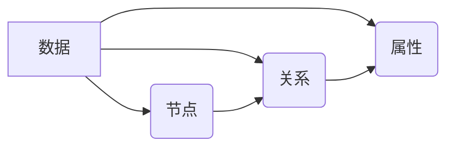
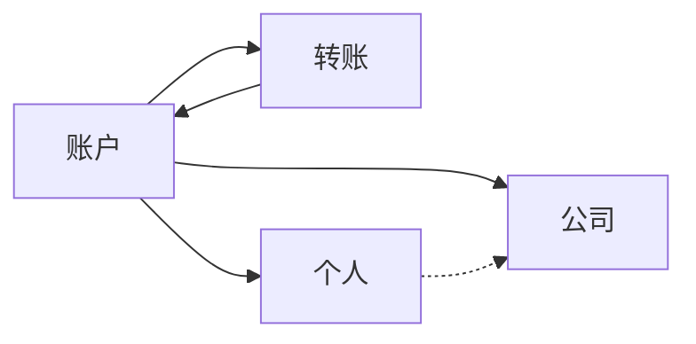

# 金融风控:Neo4j在反欺诈领域的应用

## 1.背景介绍

### 1.1 金融风险与反欺诈的重要性

在当今快节奏的金融环境中,风险管理和反欺诈措施对于维护金融体系的健康运行至关重要。金融机构面临着各种风险,包括信用风险、市场风险、操作风险和合规风险等。同时,金融欺诈活动如洗钱、身份盗窃和网络犯罪也给金融机构带来了巨大的经济损失和声誉风险。

根据最新统计数据,2022年全球金融机构因欺诈行为遭受的直接损失高达420亿美元。而有效的反欺诈措施不仅可以减少经济损失,还能提高客户对金融机构的信任度,维护金融体系的稳定性和公众利益。

### 1.2 传统反欺诈方法的局限性

传统的反欺诈方法主要依赖于规则引擎和统计模型,但这些方法存在一些固有的局限性:

- 规则引擎需要人工定义大量规则,难以及时捕捉新型欺诈手段。
- 统计模型通常基于历史数据训练,对于新兴的欺诈模式可能缺乏足够的检测能力。
- 大多数传统方法只考虑了交易本身的特征,忽视了交易之间的关联性和复杂的欺诈网络结构。

因此,金融机构亟需一种能够发现复杂欺诈模式、适应新型欺诈手段,并且具有高度可扩展性的反欺诈解决方案。

## 2.核心概念与联系

### 2.1 图数据库与Neo4j

传统的关系数据库和NoSQL数据库在处理高度互连的复杂数据时存在一些局限性。图数据库则是一种更加自然和高效的方式来存储和查询关系型数据。

Neo4j是一种领先的开源图数据库,它使用属性图模型来高效地表示和存储数据。在Neo4j中,数据被建模为节点(Node)、关系(Relationship)和属性(Property)。这种灵活的数据模型非常适合表示复杂的网络结构和实体之间的多种关联关系。



### 2.2 Neo4j在反欺诈中的优势

相比于传统的反欺诈方法,Neo4j在反欺诈领域具有以下优势:

1. **发现复杂关联模式**:Neo4j能够高效地发现和分析复杂的关系网络,如欺诈分子之间的关联、账户与账户之间的联系等,有助于揭示隐藏的欺诈模式。

2. **实时数据处理**:Neo4j支持对大规模数据进行实时查询和更新,能够及时发现新兴的欺诈活动。

3. **高度可扩展性**:Neo4j具有出色的水平扩展能力,能够支持大规模的数据量和查询负载。

4. **图形查询语言**:Neo4j提供了声明式的图形查询语言Cypher,使得复杂的图形查询和模式匹配变得简单高效。

5. **算法库丰富**:Neo4j内置了多种图算法,如最短路径、中心度、社区发现等,这些算法在反欺诈分析中有着广泛的应用。

因此,Neo4j为金融机构提供了一种全新的反欺诈解决方案,能够更好地发现和防范复杂的欺诈行为。

## 3.核心算法原理具体操作步骤

在Neo4j中,反欺诈分析主要依赖于图形模式匹配和图算法。下面将介绍其中的几种核心算法原理和具体操作步骤。

### 3.1 图形模式匹配

图形模式匹配是Neo4j的一大核心功能,它允许用户使用声明式的Cypher查询语言来查找符合特定模式的数据子图。这对于发现复杂的欺诈模式至关重要。

以下是一个示例Cypher查询,用于查找可能存在的环形转账欺诈模式:

```cypher
MATCH (a:Account)-[:TRANSFER]->(b:Account),
      (b)-[:TRANSFER]->(c:Account),
      (c)-[:TRANSFER]->(a)
WHERE a.riskScore > 0.8 OR b.riskScore > 0.8 OR c.riskScore > 0.8
RETURN a, b, c
```

该查询匹配了一个由三个账户节点组成的环形转账模式,并且至少有一个账户的风险评分超过0.8。通过这种方式,可以高效地发现潜在的欺诈活动。

### 3.2 最短路径算法

在反欺诈分析中,经常需要找出两个实体之间的关联路径,以发现潜在的欺诈网络。Neo4j内置了多种最短路径算法,可以快速计算出两个节点之间的最短路径。

以下是一个示例Cypher查询,用于查找两个账户之间的最短关联路径:

```cypher
MATCH (a:Account{id:'A123'}), (b:Account{id:'B456'}),
       path = shortestPath((a)-[*..10]-(b))
RETURN path
```

该查询计算了账户A123和B456之间的最短路径,并将结果存储在path变量中。路径的最大长度被限制为10条边,以控制计算复杂度。通过分析这些路径,可以发现潜在的欺诈关联网络。

### 3.3 社区发现算法

社区发现算法用于识别图中的密集连接组件,即具有较多内部连接但与外部连接较少的节点集合。在反欺诈领域,这种算法可以帮助发现潜在的欺诈团伙或犯罪集团。

Neo4j提供了多种社区发现算法,如Louvain算法、标签传播算法等。以下是一个使用Louvain算法的示例:

```cypher
CALL gds.louvain.stream({
  nodeProjection: 'Account',
  relationshipProjection: {
    TRANSFER: {
      orientation: 'UNDIRECTED'
    }
  }
})
YIELD nodeId, computedCommunity
RETURN gds.util.asNode(nodeId).id AS accountId, computedCommunity
ORDER BY computedCommunity
```

该查询使用Louvain算法对账户节点进行社区划分,并将结果按社区编号排序输出。通过分析同一社区内的账户,可以发现潜在的欺诈团伙成员。

## 4.数学模型和公式详细讲解举例说明

在反欺诈分析中,常常需要使用数学模型和算法来评估风险和检测异常行为。下面将介绍其中的一些常用模型和公式。

### 4.1 贝叶斯模型

贝叶斯模型是一种基于概率论的统计模型,广泛应用于欺诈检测和风险评估领域。它根据已知的先验概率和观测数据,计算出事件发生的后验概率。

贝叶斯定理的公式如下:

$$P(A|B) = \frac{P(B|A)P(A)}{P(B)}$$

其中:
- $P(A|B)$ 表示已知事件B发生的情况下,事件A发生的条件概率(后验概率)。
- $P(B|A)$ 表示已知事件A发生的情况下,事件B发生的条件概率。
- $P(A)$ 和 $P(B)$ 分别表示事件A和事件B的先验概率。

在反欺诈场景中,可以将A表示为某个交易是欺诈行为,B表示观测到的特征数据。通过贝叶斯定理,我们可以计算出给定特征数据时,交易为欺诈的后验概率,并根据这个概率值判断是否存在欺诈风险。

### 4.2 马尔可夫链模型

马尔可夫链是一种描述随机过程的数学模型,它假设未来状态只依赖于当前状态,而与过去状态无关。在反欺诈领域,马尔可夫链可用于建模和预测欺诈行为的演化过程。

设$X_t$表示时刻t的状态,马尔可夫链的转移概率可表示为:

$$P(X_{t+1}=j|X_t=i,X_{t-1}=i_{t-1},...,X_0=i_0) = P(X_{t+1}=j|X_t=i)$$

其中$P(X_{t+1}=j|X_t=i)$表示从状态i转移到状态j的概率,称为转移概率。

在实际应用中,我们可以根据历史数据估计出每个状态之间的转移概率,然后利用马尔可夫链模型预测未来的欺诈行为发展趋势。例如,可以建模账户从正常状态转移到欺诈状态的概率,从而及时发现潜在的欺诈风险。

### 4.3 异常检测算法

异常检测算法旨在从大量数据中发现那些与正常模式显著不同的异常点或异常模式。在反欺诈领域,异常检测算法可用于发现可疑的交易行为或账户活动。

一种常用的异常检测算法是基于距离的方法,它假设正常数据点彼此距离较近,而异常点与正常数据点的距离较远。常用的距离度量包括欧几里得距离、曼哈顿距离等。

设$x_i$表示第i个数据点,则基于距离的异常分数可定义为:

$$\text{AnomalyScore}(x_i) = \min\limits_{j\neq i} d(x_i, x_j)$$

其中$d(x_i, x_j)$表示$x_i$和$x_j$之间的距离。异常分数越小,表示该数据点越可能是异常点。

在Neo4j中,可以使用内置的GDSLIB库来执行各种异常检测算法,如基于距离的异常检测、基于角度的异常检测等。这些算法可以帮助发现异常的交易模式,从而识别潜在的欺诈风险。

## 5.项目实践:代码实例和详细解释说明

为了更好地理解Neo4j在反欺诈领域的应用,我们将通过一个实际项目案例来演示相关的代码实现和详细说明。

### 5.1 项目概述

本项目旨在构建一个基于Neo4j的反欺诈系统,用于监测和发现银行账户之间的可疑转账活动。我们将使用Neo4j存储账户信息和转账记录,并利用图形查询和算法来分析潜在的欺诈模式。

### 5.2 数据模型

我们将使用以下简化的数据模型:



- 账户(Account)节点表示银行账户,包含账户ID、账户类型、开户时间等属性。
- 转账(Transfer)节点表示账户之间的转账记录,包含转账金额、时间戳等属性。
- 个人(Person)和公司(Company)节点分别表示账户的所有者,包含相关的个人信息或公司信息。

账户节点通过转账关系相连,并与所有者节点建立关联。

### 5.3 数据导入

首先,我们需要将账户和转账数据导入到Neo4j中。以下是一个使用Cypher语句批量导入数据的示例:

```cypher
// 创建约束
CREATE CONSTRAINT ON (a:Account) ASSERT a.id IS UNIQUE;
CREATE CONSTRAINT ON (p:Person) ASSERT p.id IS UNIQUE;
CREATE CONSTRAINT ON (c:Company) ASSERT c.id IS UNIQUE;

// 导入账户数据
LOAD CSV WITH HEADERS FROM 'file:///accounts.csv' AS row
MERGE (a:Account {id: row.id})
  ON CREATE SET a.type = row.type, a.openDate = date(row.openDate)
MERGE (p:Person {id: row.ownerId})
  ON CREATE SET p.name = row.ownerName
MERGE (a)-[:OWNED_BY]->(p);

// 导入转账数据
LOAD CSV WITH HEADERS FROM 'file:///transfers.csv' AS row
MATCH (a1:Account {id: row.fromAccount}), (a2:Account {id: row.toAccount})
MERGE (a1)-[t:TRANSFER]->(a2)
  ON CREATE SET t.amount = toFloat(row.amount), t.timestamp = datetime(row.timestamp);
```

上述代码首先创建了必要的唯一性约束,然后分别导入了账户数据和转账数据。对于每条转账记录,它会匹配相应的源账户和目标账户,并创建一条TRANSFER关系来连接它们。

### 