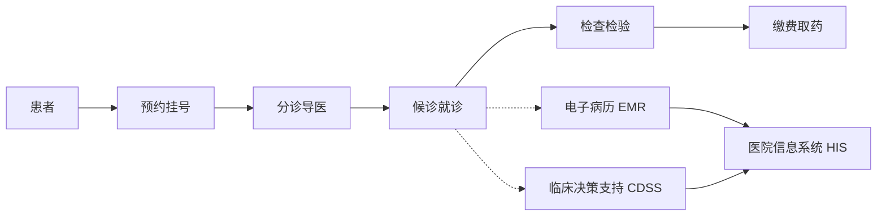

# 门诊就诊系统的设计与实现

## 1. 背景介绍

在现代医疗服务中,门诊就诊系统扮演着至关重要的角色。它是连接患者与医疗机构的桥梁,对于提高医疗服务质量、优化就诊流程、减轻医务人员工作负担等方面都有着重要意义。本文将从技术角度对门诊就诊系统的设计与实现进行深入探讨。

### 1.1 门诊就诊系统的现状与挑战

#### 1.1.1 就诊流程复杂,等待时间长

#### 1.1.2 信息化程度不高,数据孤岛问题突出

#### 1.1.3 系统集成与互联互通面临挑战

### 1.2 门诊就诊系统的意义

#### 1.2.1 提高就诊效率,改善患者就医体验

#### 1.2.2 优化医疗资源配置,提高医院运营效率

#### 1.2.3 促进医疗信息化发展,推动智慧医疗建设

## 2. 核心概念与联系

### 2.1 门诊就诊流程

#### 2.1.1 预约挂号

#### 2.1.2 分诊导医

#### 2.1.3 候诊就诊

#### 2.1.4 检查检验

#### 2.1.5 缴费取药

### 2.2 电子病历(EMR)

#### 2.2.1 结构化电子病历

#### 2.2.2 病历模板与规范

#### 2.2.3 病历质控与审核

### 2.3 临床决策支持系统(CDSS)

#### 2.3.1 医嘱规则引擎

#### 2.3.2 临床路径管理

#### 2.3.3 知识库与规则库

### 2.4 医院信息系统(HIS)集成

#### 2.4.1 挂号收费系统

#### 2.4.2 检验检查系统(LIS/RIS)

#### 2.4.3 药房管理系统



## 3. 核心算法原理与操作步骤

### 3.1 智能分诊算法

#### 3.1.1 基于主诉的分诊建议

#### 3.1.2 基于知识图谱的分诊决策

#### 3.1.3 分诊模型训练与优化

### 3.2 候诊队列调度算法

#### 3.2.1 先来先服务(FCFS)算法

#### 3.2.2 优先级调度算法

#### 3.2.3 分时段动态调度算法

### 3.3 医嘱规则引擎

#### 3.3.1 Rete算法原理

#### 3.3.2 规则冲突与优先级处理

#### 3.3.3 规则引擎性能优化

## 4. 数学模型与公式详解

### 4.1 排队论模型

在门诊候诊环节,可以使用排队论模型对候诊时间进行估计和优化。假设患者到达服从泊松分布,服务时间服从指数分布,则可以建立M/M/c排队模型:

$P_0 = \frac{1}{\sum_{n=0}^{c-1}\frac{1}{n!}(\frac{\lambda}{\mu})^n + \frac{1}{c!}\frac{(\frac{\lambda}{\mu})^c}{1-\rho}}$

$L_q = \frac{P_0(\frac{\lambda}{\mu})^c\rho}{c!(1-\rho)^2}$

$W_q = \frac{L_q}{\lambda}$

其中,$\lambda$为患者到达率,$\mu$为服务率,$c$为服务台数量,$\rho=\frac{\lambda}{c\mu}$为服务强度,$P_0$为系统空闲概率,$L_q$为平均排队长度,$W_q$为平均等待时间。

### 4.2 智能分诊模型

智能分诊可以建模为一个多分类问题。常见的分类模型包括:

(1) 朴素贝叶斯分类器

$$P(c|x) = \frac{P(c)P(x|c)}{P(x)} \propto P(c)\prod_{i=1}^{n}P(x_i|c)$$

(2) 逻辑回归模型

$$P(y=1|x) = \frac{1}{1+e^{-(\beta_0+\beta_1x_1+...+\beta_nx_n)}}$$

(3) 支持向量机(SVM)

$$\min \frac{1}{2}||w||^2 \quad s.t. \quad y_i(w^Tx_i+b) \geq 1, i=1,2,...,m$$

### 4.3 临床路径优化模型

临床路径可以用有向无环图(DAG)来建模,通过最短路径算法如Dijkstra算法来优化诊疗活动的时间与成本。

$$dist[i] = \min_{j \in pre(i)}\{dist[j] + weight(j,i)\}$$

## 5. 项目实践:代码实例与解释

下面以Python为例,给出门诊就诊系统中几个核心功能的代码实现。

### 5.1 预约挂号模块

```python
class Appointment:
    def __init__(self, patient_id, doctor_id, time_slot):
        self.patient_id = patient_id
        self.doctor_id = doctor_id
        self.time_slot = time_slot
        
    def save(self):
        # 保存预约记录到数据库
        pass
        
def make_appointment(patient_id, dept_id, doctor_id, time_slot):
    # 检查号源是否可用
    if not check_availability(doctor_id, time_slot):
        return False
        
    # 创建预约对象并保存
    appt = Appointment(patient_id, doctor_id, time_slot)
    appt.save()
    
    return True
```

### 5.2 候诊队列管理

```python
import queue

class WaitingQueue:
    def __init__(self):
        self.queue = queue.PriorityQueue()
        
    def add_patient(self, patient, priority):
        self.queue.put((priority, patient))
        
    def get_next_patient(self):
        if self.queue.empty():
            return None
        
        _, patient = self.queue.get()
        return patient
        
    def get_waiting_count(self):
        return self.queue.qsize()
        
waiting_queue = WaitingQueue()

# 添加候诊患者
waiting_queue.add_patient(patient1, 1)
waiting_queue.add_patient(patient2, 2)

# 呼叫下一位患者
next_patient = waiting_queue.get_next_patient()
```

### 5.3 电子病历管理

```python
class EMR:
    def __init__(self, patient_id, doctor_id, visit_time):
        self.patient_id = patient_id
        self.doctor_id = doctor_id
        self.visit_time = visit_time
        self.chief_complaint = ""
        self.history = ""
        self.diagnosis = ""
        self.treatment = ""
        
    def save(self):
        # 保存病历到数据库
        pass
        
def create_emr(patient_id, doctor_id):
    emr = EMR(patient_id, doctor_id, datetime.now())
    return emr
    
def update_emr(emr, field, value):
    setattr(emr, field, value)
    emr.save()
    
emr = create_emr(1000, 20)
update_emr(emr, "chief_complaint", "发烧、咳嗽3天")
update_emr(emr, "diagnosis", "上呼吸道感染")
```

## 6. 实际应用场景

### 6.1 大型综合医院门诊管理

### 6.2 互联网医院在线问诊

### 6.3 基层医疗机构分级诊疗

## 7. 工具与资源推荐

### 7.1 开源电子病历系统:OpenEMR、OpenMRS

### 7.2 医疗信息交换标准:HL7、FHIR

### 7.3 临床术语标准:SNOMED CT、LOINC

### 7.4 医疗知识库:UpToDate、Medscape

## 8. 总结:发展趋势与挑战

### 8.1 人工智能赋能,提升诊疗决策水平

### 8.2 移动医疗普及,促进患者自我管理

### 8.3 区块链技术应用,保障医疗数据安全

### 8.4 医疗信息标准化,推进互联互通

### 8.5 个性化精准医疗,提供优质医疗服务

## 9. 附录:常见问题与解答

### Q1:门诊就诊系统与医院其他信息系统是如何集成的?

A1:通过医疗信息交换标准如HL7实现各系统间的数据交互和业务协同。

### Q2:如何保障门诊就诊系统的性能和并发访问能力?

A2:采用高可用架构设计,合理配置服务器集群,并使用缓存、消息队列等手段优化性能。

### Q3:门诊就诊系统如何保障患者隐私和数据安全?

A3:遵循相关法律法规和安全标准,对敏感数据进行脱敏处理,并采用加密、访问控制等安全防护措施。

### Q4:门诊就诊系统如何与移动医疗应用进行集成?

A4:提供开放API接口,支持移动应用以安全可控的方式访问系统数据和功能。

### Q5:如何评估门诊就诊系统的实施成效?

A5:建立完善的绩效考核指标体系,从患者满意度、运营效率、经济效益等多个维度进行评估改进。

作者：禅与计算机程序设计艺术 / Zen and the Art of Computer Programming