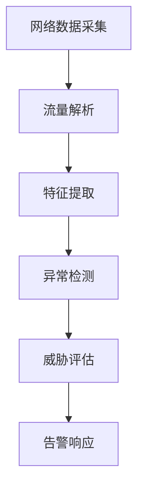
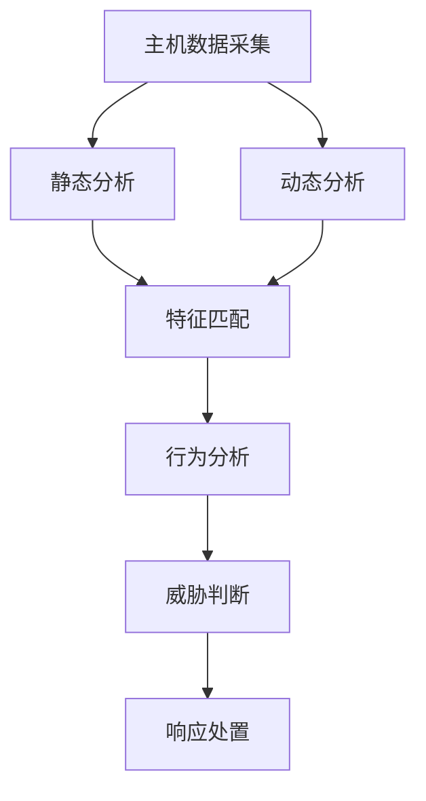

# 防患于未然:检测GhostNet攻击的策略

## 1.背景介绍

### 1.1 网络安全形势严峻

在当今互联网时代,网络安全威胁与日俱增。黑客、网络犯罪分子和一些国家的网络间谍活动使网络空间充满了各种各样的风险和挑战。无论是个人电脑、企业内部网络还是政府机构的关键基础设施,都可能遭受网络攻击的侵害。

### 1.2 GhostNet事件的影响

2009年,加拿大安全研究人员发现了一个名为"GhostNet"的庞大的恶意软件网络,该网络针对包括政府机构、企业、新闻媒体等在内的多个目标进行了长期的网络监视和数据窃取活动。GhostNet事件引发了全球关注,暴露了网络攻击的危害程度,也凸显了及时发现和防御此类攻击的重要性。

## 2.核心概念与联系

### 2.1 GhostNet攻击的特点

GhostNet是一种复杂的网络攻击活动,具有以下主要特点:

1. **大规模控制网络**: 攻击者控制了数以千计的被感染主机,形成了一个庞大的僵尸网络。
2. **针对性强**: 攻击者针对特定目标进行长期渗透和监视,窃取敏感信息。
3. **隐蔽性高**: 采用多种手段躲避检测,如使用加密通信、模糊流量等。
4. **多重攻击途径**: 利用多种漏洞和社会工程学手段进行攻击。

### 2.2 检测GhostNet的关键点

要有效检测GhostNet攻击,需要关注以下几个关键点:

1. **异常网络流量**: 检测与控制服务器的可疑通信和数据传输。
2. **恶意软件行为**: 识别特征码、后门程序、键盘记录等恶意行为。
3. **系统漏洞利用**: 监控常见漏洞的利用情况,如溢出攻击等。
4. **社会工程学攻击**: 防范钓鱼邮件、伪装网站等社会工程学手段。

## 3.核心算法原理具体操作步骤 

### 3.1 网络流量分析

网络流量分析是检测GhostNet攻击的重要手段,主要步骤包括:



1. **网络数据采集**: 部署网络探针或镜像端口,获取网络数据包。
2. **流量解析**: 对捕获的数据包进行解析,识别协议、会话等信息。
3. **特征提取**: 提取与GhostNet相关的流量特征,如特殊端口、加密通信等。
4. **异常检测**: 基于机器学习等技术,检测异常流量模式。
5. **威胁评估**: 评估异常流量的威胁级别和攻击意图。
6. **告警响应**: 对确认的攻击行为发出告警并采取相应的响应措施。

### 3.2 恶意软件检测

恶意软件检测是另一个重要环节,具体步骤如下:



1. **主机数据采集**: 收集主机上的可执行文件、内存数据、日志等信息。
2. **静态分析**: 对可执行文件进行反汇编、字符串扫描等静态分析。
3. **动态分析**: 在隔离环境中执行可疑程序,监控其行为表现。
4. **特征匹配**: 将分析结果与已知恶意软件特征库进行匹配。
5. **行为分析**: 分析程序的行为模式,判断是否存在恶意行为。
6. **威胁判断**: 综合静态和动态分析结果,评估威胁级别。
7. **响应处置**: 对确认的恶意软件实施隔离、清除等响应措施。

## 4.数学模型和公式详细讲解举例说明

### 4.1 异常流量检测模型

异常流量检测可以借助机器学习算法实现,常用的模型包括:

1. **聚类算法**

聚类算法可以发现异常流量与正常流量的差异,如K-Means算法:

$$J = \sum_{i=1}^{k}\sum_{x \in C_i} \left \| x - \mu_i \right \|^2$$

其中$J$为总体误差平方和,$C_i$为第$i$个簇,$\mu_i$为第$i$个簇的质心。

2. **基于密度的异常检测**

基于密度的方法通过估计数据点周围局部密度来识别异常,如局部异常系数(LOF)算法:

$$\text{LOF}_k(p) = \frac{\sum_{q \in N_k(p)}\frac{l_k(q)}{l_k(p)}}{|N_k(p)|}$$

其中$N_k(p)$为$p$的$k$个最近邻,$l_k(p)$为$p$到其$k$个最近邻的平均距离。

3. **深度学习模型**

深度学习模型如自编码器、生成对抗网络等,可以学习正常流量的分布,从而检测异常情况。

### 4.2 恶意软件检测模型

恶意软件检测也可以使用机器学习模型,例如:

1. **特征提取与分类**

从静态和动态分析结果中提取特征向量,然后使用分类算法(如支持向量机、决策树等)进行恶意软件检测:

$$f(x) = w^Tx + b$$

其中$x$为特征向量,$w$为权重向量,$b$为偏置项。

2. **深度神经网络**

利用深度神经网络直接从原始数据(如二进制文件)中自动学习特征,实现端到端的恶意软件检测。

3. **图神经网络**

将可执行文件表示为控制流图或调用图,使用图神经网络模型捕捉程序的结构信息。

通过将传统的特征工程与先进的机器学习模型相结合,可以提高恶意软件检测的准确性和效率。

## 5.项目实践:代码实例和详细解释说明

### 5.1 网络流量分析实例

以下是一个使用Python和Scapy库进行网络流量分析的示例:

```python
from scapy.all import *

# 定义回调函数
def pkt_callback(pkt):
    # 解析数据包
    if pkt.haslayer(IP):
        ip_src = pkt[IP].src
        ip_dst = pkt[IP].dst
        if pkt.haslayer(TCP):
            tcp_sport = pkt[TCP].sport
            tcp_dport = pkt[TCP].dport
            print(f"TCP {ip_src}:{tcp_sport} -> {ip_dst}:{tcp_dport}")
        elif pkt.haslayer(UDP):
            udp_sport = pkt[UDP].sport
            udp_dport = pkt[UDP].dport
            print(f"UDP {ip_src}:{udp_sport} -> {ip_dst}:{udp_dport}")

# 开始嗅探
print("Starting packet capture...")
sniff(prn=pkt_callback, store=0)
```

这段代码使用Scapy库捕获网络数据包,并解析IP、TCP和UDP层的信息。通过定义回调函数`pkt_callback`,可以对每个捕获的数据包执行自定义的处理逻辑,如打印源IP、目的IP、源端口和目的端口等信息。

### 5.2 恶意软件检测实例

以下是一个使用Cuckoo沙箱进行动态恶意软件分析的示例:

```python
import os
import json
from cuckoo.core.database import Database
from cuckoo.core.plugins import RunProcessingTrigger

# 定义插件
class MyPlugin(RunProcessingTrigger):
    def process_results(self, task, results):
        # 获取行为数据
        behavior = results.get("behavior", {})
        processes = behavior.get("processes", [])
        
        # 遍历进程列表
        for process in processes:
            process_name = process.get("process_name", "")
            calls = process.get("calls", [])
            
            # 检测可疑API调用
            for call in calls:
                if call.get("category") == "network":
                    print(f"[!] {process_name} made network API call: {call}")

# 初始化数据库
db = Database()

# 加载任务
tasks = db.list_tasks(status=3)  # 状态3表示已完成的任务

# 遍历任务列表
for task in tasks:
    # 加载任务结果
    results = json.loads(task.target.read())
    
    # 运行插件
    plugin = MyPlugin()
    plugin.process_results(task, results)
```

这段代码定义了一个Cuckoo插件`MyPlugin`,用于分析Cuckoo沙箱生成的行为数据。插件会遍历每个进程的API调用记录,并打印出所有网络相关的API调用,以检测可疑的网络活动。

在主程序中,代码首先初始化Cuckoo数据库,然后加载已完成的任务列表。对于每个任务,程序会加载其结果数据,并运行自定义插件进行分析。

通过编写自定义插件,可以根据具体的需求对Cuckoo沙箱生成的行为数据进行深入分析和处理。

## 6.实际应用场景

### 6.1 企业网络安全防护

企业内部网络面临着各种网络攻击的威胁,如数据窃取、勒索软件等。通过部署GhostNet攻击检测系统,企业可以及时发现异常行为,保护关键数据和系统的安全。

### 6.2 政府机构网络监控

政府机构往往是网络攻击的重点目标,需要对内部网络进行严格的监控和防护。GhostNet攻击检测系统可以帮助政府机构及时发现潜在的网络间谍活动,避免敏感信息泄露。

### 6.3 关键基础设施保护

电力、通信、交通等关键基础设施的安全运行对国家安全和社会稳定至关重要。GhostNet攻击检测技术可以应用于这些领域,提高关键基础设施的网络安全防护能力。

### 6.4 网络安全服务提供商

网络安全服务提供商可以将GhostNet攻击检测技术整合到自身的安全产品和服务中,为客户提供更加全面的网络安全防护解决方案。

## 7.工具和资源推荐

### 7.1 开源工具

- **Snort**: 著名的开源网络入侵检测系统,可用于检测异常网络流量。
- **Cuckoo Sandbox**: 开源的恶意软件分析沙箱,支持静态和动态分析。
- **Yara**: 用于创建恶意软件特征码的工具,可用于恶意软件检测。

### 7.2 商业产品

- **FireEye**: 提供网络安全解决方案,包括高级持续威胁(APT)检测和响应。
- **Symantec**: 知名的网络安全公司,提供多种安全产品和服务。
- **Palo Alto Networks**: 专注于下一代防火墙和网络安全解决方案。

### 7.3 在线资源

- **MITRE ATT&CK框架**: 描述攻击者tactics和techniques的知识库。
- **VirusTotal**: 在线恶意软件分析和扫描平台。
- **网络安全博客和论坛**: 如Krebs on Security、Reddit的NetSec等。

## 8.总结:未来发展趋势与挑战

### 8.1 发展趋势

1. **人工智能与大数据分析**: 利用机器学习和大数据分析技术,提高攻击检测的智能化水平。
2. **云安全**: 随着云计算的普及,云环境的安全防护将成为重点关注领域。
3. **物联网安全**: 物联网设备的安全性亟待加强,需要新的防护措施。
4. **自动化响应**: 实现安全事件的自动化响应和缓解,提高效率。

### 8.2 挑战

1. **新型攻击手段**: 攻击者不断推陈出新,需要持续跟进并更新防御策略。
2. **隐私与合规性**: 在保护隐私和遵守法规的同时实现有效的安全防护。
3. **人才短缺**: 网络安全人才的培养和储备是一大挑战。
4. **成本与投入**: 