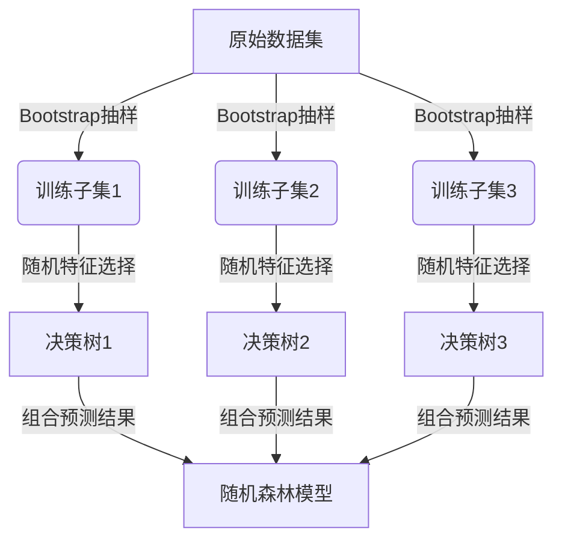

# 随机森林:Bagging的威力

## 1.背景介绍

在机器学习和数据挖掘领域,随机森林(Random Forest)是一种非常流行和有效的监督学习算法。它属于一类被称为"集成学习"(Ensemble Learning)的技术,通过构建多个决策树并将它们的预测结果进行组合,从而获得比单个决策树更准确、更健壮的预测性能。

随机森林的核心思想源自于一种名为"bagging"(Bootstrap Aggregating)的技术。Bagging通过从原始数据集中反复抽取随机子样本并训练多个模型,然后将这些模型的预测结果进行平均,从而减小了过拟合的风险,提高了整体预测的准确性和鲁棒性。

### 1.1 集成学习的优势

集成学习的关键在于将多个"弱学习器"(weak learners)组合成一个强大的"强学习器"(strong learner)。每个弱学习器都能对部分数据进行较好的拟合,但通过组合多个弱学习器的预测结果,可以克服单个模型的局限性,提高整体性能。

集成学习技术的优势主要体现在以下几个方面:

- **降低方差(Variance)**: 通过平均多个模型的预测结果,可以减小单个模型的高方差问题,从而提高整体预测的稳定性。
- **提高准确性**: 组合多个模型的预测结果往往比单个模型更加准确,尤其是在处理复杂数据时。
- **增强泛化能力**: 集成学习可以有效避免单个模型过度拟合训练数据,从而提高模型在新数据上的泛化能力。
- **处理缺失值和异常值**: 集成学习能够更好地处理数据中的缺失值和异常值,提高模型的鲁棒性。

### 1.2 Bagging与Boosting

Bagging和Boosting都是常用的集成学习技术,但它们在构建集成模型的方式上有所不同。

- **Bagging**: 通过从原始数据集中反复抽取随机子样本(有放回抽样),并使用这些子样本训练多个独立的模型,最后将这些模型的预测结果进行平均或投票,从而获得最终的预测结果。随机森林就是基于Bagging思想构建的。

- **Boosting**: 则是通过序列化的方式训练多个模型,每一轮训练时都会根据上一轮模型的预测结果调整训练样本的权重,使得后续的模型更关注那些之前被错误分类的样本。最终将所有模型的预测结果加权组合,得到最终的预测结果。代表性算法有AdaBoost、Gradient Boosting等。

两者的区别在于:Bagging是并行训练多个独立模型,而Boosting则是串行训练多个模型,并且后续模型会根据前面模型的表现进行调整。一般来说,Bagging简单且易于并行计算,而Boosting则更加复杂,但通常能获得更高的预测性能。

## 2.核心概念与联系

### 2.1 决策树

决策树(Decision Tree)是构建随机森林的基础模型。它是一种树形结构的监督学习算法,通过对特征进行递归分割,将数据空间划分为多个区域,每个区域对应一个预测值或类别。

决策树的优点包括:

- 可解释性强: 决策树的树形结构易于理解和解释。
- 无需特征缩放: 不需要对特征进行归一化处理。
- 能够处理数值型和类别型特征。

但决策树也存在一些缺陷,如容易过拟合、对数据的微小变化敏感等。这就是引入随机森林的主要动机之一。

### 2.2 Bootstrap抽样

Bootstrap抽样(有放回抽样)是Bagging技术的核心操作。它通过从原始数据集中随机抽取N个样本(N为数据集大小),并允许重复抽取,从而构建一个新的训练子集。对于每棵决策树,我们都会从原始数据集中独立地执行一次Bootstrap抽样,得到一个新的训练子集。

通过Bootstrap抽样,每棵决策树都会在不同的训练子集上进行训练,这样可以增加模型之间的差异性,从而提高整体预测的准确性和泛化能力。

### 2.3 随机特征选择

除了Bootstrap抽样外,随机森林还引入了"随机特征选择"(Random Subspace)的策略。在构建每个决策树节点时,不是从所有特征中选择最优分割特征,而是从随机选择的部分特征子集中选择最优分割特征。

这种随机特征选择的做法,进一步增加了每棵决策树之间的差异性,从而降低了单个决策树的过拟合风险,提高了整体模型的泛化能力。

### 2.4 Mermaid流程图

下面是随机森林算法的核心流程图:



该流程图清晰地展示了随机森林算法的核心步骤:

1. 从原始数据集中通过Bootstrap抽样获得多个训练子集。
2. 对于每个训练子集,使用随机特征选择策略构建一棵决策树。
3. 将多棵决策树的预测结果组合(平均或投票),得到随机森林模型的最终预测结果。

## 3.核心算法原理具体操作步骤

随机森林算法的核心步骤如下:

1. **收集数据集**: 获取足够的训练数据集,包括特征向量和目标值。

2. **准备数据集**: 对数据进行必要的预处理,如处理缺失值、特征缩放等。

3. **构建决策树集合**:
   a. 通过Bootstrap抽样从原始数据集中随机抽取N个训练样本(有放回抽样),构建一个训练子集。
   b. 对于每个训练子集,使用随机特征选择策略构建一棵决策树:
      - 在节点分割时,从所有特征中随机选择一个包含m个特征(m << 总特征数)的特征子集。
      - 从这个特征子集中选择最优分割特征,用于分割当前节点。
      - 对于每个分割后的子节点,重复上述步骤,直到满足停止条件(如最大深度、最小样本数等)。
   c. 重复执行步骤a和b,构建k棵决策树。

4. **预测**:
   - 对于新的测试样本,让构建好的k棵决策树分别进行预测。
   - 对于分类问题,采用投票的方式确定最终类别(选择票数最多的类别)。
   - 对于回归问题,计算所有决策树预测值的平均值作为最终预测结果。

5. **模型评估**: 使用测试数据集评估随机森林模型的性能,如准确率、均方误差等指标。

需要注意的是,在构建随机森林时,通常需要调整以下几个关键参数:

- 决策树数量k: 通常数量越多,模型性能越好,但计算代价也越高。
- 每棵树的最大深度: 控制单棵树的复杂度,防止过拟合。
- 特征子集大小m: 控制随机选择特征的数量,影响模型的差异性。
- 最小叶节点样本数: 控制决策树的生长,防止过拟合。

通过合理调整这些参数,可以获得性能良好且计算效率较高的随机森林模型。

## 4.数学模型和公式详细讲解举例说明

### 4.1 Bagging的数学模型

设有N个训练样本 $\{(x_1, y_1), (x_2, y_2), ..., (x_N, y_N)\}$,其中 $x_i$ 表示第i个样本的特征向量, $y_i$ 表示对应的目标值(分类或回归)。

Bagging的核心思想是通过Bootstrap抽样构建K个不同的训练子集,每个子集用于训练一个基学习器(如决策树),然后将这些基学习器的预测结果进行组合,得到最终的预测结果。

对于第k个训练子集,我们从原始数据集中有放回地抽取N个样本,记为 $\mathcal{D}_k = \{(x_1^k, y_1^k), (x_2^k, y_2^k), ..., (x_N^k, y_N^k)\}$。然后使用这个训练子集训练一个基学习器 $h_k(x)$。

最终,Bagging的预测函数为:

对于分类问题:
$$
H(x) = \mathrm{majority\ vote} \{ h_1(x), h_2(x), ..., h_K(x) \}
$$

对于回归问题:
$$
H(x) = \frac{1}{K} \sum_{k=1}^K h_k(x)
$$

其中, $H(x)$ 表示Bagging的最终预测结果, $h_k(x)$ 表示第k个基学习器对样本x的预测结果。

可以证明,Bagging能够有效降低基学习器的方差(Variance),从而提高整体预测的稳定性和准确性。

### 4.2 随机森林的数学模型

随机森林在Bagging的基础上,引入了"随机特征选择"的策略,进一步增加了基学习器之间的差异性。

设特征向量 $x = (x_1, x_2, ..., x_M)$ 包含M个特征,在构建每个决策树节点时,我们从M个特征中随机选择一个包含m个特征(m << M)的特征子集,记为 $\mathcal{F}_m$。然后从这个特征子集中选择最优分割特征,用于分割当前节点。

随机森林的预测函数与Bagging类似,只是基学习器 $h_k(x)$ 是在随机选择的特征子集 $\mathcal{F}_m$ 上训练得到的决策树。

对于分类问题:
$$
H(x) = \mathrm{majority\ vote} \{ h_1(x; \mathcal{F}_m), h_2(x; \mathcal{F}_m), ..., h_K(x; \mathcal{F}_m) \}
$$

对于回归问题:
$$
H(x) = \frac{1}{K} \sum_{k=1}^K h_k(x; \mathcal{F}_m)
$$

其中, $h_k(x; \mathcal{F}_m)$ 表示第k个决策树在特征子集 $\mathcal{F}_m$ 上对样本x的预测结果。

通过引入随机特征选择,随机森林进一步降低了基学习器之间的相关性,从而提高了整体模型的泛化能力,降低了过拟合的风险。

### 4.3 决策树的GINI指数

在构建决策树时,我们需要选择最优的特征和分割点,以最大程度地减小节点的不纯度。常用的不纯度度量指标之一是GINI指数。

对于二分类问题,设某个节点包含样本集合D,其中正例的比例为p,负例的比例为1-p,则该节点的GINI指数定义为:

$$
\mathrm{Gini}(D) = 2p(1-p)
$$

GINI指数的取值范围为[0, 0.5],值越小,说明该节点的不纯度越低,即样本越趋于属于同一类别。

对于多分类问题,GINI指数的计算公式为:

$$
\mathrm{Gini}(D) = 1 - \sum_{i=1}^C p_i^2
$$

其中,C是类别的总数,$ p_i $ 是第i类样本在节点D中的比例。

在选择最优分割特征和分割点时,我们需要计算分割后各子节点的加权GINI指数之和,选择能使该值最小的特征和分割点,从而最大程度地减小不纯度。

## 5.项目实践:代码实例和详细解释说明

下面是使用Python中的scikit-learn库实现随机森林算法的示例代码:

```python
from sklearn.ensemble import RandomForestClassifier
from sklearn.datasets import make_classification
from sklearn.model_selection import train_test_split
from sklearn.metrics import accuracy_score

# 生成模拟二分类数据集
X, y = make_classification(n_samples=1000, n