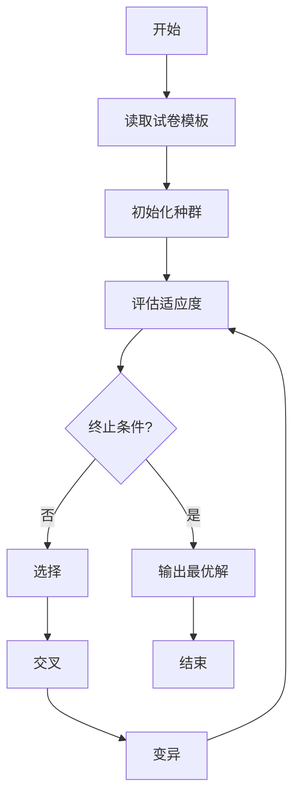

# 题库与自动制卷系统详细设计与具体代码实现

## 1.背景介绍

### 1.1 教育评估的重要性

教育评估是教学过程中不可或缺的重要环节,它不仅能够检测学生的学习情况,还能为教师提供宝贵的教学反馈,从而优化教学策略。传统的人工命题和阅卷方式存在诸多弊端,例如工作量大、效率低下、缺乏客观性等,因此自动化的题库管理和试卷组卷系统应运而生。

### 1.2 自动化系统的优势

自动化题库与制卷系统能够极大地提高工作效率,降低人力成本。同时,它确保了试题的随机性和多样性,避免了人工操作中可能存在的主观偏差。此外,该系统还能根据教学大纲和知识点要求自动生成符合要求的试卷,为教师节省了大量的时间和精力。

## 2.核心概念与联系

### 2.1 题库

题库是整个系统的核心,它是存储所有试题信息的数据库。每个试题都包含了题干、选项、知识点、难度系数等元数据,这些信息对于合理生成试卷至关重要。

### 2.2 知识点

知识点是组织和管理试题的基本单位。通过将试题与相应的知识点关联,系统能够根据教学大纲的要求,自动选取相关知识点的试题组成试卷。

### 2.3 试卷模板

试卷模板定义了试卷的整体结构,包括试卷的总分值、题型比例、知识点分布等。系统根据预设的模板要求,从题库中自动选取符合条件的试题生成试卷。

### 2.4 自动组卷算法

自动组卷算法是系统的核心算法,它负责从题库中选取合适的试题,并按照试卷模板的要求进行排列组合,最终生成满足要求的试卷。

## 3.核心算法原理具体操作步骤

自动组卷算法的核心思想是将试卷生成问题转化为一个约束优化问题。我们需要在满足试卷模板约束的前提下,从题库中选取最优的试题组合。

### 3.1 算法流程

自动组卷算法的基本流程如下:



1. 读取试卷模板,获取试卷的约束条件。
2. 初始化种群,随机从题库中选取一定数量的试题作为初始解。
3. 评估每个个体(试卷)的适应度,即它满足约束条件的程度。
4. 判断是否达到终止条件,如最大迭代次数或满足要求的最优解。
5. 选择适应度较高的个体,作为下一代种群的父代。
6. 对父代个体进行交叉操作,产生新的子代个体。
7. 对子代个体进行变异操作,增加种群的多样性。
8. 重复步骤3-7,直到达到终止条件。
9. 输出最优解,即生成的试卷。

### 3.2 适应度函数

适应度函数用于评估每个个体(试卷)满足约束条件的程度。通常,我们会将约束条件转化为一个目标函数,个体越符合约束条件,其目标函数值就越小。

$$
\begin{aligned}
\text{fitness}(x) = & \omega_1 \cdot f_1(x) + \omega_2 \cdot f_2(x) + \cdots + \omega_n \cdot f_n(x) \\
& \text{s.t.} \quad \sum_{i=1}^n \omega_i = 1
\end{aligned}
$$

其中,$f_i(x)$表示第$i$个约束条件,如总分值、题型比例等,$\omega_i$是对应的权重系数。我们的目标是最小化适应度函数的值,从而获得最优的试卷组合。

### 3.3 选择、交叉和变异

在每一代迭代中,我们需要从当前种群中选择适应度较高的个体作为父代,进行交叉和变异操作产生新的子代个体。

**选择算子**通常采用轮盘赌选择、锦标赛选择等方法,概率上优先选择适应度高的个体。

**交叉算子**则是模拟生物进化中的基因重组过程,通过在父代个体之间交换部分试题,产生新的子代个体。

**变异算子**是在个体中随机改变部分试题,以增加种群的多样性,避免陷入局部最优解。

通过不断进行选择、交叉和变异操作,算法逐渐向最优解收敛。

## 4.数学模型和公式详细讲解举例说明

在自动组卷算法中,我们需要构建数学模型来描述试卷的约束条件,并将其转化为目标函数进行优化求解。以下是一些常见的约束条件及其数学表达式:

### 4.1 总分值约束

试卷的总分值应该在一定范围内,可以表示为:

$$
L \leq \sum_{i=1}^{n}x_i \cdot s_i \leq U
$$

其中,$n$是试题总数,$x_i$是第$i$个试题是否被选中的指示变量(0或1),$s_i$是第$i$个试题的分值,而$L$和$U$分别是总分值的下限和上限。

### 4.2 题型比例约束

为了保证试卷的题型结构合理,我们需要控制不同题型的比例,如选择题、填空题等。对于第$j$种题型,其约束可表示为:

$$
L_j \leq \frac{\sum_{i=1}^{n}x_i \cdot \mathbb{1}(t_i=j)}{n} \leq U_j
$$

这里,$t_i$表示第$i$个试题的题型,$\mathbb{1}(\cdot)$是示性函数,而$L_j$和$U_j$分别是第$j$种题型的比例下限和上限。

### 4.3 知识点分布约束

为了全面考查学生的知识掌握情况,我们需要保证试卷中知识点的分布均衡。对于第$k$个知识点,其约束可表示为:

$$
L_k \leq \frac{\sum_{i=1}^{n}x_i \cdot \mathbb{1}(p_i=k)}{n} \leq U_k
$$

这里,$p_i$表示第$i$个试题所属的知识点,$L_k$和$U_k$分别是第$k$个知识点的比例下限和上限。

### 4.4 难度系数约束

为了控制试卷的难度,我们可以约束试题的平均难度系数在一定范围内:

$$
L_d \leq \frac{\sum_{i=1}^{n}x_i \cdot d_i}{\sum_{i=1}^{n}x_i} \leq U_d
$$

其中,$d_i$是第$i$个试题的难度系数,$L_d$和$U_d$分别是平均难度系数的下限和上限。

通过将上述约束条件线性组合,我们可以构建出适应度函数,并将自动组卷问题转化为一个约束优化问题。在实际应用中,我们还可以根据具体需求添加其他约束条件,以满足不同的要求。

## 5.项目实践:代码实例和详细解释说明

为了更好地理解自动组卷系统的实现,我们提供了一个基于Python的简单示例代码。该示例包括题库管理、试卷模板定义和自动组卷算法三个主要模块。

### 5.1 题库管理模块

题库管理模块负责存储和管理试题信息,包括题干、选项、知识点、难度系数等元数据。我们使用Python的数据结构(如列表和字典)来表示题库中的试题。

```python
# 题库示例数据
question_bank = [
    {
        "id": 1,
        "question": "1 + 1 = ?",
        "options": ["1", "2", "3", "4"],
        "answer": "B",
        "knowledge_point": "加法",
        "difficulty": 1
    },
    {
        "id": 2,
        "question": "5 x 6 = ?",
        "options": ["25", "30", "35", "40"],
        "answer": "B",
        "knowledge_point": "乘法",
        "difficulty": 2
    },
    # 更多试题...
]
```

### 5.2 试卷模板模块

试卷模板模块定义了试卷的整体结构,包括总分值、题型比例、知识点分布等约束条件。我们使用Python的字典来表示试卷模板。

```python
# 试卷模板示例
exam_template = {
    "total_score": 100,
    "question_type_ratio": {
        "选择题": 0.6,
        "填空题": 0.2,
        "简答题": 0.2
    },
    "knowledge_point_ratio": {
        "加法": 0.3,
        "减法": 0.3,
        "乘法": 0.2,
        "除法": 0.2
    },
    "difficulty_range": (1.5, 3.5)
}
```

### 5.3 自动组卷算法模块

自动组卷算法模块实现了基于遗传算法的组卷逻辑,包括种群初始化、适应度评估、选择、交叉和变异等操作。

```python
import random

# 初始化种群
def init_population(population_size, question_bank, exam_template):
    population = []
    for _ in range(population_size):
        exam = random.sample(question_bank, len(question_bank))
        population.append(exam)
    return population

# 评估适应度
def evaluate_fitness(exam, exam_template):
    # 计算总分值约束违反程度
    total_score = sum(q["score"] for q in exam)
    score_violation = max(0, abs(total_score - exam_template["total_score"]) - 5)

    # 计算题型比例约束违反程度
    type_violation = 0
    for question_type, ratio in exam_template["question_type_ratio"].items():
        type_count = sum(1 for q in exam if q["type"] == question_type)
        type_violation += max(0, abs(type_count / len(exam) - ratio) - 0.05)

    # 计算知识点分布约束违反程度
    knowledge_violation = 0
    for knowledge_point, ratio in exam_template["knowledge_point_ratio"].items():
        knowledge_count = sum(1 for q in exam if q["knowledge_point"] == knowledge_point)
        knowledge_violation += max(0, abs(knowledge_count / len(exam) - ratio) - 0.05)

    # 计算难度系数约束违反程度
    difficulty_sum = sum(q["difficulty"] for q in exam)
    difficulty_avg = difficulty_sum / len(exam)
    difficulty_violation = max(0, difficulty_avg - exam_template["difficulty_range"][1],
                               exam_template["difficulty_range"][0] - difficulty_avg, 0)

    # 计算总体适应度
    fitness = score_violation + type_violation + knowledge_violation + difficulty_violation
    return 1 / (1 + fitness)

# 选择操作
def selection(population, fitness_values):
    # 使用锦标赛选择算法
    new_population = []
    for _ in range(len(population)):
        candidates = random.sample(population, k=5)
        candidate_fitness = [fitness_values[population.index(c)] for c in candidates]
        best_candidate = candidates[candidate_fitness.index(max(candidate_fitness))]
        new_population.append(best_candidate)
    return new_population

# 交叉操作
def crossover(parent1, parent2):
    # 使用部分映射交叉算子
    child1 = parent1[:]
    child2 = parent2[:]
    start, end = sorted(random.sample(range(len(parent1)), 2))
    child1[start:end] = parent2[start:end]
    child2[start:end] = parent1[start:end]
    return child1, child2

# 变异操作
def mutation(individual, question_bank):
    # 随机交换两个试题的位置
    idx1, idx2 = random.sample(range(len(individual)), 2)
    individual[idx1], individual[idx2] = individual[idx2], individual[idx1]
    return individual

# 主函数
def genetic_algorithm(question_bank, exam_template, population_size, max_generations):
    population = init_population(population_size, question_bank, exam_template)
    fitness_values = [evaluate_fitness(exam, exam_template) for exam in population]

    for generation in range(max_generations):
        new_population = selection(population, fitness_values)
        offspring = []
        for i in range(0, len(new_population), 2):
            parent1 = new_population[i]
            parent2 = new_population[i+1]
            child1, child2 = crossover(parent1, parent2)
            child1 