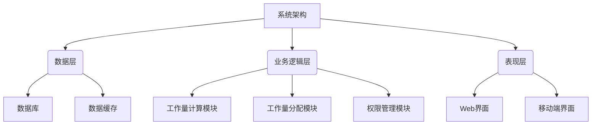
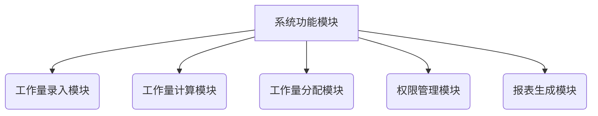

# 高校评教教师工作量管理系统设计与实现

## 1.背景介绍

### 1.1 教师工作量管理的重要性

高校教师承担着教学、科研和社会服务等多方面的工作任务,合理分配和管理教师的工作量对于提高教学质量、促进教师职业发展以及维护学校正常运转至关重要。然而,传统的手工记录和管理方式存在诸多弊端,如工作量统计不准确、工作量分配不合理、工作量反馈延迟等,给高校的教学管理工作带来了巨大挑战。

### 1.2 现有系统存在的问题

目前,虽然一些高校已经采用了教师工作量管理系统,但这些系统往往存在以下问题:

- 功能单一,只能记录教师的基本工作量,无法全面反映教师的实际工作情况。
- 界面设计陈旧,操作体验差,给教师带来额外的工作负担。
- 数据存储和计算方式落后,无法满足大规模数据处理的需求。
- 缺乏智能化功能,如工作量预测、自动分配等,导致管理效率低下。

### 1.3 新系统的必要性

为了解决现有系统的不足,迫切需要设计和开发一种新型的高校评教教师工作量管理系统。该系统应当具备以下特点:

- 功能全面,能够覆盖教师工作的各个方面,包括教学、科研、社会服务等。
- 界面友好,操作便捷,提高教师的使用体验。
- 采用先进的数据存储和计算技术,支持大规模数据处理。
- 引入智能化功能,如工作量预测、自动分配等,提高管理效率。

## 2.核心概念与联系

### 2.1 教师工作量

教师工作量是指教师在一定时间内所从事的各项工作的总和,包括教学工作量、科研工作量、社会服务工作量等。合理评估和管理教师工作量,对于保证教学质量、促进教师职业发展、维护学校正常运转具有重要意义。

### 2.2 工作量计算模型

工作量计算模型是指将教师的各项工作按照一定的标准和权重进行量化计算的模型。常见的工作量计算模型包括加权平均模型、层次分析模型等。合理的工作量计算模型是实现精确评估教师工作量的前提。

### 2.3 工作量分配策略

工作量分配策略是指根据教师的工作能力、工作偏好等因素,合理分配工作任务的策略。常见的工作量分配策略包括均衡分配策略、优先级分配策略等。合理的工作量分配策略可以提高工作效率,避免工作量过度集中或分散。

### 2.4 系统架构

系统架构是指系统的整体框架和组成部分,包括数据层、业务逻辑层、表现层等。合理的系统架构设计是保证系统高效、稳定运行的关键。

### 2.5 系统功能模块

系统功能模块是指系统提供的各项功能,包括工作量录入、工作量计算、工作量分配、权限管理等。合理划分和设计系统功能模块是实现系统功能完备的前提。

## 3.核心算法原理具体操作步骤

### 3.1 工作量计算算法

工作量计算算法是系统的核心算法之一,它将教师的各项工作按照一定的标准和权重进行量化计算,从而得出教师的总工作量。常见的工作量计算算法包括加权平均算法和层次分析算法。

#### 3.1.1 加权平均算法

加权平均算法是一种简单但实用的工作量计算算法。它将教师的各项工作按照预设的权重进行加权求和,得出总工作量。算法步骤如下:

1. 确定需要计算的工作项,如教学工作量、科研工作量、社会服务工作量等。
2. 为每个工作项分配权重,权重之和为1。
3. 计算每个工作项的工作量值。
4. 将每个工作项的工作量值乘以对应的权重,求和得到总工作量。

加权平均算法的数学表达式如下:

$$
\text{总工作量} = \sum_{i=1}^{n}w_i \times x_i
$$

其中,n为工作项的个数,$w_i$为第i个工作项的权重,$x_i$为第i个工作项的工作量值。

#### 3.1.2 层次分析算法

层次分析算法是一种更加复杂但也更加精确的工作量计算算法。它将工作量计算问题分解为多个层次,每个层次包含多个评估指标,通过计算每个指标的权重和评分,最终得出总工作量。算法步骤如下:

1. 确定工作量计算的目标层次结构,包括目标层、准则层和方案层。
2. 构建各层次之间的判断矩阵,通过专家评判得出各指标的相对重要性。
3. 计算各层次指标的权重向量。
4. 层层递阶,计算各方案在目标层的综合权重,即工作量值。
5. 对工作量值进行归一化处理,得到最终工作量。

层次分析算法的数学表达式较为复杂,具体可参考相关文献。

### 3.2 工作量分配算法

工作量分配算法是系统的另一个核心算法,它根据教师的工作能力、工作偏好等因素,合理分配工作任务。常见的工作量分配算法包括均衡分配算法和优先级分配算法。

#### 3.2.1 均衡分配算法

均衡分配算法旨在将工作任务尽可能均衡地分配给各位教师,避免工作量过度集中或分散。算法步骤如下:

1. 获取所有待分配的工作任务及其工作量。
2. 获取所有教师的工作能力信息。
3. 根据教师的工作能力,计算每位教师的工作量上限。
4. 按照工作量从大到小的顺序,依次将工作任务分配给工作量最小的教师,直至所有任务分配完毕。

均衡分配算法的优点是可以最大限度地平衡教师的工作量,但缺点是没有考虑教师的工作偏好,可能会导致部分教师被分配到不擅长的工作任务。

#### 3.2.2 优先级分配算法

优先级分配算法在均衡分配的基础上,还考虑了教师的工作偏好。它首先将工作任务按照优先级进行排序,然后依次将高优先级的任务分配给擅长该类型工作的教师。算法步骤如下:

1. 获取所有待分配的工作任务及其工作量和优先级。
2. 获取所有教师的工作能力信息和工作偏好信息。
3. 根据教师的工作能力,计算每位教师的工作量上限。
4. 按照工作任务的优先级从高到低进行排序。
5. 依次将高优先级的工作任务分配给擅长该类型工作且工作量最小的教师,直至所有任务分配完毕。

优先级分配算法的优点是可以充分考虑教师的工作偏好,提高工作效率,但缺点是可能会导致部分教师的工作量过度集中。

## 4.数学模型和公式详细讲解举例说明

在教师工作量管理系统中,数学模型和公式扮演着重要的角色,用于量化计算教师的工作量、优化工作量分配等。下面将详细讲解两个常见的数学模型及其公式。

### 4.1 加权平均模型

加权平均模型是一种简单但实用的工作量计算模型。它将教师的各项工作按照预设的权重进行加权求和,得出总工作量。

加权平均模型的数学表达式如下:

$$
\text{总工作量} = \sum_{i=1}^{n}w_i \times x_i
$$

其中,n为工作项的个数,$w_i$为第i个工作项的权重,$x_i$为第i个工作项的工作量值。

例如,假设一位教师的工作包括三个部分:教学工作量、科研工作量和社会服务工作量,权重分别为0.6、0.3和0.1。如果该教师的教学工作量为200小时,科研工作量为100小时,社会服务工作量为50小时,那么根据加权平均模型,该教师的总工作量为:

$$
\begin{aligned}
\text{总工作量} &= 0.6 \times 200 + 0.3 \times 100 + 0.1 \times 50 \\
              &= 120 + 30 + 5 \\
              &= 155 \text{小时}
\end{aligned}
$$

加权平均模型的优点是计算简单,易于理解和实现。但它也存在一些缺陷,如权重设置的主观性、无法体现工作项之间的相关性等。

### 4.2 层次分析模型

层次分析模型是一种更加复杂但也更加精确的工作量计算模型。它将工作量计算问题分解为多个层次,每个层次包含多个评估指标,通过计算每个指标的权重和评分,最终得出总工作量。

层次分析模型的核心是计算各层次指标的权重向量。常用的计算方法是构造判断矩阵,然后计算矩阵的最大特征值及对应的特征向量作为权重向量。

假设有n个指标,构造n阶判断矩阵A:

$$
A = \begin{pmatrix}
1 & a_{12} & \cdots & a_{1n} \\
a_{21} & 1 & \cdots & a_{2n} \\
\vdots & \vdots & \ddots & \vdots \\
a_{n1} & a_{n2} & \cdots & 1
\end{pmatrix}
$$

其中,$a_{ij}$表示指标i相对于指标j的重要程度。通过计算矩阵A的最大特征值$\lambda_{max}$及对应的特征向量W,可以得到各指标的权重向量:

$$
W = \begin{pmatrix}
w_1 \\
w_2 \\
\vdots \\
w_n
\end{pmatrix}
$$

然后,根据各指标的评分,可以计算出总工作量的加权和。

例如,假设某教师的工作量包括三个指标:教学工作量、科研工作量和社会服务工作量。通过专家评判构造判断矩阵:

$$
A = \begin{pmatrix}
1 & 3 & 5 \\
1/3 & 1 & 3 \\
1/5 & 1/3 & 1
\end{pmatrix}
$$

计算得到最大特征值$\lambda_{max} = 3.0825$,对应的特征向量(权重向量)为:

$$
W = \begin{pmatrix}
0.6324 \\
0.2676 \\
0.1000
\end{pmatrix}
$$

假设该教师的教学工作量评分为90分,科研工作量评分为80分,社会服务工作量评分为70分,那么根据层次分析模型,该教师的总工作量为:

$$
\begin{aligned}
\text{总工作量} &= 0.6324 \times 90 + 0.2676 \times 80 + 0.1000 \times 70 \\
              &= 56.916 + 21.408 + 7.000 \\
              &= 85.324 \text{分}
\end{aligned}
$$

层次分析模型的优点是能够体现指标之间的相关性,计算结果更加精确。但它也存在一些缺陷,如计算过程较为复杂、判断矩阵构造的主观性等。

## 5.项目实践:代码实例和详细解释说明

为了更好地理解和实现教师工作量管理系统,下面将提供一些核心模块的代码实例及详细解释说明。

### 5.1 工作量计算模块

工作量计算