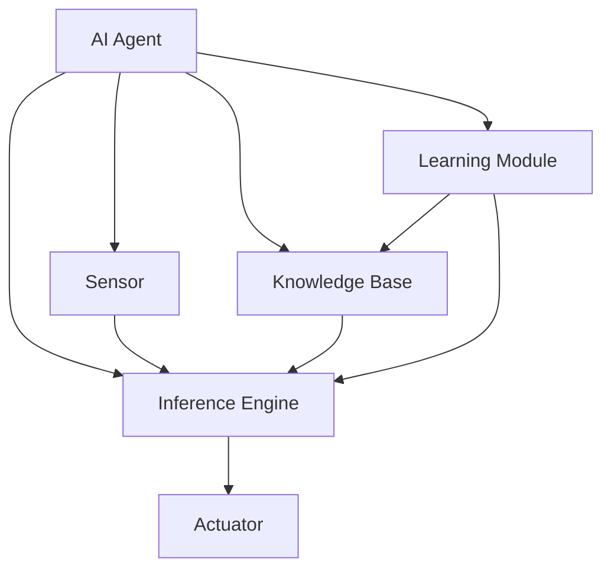
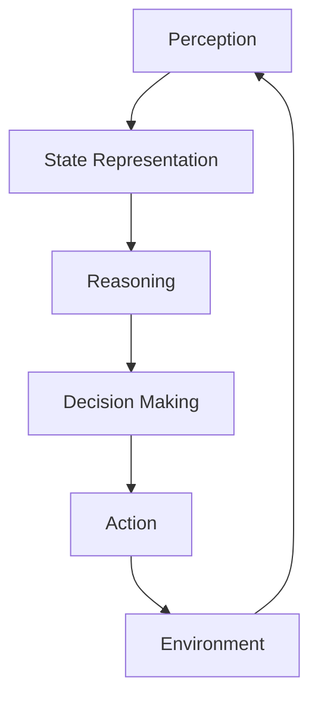

# AI Agent 智能体

## 1.背景介绍

### 1.1 人工智能的兴起

人工智能(Artificial Intelligence, AI)是当代科技领域最具革命性和影响力的技术之一。自20世纪中叶诞生以来,AI技术得到了飞速发展,并逐渐渗透到我们生活和工作的方方面面。随着计算能力的不断提升、算法的不断优化以及海量数据的积累,AI系统的性能不断提高,应用领域也在不断扩大。

### 1.2 智能体(Agent)的概念

在人工智能领域,智能体(Agent)是一个核心概念。智能体是指能够感知环境、处理信息、做出决策并采取行动的自主系统。智能体可以是物理实体(如机器人)或软件实体(如虚拟助手)。它们通过与环境交互来实现特定的目标或任务。

### 1.3 AI Agent的重要性

AI Agent作为人工智能系统的核心组成部分,在各个领域发挥着关键作用。它们可以应用于各种场景,如游戏AI、机器人控制、决策支持系统、自动驾驶汽车等。随着AI技术的不断发展,AI Agent的能力也在不断提高,可以处理越来越复杂的任务。

## 2.核心概念与联系

### 2.1 智能体的构成

一个典型的AI Agent通常由以下几个核心组件构成:

1. **感知器(Sensor)**: 用于从环境中获取信息和数据。
2. **执行器(Actuator)**: 用于在环境中执行操作和行为。
3. **知识库(Knowledge Base)**: 存储智能体所拥有的知识和规则。
4. **推理引擎(Inference Engine)**: 根据知识库和感知数据进行推理和决策。
5. **学习模块(Learning Module)**: 用于从经验中学习和优化智能体的行为。



### 2.2 智能体的类型

根据智能体与环境的交互方式和目标任务,可以将智能体分为以下几种类型:

1. **反应型智能体(Reactive Agent)**: 根据当前的感知数据做出直接反应,没有内部状态。
2. **基于模型的智能体(Model-based Agent)**: 构建环境模型,根据模型预测未来状态并做出决策。
3. **基于目标的智能体(Goal-based Agent)**: 具有明确的目标,决策旨在实现该目标。
4. **基于效用的智能体(Utility-based Agent)**: 根据效用函数评估不同行为的收益,选择效用最大的行为。
5. **学习型智能体(Learning Agent)**: 通过与环境交互积累经验,不断优化自身的行为策略。

### 2.3 智能体与环境的交互

智能体与环境之间存在着复杂的交互关系。智能体通过感知器获取环境状态,并根据推理引擎做出决策,通过执行器对环境进行操作。同时,环境的变化也会反过来影响智能体的决策和行为。这种持续的感知-决策-行动循环构成了智能体与环境之间的交互过程。

## 3.核心算法原理具体操作步骤

### 3.1 智能体决策过程

智能体的核心任务是根据当前状态做出合理的决策和行为。这个过程通常包括以下几个步骤:

1. **感知(Perception)**: 从环境中获取当前状态信息。
2. **状态表示(State Representation)**: 将感知数据转换为内部状态表示。
3. **推理(Reasoning)**: 根据知识库和推理规则对当前状态进行推理。
4. **决策(Decision Making)**: 根据推理结果选择最优行为。
5. **执行(Action)**: 通过执行器实施所选行为,影响环境状态。



### 3.2 搜索算法

搜索算法是智能体决策过程中常用的一种方法。它通过构建搜索树,系统地探索可能的状态序列,寻找到达目标状态的最优路径。常见的搜索算法包括:

1. **广度优先搜索(Breadth-First Search, BFS)**
2. **深度优先搜索(Depth-First Search, DFS)**
3. **A*搜索算法(A* Search)**
4. **启发式搜索(Heuristic Search)**

### 3.3 机器学习算法

机器学习算法允许智能体从经验数据中自动学习和优化其行为策略。常见的机器学习算法包括:

1. **监督学习(Supervised Learning)**: 基于带标签的训练数据进行学习,如分类和回归。
2. **无监督学习(Unsupervised Learning)**: 从无标签数据中发现潜在模式和结构,如聚类和降维。
3. **强化学习(Reinforcement Learning)**: 通过与环境交互获得奖励信号,不断优化行为策略。
4. **深度学习(Deep Learning)**: 基于神经网络的机器学习算法,在计算机视觉、自然语言处理等领域表现出色。

### 3.4 规划算法

规划算法旨在为智能体生成一系列行动,以实现特定目标。常见的规划算法包括:

1. **情景规划(Situation Planning)**
2. **层次任务网络规划(Hierarchical Task Network Planning)**
3. **时序规划(Temporal Planning)**
4. **概率规划(Probabilistic Planning)**

## 4.数学模型和公式详细讲解举例说明

### 4.1 马尔可夫决策过程(Markov Decision Process, MDP)

马尔可夫决策过程是描述智能体与环境交互的数学框架。它由以下要素组成:

- $\mathcal{S}$: 状态集合
- $\mathcal{A}$: 行为集合
- $\mathcal{P}$: 转移概率函数 $\mathcal{P}(s'|s,a)$,表示在状态 $s$ 执行行为 $a$ 后转移到状态 $s'$ 的概率
- $\mathcal{R}$: 奖励函数 $\mathcal{R}(s,a,s')$,表示在状态 $s$ 执行行为 $a$ 并转移到状态 $s'$ 获得的即时奖励
- $\gamma$: 折现因子,用于权衡即时奖励和长期奖励

智能体的目标是找到一个策略 $\pi: \mathcal{S} \rightarrow \mathcal{A}$,使得期望的累积折现奖励最大化:

$$
\max_{\pi} \mathbb{E}_{\pi}\left[ \sum_{t=0}^{\infty} \gamma^t R(s_t, a_t, s_{t+1}) \right]
$$

其中 $s_t, a_t, s_{t+1}$ 分别表示在时间步 $t$ 的状态、行为和下一个状态。

### 4.2 Q-Learning算法

Q-Learning是一种基于强化学习的算法,用于求解MDP问题。它通过不断更新状态-行为值函数 $Q(s,a)$ 来逼近最优策略。Q-Learning算法的更新规则如下:

$$
Q(s_t, a_t) \leftarrow Q(s_t, a_t) + \alpha \left[ r_t + \gamma \max_{a} Q(s_{t+1}, a) - Q(s_t, a_t) \right]
$$

其中:

- $\alpha$ 是学习率,控制新信息对Q值的影响程度
- $r_t$ 是在时间步 $t$ 获得的即时奖励
- $\gamma$ 是折现因子
- $\max_{a} Q(s_{t+1}, a)$ 是下一个状态 $s_{t+1}$ 下所有可能行为的最大Q值

通过不断更新Q值,算法最终会收敛到最优Q函数,从而得到最优策略。

### 4.3 深度Q网络(Deep Q-Network, DQN)

深度Q网络是结合深度学习和Q-Learning的算法,可以处理高维状态空间的问题。它使用神经网络来近似Q函数:

$$
Q(s, a; \theta) \approx Q^*(s, a)
$$

其中 $\theta$ 是神经网络的参数。

在训练过程中,DQN通过经验回放(Experience Replay)和目标网络(Target Network)等技术来提高训练稳定性和收敛性。经验回放通过存储过去的状态-行为-奖励-下一状态样本,并从中随机抽取进行训练,打破了数据样本之间的相关性。目标网络则通过定期更新目标Q值,使得训练目标保持相对稳定。

DQN算法在多个领域取得了突破性进展,如Atari游戏和星际争霸等。

## 5.项目实践:代码实例和详细解释说明

以下是一个使用Python和PyTorch实现的简单DQN代理示例,用于解决经典的CartPole问题。

```python
import gym
import torch
import torch.nn as nn
import torch.optim as optim
import random
from collections import deque

# 定义DQN网络
class DQN(nn.Module):
    def __init__(self, state_size, action_size):
        super(DQN, self).__init__()
        self.fc1 = nn.Linear(state_size, 24)
        self.fc2 = nn.Linear(24, 24)
        self.fc3 = nn.Linear(24, action_size)

    def forward(self, x):
        x = torch.relu(self.fc1(x))
        x = torch.relu(self.fc2(x))
        x = self.fc3(x)
        return x

# 定义DQN代理
class DQNAgent:
    def __init__(self, state_size, action_size):
        self.state_size = state_size
        self.action_size = action_size
        self.memory = deque(maxlen=2000)
        self.gamma = 0.95    # 折现因子
        self.epsilon = 1.0   # 探索率
        self.epsilon_min = 0.01
        self.epsilon_decay = 0.995
        self.model = DQN(state_size, action_size)
        self.optimizer = optim.Adam(self.model.parameters())
        self.loss = nn.MSELoss()

    def act(self, state):
        if random.random() <= self.epsilon:
            return random.randrange(self.action_size)
        else:
            state = torch.tensor(state, dtype=torch.float32).unsqueeze(0)
            q_values = self.model(state)
            return q_values.max(1)[1].item()

    def memorize(self, state, action, reward, next_state, done):
        self.memory.append((state, action, reward, next_state, done))

    def replay(self, batch_size):
        minibatch = random.sample(self.memory, batch_size)
        states, actions, rewards, next_states, dones = zip(*minibatch)
        states = torch.tensor(states, dtype=torch.float32)
        actions = torch.tensor(actions, dtype=torch.int64).unsqueeze(1)
        rewards = torch.tensor(rewards, dtype=torch.float32)
        next_states = torch.tensor(next_states, dtype=torch.float32)
        dones = torch.tensor(dones, dtype=torch.uint8)

        q_values = self.model(states).gather(1, actions)
        next_q_values = self.model(next_states).max(1)[0].detach()
        expected_q_values = rewards + self.gamma * next_q_values * (1 - dones)

        loss = self.loss(q_values, expected_q_values.unsqueeze(1))
        self.optimizer.zero_grad()
        loss.backward()
        self.optimizer.step()

        if self.epsilon > self.epsilon_min:
            self.epsilon *= self.epsilon_decay

# 训练DQN代理
env = gym.make('CartPole-v1')
state_size = env.observation_space.shape[0]
action_size = env.action_space.n
agent = DQNAgent(state_size, action_size)

batch_size = 32
episodes = 1000
for episode in range(episodes):
    state = env.reset()
    done = False
    score = 0

    while not done:
        action = agent.act(state)
        next_state, reward, done, _ = env.step(action)
        agent.memorize(state, action, reward, next_state, done)
        state = next_state
        score += reward

        if len(agent.memory) >= batch_size:
            agent.replay(batch_size)

    print(f"Episode: {episode}, Score: {score}")

env.close()
```

上述代码实现了一个简单的DQN代理,用于解决CartPole问题。以下是对关键部分的详细解释:

1. `DQN`类定义了一个简单的前馈神经网络,用于近似Q函数。
2. `DQNAgent`类实现了DQN算法的核心逻辑,包括行为选择、经验存储、经验回放和模型更新等。
3. `act`方