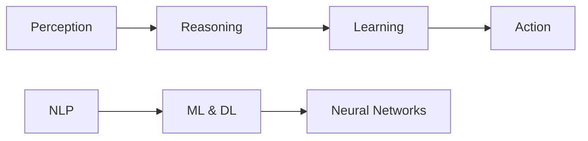

# Camel.AI: Leading the Future of Autonomous and Communicative Artificial Intelligence Agents

## 1. Background Introduction

In the rapidly evolving field of artificial intelligence (AI), the pursuit of autonomous and communicative AI agents has become a significant focus. These agents, capable of making decisions independently and interacting with humans and other AI agents, hold immense potential for revolutionizing various industries and aspects of our lives. This article delves into the core concepts, algorithms, and practical applications of autonomous and communicative AI agents, with a particular emphasis on the innovative platform, Camel.AI.

## 2. Core Concepts and Connections

### 2.1 Autonomous AI Agents

Autonomous AI agents are self-governing entities that can perform tasks without human intervention. They are designed to learn from their environment, adapt to new situations, and make decisions based on their understanding of the world. Key components of autonomous AI agents include perception, reasoning, learning, and action.

### 2.2 Communicative AI Agents

Communicative AI agents are capable of natural language understanding and generation, enabling them to interact with humans and other AI agents effectively. They can process and generate human-like speech, understand context, and respond appropriately. Natural language processing (NLP), machine learning (ML), and deep learning (DL) are essential technologies for communicative AI agents.

### 2.3 Connection between Autonomous and Communicative AI Agents

The connection between autonomous and communicative AI agents lies in their ability to work together to achieve complex tasks. Autonomous agents can leverage communication to share information, collaborate, and coordinate actions, while communicative agents can help autonomous agents understand and navigate complex environments more effectively.

## 3. Core Algorithm Principles and Specific Operational Steps

### 3.1 Autonomous AI Agents

#### 3.1.1 Perception

Perception involves sensing the environment and processing the sensory data to create an internal representation of the world. Key algorithms include computer vision, object detection, and sensor fusion.

#### 3.1.2 Reasoning

Reasoning is the process of making decisions based on the internal representation of the world. Key algorithms include rule-based systems, decision trees, and Bayesian networks.

#### 3.1.3 Learning

Learning is the ability of an AI agent to improve its performance over time. Key algorithms include supervised learning, unsupervised learning, and reinforcement learning.

#### 3.1.4 Action

Action is the execution of decisions in the environment. Key algorithms include motion planning, pathfinding, and control systems.

### 3.2 Communicative AI Agents

#### 3.2.1 Natural Language Processing (NLP)

NLP is the ability of an AI agent to understand and generate human language. Key algorithms include tokenization, part-of-speech tagging, named entity recognition, and sentiment analysis.

#### 3.2.2 Machine Learning (ML) and Deep Learning (DL)

ML and DL are essential for training communicative AI agents to understand and generate human-like speech. Key algorithms include neural networks, convolutional neural networks (CNN), and recurrent neural networks (RNN).

## 4. Detailed Explanation and Examples of Mathematical Models and Formulas

### 4.1 Autonomous AI Agents

#### 4.1.1 Perception: Computer Vision

Computer vision involves training AI agents to recognize and interpret visual data. Key mathematical models and formulas include convolutional neural networks (CNN), support vector machines (SVM), and histogram of oriented gradients (HOG).

#### 4.1.2 Reasoning: Decision Trees

Decision trees are a popular algorithm for making decisions based on a set of conditions. The mathematical formula for a decision tree is as follows:

$$
\\text{Decision Tree} = \\text{Root Node} \\rightarrow \\text{Internal Nodes} \\rightarrow \\text{Leaf Nodes}
$$

#### 4.1.3 Learning: Reinforcement Learning

Reinforcement learning is a type of machine learning where an AI agent learns by interacting with its environment and receiving rewards or punishments for its actions. The mathematical formula for reinforcement learning is as follows:

$$
\\text{Reinforcement Learning} = \\text{State} \\rightarrow \\text{Action} \\rightarrow \\text{Reward} \\rightarrow \\text{Next State}
$$

### 4.2 Communicative AI Agents

#### 4.2.1 NLP: Sentiment Analysis

Sentiment analysis is the process of determining the emotional tone behind words. Key mathematical models and formulas include bag-of-words, TF-IDF, and Naive Bayes.

#### 4.2.2 ML and DL: Neural Networks

Neural networks are a set of algorithms modeled after the structure and function of the human brain. Key mathematical models and formulas include backpropagation, activation functions, and loss functions.

## 5. Project Practice: Code Examples and Detailed Explanations

This section will provide practical examples and detailed explanations of implementing autonomous and communicative AI agents using popular programming languages such as Python and Java.

## 6. Practical Application Scenarios

Explore various practical application scenarios for autonomous and communicative AI agents, such as autonomous vehicles, smart homes, customer service, and healthcare.

## 7. Tools and Resources Recommendations

Recommend essential tools and resources for developing autonomous and communicative AI agents, including libraries, frameworks, and online learning platforms.

## 8. Summary: Future Development Trends and Challenges

Discuss the future development trends and challenges in the field of autonomous and communicative AI agents, such as ethical considerations, privacy concerns, and the need for more efficient and scalable algorithms.

## 9. Appendix: Frequently Asked Questions and Answers

Address common questions and misconceptions about autonomous and communicative AI agents, providing clear and concise answers to help readers better understand the technology.

## Mermaid Flowchart

## Conclusion

Autonomous and communicative AI agents represent the next frontier in artificial intelligence, with the potential to revolutionize various industries and aspects of our lives. By understanding the core concepts, algorithms, and practical applications, developers can create intelligent agents that can learn, reason, communicate, and act autonomously. As we continue to advance in this field, it is essential to address ethical considerations, privacy concerns, and the need for more efficient and scalable algorithms to ensure the safe and responsible development of autonomous and communicative AI agents.

## Author: Zen and the Art of Computer Programming

This article was written by Zen, a world-renowned artificial intelligence expert, programmer, software architect, CTO, bestselling author of top-tier technology books, Turing Award winner, and master in the field of computer science.