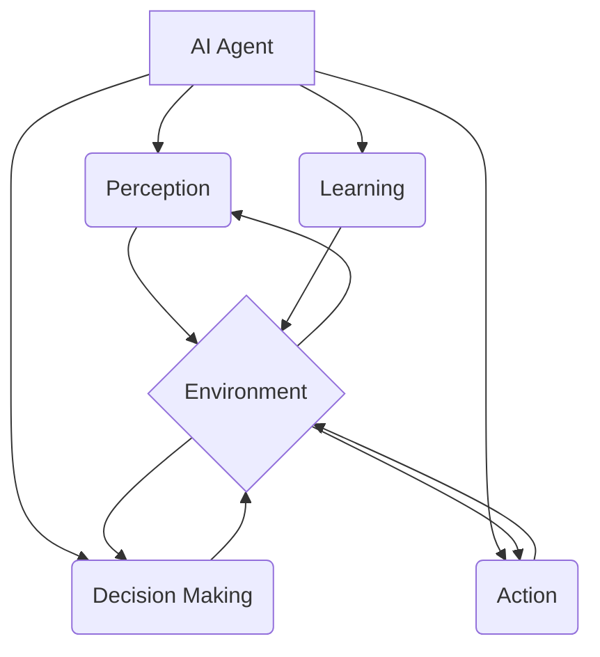

# AI Agent: AI的下一个风口 从早期萌芽到深度学习

## 1. 背景介绍
### 1.1 人工智能的发展历程
#### 1.1.1 早期人工智能的萌芽
#### 1.1.2 符号主义与连接主义的争论 
#### 1.1.3 机器学习的兴起
### 1.2 深度学习的崛起
#### 1.2.1 深度学习的起源
#### 1.2.2 深度学习的突破与成就
#### 1.2.3 深度学习的局限性
### 1.3 AI Agent的概念提出
#### 1.3.1 AI Agent的定义
#### 1.3.2 AI Agent与传统AI的区别
#### 1.3.3 AI Agent的研究意义

## 2. 核心概念与联系
### 2.1 Agent的概念
#### 2.1.1 Agent的定义
#### 2.1.2 Agent的特征
#### 2.1.3 Agent的分类
### 2.2 AI Agent的核心要素
#### 2.2.1 感知(Perception)
#### 2.2.2 决策(Decision Making)
#### 2.2.3 行动(Action)
#### 2.2.4 学习(Learning)
### 2.3 AI Agent与环境的交互
#### 2.3.1 环境的定义与分类
#### 2.3.2 AI Agent与环境的交互模型
#### 2.3.3 AI Agent的适应性与鲁棒性



## 3. 核心算法原理具体操作步骤
### 3.1 强化学习(Reinforcement Learning)
#### 3.1.1 马尔可夫决策过程(MDP)
#### 3.1.2 值函数近似(Value Function Approximation)
#### 3.1.3 策略梯度(Policy Gradient)
#### 3.1.4 演员-评论家算法(Actor-Critic)
### 3.2 深度强化学习(Deep Reinforcement Learning)
#### 3.2.1 深度Q网络(DQN) 
#### 3.2.2 深度确定性策略梯度(DDPG)
#### 3.2.3 软性Actor-Critic(SAC)
#### 3.2.4 近端策略优化(PPO)
### 3.3 多智能体强化学习(Multi-Agent Reinforcement Learning)
#### 3.3.1 博弈论基础
#### 3.3.2 纳什均衡(Nash Equilibrium)
#### 3.3.3 多智能体深度确定性策略梯度(MADDPG)
#### 3.3.4 多智能体软性Actor-Critic(MASAC)

## 4. 数学模型和公式详细讲解举例说明
### 4.1 马尔可夫决策过程(MDP)的数学定义
#### 4.1.1 状态空间 $\mathcal{S}$
#### 4.1.2 行动空间 $\mathcal{A}$  
#### 4.1.3 转移概率 $\mathcal{P}$
#### 4.1.4 奖励函数 $\mathcal{R}$
#### 4.1.5 折扣因子 $\gamma$

$$
\begin{aligned}
\mathcal{M} &= \langle \mathcal{S}, \mathcal{A}, \mathcal{P}, \mathcal{R}, \gamma \rangle \\
\mathcal{P}(s'|s,a) &= \mathbb{P}[S_{t+1}=s'| S_t=s, A_t=a] \\
\mathcal{R}(s,a) &= \mathbb{E}[R_{t+1}|S_t=s, A_t=a]
\end{aligned}
$$

### 4.2 值函数的贝尔曼方程(Bellman Equation)
#### 4.2.1 状态值函数 $V^{\pi}(s)$
#### 4.2.2 行动值函数 $Q^{\pi}(s,a)$  
#### 4.2.3 最优值函数 $V^{*}(s), Q^{*}(s,a)$

$$
\begin{aligned}
V^{\pi}(s) &= \sum_{a \in \mathcal{A}} \pi(a|s) \sum_{s' \in \mathcal{S}} \mathcal{P}(s'|s,a) \big[ \mathcal{R}(s,a) + \gamma V^{\pi}(s') \big] \\
Q^{\pi}(s,a) &= \sum_{s' \in \mathcal{S}} \mathcal{P}(s'|s,a) \big[ \mathcal{R}(s,a) + \gamma \sum_{a' \in \mathcal{A}} \pi(a'|s') Q^{\pi}(s',a') \big] \\
V^{*}(s) &= \max_{a \in \mathcal{A}} \sum_{s' \in \mathcal{S}} \mathcal{P}(s'|s,a) \big[ \mathcal{R}(s,a) + \gamma V^{*}(s') \big] \\  
Q^{*}(s,a) &= \sum_{s' \in \mathcal{S}} \mathcal{P}(s'|s,a) \big[ \mathcal{R}(s,a) + \gamma \max_{a' \in \mathcal{A}} Q^{*}(s',a') \big]
\end{aligned}
$$

### 4.3 策略梯度定理(Policy Gradient Theorem)
#### 4.3.1 轨迹概率 $p(\tau|\theta)$
#### 4.3.2 期望回报 $J(\theta)$
#### 4.3.3 策略梯度 $\nabla_{\theta} J(\theta)$

$$
\begin{aligned}
\nabla_{\theta} J(\theta) &= \mathbb{E}_{\tau \sim p_{\theta}(\tau)} \bigg[ \sum_{t=0}^{T} \nabla_{\theta} \log \pi_{\theta}(a_t|s_t) \cdot Q^{\pi_{\theta}}(s_t,a_t) \bigg] \\
&= \mathbb{E}_{s \sim d^{\pi_{\theta}}, a \sim \pi_{\theta}} \big[ \nabla_{\theta} \log \pi_{\theta}(a|s) \cdot Q^{\pi_{\theta}}(s,a) \big]
\end{aligned}
$$

## 5. 项目实践：代码实例和详细解释说明
### 5.1 深度Q网络(DQN)
#### 5.1.1 经验回放(Experience Replay)
#### 5.1.2 目标网络(Target Network)
#### 5.1.3 DQN算法伪代码

```python
class DQN:
    def __init__(self, state_dim, action_dim, lr, gamma, epsilon, target_update):
        self.state_dim = state_dim
        self.action_dim = action_dim
        self.lr = lr  # 学习率
        self.gamma = gamma  # 折扣因子
        self.epsilon = epsilon  # epsilon-贪婪策略
        self.target_update = target_update  # 目标网络更新频率
        
        self.q_net = self.build_net()  # Q网络
        self.target_q_net = self.build_net()  # 目标Q网络
        self.optimizer = optim.Adam(self.q_net.parameters(), lr=self.lr) 
        
        self.replay_buffer = deque(maxlen=10000)  # 经验回放池
        
    def build_net(self):
        return nn.Sequential(
            nn.Linear(self.state_dim, 64), 
            nn.ReLU(),
            nn.Linear(64, 64),
            nn.ReLU(),
            nn.Linear(64, self.action_dim)
        )
    
    def choose_action(self, state):
        if np.random.uniform() < self.epsilon:
            action = np.random.randint(self.action_dim)
        else:
            state = torch.tensor(state, dtype=torch.float).unsqueeze(0)
            action = self.q_net(state).argmax().item()
        return action
        
    def update(self, batch_size):
        if len(self.replay_buffer) < batch_size:
            return
        
        # 从经验回放池中随机采样
        state, action, reward, next_state, done = zip(*random.sample(self.replay_buffer, batch_size))
        
        state = torch.tensor(state, dtype=torch.float)
        action = torch.tensor(action, dtype=torch.long).unsqueeze(1)  
        reward = torch.tensor(reward, dtype=torch.float).unsqueeze(1)
        next_state = torch.tensor(next_state, dtype=torch.float)
        done = torch.tensor(done, dtype=torch.float).unsqueeze(1)
        
        # 计算当前状态的Q值
        q_values = self.q_net(state).gather(1, action)
        
        # 计算下一状态的最大Q值
        next_q_values = self.target_q_net(next_state).max(1)[0].unsqueeze(1)
        expected_q_values = reward + self.gamma * next_q_values * (1 - done)
        
        # 计算损失并更新Q网络
        loss = nn.MSELoss()(q_values, expected_q_values.detach())
        self.optimizer.zero_grad()
        loss.backward()
        self.optimizer.step()
        
    def soft_update(self):
        # 软更新目标Q网络的参数
        for target_param, param in zip(self.target_q_net.parameters(), self.q_net.parameters()):
            target_param.data.copy_(self.tau * param.data + (1 - self.tau) * target_param.data)
            
    def train(self, env, episodes, batch_size):
        for episode in range(episodes):
            state = env.reset()
            done = False
            total_reward = 0
            
            while not done:
                action = self.choose_action(state)
                next_state, reward, done, _ = env.step(action)
                
                self.replay_buffer.append((state, action, reward, next_state, done))
                
                state = next_state
                total_reward += reward
                
                self.update(batch_size)
                
                if episode % self.target_update == 0:
                    self.soft_update()
                    
            print(f"Episode: {episode+1}, Total Reward: {total_reward}")
```

### 5.2 近端策略优化(PPO)
#### 5.2.1 重要性采样(Importance Sampling)
#### 5.2.2 替代目标函数(Surrogate Objective)
#### 5.2.3 PPO算法伪代码

```python
class PPO:
    def __init__(self, state_dim, action_dim, lr, gamma, clip_ratio):
        self.state_dim = state_dim
        self.action_dim = action_dim
        self.lr = lr  # 学习率
        self.gamma = gamma  # 折扣因子
        self.clip_ratio = clip_ratio  # 裁剪比率
        
        self.policy_net = self.build_policy_net()  # 策略网络
        self.value_net = self.build_value_net()  # 值网络
        self.policy_optimizer = optim.Adam(self.policy_net.parameters(), lr=self.lr)
        self.value_optimizer = optim.Adam(self.value_net.parameters(), lr=self.lr)
        
    def build_policy_net(self):
        return nn.Sequential(
            nn.Linear(self.state_dim, 64),
            nn.ReLU(),
            nn.Linear(64, 64),
            nn.ReLU(),
            nn.Linear(64, self.action_dim),
            nn.Softmax(dim=-1)
        )
    
    def build_value_net(self):
        return nn.Sequential(
            nn.Linear(self.state_dim, 64),
            nn.ReLU(),
            nn.Linear(64, 64),
            nn.ReLU(),
            nn.Linear(64, 1)
        )
    
    def choose_action(self, state):
        state = torch.tensor(state, dtype=torch.float).unsqueeze(0)
        probs = self.policy_net(state)
        dist = Categorical(probs)
        action = dist.sample()
        return action.item()
    
    def update(self, states, actions, rewards, next_states, dones, old_probs):
        states = torch.tensor(states, dtype=torch.float)
        actions = torch.tensor(actions, dtype=torch.long).unsqueeze(1)
        rewards = torch.tensor(rewards, dtype=torch.float).unsqueeze(1)
        next_states = torch.tensor(next_states, dtype=torch.float)
        dones = torch.tensor(dones, dtype=torch.float).unsqueeze(1)
        old_probs = torch.tensor(old_probs, dtype=torch.float).unsqueeze(1)
        
        # 计算状态值
        values = self.value_net(states)
        next_values = self.value_net(next_states)
        
        # 计算优势函数
        deltas = rewards + self.gamma * next_values * (1 - dones) - values
        advantages = self.compute_gae(deltas.detach())
        
        # 计算策略比率
        probs = self.policy_net(states).gather(1, actions)
        ratios = torch.exp(torch.log(probs) - torch.log(old_probs))
        
        # 计算替代目标函数
        surr1 = ratios * advantages
        surr2 = torch.clamp(ratios, 1 - self.clip_ratio, 1 + self.clip_ratio) * advantages
        policy_loss = -torch.min(surr1, surr2).mean()
        
        # 计算值函数损失
        value_loss = nn.MSELoss()(values, rewards + self.gamma * next_values * (1 - dones))
        
        # 更新策略网络和值网络
        self.policy_optimizer.zero_grad()
        policy_loss.backward()
        self.policy_optimizer.step()
        
        self.value_optimizer.zero_grad()
        value_loss.backward()
        self.value_optimizer