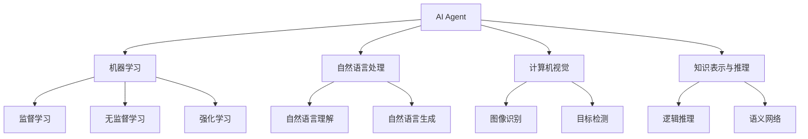
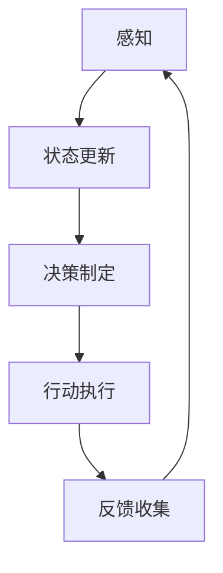

# AI Agent: AI的下一个风口 企业级应用与任务规划

## 1. 背景介绍

### 1.1 人工智能的发展历程

人工智能(Artificial Intelligence, AI)是当代科技发展的前沿领域,已经渗透到我们生活和工作的方方面面。从20世纪50年代AI概念的提出,到今天的深度学习、强化学习等技术的飞速发展,AI正在改变着世界。

### 1.2 AI Agent的兴起

在AI的发展过程中,AI Agent(智能代理)的概念应运而生。AI Agent是一种具有自主性、交互性和反应性的软件实体,能够感知环境、处理信息、做出决策并执行行动,以完成特定任务。随着AI技术的不断进步,AI Agent在各行各业的应用也日益广泛。

### 1.3 企业级应用的需求

在当今商业环境中,企业面临着日益复杂的挑战,需要高效、智能的解决方案来提高生产力、优化流程、改善决策等。AI Agent凭借其强大的数据处理、决策制定和自动化执行能力,成为企业级应用的重要工具。

## 2. 核心概念与联系

### 2.1 AI Agent的定义

AI Agent是一种能够感知环境、处理信息、做出决策并执行行动的自主系统。它具有以下三个核心特征:

1. 自主性(Autonomy):能够独立地做出决策和行动,而不需要人工干预。
2. 交互性(Interactivity):能够与环境和其他代理进行交互,接收信息并做出反应。
3. 反应性(Reactivity):能够根据环境变化及时做出响应,采取相应的行动。

### 2.2 AI Agent的类型

根据AI Agent的功能和特点,可以将其分为以下几种类型:

1. 简单反射型Agent(Simple Reflex Agent)
2. 基于模型的Agent(Model-Based Agent)
3. 基于目标的Agent(Goal-Based Agent)
4. 基于效用的Agent(Utility-Based Agent)
5. 学习型Agent(Learning Agent)

不同类型的AI Agent适用于不同的应用场景和任务需求。

### 2.3 AI Agent与其他AI概念的关系

AI Agent与其他AI概念存在密切联系,例如:

- 机器学习(Machine Learning)为AI Agent提供了学习和优化决策的能力。
- 自然语言处理(Natural Language Processing)赋予AI Agent理解和生成自然语言的能力。
- 计算机视觉(Computer Vision)使AI Agent能够感知和理解视觉信息。
- 知识表示与推理(Knowledge Representation and Reasoning)为AI Agent提供了知识建模和推理的基础。

AI Agent是一种集成了多种AI技术的综合性系统,能够高效地完成复杂的任务。



## 3. 核心算法原理具体操作步骤

### 3.1 AI Agent的基本工作流程

AI Agent的基本工作流程可以概括为以下几个步骤:

1. 感知(Perception):通过各种传感器获取环境信息,如视觉、语音、文本等。
2. 状态更新(State Update):将获取的信息与Agent的内部状态进行整合,更新Agent的知识库。
3. 决策制定(Decision Making):根据更新后的状态和任务目标,利用决策算法制定行动计划。
4. 行动执行(Action Execution):执行制定的行动计划,与环境进行交互。
5. 反馈收集(Feedback Collection):获取执行行动后的环境反馈,用于下一次迭代。

这个循环过程持续进行,直到完成任务目标或遇到终止条件。



### 3.2 决策算法

决策算法是AI Agent制定行动计划的核心部分,常见的决策算法包括:

1. 搜索算法(Search Algorithms):如A*算法、贪心算法等,用于在状态空间中搜索最优解。
2. 规划算法(Planning Algorithms):如STRIPS、GraphPlan等,用于生成行动序列以达成目标。
3. 马尔可夫决策过程(Markov Decision Processes, MDPs):建模决策问题为马尔可夫过程,求解最优策略。
4. 多智能体系统(Multi-Agent Systems):研究多个Agent如何协作完成任务。

不同的决策算法适用于不同的问题类型和约束条件,选择合适的算法对于AI Agent的性能至关重要。

### 3.3 学习算法

AI Agent通常需要具备学习能力,以适应动态环境和提高决策质量。常见的学习算法包括:

1. 监督学习(Supervised Learning):从标注数据中学习映射函数,如分类、回归等。
2. 无监督学习(Unsupervised Learning):从未标注数据中发现隐藏模式,如聚类、降维等。
3. 强化学习(Reinforcement Learning):通过与环境交互获取反馈,学习最优策略。
4. 迁移学习(Transfer Learning):利用已学习的知识加速新任务的学习过程。
5. 元学习(Meta-Learning):学习如何更好地学习,提高学习效率。

合理应用学习算法可以使AI Agent持续优化自身,提高任务完成能力。

## 4. 数学模型和公式详细讲解举例说明

### 4.1 马尔可夫决策过程(MDP)

马尔可夫决策过程(Markov Decision Process, MDP)是AI Agent决策制定的重要数学模型。MDP由以下五元组组成:

$$\langle S, A, P, R, \gamma \rangle$$

其中:
- $S$是状态集合,表示Agent可能处于的所有状态
- $A$是行动集合,表示Agent可以执行的所有行动
- $P(s' \mid s, a)$是状态转移概率,表示在状态$s$执行行动$a$后,转移到状态$s'$的概率
- $R(s, a, s')$是回报函数,表示在状态$s$执行行动$a$后,转移到状态$s'$所获得的即时回报
- $\gamma \in [0, 1)$是折现因子,用于权衡即时回报和长期回报的重要性

MDP的目标是找到一个策略$\pi: S \rightarrow A$,使得期望的累积折现回报最大化:

$$\max_\pi \mathbb{E}\left[ \sum_{t=0}^\infty \gamma^t R(s_t, a_t, s_{t+1}) \mid \pi \right]$$

其中$s_0$是初始状态,$a_t = \pi(s_t)$是在状态$s_t$执行的行动。

### 4.2 值函数和贝尔曼方程

在MDP中,我们定义状态值函数$V^\pi(s)$和行动值函数$Q^\pi(s, a)$来评估策略$\pi$的好坏:

$$V^\pi(s) = \mathbb{E}_\pi\left[ \sum_{t=0}^\infty \gamma^t R(s_t, a_t, s_{t+1}) \mid s_0 = s \right]$$

$$Q^\pi(s, a) = \mathbb{E}_\pi\left[ \sum_{t=0}^\infty \gamma^t R(s_t, a_t, s_{t+1}) \mid s_0 = s, a_0 = a \right]$$

$V^\pi(s)$表示在状态$s$下,执行策略$\pi$所能获得的期望累积折现回报。$Q^\pi(s, a)$表示在状态$s$下执行行动$a$,之后再执行策略$\pi$所能获得的期望累积折现回报。

值函数满足贝尔曼方程:

$$V^\pi(s) = \sum_{a \in A} \pi(a \mid s) \sum_{s' \in S} P(s' \mid s, a) \left[ R(s, a, s') + \gamma V^\pi(s') \right]$$

$$Q^\pi(s, a) = \sum_{s' \in S} P(s' \mid s, a) \left[ R(s, a, s') + \gamma \sum_{a' \in A} \pi(a' \mid s') Q^\pi(s', a') \right]$$

解这些方程可以得到最优值函数$V^*(s)$和$Q^*(s, a)$,进而得到最优策略$\pi^*(s) = \arg\max_a Q^*(s, a)$。

### 4.3 动态规划算法

动态规划(Dynamic Programming)是求解MDP的经典算法,包括值迭代(Value Iteration)和策略迭代(Policy Iteration)两种方法。

**值迭代算法**:

1. 初始化$V(s)$为任意值函数
2. 重复直到收敛:
   $$V(s) \leftarrow \max_a \sum_{s' \in S} P(s' \mid s, a) \left[ R(s, a, s') + \gamma V(s') \right]$$
3. 对于每个状态$s$,令$\pi^*(s) = \arg\max_a \sum_{s' \in S} P(s' \mid s, a) \left[ R(s, a, s') + \gamma V(s') \right]$

**策略迭代算法**:

1. 初始化$\pi$为任意策略
2. 重复直到收敛:
   1. 对于当前策略$\pi$,求解$V^\pi$:
      $$V^\pi(s) = \sum_{a \in A} \pi(a \mid s) \sum_{s' \in S} P(s' \mid s, a) \left[ R(s, a, s') + \gamma V^\pi(s') \right]$$
   2. 对于每个状态$s$,令$\pi'(s) = \arg\max_a \sum_{s' \in S} P(s' \mid s, a) \left[ R(s, a, s') + \gamma V^\pi(s') \right]$
   3. 如果$\pi' = \pi$,则停止迭代;否则令$\pi \leftarrow \pi'$

这些算法可以求解具有有限状态和行动空间的MDP问题。对于连续状态或行动空间,需要使用近似动态规划等技术。

## 5. 项目实践: 代码实例和详细解释说明

为了更好地理解AI Agent的实现,我们以一个简单的网格世界(GridWorld)为例,演示如何使用Python和强化学习算法训练一个AI Agent。

### 5.1 问题描述

在一个$4 \times 4$的网格世界中,Agent的目标是从起点(0, 0)到达终点(3, 3)。网格中存在障碍物,Agent需要学习如何避开障碍物到达终点。Agent可以执行四个基本行动:上、下、左、右。每一步行动都会获得-1的即时回报,到达终点后获得+10的终止回报。

### 5.2 环境实现

我们首先定义网格世界环境:

```python
import numpy as np

class GridWorld:
    def __init__(self):
        self.shape = (4, 4)
        self.start = (0, 0)
        self.goal = (3, 3)
        self.obstacles = [(1, 1), (2, 2)]
        self.actions = ['up', 'down', 'left', 'right']
        self.action_coords = [(-1, 0), (1, 0), (0, -1), (0, 1)]

    def step(self, state, action):
        x, y = state
        dx, dy = self.action_coords[action]
        new_x, new_y = x + dx, y + dy
        
        if (new_x, new_y) in self.obstacles:
            new_x, new_y = x, y
        
        new_state = (new_x, new_y)
        
        if new_state == self.goal:
            reward = 10
            done = True
        else:
            reward = -1
            done = False
        
        return new_state, reward, done
```

这个`GridWorld`类定义了环境的基本属性,如形状、起点、终点、障碍物位置等。`step`函数实现了状态转移和回报计算逻辑。

### 5.3 Q-Learning算法实现

接下来,我们使用Q-Learning算法训练一个Agent来解决这个问题。Q-Learning是一种基于时间差分的强化学习算法,可以在线学习最优策略。

```python
import random

class QLearningAgent:
    def __init__(self, env, alpha=0.1, gamma=0.9, epsilon=0.1):
        self.env = env
        self.q_table = np.zeros((env.shape + (len(env.actions),)))
        self.alpha = alpha
        self.gamma = gamma
        self.epsilon = epsilon