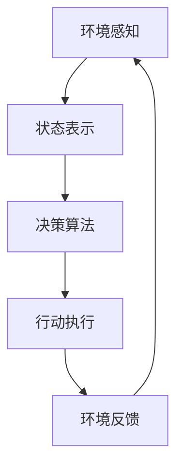

# AI Agent: AI的下一个风口 具身认知理论的重要性

## 1. 背景介绍

在过去几十年中,人工智能(AI)技术取得了长足的进步,尤其是在机器学习和深度学习领域。从语音识别、图像处理到自然语言处理,AI系统已经渗透到我们生活的方方面面。然而,目前的AI系统大多是基于软件的"脑模型",缺乏对物理世界的直接感知和交互能力。这种"脱离现实"的特点限制了AI系统的发展空间。

具身认知(Embodied Cognition)理论为AI系统带来了新的发展方向。具身认知强调认知过程是通过身体与环境的相互作用而发生的,智能不仅仅是一个抽象的计算过程,而是需要与物理世界紧密耦合。基于这一理论,AI Agent(智能体)应运而生,它是一种能够感知环境、做出决策并在物理世界中采取行动的智能系统。

## 2. 核心概念与联系

### 2.1 具身认知理论

具身认知理论认为,认知过程并非发生在与环境隔离的大脑中,而是通过身体与环境的持续互动而产生。人类的思维、推理和决策都是基于对周围环境的感知和身体的运动经验。这一理论挑战了传统的"计算主义"观点,即认知只是一种符号操作过程。

### 2.2 AI Agent

AI Agent是一种能够感知环境、做出决策并在物理世界中采取行动的智能系统。它通过传感器获取环境信息,利用决策算法选择行动策略,并通过执行器(如机器人手臂)在现实世界中执行操作。

AI Agent与传统的软件AI系统的根本区别在于,它需要直接与物理环境进行交互,而不是在隔离的虚拟环境中运行。这使得AI Agent不仅需要强大的计算能力,还需要具备对环境的感知和操作能力。

### 2.3 AI Agent与具身认知理论的联系

具身认知理论为AI Agent的发展提供了理论基础。AI Agent通过与环境的持续互动,获取感知数据并基于这些数据进行决策和行动,从而展现出"具身"的认知过程。与传统的软件AI系统相比,AI Agent更加贴近人类的认知方式,有望实现更加智能和人性化的交互。

## 3. 核心算法原理具体操作步骤

AI Agent的核心算法原理可以概括为感知-决策-行动的循环过程,如下图所示:



### 3.1 环境感知

AI Agent通过各种传感器(如摄像头、雷达、麦克风等)获取环境信息,包括视觉、声音、位置等数据。这些原始数据需要进行预处理和特征提取,以构建Agent可以理解的状态表示。

### 3.2 状态表示

状态表示是Agent对当前环境的内部描述,它是决策算法的输入。常见的状态表示方法包括特征向量、图像像素矩阵、语义表示等。高质量的状态表示对于Agent做出正确决策至关重要。

### 3.3 决策算法

决策算法是Agent的"大脑",它根据当前状态表示选择合适的行动策略。常见的决策算法包括强化学习、规划算法、基于模型的方法等。决策算法的设计需要权衡探索与利用的平衡,以达到长期的最优表现。

### 3.4 行动执行

一旦做出决策,Agent需要通过执行器(如机器人手臂、语音合成器等)在物理世界中执行相应的操作。行动执行的质量直接影响Agent与环境的互动效果。

### 3.5 环境反馈

Agent的行动会引起环境的变化,新的环境状态将作为反馈输入到Agent,重新启动感知-决策-行动的循环。这种持续的环境互动是具身认知理论的核心体现。

## 4. 数学模型和公式详细讲解举例说明

在AI Agent的算法中,常常需要使用数学模型来描述和优化决策过程。以下是一些常见的数学模型和公式:

### 4.1 马尔可夫决策过程(MDP)

马尔可夫决策过程(Markov Decision Process, MDP)是一种广泛使用的数学框架,用于描述Agent与环境的互动。MDP由一个五元组(S, A, P, R, γ)定义,其中:

- S是状态集合
- A是行动集合
- P是状态转移概率,P(s'|s,a)表示在状态s执行行动a后,转移到状态s'的概率
- R是奖励函数,R(s,a)表示在状态s执行行动a后获得的即时奖励
- γ是折现因子,用于权衡即时奖励和长期回报

在MDP框架下,Agent的目标是找到一个策略π,使得期望的累积折现奖励最大化:

$$\max_\pi \mathbb{E}\left[\sum_{t=0}^\infty \gamma^t R(s_t, a_t)\right]$$

其中$a_t = \pi(s_t)$是根据策略π在状态$s_t$选择的行动。

### 4.2 Q-Learning

Q-Learning是一种著名的强化学习算法,用于在MDP环境中寻找最优策略。它基于贝尔曼方程,通过迭代更新状态-行动值函数Q(s,a),最终收敛到最优策略。

Q-Learning的更新规则为:

$$Q(s_t, a_t) \leftarrow Q(s_t, a_t) + \alpha \left[r_t + \gamma \max_{a'} Q(s_{t+1}, a') - Q(s_t, a_t)\right]$$

其中$\alpha$是学习率,$r_t$是在状态$s_t$执行行动$a_t$后获得的即时奖励,$\gamma$是折现因子。

通过不断更新Q函数,Agent最终可以找到在每个状态下执行的最优行动,从而获得最大的累积奖励。

### 4.3 策略梯度算法

策略梯度算法是另一种常用的强化学习方法,它直接对策略函数$\pi_\theta(a|s)$进行参数化,并通过梯度上升的方式优化策略参数$\theta$,使得期望的累积奖励最大化:

$$\max_\theta \mathbb{E}_{\pi_\theta}\left[\sum_{t=0}^\infty \gamma^t R(s_t, a_t)\right]$$

策略梯度可以通过利用似然比技巧(Likelihood Ratio Trick)来估计:

$$\nabla_\theta J(\theta) = \mathbb{E}_{\pi_\theta}\left[\sum_{t=0}^\infty \nabla_\theta \log \pi_\theta(a_t|s_t) Q^{\pi_\theta}(s_t, a_t)\right]$$

其中$Q^{\pi_\theta}(s_t, a_t)$是在策略$\pi_\theta$下,状态$s_t$执行行动$a_t$的长期回报。

通过梯度上升,可以不断更新策略参数$\theta$,使得Agent的行为策略越来越接近最优策略。

以上是AI Agent中常见的一些数学模型和公式,它们为Agent的决策过程提供了理论基础和优化方法。在实际应用中,这些模型和算法往往需要根据具体问题进行调整和改进。

## 5. 项目实践:代码实例和详细解释说明

为了更好地理解AI Agent的工作原理,我们将通过一个简单的示例项目来演示如何构建一个基于Q-Learning的Agent,用于解决经典的"格子世界"(GridWorld)问题。

### 5.1 问题描述

格子世界是强化学习中一个常见的示例问题。Agent被放置在一个由格子组成的二维世界中,其目标是从起点到达终点。每一步,Agent可以选择上下左右四个方向中的一个进行移动。某些格子可能存在障碍物或者陷阱,Agent需要学习如何避开这些格子,找到到达终点的最佳路径。

### 5.2 环境设置

我们首先定义格子世界的环境,包括世界的大小、起点、终点、障碍物和陷阱的位置等。为了简化问题,我们假设Agent的行动是确定性的,即每次移动都会按照指定的方向进行。

```python
import numpy as np

# 格子世界的大小
WORLD_SIZE = (5, 5)

# 起点和终点位置
START = (0, 0)
GOAL = (4, 4)

# 障碍物和陷阱的位置
OBSTACLES = [(1, 1), (3, 1), (3, 3)]
PITS = [(2, 2)]

# 定义奖励
GOAL_REWARD = 10
PIT_REWARD = -10
STEP_REWARD = -1
```

### 5.3 Q-Learning实现

接下来,我们实现Q-Learning算法,用于训练Agent在格子世界中找到最优路径。

```python
import random

class QLearningAgent:
    def __init__(self, alpha, gamma, epsilon, world_size):
        self.alpha = alpha  # 学习率
        self.gamma = gamma  # 折现因子
        self.epsilon = epsilon  # 探索率
        self.world_size = world_size
        self.Q = np.zeros(world_size + (4,))  # 初始化Q表

    def get_action(self, state):
        # 根据epsilon-greedy策略选择行动
        if random.random() < self.epsilon:
            return random.randint(0, 3)  # 探索
        else:
            return np.argmax(self.Q[state])  # 利用

    def update(self, state, action, reward, next_state):
        # 更新Q表
        next_max_q = np.max(self.Q[next_state])
        self.Q[state][action] += self.alpha * (reward + self.gamma * next_max_q - self.Q[state][action])

    def train(self, num_episodes):
        # 训练Agent
        for episode in range(num_episodes):
            state = START
            done = False
            while not done:
                action = self.get_action(state)
                next_state, reward, done = self.step(state, action)
                self.update(state, action, reward, next_state)
                state = next_state

    def step(self, state, action):
        # 执行一步行动,返回下一个状态、奖励和是否结束
        row, col = state
        if action == 0:  # 上
            next_state = (max(row - 1, 0), col)
        elif action == 1:  # 下
            next_state = (min(row + 1, self.world_size[0] - 1), col)
        elif action == 2:  # 左
            next_state = (row, max(col - 1, 0))
        else:  # 右
            next_state = (row, min(col + 1, self.world_size[1] - 1))

        if next_state == GOAL:
            reward = GOAL_REWARD
            done = True
        elif next_state in PITS:
            reward = PIT_REWARD
            done = True
        elif next_state in OBSTACLES:
            reward = STEP_REWARD
            next_state = state  # 障碍物处不移动
        else:
            reward = STEP_REWARD
            done = False

        return next_state, reward, done
```

在上面的代码中,我们定义了一个`QLearningAgent`类,用于实现Q-Learning算法。`get_action`方法根据epsilon-greedy策略选择行动,`update`方法用于更新Q表,`train`方法则是训练Agent的主循环。

`step`函数模拟了Agent在格子世界中执行一步行动的过程,根据下一个状态的情况返回相应的奖励和是否结束。

### 5.4 训练和可视化

最后,我们训练Agent并可视化其在格子世界中的行为。

```python
import matplotlib.pyplot as plt

# 创建Agent
agent = QLearningAgent(alpha=0.1, gamma=0.9, epsilon=0.1, world_size=WORLD_SIZE)

# 训练Agent
agent.train(num_episodes=1000)

# 可视化最优路径
optimal_path = []
state = START
while state != GOAL:
    action = np.argmax(agent.Q[state])
    optimal_path.append(state)
    state, _, _ = agent.step(state, action)
optimal_path.append(GOAL)

# 绘制格子世界和最优路径
world = np.zeros(WORLD_SIZE)
for obstacle in OBSTACLES:
    world[obstacle] = 1
for pit in PITS:
    world[pit] = 2

plt.figure(figsize=(6, 6))
plt.imshow(world, cmap='binary')
for state in optimal_path:
    row, col = state
    plt.plot(col, row, 'ro', markersize=10)
plt.show()
```

在这段代码中,我们首先创建一个`QLearningAgent`实例,并通过`train`方法进行训练。训练完成后