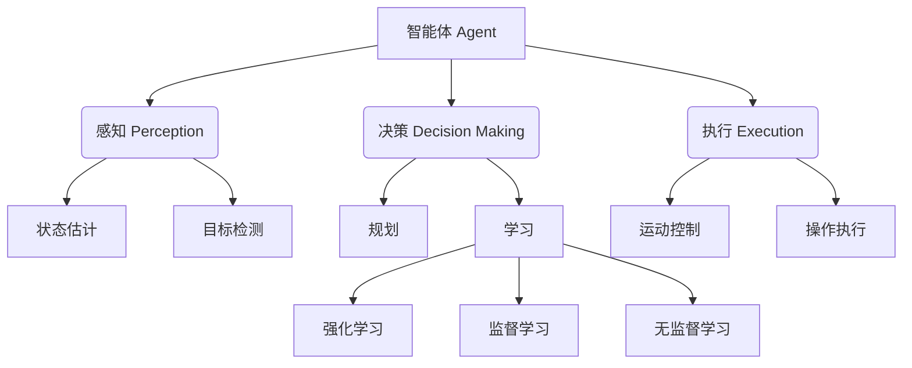

# AI Agent: AI的下一个风口 展望：安全、发展、边界和挑战

## 1. 背景介绍
### 1.1 AI Agent的兴起
### 1.2 AI Agent的定义与特点 
### 1.3 AI Agent的发展历程

## 2. 核心概念与联系
### 2.1 AI Agent的核心概念
#### 2.1.1 智能体(Agent)
#### 2.1.2 感知(Perception)  
#### 2.1.3 决策(Decision Making)
#### 2.1.4 执行(Execution)
#### 2.1.5 学习(Learning)
### 2.2 AI Agent的分类
#### 2.2.1 按智能程度分类
##### 2.2.1.1 弱AI Agent
##### 2.2.1.2 强AI Agent 
##### 2.2.1.3 超AI Agent
#### 2.2.2 按应用领域分类 
##### 2.2.2.1 工业AI Agent
##### 2.2.2.2 商业AI Agent
##### 2.2.2.3 教育AI Agent
##### 2.2.2.4 医疗AI Agent
### 2.3 AI Agent与其他AI技术的关系
#### 2.3.1 AI Agent与机器学习的关系
#### 2.3.2 AI Agent与知识图谱的关系
#### 2.3.3 AI Agent与自然语言处理的关系

## 3. 核心算法原理具体操作步骤
### 3.1 基于搜索的AI Agent算法
#### 3.1.1 宽度优先搜索(BFS) 
#### 3.1.2 深度优先搜索(DFS)
#### 3.1.3 A*搜索算法
### 3.2 基于规划的AI Agent算法
#### 3.2.1 前向规划算法
#### 3.2.2 后向规划算法 
#### 3.2.3 部分顺序规划算法
### 3.3 基于强化学习的AI Agent算法
#### 3.3.1 Q-Learning算法
#### 3.3.2 SARSA算法
#### 3.3.3 DQN(Deep Q Network)算法
### 3.4 基于逻辑推理的AI Agent算法
#### 3.4.1 一阶逻辑推理
#### 3.4.2 归结推理
#### 3.4.3 模糊逻辑推理

## 4. 数学模型和公式详细讲解举例说明
### 4.1 马尔可夫决策过程(MDP)模型
#### 4.1.1 MDP的定义与组成
#### 4.1.2 MDP的Bellman方程
### 4.2 部分可观察马尔可夫决策过程(POMDP)模型  
#### 4.2.1 POMDP的定义与组成
#### 4.2.2 POMDP的Bellman方程
### 4.3 动态贝叶斯网络(DBN)模型
#### 4.3.1 DBN的定义与组成
#### 4.3.2 DBN的推理算法
### 4.4 强化学习中的数学模型 
#### 4.4.1 状态-行为值函数
#### 4.4.2 时间差分学习 
#### 4.4.3 策略梯度定理

## 5. 项目实践：代码实例和详细解释说明
### 5.1 基于Python的AI Agent开发框架
#### 5.1.1 OpenAI Gym环境介绍
#### 5.1.2 基于Gym环境的Agent开发示例
### 5.2 基于Java的AI Agent开发框架
#### 5.2.1 JADE框架介绍
#### 5.2.2 基于JADE的Agent开发示例
### 5.3 基于C++的AI Agent开发框架
#### 5.3.1 ROS(Robot Operating System)介绍
#### 5.3.2 基于ROS的Agent开发示例
### 5.4 经典AI Agent项目案例分析
#### 5.4.1 AlphaGo的实现原理与代码分析
#### 5.4.2 Libratus的实现原理与代码分析
#### 5.4.3 OpenAI Five的实现原理与代码分析

## 6. 实际应用场景
### 6.1 智能客服领域的应用
#### 6.1.1 基于自然语言理解的客服AI Agent
#### 6.1.2 基于知识图谱的客服AI Agent
### 6.2 自动驾驶领域的应用
#### 6.2.1 自动驾驶感知决策AI Agent
#### 6.2.2 自动驾驶路径规划AI Agent
### 6.3 智能制造领域的应用
#### 6.3.1 设备预测性维护AI Agent
#### 6.3.2 生产排程优化AI Agent
### 6.4 智慧城市领域的应用
#### 6.4.1 交通流量预测与调度AI Agent
#### 6.4.2 城市安防监控AI Agent

## 7. 工具和资源推荐
### 7.1 AI Agent开发工具
#### 7.1.1 TensorFlow
#### 7.1.2 PyTorch
#### 7.1.3 Keras
### 7.2 AI Agent开发平台
#### 7.2.1 Google Cloud AI Platform
#### 7.2.2 Amazon SageMaker
#### 7.2.3 Microsoft Azure AI
### 7.3 AI Agent学习资源
#### 7.3.1 《人工智能：一种现代的方法》
#### 7.3.2 《深度强化学习》
#### 7.3.3 DeepMind强化学习课程

## 8. 总结：未来发展趋势与挑战
### 8.1 AI Agent的未来发展趋势 
#### 8.1.1 多Agent协同与博弈
#### 8.1.2 人机混合增强智能
#### 8.1.3 AI Agent的自主学习与进化
### 8.2 AI Agent面临的挑战
#### 8.2.1 AI Agent的安全与隐私问题
#### 8.2.2 AI Agent的伦理与道德问题
#### 8.2.3 AI Agent的可解释性问题
### 8.3 AI Agent的研究方向展望
#### 8.3.1 AI Agent的理论基础研究
#### 8.3.2 AI Agent的跨领域融合研究
#### 8.3.3 AI Agent的产业化应用研究

## 9. 附录：常见问题与解答 
### 9.1 什么是AI Agent？与传统软件的区别是什么？
### 9.2 目前AI Agent主要应用在哪些领域？未来还有哪些潜在应用方向？
### 9.3 开发一个AI Agent需要哪些技术和工具？
### 9.4 如何评估一个AI Agent系统的性能？有哪些指标？
### 9.5 对于AI Agent的发展，您有哪些建议和展望？

人工智能Agent技术正在引领人工智能领域的新一轮变革浪潮。作为下一代人工智能系统的核心，AI Agent 综合运用了多种人工智能技术，如机器学习、知识表示、自然语言理解、计算机视觉等，使得人工智能系统能够像人一样感知、思考、决策和行动。

一个典型的AI Agent由感知、决策、执行等模块构成。感知模块负责接收和理解外界的信息，通过状态估计、目标检测等技术对环境进行感知。决策模块是Agent的核心，它根据感知到的信息，运用各种推理、规划、学习算法进行决策，生成行动策略。执行模块则负责控制Agent执行具体的动作。

AI Agent的决策算法可分为基于搜索、基于规划、基于强化学习、基于逻辑推理等不同流派。其中，强化学习是当前研究的重点，通过设计奖励函数，使Agent在与环境的交互中不断试错，最终学习到最优策略。马尔可夫决策过程(MDP)是强化学习的理论基础，可用贝尔曼方程描述其数学模型。在部分可观察场景下，则需采用POMDP模型。

在实践中，可基于Python/Java/C++等语言，使用TensorFlow/PyTorch/Keras等开发工具，在OpenAI Gym/JADE/ROS等开发环境下构建AI Agent。一些经典项目如AlphaGo、Libratus、OpenAI Five，展示了AI Agent在复杂博弈领域的巨大潜力。

当前，AI Agent已在智能客服、自动驾驶、智能制造、智慧城市等领域得到广泛应用。未来，AI Agent有望突破安全、伦理、 可解释性等挑战，实现多Agent协同、人机混合增强、自主进化等新的发展方向，为人类社会发展做出更大贡献。

作者：禅与计算机程序设计艺术 / Zen and the Art of Computer Programming