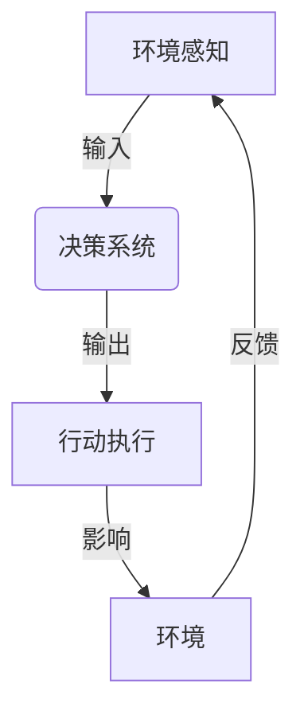

# AI Agent: AI的下一个风口 智能体与传统软件的关系

## 1. 背景介绍

### 1.1 人工智能的发展历程

人工智能(Artificial Intelligence, AI)是当代科技领域最具变革性的力量之一。自20世纪50年代诞生以来,AI经历了起伏跌宕的发展历程。从早期的专家系统和机器学习算法,到近年来的深度学习和神经网络的突破性进展,AI已经渗透到我们生活和工作的方方面面。

### 1.2 传统软件架构的局限性

然而,传统的软件架构和开发模式面临着日益严峻的挑战。随着数据量的激增和问题复杂度的提高,基于规则和算法的传统软件系统越来越难以满足现实需求。它们缺乏自主学习和适应能力,难以处理不确定性和动态环境。

### 1.3 智能体的崛起

在这种背景下,智能体(Agent)作为AI系统的新范式应运而生。智能体是一种具有感知、决策和行动能力的自主实体,能够根据环境变化做出智能反应。与传统软件相比,智能体具有更强的自主性、适应性和交互性,有望为复杂问题带来全新的解决方案。

## 2. 核心概念与联系

### 2.1 智能体的定义

智能体是指能够感知环境、处理信息、做出决策并采取行动的自主系统。它是一种具有智能行为的虚拟或物理实体,可以根据预定目标和环境状态进行合理决策和行为选择。

### 2.2 智能体与传统软件的区别

传统软件通常是基于预定义的规则和算法运行,缺乏自主学习和决策能力。而智能体则具备感知、推理和行动的综合能力,能够根据环境变化做出智能反应。

智能体的核心特征包括:

- 自主性(Autonomy):能够独立做出决策和行动,而不需要人工干预。
- 反应性(Reactivity):能够及时感知环境变化并做出相应反应。
- 主动性(Pro-activeness):不仅被动响应环境,还能根据目标主动采取行动。
- 社会能力(Social Ability):能够与其他智能体或人类进行交互和协作。

### 2.3 智能体架构

智能体通常采用感知-决策-行动的基本架构,如下所示:



1. 环境感知(Environment Perception):通过各种传感器获取环境信息,如视觉、声音、位置等数据。
2. 决策系统(Decision System):基于感知数据和内部知识库,利用推理、规划和学习算法做出决策。
3. 行动执行(Action Execution):根据决策结果,通过执行器(如机器人手臂)采取相应行动,影响外部环境。
4. 环境反馈(Environment Feedback):环境对智能体的行动做出反应,形成新的环境状态,重新输入到感知模块。

这种循环交互过程使得智能体能够持续学习和优化自身行为,适应复杂动态环境。

## 3. 核心算法原理具体操作步骤

智能体的决策系统是其核心部分,通常包含以下几个关键算法和步骤:

### 3.1 问题建模

首先需要将现实问题形式化为智能体可以理解和处理的数学模型,包括:

1. 定义智能体的状态空间(State Space)和可执行动作空间(Action Space)。
2. 确定环境的状态转移函数(State Transition Function)和奖励函数(Reward Function)。
3. 设定智能体的目标,如最大化累积奖励等。

### 3.2 感知与状态估计

智能体需要从环境中获取观测数据,并基于这些数据估计当前状态。常用的状态估计算法包括:

- 卡尔曼滤波(Kalman Filter)
- 粒子滤波(Particle Filter)
- 隐马尔可夫模型(Hidden Markov Model)

### 3.3 决策与规划

确定当前状态后,智能体需要选择一个最优动作序列来实现目标。主要的决策算法有:

1. **经典搜索算法**
    - 深度优先搜索(Depth-First Search)
    - 广度优先搜索(Breadth-First Search)
    - A*算法

2. **马尔可夫决策过程(Markov Decision Process, MDP)**
    - 价值迭代(Value Iteration)
    - 策略迭代(Policy Iteration)
    - 蒙特卡罗方法(Monte Carlo Methods)

3. **强化学习(Reinforcement Learning)**
    - Q-Learning
    - Deep Q-Network (DQN)
    - Policy Gradient Methods

### 3.4 学习与优化

智能体还需要根据环境反馈不断优化自身的决策模型和策略,以提高长期收益。常用的学习算法包括:

- 监督学习(Supervised Learning)
- 无监督学习(Unsupervised Learning)
- 强化学习(Reinforcement Learning)
- 深度学习(Deep Learning)
- 进化算法(Evolutionary Algorithms)

通过上述算法和步骤,智能体可以在复杂环境中自主地感知、决策、行动和学习,展现出智能行为。

## 4. 数学模型和公式详细讲解举例说明

智能体的数学模型是其核心理论基础,下面将详细介绍一些常用的数学模型和公式。

### 4.1 马尔可夫决策过程(MDP)

马尔可夫决策过程是智能体决策的基本数学框架,可以形式化描述智能体与环境的交互过程。一个MDP可以用一个元组 $\langle S, A, P, R, \gamma \rangle$ 来表示:

- $S$ 是状态集合(State Space)
- $A$ 是动作集合(Action Space)
- $P(s'|s,a)$ 是状态转移概率(State Transition Probability),表示在状态 $s$ 下执行动作 $a$ 后,转移到状态 $s'$ 的概率。
- $R(s,a,s')$ 是奖励函数(Reward Function),表示在状态 $s$ 下执行动作 $a$ 后,转移到状态 $s'$ 所获得的即时奖励。
- $\gamma \in [0,1)$ 是折现因子(Discount Factor),用于权衡即时奖励和长期累积奖励的权重。

智能体的目标是找到一个最优策略 $\pi^*(a|s)$,使得在该策略下的期望累积奖励最大:

$$
\max_\pi \mathbb{E}_\pi \left[ \sum_{t=0}^\infty \gamma^t R(s_t, a_t, s_{t+1}) \right]
$$

其中 $s_t, a_t$ 分别表示在时间步 $t$ 的状态和动作。

### 4.2 Q-Learning 算法

Q-Learning 是一种著名的强化学习算法,用于求解 MDP 的最优策略。它通过不断更新一个 Q 函数 $Q(s,a)$ 来近似最优行为策略,其更新规则为:

$$
Q(s_t, a_t) \leftarrow Q(s_t, a_t) + \alpha \left[ r_t + \gamma \max_{a'} Q(s_{t+1}, a') - Q(s_t, a_t) \right]
$$

其中:

- $\alpha$ 是学习率(Learning Rate),控制更新幅度。
- $r_t$ 是在时间步 $t$ 获得的即时奖励。
- $\gamma$ 是折现因子,与 MDP 中的定义相同。
- $\max_{a'} Q(s_{t+1}, a')$ 表示在下一状态 $s_{t+1}$ 下,执行最优动作所能获得的最大 Q 值。

通过不断更新 Q 函数,智能体可以逐步学习到最优策略 $\pi^*(s) = \arg\max_a Q(s,a)$。

### 4.3 深度 Q 网络(Deep Q-Network, DQN)

传统的 Q-Learning 算法在处理高维观测数据时存在困难,深度 Q 网络(DQN)通过结合深度神经网络来克服这一限制。DQN 使用一个神经网络 $Q(s,a;\theta)$ 来拟合 Q 函数,其中 $\theta$ 是网络参数。在每一步,DQN 根据当前状态 $s_t$ 和所有可能动作 $a$,计算出所有 Q 值 $Q(s_t, a;\theta)$,并选择 Q 值最大的动作 $a_t = \arg\max_a Q(s_t, a;\theta)$ 执行。

网络参数 $\theta$ 通过最小化损失函数进行优化:

$$
L(\theta) = \mathbb{E}_{(s_t, a_t, r_t, s_{t+1})} \left[ \left( r_t + \gamma \max_{a'} Q(s_{t+1}, a';\theta^-) - Q(s_t, a_t;\theta) \right)^2 \right]
$$

其中 $\theta^-$ 是一个目标网络(Target Network),用于估计 $\max_{a'} Q(s_{t+1}, a';\theta^-)$,以提高训练稳定性。

通过不断优化神经网络参数,DQN 可以学习到一个近似最优的 Q 函数,从而实现智能决策。

上述公式和算法只是智能体数学模型的一个简单示例,在实际应用中还有许多其他复杂的模型和算法,如策略梯度(Policy Gradient)、蒙特卡罗树搜索(Monte Carlo Tree Search)等,需要根据具体问题和场景进行选择和设计。

## 5. 项目实践:代码实例和详细解释说明

为了更好地理解智能体的原理和实现,我们将通过一个简单的网格世界(GridWorld)示例,展示如何使用 Python 和 OpenAI Gym 库构建一个基于 Q-Learning 的智能体代理。

### 5.1 问题描述

在一个 4x4 的网格世界中,智能体代理(Agent)的目标是从起点(0,0)到达终点(3,3)。每一步,代理可以选择上下左右四个方向中的一个进行移动。网格中还存在一些障碍物,代理不能穿过。到达终点时,代理获得正奖励;撞到障碍物时,获得负奖励。

### 5.2 环境构建

我们首先使用 OpenAI Gym 库构建网格世界环境:

```python
import gym
import numpy as np

# 定义网格世界
grid = np.array([
    [0, 0, 0, 0],
    [0, -1, 0, 0],
    [0, 0, 0, 0],
    [0, 0, 0, 1]
])

# 创建自定义环境
class GridWorldEnv(gym.Env):
    def __init__(self):
        self.grid = grid
        self.agent_pos = (0, 0)
        self.action_space = gym.spaces.Discrete(4)  # 上下左右四个动作
        self.observation_space = gym.spaces.Discrete(16)  # 4x4 网格,共 16 个状态

    def reset(self):
        self.agent_pos = (0, 0)
        return self._get_obs()

    def step(self, action):
        # 执行动作并获取新状态
        new_pos = self._move(action)
        obs = self._get_obs()
        reward = self._get_reward(new_pos)
        done = self._is_done(new_pos)
        return obs, reward, done, {}

    def _get_obs(self):
        return self.agent_pos[0] * 4 + self.agent_pos[1]

    def _move(self, action):
        # 0: 上, 1: 右, 2: 下, 3: 左
        row, col = self.agent_pos
        if action == 0:
            row = max(row - 1, 0)
        elif action == 1:
            col = min(col + 1, 3)
        elif action == 2:
            row = min(row + 1, 3)
        else:
            col = max(col - 1, 0)
        return (row, col)

    def _get_reward(self, new_pos):
        if self.grid[new_pos] == -1:
            return -1  # 撞到障碍物
        elif new_pos == (3, 3):
            return 1  # 到达终点
        else:
            return 0

    def _is_done(self, new_pos):
        return new_pos == (3, 3) or self.grid[new_pos] == -1

# 创建环境实例
env = GridWorldEnv()
```

在上面的代码中,我们定义了一个 `GridWorldEnv` 类,继承自 OpenAI Gym 的 `Env` 基类。该类包含了网格世界的状态、动作