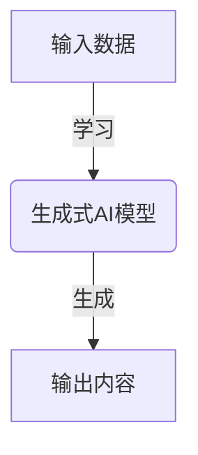
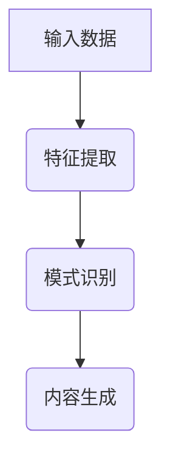
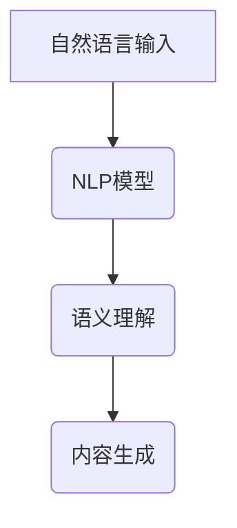
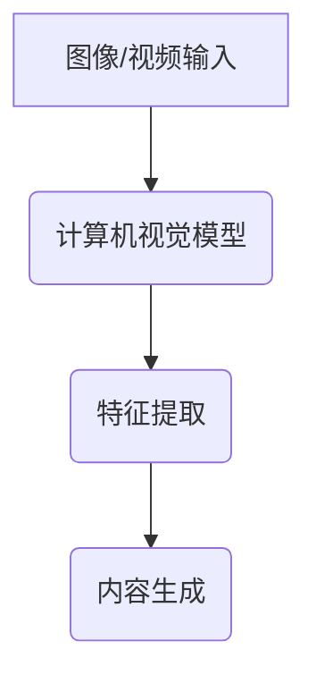
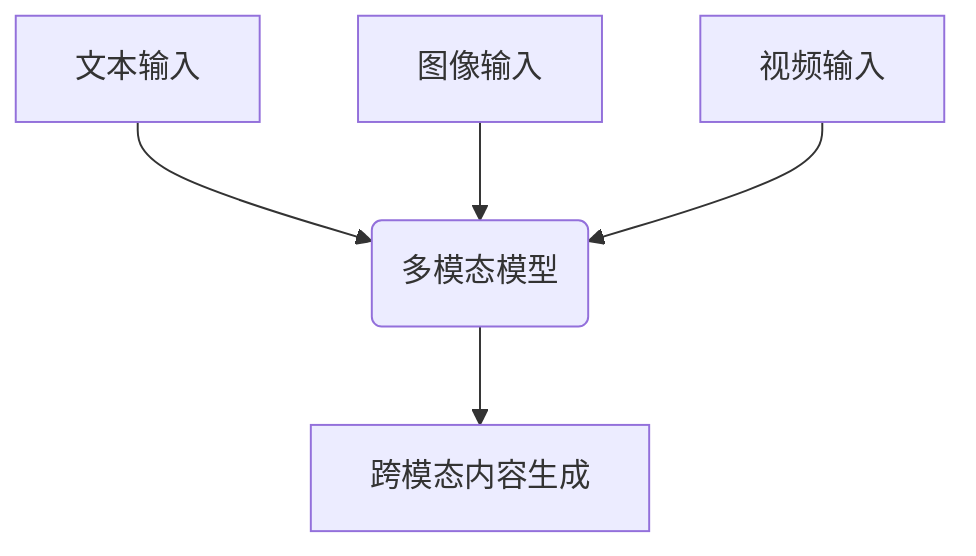
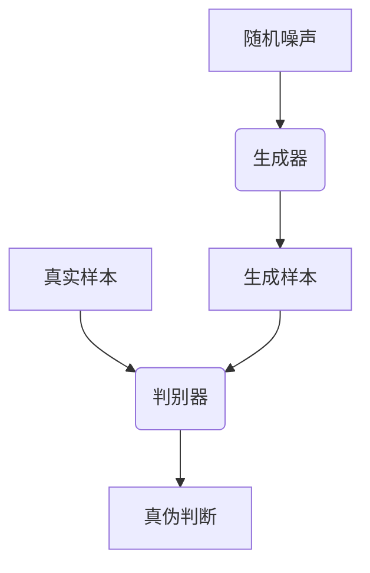
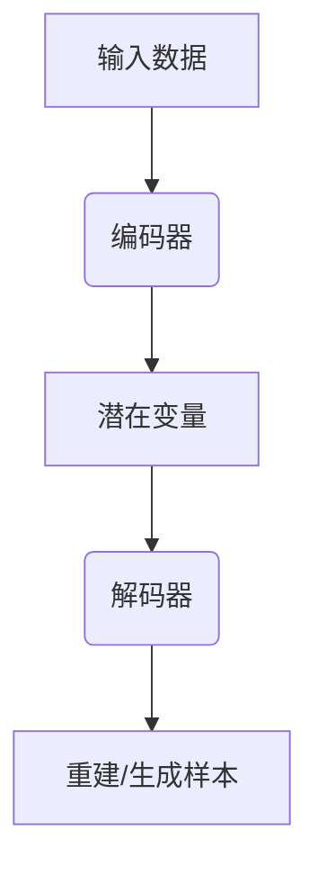
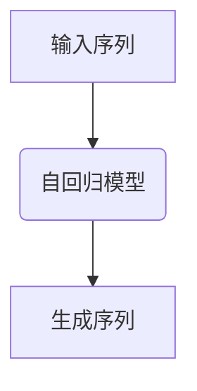

# AIGC 原理与代码实例讲解

## 1. 背景介绍

### 1.1 人工智能的崛起

人工智能(Artificial Intelligence, AI)是当代科技领域最具革命性和颠覆性的技术之一。自20世纪50年代诞生以来,AI不断发展壮大,逐步渗透到我们生活的方方面面。近年来,随着算力的飞速增长、海量数据的积累以及算法的不断创新,AI取得了令人瞩目的进展,尤其是在计算机视觉、自然语言处理、决策控制等领域的突破,推动了智能化应用的蓬勃发展。

### 1.2 人工智能生成内容(AIGC)的兴起

在AI技术的助推下,人工智能生成内容(AI-Generated Content, AIGC)应运而生,成为了AI落地应用的一个重要分支。AIGC技术利用深度学习、自然语言处理等AI算法,可以自动生成文本、图像、视频、音频等多种形式的内容,大大降低了内容创作的门槛和成本。

AIGC技术的兴起,不仅为内容创作者提供了高效的辅助工具,也为企业带来了全新的商业机遇。无论是营销广告、客户服务,还是教育培训、新闻出版等领域,AIGC都展现出了巨大的应用潜力和价值。

### 1.3 AIGC的挑战与机遇

尽管AIGC技术前景广阔,但也面临着诸多挑战,如版权问题、知识产权保护、内容真实性、算法公平性等。此外,AIGC技术的发展也给传统内容创作行业带来了冲击,需要相关从业者进行转型升级。

同时,AIGC技术的不断完善,也将为人类社会带来更多机遇。AIGC有望推动内容创作的民主化,使更多人能够参与到内容创作中来;它还可以帮助克服语言和文化障碍,促进不同群体之间的交流与理解;此外,AIGC还可以为残障人士提供更好的无障碍服务,提高他们的生活质量。

总的来说,AIGC是一把"双刃剑",我们需要积极拥抱它带来的机遇,同时也要高度重视它可能带来的风险,努力构建有利于AIGC健康发展的生态环境。

## 2. 核心概念与联系

### 2.1 生成式人工智能

生成式人工智能(Generative AI)是指能够基于输入数据自主生成新的、原创性的内容或数据的人工智能系统。它是AIGC技术的核心驱动力,与传统的判别式或识别式AI形成鲜明对比。

生成式AI的核心思想是通过学习大量数据,捕捉其中的模式和规律,然后基于这些模式和规律生成新的内容。常见的生成式AI模型包括变分自编码器(VAE)、生成对抗网络(GAN)、自回归模型(如GPT)等。

### 2.2 深度学习

深度学习(Deep Learning)是生成式AI的主要技术基础。它是机器学习的一个分支,主要通过构建深层神经网络模型,对大量数据进行表示学习和特征提取,从而实现对复杂模式的捕捉和内容生成。

常见的深度学习模型包括卷积神经网络(CNN)、递归神经网络(RNN)、长短期记忆网络(LSTM)、注意力机制(Attention)等。这些模型在计算机视觉、自然语言处理等领域发挥着重要作用。

### 2.3 自然语言处理

自然语言处理(Natural Language Processing, NLP)是AIGC中不可或缺的关键技术。它致力于使计算机能够理解和生成人类自然语言,是实现人机交互和内容生成的基础。

常见的NLP任务包括文本分类、机器翻译、文本摘要、问答系统、对话系统等。近年来,基于transformer的大型语言模型(如GPT、BERT)取得了突破性进展,显著提高了NLP系统的性能。

### 2.4 计算机视觉

计算机视觉(Computer Vision)是另一个与AIGC密切相关的技术领域。它旨在使计算机能够从图像或视频中获取有用信息,并进行识别、检测、分割等任务。

在AIGC中,计算机视觉技术可以用于生成图像、视频等视觉内容。常见的模型包括生成对抗网络(GAN)、变分自编码器(VAE)等。此外,计算机视觉还可以与NLP技术相结合,实现图文生成等跨模态任务。

### 2.5 多模态学习

多模态学习(Multimodal Learning)是AIGC的一个重要发展方向。它旨在让AI系统能够同时处理多种形式的数据,如文本、图像、视频、音频等,并捕捉它们之间的关联关系,实现跨模态的内容理解和生成。

多模态学习需要将不同模态的数据进行有效融合,并建立统一的表示空间。常见的模型包括视觉语义模型(ViLBERT)、统一转换器(UniT)等。多模态学习有望推动AIGC技术向更加智能化和通用化的方向发展。

上述这些核心概念相互关联、相辅相成,共同推动了AIGC技术的飞速发展。生成式AI提供了内容生成的总体框架,深度学习为其提供了强大的建模能力,自然语言处理和计算机视觉分别致力于语言内容和视觉内容的生成,而多模态学习则将不同模态的能力进行了有机融合。只有将这些技术紧密结合,AIGC才能充分发挥其巨大潜力。

## 3. 核心算法原理具体操作步骤

在上一节中,我们介绍了AIGC技术的核心概念,本节将进一步剖析其中的核心算法原理和具体操作步骤。

### 3.1 生成对抗网络(GAN)

#### 3.1.1 GAN原理

生成对抗网络(Generative Adversarial Networks, GAN)是一种广泛应用于图像、视频、音频等生成任务的深度学习模型。它由两个神经网络组成:生成器(Generator)和判别器(Discriminator)。

生成器的目标是从随机噪声中生成逼真的数据样本,而判别器则需要判断生成的样本是真实的还是伪造的。两个网络相互对抗,生成器努力生成更加逼真的样本来欺骗判别器,而判别器则努力提高自身的判别能力。通过这种对抗训练,最终可以得到一个能够生成高质量样本的生成器模型。

#### 3.1.2 GAN训练步骤

1. **初始化生成器和判别器模型**,通常使用卷积神经网络或其他深度神经网络结构。
2. **加载训练数据集**,包含大量真实样本。
3. **对判别器进行训练**:
    a. 从训练数据集中采样一批真实样本。
    b. 从随机噪声中采样一批噪声向量,输入生成器生成一批伪造样本。
    c. 将真实样本和伪造样本输入判别器,计算判别器的损失函数。
    d. 根据损失函数,使用优化算法(如梯度下降)更新判别器的参数。
4. **对生成器进行训练**:
    a. 从随机噪声中采样一批噪声向量,输入生成器生成一批伪造样本。
    b. 将伪造样本输入判别器,计算生成器的损失函数(目标是使判别器将伪造样本判断为真实样本)。
    c. 根据损失函数,使用优化算法更新生成器的参数。
5. **重复步骤3和4**,直到模型收敛或达到预设的迭代次数。

通过上述对抗训练过程,生成器和判别器不断提高自身的能力,最终可以得到一个能够生成高质量样本的生成器模型。

### 3.2 变分自编码器(VAE)

#### 3.2.1 VAE原理

变分自编码器(Variational Autoencoder, VAE)是一种常用于生成式建模的深度学习模型。它将输入数据映射到一个连续的潜在空间(latent space),然后从该潜在空间中采样,重建出原始输入数据或生成新的样本。

VAE由两个主要部分组成:编码器(Encoder)和解码器(Decoder)。编码器将输入数据映射到潜在空间的潜在变量,而解码器则从潜在变量重建出原始数据或生成新样本。

#### 3.2.2 VAE训练步骤

1. **初始化编码器和解码器模型**,通常使用深度神经网络结构。
2. **加载训练数据集**,包含大量样本。
3. **对VAE进行训练**:
    a. 从训练数据集中采样一批样本。
    b. 将样本输入编码器,获得潜在变量的均值和方差。
    c. 从编码器输出的均值和方差中采样潜在变量。
    d. 将采样的潜在变量输入解码器,获得重建样本。
    e. 计算重建损失(reconstruction loss),即重建样本与原始样本之间的差异。
    f. 计算KL散度(KL divergence),即编码器输出的潜在变量分布与预设的先验分布(通常为标准正态分布)之间的差异。
    g. 将重建损失和KL散度相加,作为VAE的总损失函数。
    h. 根据总损失函数,使用优化算法(如梯度下降)更新编码器和解码器的参数。
4. **重复步骤3**,直到模型收敛或达到预设的迭代次数。

通过上述训练过程,VAE学习了将输入数据映射到潜在空间的方式,以及从潜在空间重建或生成新样本的能力。在推理阶段,我们可以从潜在空间中采样,并通过解码器生成新的样本。

### 3.3 自回归模型(GPT)

#### 3.3.1 自回归模型原理

自回归模型(Autoregressive Model)是一种常用于自然语言处理任务(如文本生成、机器翻译等)的深度学习模型。它的核心思想是将序列数据(如文本)建模为一个标记的条件概率分布,每个标记的生成都依赖于之前生成的标记序列。

自回归模型通常采用transformer或RNN等序列模型结构,利用注意力机制或递归神经网络捕捉序列数据中的长期依赖关系。在推理阶段,模型根据已生成的标记序列,预测下一个最可能的标记,从而实现自回归生成。

#### 3.3.2 GPT训练步骤

GPT(Generative Pre-trained Transformer)是一种基于transformer的大型自回归语言模型,它的训练过程如下:

1. **初始化transformer模型**,包括编码器(Encoder)和解码器(Decoder)。
2. **加载大规模文本语料库**,作为训练数据集。
3. **对GPT进行预训练**:
    a. 从语料库中采样一批文本序列。
    b. 将文本序列输入transformer编码器,获