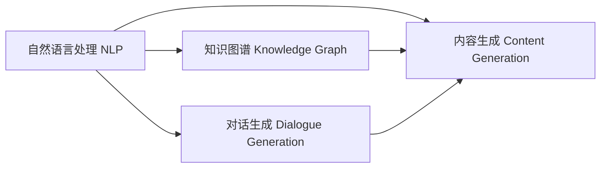

# AIGC从入门到实战：AI 助力市场调研和策划，让营销如虎添翼

## 1. 背景介绍

人工智能生成内容(AIGC)技术的快速发展正在重塑各行各业,尤其是在营销领域掀起了一场革命。传统的市场调研和营销策划工作往往需要投入大量的人力物力,而AIGC技术的出现为这一领域带来了新的突破。通过利用AI的智能分析和内容生成能力,企业可以更高效、更精准地开展市场调研,制定出更具洞察力和创意的营销策略。本文将深入探讨AIGC技术在市场调研和营销策划中的应用,帮助读者掌握这一前沿技术,为企业营销赋能。

### 1.1 AIGC的兴起与发展
#### 1.1.1 AIGC的概念与内涵
#### 1.1.2 AIGC技术的发展历程
#### 1.1.3 AIGC在各领域的应用现状

### 1.2 营销环境的变革
#### 1.2.1 数字化时代的营销挑战
#### 1.2.2 传统营销方式的局限性
#### 1.2.3 AIGC技术带来的机遇

### 1.3 AIGC在市场调研和营销策划中的价值
#### 1.3.1 提升市场调研效率
#### 1.3.2 洞察消费者需求
#### 1.3.3 优化营销内容创意
#### 1.3.4 个性化营销的实现

## 2. 核心概念与联系

要深入理解AIGC在市场调研和营销策划中的应用,需要掌握一些核心概念:

### 2.1 自然语言处理(NLP)
NLP是AIGC的重要基础,它使计算机能够理解、分析和生成人类语言。在市场调研中,NLP可以用于分析消费者评论、社交媒体内容等非结构化数据,挖掘消费者情感和偏好。

### 2.2 知识图谱(Knowledge Graph)
知识图谱是一种结构化的知识库,它描述了实体之间的关系。在营销中,知识图谱可以用于描述产品、用户、场景等要素之间的联系,帮助理解消费者行为和需求。

### 2.3 对话生成(Dialogue Generation) 
对话生成技术可以让AI与用户进行自然流畅的对话交互。在营销中,这一技术可用于开发智能客服、销售助手等应用,提升用户体验。

### 2.4 内容生成(Content Generation)
内容生成是AIGC的核心能力,它可以根据输入的主题、关键词等信息,自动生成文章、脚本、文案等内容。这一技术在营销内容创作中有广泛应用。

以下是这些概念之间关系的Mermaid流程图:



自然语言处理是其他几项技术的基础,知识图谱、对话生成、内容生成都建立在NLP之上,最终目标是生成高质量的内容。理解了这些概念之间的联系,就能更好地把握AIGC技术在营销中的应用。

## 3. 核心算法原理与具体操作步骤

AIGC在市场调研和营销策划中的应用离不开一些核心算法的支持。下面介绍几种常用算法的原理和操作步骤:

### 3.1 主题模型(Topic Model)
主题模型是一种无监督学习算法,可以从大规模文本数据中发现隐藏的主题结构。常见的主题模型有潜在狄利克雷分布(LDA)、非负矩阵分解(NMF)等。

#### 3.1.1 LDA的原理
LDA假设每个文档是由多个主题组成的,每个主题又是由多个单词组成的。通过分析文档-主题和主题-单词的分布,LDA可以发现文本集合中的主题结构。

#### 3.1.2 LDA的操作步骤
1. 对文本数据进行预处理,如分词、去停用词等
2. 设定主题数K,迭代次数N等超参数 
3. 随机初始化文档-主题和主题-单词分布
4. 重复以下步骤N次:
   - 对每个文档的每个单词,根据当前的主题-单词分布,重新采样其主题
   - 对每个主题,根据当前的文档-主题分布,更新主题-单词分布
5. 输出最终的文档-主题和主题-单词分布

### 3.2 情感分析(Sentiment Analysis)
情感分析是一种判断文本情感倾向(积极、消极、中性)的算法,常用于分析用户评论、社交媒体内容等。

#### 3.2.1 基于词典的情感分析
这种方法需要预先构建一个情感词词典,然后根据文本中出现的情感词来判断其情感倾向。

1. 构建情感词词典,标注每个词的情感得分(正值表示积极,负值表示消极)
2. 对文本进行分词
3. 统计文本中每个情感词的得分,累加得到文本的总体情感得分
4. 根据情感得分的正负和大小,判断文本的情感倾向

#### 3.2.2 基于机器学习的情感分析
这种方法将情感分析看作一个文本分类问题,通过训练有标注数据来建立分类器。

1. 收集并标注训练数据,如1000条正面评论和1000条负面评论
2. 对文本进行特征提取,常用的特征有:
   - 词袋(Bag-of-words):文本中每个词的出现次数
   - TF-IDF:词频-逆文档频率,反映一个词对文本的重要程度
   - 词嵌入(Word Embedding):将词映射为稠密向量,如Word2Vec
3. 选择一个分类算法,如朴素贝叶斯、支持向量机、神经网络等
4. 训练分类器,调整超参数以达到最佳性能
5. 使用训练好的分类器预测新文本的情感倾向

### 3.3 文本生成(Text Generation)
文本生成算法可以根据输入的上文,自动生成下文内容。近年来,以Transformer为代表的预训练语言模型在文本生成任务上取得了突破性进展。

#### 3.3.1 Transformer的原理
Transformer是一种基于自注意力机制(Self-attention)的神经网络结构。它抛弃了传统的RNN/CNN结构,通过Self-attention计算序列中任意两个位置之间的依赖关系,从而更好地捕捉长距离依赖。

#### 3.3.2 GPT的原理和训练过程
GPT(Generative Pre-trained Transformer)是基于Transformer的语言模型,通过预训练和微调两个阶段来完成文本生成任务。

预训练阶段:
1. 收集大规模无标注文本数据,如维基百科、新闻等
2. 将文本数据进行tokenize,转换为模型可以处理的数字序列
3. 按照一定的概率对数据进行mask,随机遮盖一些token
4. 使用Transformer结构对数据进行建模,通过最小化被mask位置的预测误差来学习语言的统计规律

微调阶段:
1. 在下游任务的有标注数据上,通过添加额外的输出层,将预训练模型微调为具体任务的模型
2. 输入文本前缀,使用微调后的模型生成后续内容

通过预训练学习语言的一般规律,再通过微调适应具体任务,GPT在文本生成、对话、问答等任务上都取得了很好的效果。

## 4. 数学模型和公式详细讲解举例说明

在AIGC的实际应用中,一些数学模型和公式发挥着重要作用。下面以TF-IDF、Word2Vec、Transformer中的Self-attention为例,详细讲解其数学原理。

### 4.1 TF-IDF
TF-IDF(Term Frequency-Inverse Document Frequency)用于评估一个词对于一个文档集或一个语料库中的其中一份文档的重要程度。

TF(词频)表示词条在文档d中出现的频率:

$$
TF(t,d) = \frac{f_{t,d}}{\sum_{t'\in d} f_{t',d}}
$$

其中,$f_{t,d}$是词条t在文档d中出现的次数,$\sum_{t'\in d} f_{t',d}$是文档d中所有词条的出现次数之和。

IDF(逆文档频率)表示词条t在整个文档集D中的重要程度:

$$
IDF(t,D) = \log \frac{|D|}{|\{d\in D:t\in d\}|}
$$

其中,$|D|$是文档集D中文档的总数,$|\{d\in D:t\in d\}|$是包含词条t的文档数。

TF-IDF就是将TF和IDF相乘得到:

$$
TFIDF(t,d,D) = TF(t,d) \times IDF(t,D)
$$

直观地理解,TF-IDF体现了一个词在一篇文档中出现的频繁程度,以及该词在整个语料库中的独特程度。如果一个词在一篇文档中多次出现,但在其他文档中很少出现,那么它的TF-IDF值就会很高,表明这个词对这篇文档而言很重要。

举例来说,假设我们有两篇文档:
- 文档1:"AIGC is a hot topic in AI field. Many companies are investing in AIGC."
- 文档2:"AIGC brings new opportunities and challenges to digital marketing."

对于词"AIGC",它在两篇文档中都出现了2次,因此TF值相同。但是"digital"这个词只在文档2中出现,因此它的IDF值更高。通过计算可以得到:

```
TF("AIGC", 文档1) = 2/14 = 0.143
TF("AIGC", 文档2) = 2/12 = 0.167
IDF("AIGC") = log(2/2) = 0
IDF("digital") = log(2/1) = 0.301

TFIDF("AIGC", 文档1) = 0.143 * 0 = 0 
TFIDF("AIGC", 文档2) = 0.167 * 0 = 0
TFIDF("digital", 文档2) = 0.083 * 0.301 = 0.025
```

可以看出,"digital"这个词对文档2的重要性更高。TF-IDF常用于文本挖掘、信息检索等领域,为文本表示提供了一种简单有效的方法。

### 4.2 Word2Vec
Word2Vec是一种将词转换为稠密向量表示的算法,通过词向量可以刻画词与词之间的语义关系。Word2Vec包含两个经典模型:CBOW(Continuous Bag-of-Words)和Skip-gram。

#### 4.2.1 CBOW模型
CBOW模型根据一个词的上下文来预测这个词本身。假设词w的上下文窗口大小为c,上下文词向量为$v(Context(w))$,模型参数为$\theta$,CBOW的优化目标是最大化如下条件概率:

$$
L(\theta) = \prod_{w\in C} P(w|Context(w);\theta) 
$$

其中,$P(w|Context(w);\theta)$表示在给定上下文$Context(w)$的条件下,生成词w的概率,通常使用Softmax函数建模:

$$
P(w|Context(w);\theta) = \frac{e^{v_w^T v(Context(w))}}{\sum_{w'\in V} e^{v_{w'}^T v(Context(w))}}
$$

其中,$v_w$是词w的输出向量,$V$是词表。

在实际训练中,由于Softmax的分母需要遍历词表中的所有词,计算代价很高,因此常用负采样(Negative Sampling)等方法进行近似。

#### 4.2.2 Skip-gram模型 
Skip-gram模型与CBOW相反,它根据一个词来预测其上下文。Skip-gram的优化目标是最大化如下条件概率:

$$
L(\theta) = \prod_{w\in C} \prod_{u\in Context(w)} P(u|w;\theta)
$$

其中,$P(u|w;\theta)$表示在给定词w的条件下,生成其上下文词u的概率,同样地,可以用Softmax函数建模:

$$
P(u|w;\theta) = \frac{e^{v_u^T v_w}}{\sum_{u'\in V} e^{v_{u'}^T v_w}}
$$

Skip-gram模型也面临着Softmax计算代价高的问题,同样可以用负采样等方法加速训练。

举例来说,假设我们有一