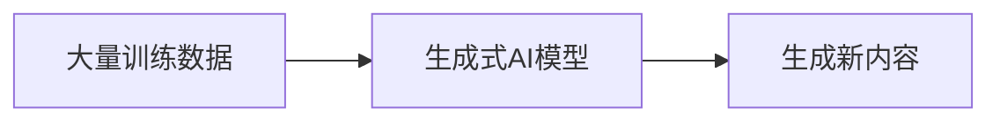
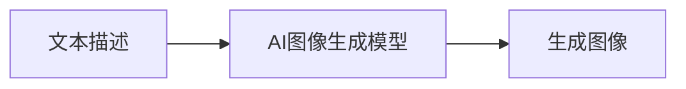
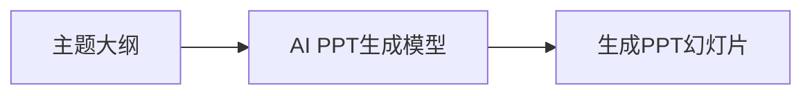

# AIGC从入门到实战：AI 辅助设计：基于 AI 生成图像和 PPT 的创意设计

## 1. 背景介绍

### 1.1 人工智能时代的到来

近年来,人工智能(AI)技术取得了长足的进步,尤其是在图像生成和自然语言处理等领域。随着大型语言模型(LLM)和生成式人工智能(Generative AI)的兴起,AI 已经渗透到我们生活和工作的方方面面。AIGC(AI Generated Content,AI生成内容)正在改变内容创作的游戏规则,为创意设计领域带来了新的机遇和挑战。

### 1.2 创意设计中的 AI 应用

在创意设计领域,AI 可以帮助设计师提高效率、激发灵感并探索新的创意路径。AI 生成图像和 PPT 等功能使设计师能够快速创建出色的视觉内容,从而将更多精力集中在概念设计和艺术表达上。同时,AI 也为设计师提供了新的工具和技能,使他们能够更好地满足不断变化的客户需求。

## 2. 核心概念与联系

### 2.1 生成式人工智能(Generative AI)

生成式人工智能是指能够生成新内容(如文本、图像、音频等)的人工智能系统。它通过学习大量现有数据,捕捉其中的模式和规律,然后基于这些知识生成新的、前所未有的内容。常见的生成式AI模型包括GPT-3、DALL-E、Stable Diffusion等。



### 2.2 AI 生成图像

AI 生成图像是指使用人工智能算法从文本描述或其他输入中生成图像。主要技术包括生成对抗网络(GAN)、扩散模型(Diffusion Model)等。这些模型能够捕捉图像中的细节和语义信息,并基于输入生成逼真、高质量的图像。



### 2.3 AI 生成 PPT

AI 生成 PPT 是指使用人工智能算法根据输入的主题、大纲等自动生成 PPT 幻灯片。这种技术可以节省大量的时间和精力,同时确保生成的 PPT 具有专业的设计和布局。常见的 AI 生成 PPT 工具包括 Tome、Gamma 等。



## 3. 核心算法原理具体操作步骤

### 3.1 生成对抗网络(GAN)

生成对抗网络(Generative Adversarial Networks, GAN)是一种用于生成式建模的深度学习架构。它由两个神经网络组成:生成器(Generator)和判别器(Discriminator)。生成器从随机噪声中生成假的数据样本,而判别器则试图区分真实数据和生成器生成的假数据。通过这种对抗训练过程,生成器逐渐学会生成更加逼真的数据。

GAN 在图像生成领域有着广泛的应用。以 AI 生成图像为例,其核心步骤如下:

1. **数据预处理**:收集和准备大量高质量的图像数据集,进行标注、增强和清洗等预处理。
2. **模型构建**:构建生成器和判别器网络,通常使用卷积神经网络(CNN)。
3. **模型训练**:生成器从随机噪声中生成假图像,判别器判断图像是真是假。两个网络相互对抗,逐步提高生成图像的质量。
4. **模型优化**:通过调整网络架构、超参数和训练策略等方式,不断优化模型性能。
5. **图像生成**:训练完成后,输入文本描述或其他条件,生成器即可生成对应的图像。

### 3.2 扩散模型(Diffusion Model)

扩散模型是一种新兴的生成式深度学习模型,近年来在图像、音频和视频生成等领域取得了卓越的成绩。它通过学习数据的噪声分布,逐步去噪并生成高质量的样本。主要分为两个过程:

1. **正向扩散过程**:将干净的数据添加高斯噪声,逐步破坏数据的结构和细节。
2. **反向采样过程**:从纯噪声开始,通过学习的反向过程模型,逐步去除噪声,最终生成干净的数据样本。

以稳定扩散(Stable Diffusion)为例,AI 生成图像的核心步骤如下:

1. **数据准备**:收集和准备高质量的图像数据集。
2. **正向扩散**:将图像数据添加高斯噪声,生成噪声图像序列。
3. **模型训练**:使用噪声图像序列训练扩散模型,学习从噪声到干净图像的反向过程。
4. **条件输入**:在生成过程中,输入文本描述或其他条件作为引导。
5. **反向采样**:从纯噪声开始,通过训练好的扩散模型,逐步去除噪声,生成条件图像。

### 3.3 AI 生成 PPT 流程

AI 生成 PPT 的核心步骤通常包括:

1. **输入处理**:接收用户输入的主题、大纲等,进行自然语言处理和语义理解。
2. **内容生成**:根据输入,生成 PPT 的文本内容,包括标题、正文、关键点等。
3. **布局设计**:确定每张幻灯片的布局,如标题位置、正文区域、图表位置等。
4. **视觉元素生成**:根据内容,生成相应的图像、图表、图标等视觉元素。
5. **幻灯片组装**:将文本内容和视觉元素组装到幻灯片模板中,形成完整的 PPT。
6. **样式优化**:根据设计原则,优化 PPT 的色彩、字体、过渡效果等样式。
7. **输出 PPT**:将生成的 PPT 导出为标准格式(如.pptx)供用户使用。

该过程涉及自然语言处理、计算机视觉、布局设计等多个AI技术,需要模型之间的协同工作。

## 4. 数学模型和公式详细讲解举例说明

### 4.1 生成对抗网络(GAN)数学模型

生成对抗网络由生成器 $G$ 和判别器 $D$ 两个网络组成,它们相互对抗以达到纳什均衡。生成器 $G$ 将噪声 $z$ 映射为样本 $G(z)$,旨在使生成的样本 $G(z)$ 尽可能接近真实数据分布 $p_{data}(x)$。判别器 $D$ 则试图区分生成的样本 $G(z)$ 和真实样本 $x$。可以将 GAN 建模为一个两人零和博弈,目标函数为:

$$\min_{G}\max_{D}V(D,G)=\mathbb{E}_{x\sim p_{data}(x)}[\log D(x)]+\mathbb{E}_{z\sim p_{z}(z)}[\log(1-D(G(z)))]$$

其中,第一项是判别器对真实样本的期望输出,第二项是判别器对生成样本的期望输出。生成器和判别器相互对抗,最终达到纳什均衡,此时生成的样本分布 $p_g$ 等于真实数据分布 $p_{data}$。

### 4.2 扩散模型(Diffusion Model)数学模型

扩散模型通过学习从噪声到数据的反向过程来生成样本。设 $x_0$ 为原始数据, $x_T$ 为纯噪声,正向扩散过程可表示为:

$$q(x_t|x_{t-1})=\mathcal{N}(x_t;\sqrt{1-\beta_t}x_{t-1},\beta_tI)$$

其中 $\beta_t$ 是方差系数,控制每一步添加的噪声量。反向过程则是从噪声 $x_T$ 开始,逐步去除噪声,生成 $x_0$:

$$p_\theta(x_{t-1}|x_t)=\mathcal{N}(x_{t-1};\mu_\theta(x_t,t),\Sigma_\theta(x_t,t))$$

模型需要学习均值 $\mu_\theta$ 和方差 $\Sigma_\theta$,使得反向过程能够恢复原始数据 $x_0$。通过最小化如下损失函数训练模型:

$$\mathcal{L}_\theta=\mathbb{E}_{q(x_T,\cdots,x_1,x_0)}\Big[\sum_{t=1}^T\|x_t-\mu_\theta(x_{t-1},t)\|^2\Big]$$

训练完成后,模型可以从噪声 $x_T$ 开始,通过反向过程生成所需的样本 $x_0$。

## 5. 项目实践:代码实例和详细解释说明

以下是使用 PyTorch 实现一个简单的 GAN 模型生成手写数字图像的代码示例,并对关键步骤进行了详细注释说明。

```python
import torch
import torch.nn as nn
import torchvision.datasets as dsets
import torchvision.transforms as transforms

# 超参数设置
batch_size = 128
lr = 0.0002
image_size = 28 * 28
hidden_size = 256
noise_size = 100
num_epochs = 20

# MNIST 数据集准备
mnist = dsets.MNIST(root='./data', train=True, download=True, transform=transforms.Compose([
    transforms.ToTensor(),
    transforms.Normalize((0.5,), (0.5,))
]))
data_loader = torch.utils.data.DataLoader(dataset=mnist, batch_size=batch_size, shuffle=True)

# 判别器模型
class Discriminator(nn.Module):
    def __init__(self):
        super(Discriminator, self).__init__()
        self.model = nn.Sequential(
            nn.Linear(image_size, hidden_size),
            nn.LeakyReLU(0.2),
            nn.Linear(hidden_size, hidden_size * 2),
            nn.LeakyReLU(0.2),
            nn.Linear(hidden_size * 2, 1),
            nn.Sigmoid()
        )

    def forward(self, x):
        x = x.view(-1, image_size)
        output = self.model(x)
        return output

# 生成器模型
class Generator(nn.Module):
    def __init__(self):
        super(Generator, self).__init__()
        self.model = nn.Sequential(
            nn.Linear(noise_size, hidden_size * 2),
            nn.ReLU(),
            nn.Linear(hidden_size * 2, hidden_size * 4),
            nn.ReLU(),
            nn.Linear(hidden_size * 4, image_size),
            nn.Tanh()
        )

    def forward(self, x):
        output = self.model(x)
        return output

# 初始化模型
discriminator = Discriminator()
generator = Generator()

# 损失函数和优化器
criterion = nn.BCELoss()
d_optimizer = torch.optim.Adam(discriminator.parameters(), lr=lr)
g_optimizer = torch.optim.Adam(generator.parameters(), lr=lr)

# 训练循环
for epoch in range(num_epochs):
    for i, (images, _) in enumerate(data_loader):
        
        # 训练判别器
        real_labels = torch.ones(batch_size, 1)
        fake_labels = torch.zeros(batch_size, 1)
        
        outputs = discriminator(images.reshape(batch_size, -1))
        d_loss_real = criterion(outputs, real_labels)
        
        noise = torch.randn(batch_size, noise_size)
        fake_images = generator(noise)
        outputs = discriminator(fake_images)
        d_loss_fake = criterion(outputs, fake_labels)
        
        d_loss = d_loss_real + d_loss_fake
        discriminator.zero_grad()
        d_loss.backward()
        d_optimizer.step()
        
        # 训练生成器
        noise = torch.randn(batch_size, noise_size)
        fake_images = generator(noise)
        outputs = discriminator(fake_images)
        g_loss = criterion(outputs, real_labels)
        
        generator.zero_grad()
        g_loss.backward()
        g_optimizer.step()
        
    print(f'Epoch [{epoch+1}/{num_epochs}], d_loss: {d_loss.item():.4f}, g_loss: {g_loss.item():.4f}')
    
# 保存模型
torch.save(generator.state_dict(), 'generator.pth')
torch.save(discriminator.state_dict(), 'discriminator.pth')
```

上述代码实现了一个基本的 GAN 模型,用于生成手写数字图像。主要步骤包括:

1. 导入必要的库和定义超参数。
2. 准备 MNIST 手写数字数据集。
3