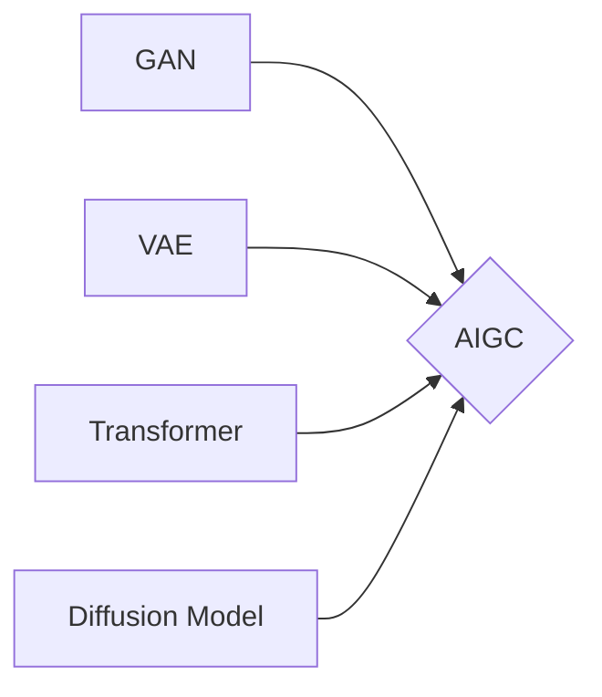

# AIGC从入门到实战：AIGC 小知识

## 1. 背景介绍
### 1.1 AIGC的兴起
近年来,人工智能生成内容(AIGC)技术快速发展,在文本、图像、音频、视频等领域取得了突破性进展。AIGC利用机器学习算法,特别是生成式对抗网络(GAN)和变分自编码器(VAE)等模型,可以生成逼真的合成内容。这为内容创作、游戏开发、虚拟现实等行业带来了革命性变化。

### 1.2 AIGC的应用前景
AIGC有望在多个领域发挥重要作用:
- 数字内容创作:自动生成文章、小说、剧本、音乐、绘画等,提高内容生产效率
- 游戏和电影:自动生成游戏关卡、电影特效、虚拟角色,丰富视觉体验
- 虚拟现实:构建逼真的虚拟场景和人物,打造沉浸式VR体验
- 数字营销:个性化推荐、智能客服、广告创意生成等,提升用户体验

### 1.3 AIGC面临的挑战
尽管AIGC前景广阔,但仍面临一些挑战:
- 生成内容的一致性和连贯性有待提高
- 对抗样本和隐私安全问题需要重视
- 版权归属、内容审核等伦理和法律问题亟待解决
- 缺乏大规模高质量的训练数据

## 2. 核心概念与联系
### 2.1 生成式对抗网络(GAN)
GAN由生成器和判别器组成,通过二者的博弈学习,生成器不断提升生成内容的真实性,判别器不断提高辨别能力,最终使生成内容难以与真实内容区分。GAN常用于图像、视频、音频等连续数据的生成任务。

### 2.2 变分自编码器(VAE) 
VAE通过编码器将输入数据映射到隐空间,再通过解码器从隐空间采样生成输出,其目标是最小化重构误差和隐变量的KL散度。VAE更适合文本、属性等离散数据的生成。

### 2.3 Transformer
Transformer是一种基于自注意力机制的序列建模架构,擅长捕捉长距离依赖。GPT、BERT等大语言模型都基于Transformer,为AIGC的文本生成任务提供了强大的语言理解和生成能力。

### 2.4 扩散模型 
扩散模型通过迭代的噪声扰动和去噪过程来生成数据,其思想源自非平衡热力学。扩散模型在图像、音频领域表现出众,代表模型有DDPM、DALL-E等。

以下是这些概念之间的联系:


## 3. 核心算法原理与操作步骤
### 3.1 GAN的训练过程
1. 随机初始化生成器G和判别器D的参数
2. 固定G,训练D使其最大化判别真实数据和生成数据的概率差异
3. 固定D,训练G使其生成的数据能够欺骗D
4. 交替进行步骤2和3,直到G和D达到纳什均衡,生成数据分布接近真实数据分布

### 3.2 VAE的训练过程
1. 将输入数据x通过编码器映射到隐空间,得到均值和方差
2. 从隐空间采样隐变量z
3. 将z通过解码器映射为输出数据x'
4. 最小化x和x'的重构误差以及隐变量z与标准正态分布的KL散度
5. 反向传播,更新VAE的参数

### 3.3 Transformer的核心原理
1. 输入序列通过词嵌入和位置编码相加,得到输入表示
2. 多头自注意力机制计算序列各位置之间的相关性,捕捉长距离依赖
3. 前馈神经网络对自注意力的输出进行非线性变换
4. 残差连接和层归一化有助于梯度传播和模型收敛
5. 解码器根据编码器的输出和已生成序列自回归地预测下一个token

### 3.4 扩散模型的生成步骤
1. 给定噪声图像x_T,T为扩散步数
2. for t=T to 1: 
    - 根据x_t预测噪声,得到去噪后的图像表示 
    - 根据x_t和噪声预测值,通过朗之万动力学采样得到x_{t-1}
3. 解码x_0得到最终生成图像

## 4. 数学模型与公式详解
### 4.1 GAN的目标函数
GAN的训练目标是求解以下极小极大博弈问题:
$$\min_G \max_D V(D,G) = \mathbb{E}_{x \sim p_{data}(x)}[\log D(x)] + \mathbb{E}_{z \sim p_z(z)}[\log (1-D(G(z)))]$$
其中,$p_{data}$为真实数据分布,$p_z$为随机噪声分布,$D(x)$为判别器输出真实数据的概率,$G(z)$为生成器将噪声$z$映射为生成数据。

### 4.2 VAE的损失函数
VAE的损失函数由重构误差和KL散度两部分组成:
$$L(\theta, \phi) = -\mathbb{E}_{z \sim q_\phi(z|x)}[\log p_\theta(x|z)] + D_{KL}(q_\phi(z|x) \| p(z))$$
其中,$\theta$和$\phi$分别为解码器和编码器的参数,$q_\phi(z|x)$为编码器将$x$映射到隐变量$z$的后验分布,$p_\theta(x|z)$为解码器根据$z$重构$x$的似然概率,$p(z)$为隐变量的先验分布,通常假设为标准正态分布。

### 4.3 Transformer的自注意力计算
自注意力通过查询向量$Q$、键向量$K$、值向量$V$计算序列各位置之间的相关性:
$$Attention(Q,K,V) = softmax(\frac{QK^T}{\sqrt{d_k}})V$$
其中,$Q$、$K$、$V$分别由输入序列$X$乘以参数矩阵$W^Q$、$W^K$、$W^V$得到,$d_k$为$K$的维度。多头自注意力通过并行计算多个头的注意力并拼接,增强模型的表达能力。

### 4.4 扩散模型的前向和反向过程
扩散模型的前向过程将数据$x_0$逐步添加高斯噪声,得到一系列噪声数据$x_1, \dots, x_T$:
$$q(x_t|x_{t-1}) = \mathcal{N}(x_t; \sqrt{1-\beta_t} x_{t-1}, \beta_t \mathbf{I})$$
其中,$\beta_t$为噪声强度超参数。

反向过程通过估计噪声来逐步去噪,从$x_T$恢复$x_0$:
$$p_\theta(x_{t-1}|x_t) = \mathcal{N}(x_{t-1}; \mu_\theta(x_t, t), \Sigma_\theta(x_t, t))$$
其中,$\mu_\theta$和$\Sigma_\theta$为神经网络预测的均值和方差。

## 5. 项目实践
### 5.1 基于GAN生成动漫头像
利用GAN可以生成风格多样、形象鲜明的动漫头像。下面是基于PyTorch实现的DCGAN示例代码:
```python
class Generator(nn.Module):
    def __init__(self):
        super(Generator, self).__init__()
        self.main = nn.Sequential(
            nn.ConvTranspose2d(100, 64*8, 4, 1, 0, bias=False),
            nn.BatchNorm2d(64*8),
            nn.ReLU(True),
            nn.ConvTranspose2d(64*8, 64*4, 4, 2, 1, bias=False),
            nn.BatchNorm2d(64*4),
            nn.ReLU(True),
            nn.ConvTranspose2d(64*4, 64*2, 4, 2, 1, bias=False),
            nn.BatchNorm2d(64*2),
            nn.ReLU(True),
            nn.ConvTranspose2d(64*2, 64, 4, 2, 1, bias=False),
            nn.BatchNorm2d(64),
            nn.ReLU(True),
            nn.ConvTranspose2d(64, 3, 4, 2, 1, bias=False),
            nn.Tanh()
        )

    def forward(self, x):
        return self.main(x)

class Discriminator(nn.Module):
    def __init__(self):
        super(Discriminator, self).__init__()
        self.main = nn.Sequential(
            nn.Conv2d(3, 64, 4, 2, 1, bias=False),
            nn.LeakyReLU(0.2, inplace=True),
            nn.Conv2d(64, 64*2, 4, 2, 1, bias=False),
            nn.BatchNorm2d(64*2),
            nn.LeakyReLU(0.2, inplace=True),
            nn.Conv2d(64*2, 64*4, 4, 2, 1, bias=False),
            nn.BatchNorm2d(64*4),
            nn.LeakyReLU(0.2, inplace=True),
            nn.Conv2d(64*4, 64*8, 4, 2, 1, bias=False),
            nn.BatchNorm2d(64*8),
            nn.LeakyReLU(0.2, inplace=True),
            nn.Conv2d(64*8, 1, 4, 1, 0, bias=False),
            nn.Sigmoid()
        )

    def forward(self, x):
        return self.main(x)
```
生成器通过转置卷积将随机噪声逐步上采样为64x64的RGB图像,判别器通过卷积层提取特征并预测真假概率。训练时交替优化二者,最终生成高质量的动漫头像。

### 5.2 基于VAE生成文本
利用VAE可以从隐空间采样生成多样化的文本。下面是基于TensorFlow实现的文本VAE示例代码:
```python
class Encoder(tf.keras.Model):
    def __init__(self, latent_dim):
        super(Encoder, self).__init__()
        self.embedding = tf.keras.layers.Embedding(vocab_size, embedding_dim)
        self.rnn = tf.keras.layers.LSTM(hidden_dim)
        self.dense_mean = tf.keras.layers.Dense(latent_dim)
        self.dense_log_var = tf.keras.layers.Dense(latent_dim)
    
    def call(self, x):
        x = self.embedding(x)
        _, state_h, _ = self.rnn(x) 
        mean = self.dense_mean(state_h)
        log_var = self.dense_log_var(state_h)
        return mean, log_var

class Decoder(tf.keras.Model):
    def __init__(self):
        super(Decoder, self).__init__()
        self.embedding = tf.keras.layers.Embedding(vocab_size, embedding_dim)
        self.rnn = tf.keras.layers.LSTM(hidden_dim, return_sequences=True)
        self.dense = tf.keras.layers.Dense(vocab_size)

    def call(self, x, state_h, state_c):
        x = self.embedding(x)
        x, (state_h, state_c) = self.rnn(x, initial_state=[state_h, state_c])
        logits = self.dense(x)
        return logits, state_h, state_c
```
编码器通过词嵌入和LSTM将文本序列编码为隐变量的均值和对数方差,解码器根据采样的隐变量和之前生成的token自回归地预测下一个token的概率分布。训练时最小化重构误差和KL散度,生成时从先验分布采样隐变量并解码。

### 5.3 基于Stable Diffusion生成图像
Stable Diffusion是一个功能强大的文图生成扩散模型,支持根据文本描述生成高质量图像。可以通过HuggingFace的diffusers库轻松使用:
```python
from diffusers import StableDiffusionPipeline

model_id = "CompVis/stable-diffusion-v1-4"
pipe = StableDiffusionPipeline.from_pretrained(model_id)

prompt = "a photo of an astronaut riding a horse on mars"
image = pipe(prompt).images[0]  
image.save("astronaut_rides_horse.png")
```
只需输入文本描述,预训练的Stable Diffusion模型即可生成匹配的图像。通过调节guidance scale、num_inference_steps等参数可以控制生成图像的质量和多样性。Stable Diffusion在艺术创作、设计生成等领域有广泛应用前景。

## 6. 实际应用场景
### 6.1 游戏场景自动生成
在游戏开发中,利用AIGC可以自动生成海量