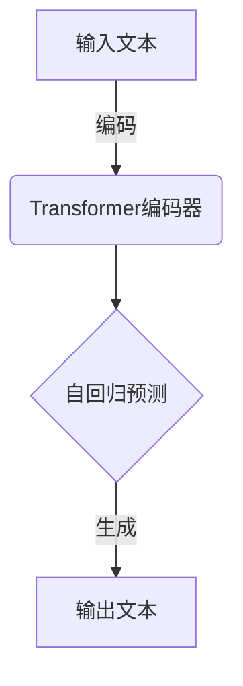
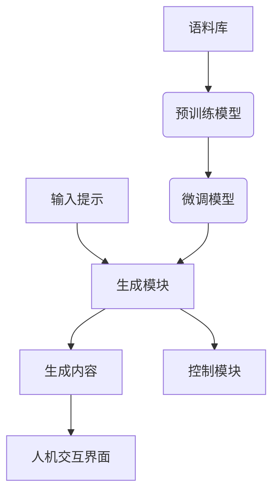
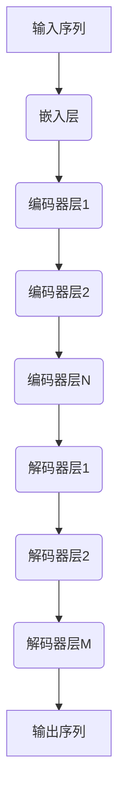
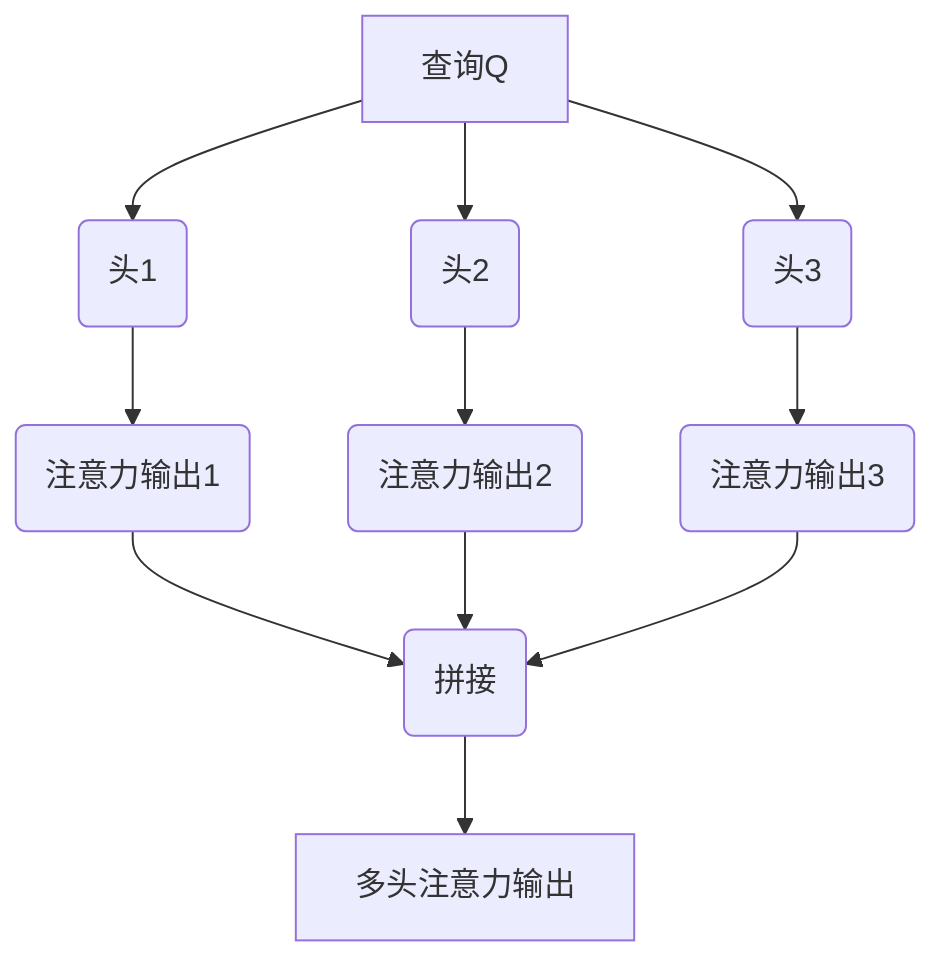
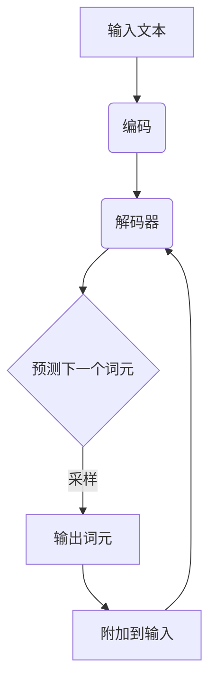

# AIGC从入门到实战：ChatGPT 仅仅是个聊天机器人？

## 1. 背景介绍

### 1.1 人工智能的发展历程

人工智能(Artificial Intelligence, AI)是一个令人兴奋且不断发展的领域,旨在创造出能够模仿人类智能行为的智能系统。自20世纪50年代AI概念被正式提出以来,这一领域经历了几个重要的发展阶段。

#### 1.1.1 早期发展阶段

在20世纪50年代至70年代,AI研究主要集中在基于规则和逻辑的系统上,如专家系统和博弈程序。这一时期的代表性成就包括深蓝(DeepBlue)国际象棋程序和NASA的规划和调度系统。

#### 1.1.2 知识库和神经网络阶段

80年代至90年代,AI研究开始关注知识库和神经网络。知识库系统旨在存储和推理大量结构化知识,而神经网络则模仿生物神经系统的工作方式进行学习和推理。这一时期出现了一些早期的自然语言处理和模式识别应用。

#### 1.1.3 大数据和深度学习时代

21世纪初,随着计算能力的飞速提升和大数据的出现,深度学习(Deep Learning)技术开始引领AI的新浪潮。深度神经网络能够从海量数据中自主学习特征模式,在计算机视觉、自然语言处理、语音识别等领域取得了突破性进展。

### 1.2 AIGC(AI生成内容)的兴起

在深度学习的推动下,AI生成内容(AI-Generated Content, AIGC)技术应运而生。AIGC系统能够基于训练数据,生成看似人类创作的文字、图像、音频和视频内容。其中,以GPT(Generative Pre-trained Transformer)语言模型为代表的文本生成技术备受关注。

ChatGPT就是一款基于GPT语言模型的AIGC系统,由OpenAI公司于2022年11月推出,它能够通过对话方式生成高质量、多样化的文本内容,在短时间内引发了广泛关注和讨论。

## 2. 核心概念与联系

### 2.1 GPT语言模型

GPT(Generative Pre-trained Transformer)是一种基于Transformer架构的大型语言模型,由OpenAI公司开发。它通过在大规模文本语料库上进行预训练,学习文本数据中蕴含的语义和上下文信息,从而获得生成自然语言的能力。

GPT模型的核心思想是"自回归"(Autoregressive),即根据给定的文本前缀,预测下一个最可能出现的词元(token)。在预测时,模型会考虑上下文信息,生成与上下文语义相符的连贯文本。

GPT模型通过不断扩大模型规模(参数量)和训练数据集,其生成能力不断提高。GPT-3是目前最大的语言模型,拥有1750亿个参数,展现出令人惊叹的文本生成水平。

### 2.2 AIGC系统架构

一个典型的AIGC系统架构包括以下几个关键部分:

1. **语料库**:海量的高质量文本数据集,用于模型训练。
2. **预训练模型**:通过自监督学习方式在语料库上训练得到的大型语言模型,如GPT。
3. **微调模型**:针对特定任务(如对话、文本生成等),在预训练模型的基础上进行进一步微调得到的专用模型。
4. **生成模块**:基于微调模型,通过输入文本前缀(或提示)生成目标输出内容。
5. **控制模块**:控制生成内容的属性(如长度、风格等)并过滤不当内容。
6. **人机交互界面**:为用户提供输入和查看生成内容的界面。

ChatGPT系统整合了以上各个模块,使用GPT-3.5作为基础模型,并通过对话数据进行额外微调,从而获得较强的对话生成能力。

## 3. 核心算法原理具体操作步骤

### 3.1 Transformer架构

Transformer是GPT等语言模型的核心架构,由Google在2017年提出,用于解决序列到序列(Sequence-to-Sequence)的转换任务。它完全基于注意力(Attention)机制,摒弃了传统的RNN和CNN结构。

Transformer的主要组件包括:

1. **嵌入层(Embedding Layer)**: 将输入词元映射为向量表示。
2. **编码器(Encoder)**: 由多个相同的编码器层堆叠而成,每层包含多头注意力(Multi-Head Attention)和前馈神经网络(Feed-Forward Network)。编码器捕获输入序列的上下文信息。
3. **解码器(Decoder)**: 与编码器类似,但在注意力机制中还引入了对编码器输出的注意力,用于生成目标序列。

#### 3.1.1 注意力机制

注意力机制是Transformer的核心,它允许模型在生成每个词元时,动态地关注输入序列中的不同部分。

对于给定的查询向量(Query)和一组键值对(Key-Value pairs),注意力机制会计算查询与每个键的相关性得分,然后将值向量加权求和,作为查询的注意力表示。

$$\text{Attention}(Q, K, V) = \text{softmax}(\frac{QK^T}{\sqrt{d_k}})V$$

其中$Q$为查询向量,$K$为键向量,$V$为值向量,$d_k$为缩放因子。

#### 3.1.2 多头注意力

为了捕获不同子空间的信息,Transformer采用了多头注意力(Multi-Head Attention)机制。它将查询、键、值映射到不同的表示子空间,并在每个子空间上并行计算注意力,最后将所有注意力输出拼接起来。

### 3.2 自回归语言模型

GPT等语言模型采用了自回归(Autoregressive)的生成方式,即根据给定的文本前缀,预测下一个最可能出现的词元。这种方式能够生成连贯、上下文相关的文本内容。

自回归生成过程可以概括为以下步骤:

1. 将输入文本前缀编码为向量表示。
2. 将编码向量输入到Transformer解码器。
3. 对于每个要生成的位置:
    - 计算该位置的注意力输出向量。
    - 将注意力向量输入到前馈神经网络,得到词元概率分布。
    - 从概率分布中采样(或选取最大值)得到预测的词元。
    - 将预测词元附加到输入序列,作为下一步的输入。
4. 重复步骤3,直到达到预设的长度或生成终止标记。

通过这种自回归方式,GPT模型能够根据上下文信息生成连贯、自然的文本内容。

### 3.3 生成策略

在实际生成过程中,GPT模型还采用了一些策略来控制和优化输出质量:

1. **温度采样(Temperature Sampling)**: 通过调整概率分布的"温度"参数,控制输出的随机性和多样性。较高的温度会产生更多样化但可能不太连贯的输出,较低的温度则会生成更保守、更连贯的输出。

2. **顶部采样(Top-k Sampling)和顶部概率采样(Top-p Sampling)**: 这两种策略通过只考虑概率分布中概率值最大的前k个词元或累积概率达到p的词元,来过滤掉低概率的、可能不太合理的选项。

3. **beam search解码**: 这种策略在每个时间步保留概率最高的k个候选序列,并在后续时间步基于这些候选序列进行扩展,最终选择概率最高的一个作为输出。这种方法可以产生较高质量的输出,但计算开销较大。

4. **惩罚(Penalty)**: 对于一些特定的不当词元或短语,可以在概率分布中对其进行惩罚,降低它们被选中的概率。这种方式可以过滤掉一些不当或有害的内容。

通过合理使用这些策略,AIGC系统可以在一定程度上控制和优化生成内容的质量和属性。

## 4. 数学模型和公式详细讲解举例说明

### 4.1 Transformer中的注意力计算

在Transformer架构中,注意力机制是核心所在。我们将详细解释其中的数学原理。

给定一个查询向量$\boldsymbol{q} \in \mathbb{R}^{d_q}$,一组键向量$\boldsymbol{K} = [\boldsymbol{k}_1, \boldsymbol{k}_2, \dots, \boldsymbol{k}_n]$和对应的值向量$\boldsymbol{V} = [\boldsymbol{v}_1, \boldsymbol{v}_2, \dots, \boldsymbol{v}_n]$,其中$\boldsymbol{k}_i, \boldsymbol{v}_i \in \mathbb{R}^{d_v}$,注意力计算过程如下:

1. 计算查询与每个键的相似度得分:

$$s_i = \frac{\boldsymbol{q} \cdot \boldsymbol{k}_i}{\sqrt{d_k}}$$

其中$d_k$是缩放因子,用于防止内积值过大导致梯度消失。

2. 对相似度得分应用softmax函数,得到注意力权重:

$$\alpha_i = \text{softmax}(s_i) = \frac{e^{s_i}}{\sum_{j=1}^n e^{s_j}}$$

3. 将值向量加权求和,得到注意力输出:

$$\text{Attention}(\boldsymbol{q}, \boldsymbol{K}, \boldsymbol{V}) = \sum_{i=1}^n \alpha_i \boldsymbol{v}_i$$

这个注意力输出向量捕获了与查询最相关的值向量的信息。

在实践中,通常会使用多头注意力(Multi-Head Attention),将查询、键、值映射到不同的子空间,并在每个子空间上并行计算注意力,最后将所有注意力输出拼接起来。对于给定的查询$\boldsymbol{Q}$、键$\boldsymbol{K}$和值$\boldsymbol{V}$,多头注意力计算如下:

$$\begin{aligned}
\text{MultiHead}(\boldsymbol{Q}, \boldsymbol{K}, \boldsymbol{V}) &= \text{Concat}(\text{head}_1, \text{head}_2, \dots, \text{head}_h) \boldsymbol{W}^O\\
\text{where } \text{head}_i &= \text{Attention}(\boldsymbol{Q}\boldsymbol{W}_i^Q, \boldsymbol{K}\boldsymbol{W}_i^K, \boldsymbol{V}\boldsymbol{W}_i^V)
\end{aligned}$$

其中$\boldsymbol{W}_i^Q \in \mathbb{R}^{d_q \times d_{q/h}}$、$\boldsymbol{W}_i^K \in \mathbb{R}^{d_k \times d_{k/h}}$、$\boldsymbol{W}_i^V \in \mathbb{R}^{d_v \times d_{v/h}}$是线性映射矩阵,用于将查询、键、值映射到不同的子空间;$\bolds