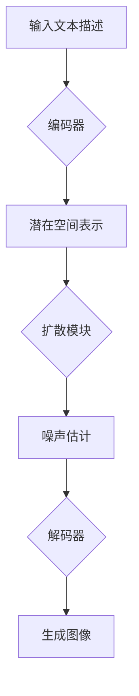

# AIGC从入门到实战：专注：Stable Diffusion，更专业的人物绘画 AI

## 1. 背景介绍

人工智能生成内容(AIGC)技术的迅速发展，正在颠覆传统的内容创作方式。其中，Stable Diffusion作为一个强大的文本到图像(text-to-image)生成模型，在人物绘画领域展现出了令人瞩目的潜力。本文将深入探讨Stable Diffusion的原理、应用和实践，帮助读者从入门到精通，掌握这一前沿的AIGC技术。

### 1.1 AIGC的兴起与发展

#### 1.1.1 AIGC的定义与特点
#### 1.1.2 AIGC在各领域的应用现状
#### 1.1.3 AIGC的未来发展趋势

### 1.2 Stable Diffusion的诞生

#### 1.2.1 Stable Diffusion的研发背景
#### 1.2.2 Stable Diffusion的优势与特点
#### 1.2.3 Stable Diffusion在AIGC领域的地位

## 2. 核心概念与联系

要深入理解Stable Diffusion，首先需要掌握一些基础的核心概念。本章将介绍Stable Diffusion涉及的关键技术与原理，并阐明它们之间的内在联系。

### 2.1 扩散模型(Diffusion Models)

#### 2.1.1 扩散模型的基本原理
#### 2.1.2 去噪扩散概率模型(Denoising Diffusion Probabilistic Models, DDPM)
#### 2.1.3 潜在扩散模型(Latent Diffusion Models, LDM)

### 2.2 变分自编码器(Variational Autoencoders, VAEs) 

#### 2.2.1 VAE的基本架构与原理
#### 2.2.2 VAE在生成模型中的应用
#### 2.2.3 VAE与扩散模型的结合

### 2.3 注意力机制(Attention Mechanism)

#### 2.3.1 注意力机制的基本概念
#### 2.3.2 自注意力(Self-Attention)与交叉注意力(Cross-Attention)
#### 2.3.3 注意力机制在Stable Diffusion中的应用

### 2.4 条件生成(Conditional Generation)

#### 2.4.1 条件生成的基本原理
#### 2.4.2 文本条件生成(Text-Conditional Generation)
#### 2.4.3 Stable Diffusion中的条件生成方法

## 3. 核心算法原理具体操作步骤

本章将详细阐述Stable Diffusion的核心算法原理，并给出具体的操作步骤，帮助读者深入理解模型的工作机制。

### 3.1 Stable Diffusion的整体架构

#### 3.1.1 编码器(Encoder)
#### 3.1.2 扩散模块(Diffusion Module)
#### 3.1.3 解码器(Decoder)

### 3.2 前向过程(Forward Process)

#### 3.2.1 图像编码
#### 3.2.2 噪声添加
#### 3.2.3 时间步长设置

### 3.3 逆向过程(Reverse Process) 

#### 3.3.1 噪声估计
#### 3.3.2 逐步去噪
#### 3.3.3 图像解码

### 3.4 训练过程

#### 3.4.1 损失函数设计
#### 3.4.2 优化算法选择
#### 3.4.3 超参数调整

## 4. 数学模型和公式详细讲解举例说明

为了帮助读者更好地理解Stable Diffusion背后的数学原理，本章将详细讲解模型涉及的关键数学模型和公式，并给出具体的举例说明。

### 4.1 扩散过程的数学表示

#### 4.1.1 前向扩散过程的数学公式
#### 4.1.2 逆向扩散过程的数学公式
#### 4.1.3 扩散过程的离散化处理

### 4.2 变分下界(Variational Lower Bound)

#### 4.2.1 变分下界的数学推导
#### 4.2.2 变分下界在模型训练中的作用
#### 4.2.3 变分下界的优化策略

### 4.3 注意力机制的数学表示

#### 4.3.1 自注意力的数学公式
#### 4.3.2 交叉注意力的数学公式
#### 4.3.3 注意力权重的计算方法

### 4.4 条件生成的数学表示

#### 4.4.1 条件概率的数学定义
#### 4.4.2 条件生成中的似然函数
#### 4.4.3 条件生成的梯度估计方法

## 5. 项目实践：代码实例和详细解释说明

本章将通过具体的代码实例，演示如何使用Stable Diffusion进行人物绘画。同时，对关键代码进行详细的解释说明，帮助读者深入理解模型的实现细节。

### 5.1 环境配置与数据准备

#### 5.1.1 开发环境搭建
#### 5.1.2 依赖库安装
#### 5.1.3 数据集选择与预处理

### 5.2 模型定义与初始化

#### 5.2.1 编码器的代码实现
#### 5.2.2 扩散模块的代码实现
#### 5.2.3 解码器的代码实现

### 5.3 训练过程的代码实现

#### 5.3.1 数据加载与批处理
#### 5.3.2 前向传播与反向传播
#### 5.3.3 模型保存与加载

### 5.4 推理过程的代码实现

#### 5.4.1 文本编码与条件生成
#### 5.4.2 噪声估计与逐步去噪
#### 5.4.3 图像解码与后处理

## 6. 实际应用场景

Stable Diffusion在人物绘画领域有着广泛的应用前景。本章将探讨几个典型的应用场景，展示该技术的实际价值。

### 6.1 游戏与动漫角色设计

#### 6.1.1 快速生成角色概念图
#### 6.1.2 辅助角色造型设计
#### 6.1.3 生成角色表情与姿态

### 6.2 虚拟形象生成

#### 6.2.1 生成个性化虚拟形象
#### 6.2.2 虚拟主播与数字人
#### 6.2.3 虚拟试衣与化妆

### 6.3 艺术创作与设计

#### 6.3.1 辅助艺术家进行创作
#### 6.3.2 生成各种风格的人物插画
#### 6.3.3 创意设计灵感来源

### 6.4 教育与培训

#### 6.4.1 生成教学示例与练习题
#### 6.4.2 模拟真实场景进行培训
#### 6.4.3 生成个性化学习内容

## 7. 工具和资源推荐

为了帮助读者更好地学习和应用Stable Diffusion，本章将推荐一些实用的工具和学习资源。

### 7.1 开源实现与预训练模型

#### 7.1.1 CompVis/stable-diffusion
#### 7.1.2 Stability AI
#### 7.1.3 DreamStudio

### 7.2 数据集与训练资源

#### 7.2.1 LAION-400M
#### 7.2.2 Danbooru2021
#### 7.2.3 WikiArt

### 7.3 社区与交流平台

#### 7.3.1 Hugging Face社区
#### 7.3.2 Reddit r/StableDiffusion
#### 7.3.3 Discord服务器

### 7.4 学习教程与文档

#### 7.4.1 官方文档
#### 7.4.2 Colab教程
#### 7.4.3 YouTube视频教程

## 8. 总结：未来发展趋势与挑战

本章将总结Stable Diffusion在人物绘画领域的应用现状，并展望其未来的发展趋势和可能面临的挑战。

### 8.1 Stable Diffusion的优势与局限

#### 8.1.1 高质量人物图像生成
#### 8.1.2 灵活的条件控制
#### 8.1.3 生成多样性与一致性

### 8.2 未来发展趋势

#### 8.2.1 模型性能的进一步提升
#### 8.2.2 多模态条件生成
#### 8.2.3 实时交互式生成

### 8.3 面临的挑战

#### 8.3.1 版权与伦理问题
#### 8.3.2 数据偏差与公平性
#### 8.3.3 计算资源与效率

## 9. 附录：常见问题与解答

本章将解答读者在学习和应用Stable Diffusion过程中可能遇到的一些常见问题。

### 9.1 安装与配置问题

#### 9.1.1 如何安装Stable Diffusion?
#### 9.1.2 显卡要求与配置
#### 9.1.3 常见的错误与解决方法

### 9.2 训练与微调问题

#### 9.2.1 如何在自己的数据集上进行微调?
#### 9.2.2 训练过程中的注意事项
#### 9.2.3 如何提高训练效率?

### 9.3 推理与应用问题

#### 9.3.1 如何控制生成图像的风格?
#### 9.3.2 如何提高生成图像的质量?
#### 9.3.3 如何将生成的图像应用到实际项目中?

### 9.4 其他常见问题

#### 9.4.1 Stable Diffusion与其他文本到图像模型的比较
#### 9.4.2 如何与Stable Diffusion社区互动?
#### 9.4.3 如何跟踪Stable Diffusion的最新进展?

以上就是本文对Stable Diffusion在人物绘画领域应用的全面介绍。通过深入探讨其原理、实践和应用，希望能够帮助读者掌握这一前沿的AIGC技术，并在实际项目中发挥其价值。Stable Diffusion正在不断发展和完善，相信在不久的将来，它将为人物绘画领域带来更多令人惊喜的突破。让我们一起期待并见证这一技术的未来吧!

作者：禅与计算机程序设计艺术 / Zen and the Art of Computer Programming

