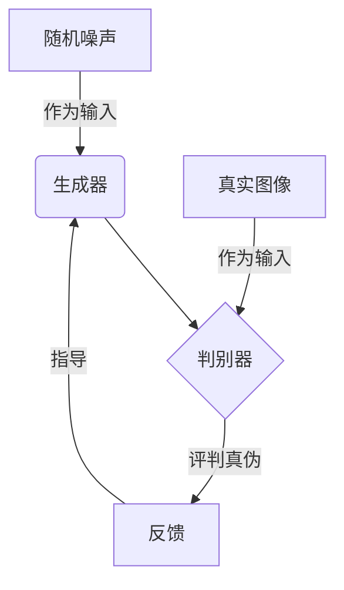
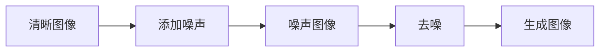
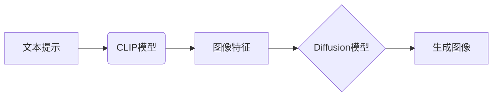

# AIGC从入门到实战：启动AIGC工具中的明星产品Midjourney

## 1.背景介绍

### 1.1 人工智能生成内容(AIGC)的兴起

在过去几年中,人工智能生成内容(AIGC)技术取得了长足进步,并在各个领域掀起了热潮。AIGC旨在利用人工智能算法生成文本、图像、音频和视频等多种形式的内容,从而提高内容创作效率,降低生产成本。

作为AIGC的一个分支,人工智能生成图像(AI-Generated Images)技术近年来发展迅猛,吸引了大量创作者和企业的关注。凭借强大的视觉生成能力,AI生成图像工具可以根据文本描述快速生成逼真的图像,为设计、营销、教育等领域带来全新的创作体验。

### 1.2 Midjourney:AI生成图像工具中的佼佼者

在AI生成图像工具的竞争格局中,Midjourney凭借出色的图像质量、丰富的创作功能和良好的用户体验,迅速成为了该领域的明星产品。作为一款基于Discord的AI绘图机器人,Midjourney允许用户通过文本提示生成各种风格的图像,从写实到抽象,从静物到人像,应有尽有。

Midjourney的核心是一种基于Diffusion模型的生成对抗网络(Generative Adversarial Network,GAN),能够从随机噪声中生成逼真的图像。与此同时,Midjourney还采用了一些创新技术,如CLIP(Contrastive Language-Image Pre-training)模型、注意力机制等,进一步提升了图像质量和生成效率。

凭借出众的性能表现,Midjourney在短时间内就吸引了大量用户,成为了AIGC工具领域的代表性产品之一。本文将深入探讨Midjourney的核心技术原理、使用方法和实际应用场景,为读者揭开这一AI绘图神器的神秘面纱。

## 2.核心概念与联系

### 2.1 生成对抗网络(GAN)

生成对抗网络(Generative Adversarial Network,GAN)是Midjourney的核心技术之一。GAN由两个神经网络组成:生成器(Generator)和判别器(Discriminator)。生成器的目标是生成逼真的图像,而判别器的目标是区分生成的图像和真实图像。

在训练过程中,生成器和判别器相互对抗,生成器不断尝试生成更加逼真的图像来欺骗判别器,而判别器则努力区分真实图像和生成图像。通过这种对抗训练,生成器最终能够生成高质量的图像。

上图展示了GAN的基本工作原理。生成器从随机噪声开始,生成图像;判别器接收生成的图像和真实图像,并评判它们的真伪;根据判别器的反馈,生成器不断调整参数,以生成更加逼真的图像。

### 2.2 Diffusion模型

Diffusion模型是Midjourney使用的另一种核心技术。与GAN不同,Diffusion模型采用了一种新颖的生成方式,即通过逐步去噪的方式从高斯噪声中生成图像。

Diffusion模型的训练过程包括两个阶段:正向扩散(Forward Diffusion)和逆向采样(Reverse Sampling)。在正向扩散阶段,模型将清晰的图像逐步添加高斯噪声,直至图像完全变为噪声;在逆向采样阶段,模型则从纯噪声开始,逐步去除噪声,最终生成清晰的图像。

上图展示了Diffusion模型的基本工作流程。通过这种独特的生成方式,Diffusion模型能够生成高质量、细节丰富的图像,并避免了GAN在训练过程中可能出现的模式崩溃(Mode Collapse)问题。

### 2.3 CLIP模型

除了GAN和Diffusion模型,Midjourney还采用了CLIP(Contrastive Language-Image Pre-training)模型,以实现文本到图像的生成。CLIP是一种大型的视觉-语言双塔模型,能够学习图像和文本之间的对应关系。

在Midjourney中,CLIP模型用于将用户输入的文本提示转化为图像特征,然后将这些特征作为条件输入到Diffusion模型中,指导图像生成的过程。通过这种方式,Midjourney可以根据用户的文本描述生成符合要求的图像。

上图展示了CLIP模型在Midjourney中的作用。CLIP模型将文本提示转化为图像特征,Diffusion模型则根据这些特征生成最终的图像。CLIP模型的引入大大提高了Midjourney的文本理解能力和图像生成质量。

## 3.核心算法原理具体操作步骤

### 3.1 Diffusion模型的正向扩散过程

Diffusion模型的正向扩散过程是将清晰的图像逐步添加高斯噪声,直至图像完全变为噪声。具体操作步骤如下:

1. 初始化一个清晰的图像 $x_0$。
2. 对于时间步 $t=1,2,...,T$:
    - 从高斯分布 $\mathcal{N}(0,1)$ 中采样噪声 $\epsilon_t$。
    - 计算 $\alpha_t = \bar{\alpha}_t^2$,其中 $\bar{\alpha}_t$ 是一个预定义的方差系数。
    - 计算 $x_t = \sqrt{\alpha_t}x_{t-1} + \sqrt{1-\alpha_t}\epsilon_t$,即将噪声 $\epsilon_t$ 添加到前一时间步的图像 $x_{t-1}$ 中。
3. 最终得到纯噪声图像 $x_T$。

上述过程可以用以下公式表示:

$$
q(x_t|x_{t-1}) = \mathcal{N}(x_t;\sqrt{\alpha_t}x_{t-1},1-\alpha_t)
$$

其中,q(x_t|x_{t-1})表示从x_{t-1}到x_t的转移概率分布。通过这种方式,模型可以学习如何从纯噪声中生成清晰的图像。

### 3.2 Diffusion模型的逆向采样过程

在训练完成后,Diffusion模型可以通过逆向采样过程从纯噪声中生成图像。具体操作步骤如下:

1. 初始化一个纯噪声图像 $x_T$。
2. 对于时间步 $t=T,T-1,...,1$:
    - 从模型中采样 $\epsilon_\theta(x_t,t)$,这是一个基于当前图像 $x_t$ 和时间步 $t$ 的噪声预测。
    - 计算 $\bar{\alpha}_{t-1} = \eta_t\bar{\alpha}_t$,其中 $\eta_t$ 是一个预定义的系数。
    - 计算 $\hat{x}_{t-1} = \frac{1}{\sqrt{\alpha_t}}(x_t-\frac{1-\alpha_t}{\sqrt{1-\bar{\alpha}_t}}\epsilon_\theta(x_t,t))$。
    - 从高斯分布 $\mathcal{N}(0,1)$ 中采样噪声 $\epsilon_{t-1}$。
    - 计算 $x_{t-1} = \sqrt{\bar{\alpha}_{t-1}}\hat{x}_{t-1} + \sqrt{1-\bar{\alpha}_{t-1}}\epsilon_{t-1}$。
3. 最终得到生成的图像 $x_0$。

上述过程可以用以下公式表示:

$$
p_\theta(x_{t-1}|x_t) = \mathcal{N}(x_{t-1};\hat{x}_{t-1},1-\bar{\alpha}_{t-1})
$$

其中,p_\theta(x_{t-1}|x_t)表示从x_t到x_{t-1}的转移概率分布,由模型参数θ决定。通过这种方式,模型可以从纯噪声中逐步生成清晰的图像。

### 3.3 CLIP模型的文本到图像特征转换

CLIP模型的作用是将用户输入的文本提示转换为图像特征,以指导Diffusion模型的生成过程。具体操作步骤如下:

1. 将文本提示输入到CLIP模型的文本编码器中,得到文本特征向量 $f_t$。
2. 将当前生成的图像 $x_t$ 输入到CLIP模型的图像编码器中,得到图像特征向量 $f_i$。
3. 计算文本特征向量 $f_t$ 和图像特征向量 $f_i$ 之间的余弦相似度:

$$
s(x_t) = \frac{f_t^\top f_i}{\|f_t\|\|f_i\|}
$$

4. 将相似度 $s(x_t)$ 作为条件,输入到Diffusion模型中,指导下一时间步的图像生成。

通过这种方式,CLIP模型可以将用户的文本描述转化为图像特征,并将这些特征融入到Diffusion模型的生成过程中,从而实现根据文本生成符合要求的图像。

## 4.数学模型和公式详细讲解举例说明

### 4.1 生成对抗网络(GAN)的数学模型

生成对抗网络(GAN)由生成器G和判别器D组成,它们的目标函数可以表示为:

$$\min_G \max_D V(D,G) = \mathbb{E}_{x\sim p_{data}(x)}[\log D(x)] + \mathbb{E}_{z\sim p_z(z)}[\log(1-D(G(z)))]$$

其中,x是真实数据的样本,z是随机噪声,p_data(x)是真实数据的分布,p_z(z)是随机噪声的分布。

判别器D的目标是最大化上式,即最大化对真实数据的正确判别概率,同时最大化对生成数据的错误判别概率。而生成器G的目标是最小化上式,即最小化判别器对生成数据的正确判别概率。

通过这种对抗训练,生成器G将不断努力生成更加逼真的数据,以欺骗判别器D,而判别器D也会不断提高判别能力,从而推动双方的性能不断提升。

例如,在生成图像的任务中,生成器G将从随机噪声z生成图像G(z),而判别器D则判断G(z)是真实图像还是生成图像。通过不断迭代训练,生成器G最终能够生成高质量、逼真的图像。

### 4.2 Diffusion模型的数学模型

Diffusion模型的核心思想是通过正向扩散过程将清晰的图像转换为噪声,然后通过逆向采样过程从噪声中重建图像。

正向扩散过程可以表示为:

$$
q(x_t|x_{t-1}) = \mathcal{N}(x_t;\sqrt{\alpha_t}x_{t-1},1-\alpha_t)
$$

其中,x_t是时间步t的图像,α_t是一个预定义的方差系数。该过程将噪声逐步添加到图像中,直至图像完全变为噪声。

逆向采样过程可以表示为:

$$
p_\theta(x_{t-1}|x_t) = \mathcal{N}(x_{t-1};\hat{x}_{t-1},1-\bar{\alpha}_{t-1})
$$

其中,θ是模型参数,x_t是时间步t的图像,\bar{α}_{t-1}是另一个预定义的方差系数,\hat{x}_{t-1}是模型预测的前一时间步的图像。该过程从纯噪声开始,逐步去除噪声,最终生成清晰的图像。

在实际应用中,Diffusion模型通常采用U-Net结构,将条件信息(如CLIP模型提供的图像特征)融入到每个时间步的预测中,从而实现条件图像生成。

例如,要生成一张"一只可爱的小狗在草地上玩耍"的图像,我们可以将这个文本描述输入到CLIP模型中,得到对应的图像特征,然后将这些特征作为条