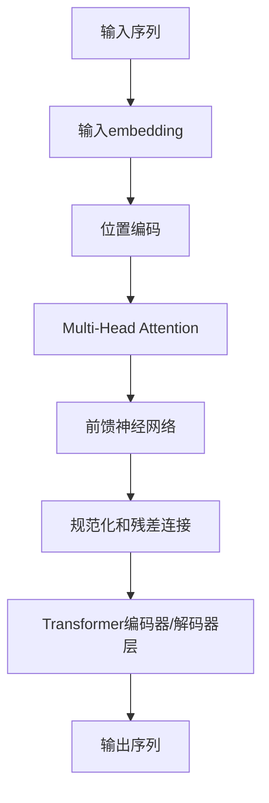
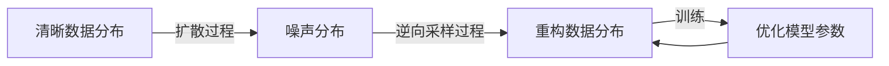
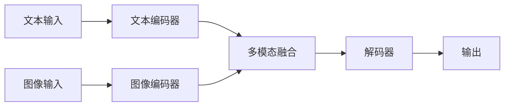

# AIGC从入门到实战：基建：人工智能时代的变迁

## 1. 背景介绍

### 1.1 人工智能的崛起

人工智能(Artificial Intelligence, AI)作为一种先进的计算技术,正在以前所未有的方式重塑着我们的世界。从语音助手到自动驾驶汽车,从医疗诊断到金融分析,AI已经渗透到了我们生活的方方面面。然而,这仅仅是一个开端。随着AI技术的不断发展和创新,我们正在迎来一个前所未有的人工智能时代。

### 1.2 AIGC的兴起

在这个人工智能时代的浪潮中,AIGC(Artificial Intelligence Generated Content,人工智能生成内容)作为一种新兴技术,正在引领着内容创作领域的变革。AIGC利用先进的机器学习算法和大规模训练数据,能够自动生成高质量的文本、图像、视频、音频等多种形式的内容,为各行各业带来了全新的机遇和挑战。

### 1.3 AIGC的影响

AIGC的兴起不仅彻底改变了内容创作的方式,也对整个社会产生了深远的影响。它有望解决内容创作的效率和成本问题,为创作者提供强大的辅助工具,同时也可能引发就业市场的重大变革。此外,AIGC还将推动人工智能技术在各个领域的深度应用,催生新的商业模式和创新机会。

## 2. 核心概念与联系

### 2.1 AIGC的核心概念

要全面理解AIGC,我们需要掌握以下几个核心概念:

1. **生成式人工智能(Generative AI)**: 指能够基于输入数据自主生成新的、有意义的内容的人工智能系统。AIGC就属于生成式人工智能的一种应用。

2. **语言模型(Language Model)**: 一种基于大量文本数据训练而成的机器学习模型,能够捕捉语言的统计规律,用于生成自然语言文本。GPT-3等大型语言模型是AIGC文本生成的核心技术。

3. **diffusion模型(Diffusion Model)**: 一种基于扩散过程的生成式深度学习模型,能够从噪声数据中生成高质量的图像、视频等内容。Stable Diffusion等diffusion模型是AIGC图像/视频生成的关键技术。

4. **多模态(Multimodal)**: 指同时处理多种形式的数据,如文本、图像、视频等。AIGC系统通常需要具备多模态能力,以生成多种形式的内容。

5. **人工智能辅助创作(AI-Assisted Creation)**: 利用人工智能技术辅助人类进行创作活动,提高创作效率和质量。AIGC可以作为人工智能辅助创作的重要工具。

### 2.2 AIGC与其他技术的关联

AIGC并不是一个孤立的技术,它与多个领域的技术紧密相关:

- **机器学习(Machine Learning)**: AIGC的核心技术基础,如语言模型、diffusion模型等都源自机器学习算法。

- **大数据(Big Data)**: 训练AIGC模型需要大量高质量的数据,因此大数据技术对AIGC至关重要。

- **自然语言处理(Natural Language Processing, NLP)**: 文本内容生成离不开NLP技术的支持。

- **计算机视觉(Computer Vision)**: 图像、视频内容生成需要计算机视觉技术的参与。

- **人机交互(Human-Computer Interaction, HCI)**: AIGC系统需要与人类创作者进行良好的交互,因此需要借助HCI技术。

AIGC的发展离不开这些相关技术的共同推动,同时AIGC也将为这些技术领域带来新的应用场景和发展机遇。

## 3. 核心算法原理具体操作步骤

### 3.1 语言模型

#### 3.1.1 Transformer架构

Transformer是当前主流的语言模型架构,其核心思想是利用Self-Attention机制来捕捉输入序列中元素之间的长程依赖关系。Transformer的基本操作步骤如下:

1. **输入embedding**: 将输入序列(如文本)映射为embedding向量表示。

2. **位置编码(Positional Encoding)**: 为每个位置添加位置信息,使模型能够捕捉序列的顺序信息。

3. **Multi-Head Attention**: 计算Query、Key和Value之间的注意力分数,并基于注意力分数对Value进行加权求和,获得每个位置的注意力表示。

4. **前馈神经网络(Feed-Forward Network)**: 对注意力表示进行非线性变换,产生该层的输出表示。

5. **规范化(Normalization)和残差连接(Residual Connection)**: 用于稳定训练过程和提高模型性能。

6. **解码器(Decoder)**: 对于序列生成任务,需要使用掩码的Multi-Head Attention,确保每个位置只能关注之前的位置。

通过堆叠多个Transformer编码器/解码器层,模型可以学习到更高层次的语义表示,从而实现强大的文本生成能力。

#### 3.1.2 预训练与微调

大型语言模型通常采用预训练与微调的范式进行训练:

1. **预训练(Pre-training)**: 在大规模无监督文本数据上进行自监督学习,获得通用的语言表示能力。常见的预训练目标包括掩码语言模型(Masked Language Model)和下一句预测(Next Sentence Prediction)等。

2. **微调(Fine-tuning)**: 在特定的下游任务数据上,基于预训练模型进行进一步的监督微调,使模型适应特定任务。

预训练可以让模型学习到丰富的语言知识,而微调则让模型专注于特定的应用场景,两者相结合可以获得出色的性能表现。

### 3.2 Diffusion模型

#### 3.2.1 扩散过程

Diffusion模型的核心思想是利用一个可逆的扩散(diffusion)过程,从清晰的数据分布逐步扩散到噪声分布,再通过学习的逆过程从噪声分布还原回清晰的数据分布。具体步骤如下:

1. **前向扩散过程**: 从初始数据分布 $q(x_0)$ 出发,通过 $T$ 个扩散步骤,将数据逐步扩散到噪声分布 $q(x_T)$。每个扩散步骤根据高斯噪声对数据进行扰动:

$$
q(x_{t+1}|x_t) = \mathcal{N}(x_{t+1}; \sqrt{1-\beta_t}x_t, \beta_t\mathbf{I})
$$

其中 $\beta_t$ 是方差系数,控制每步扩散的程度。

2. **逆向采样过程**: 从噪声分布 $q(x_T)$ 出发,通过学习的逆过程 $p_\theta(x_{t-1}|x_t)$ 逐步重构出清晰的数据分布 $p_\theta(x_0)$。该过程由一个神经网络 $p_\theta$ 参数化,需要通过训练数据对其进行学习。

#### 3.2.2 训练目标

Diffusion模型的训练目标是最小化噪声分布 $q(x_T)$ 和模型生成的分布 $p_\theta(x_0)$ 之间的距离,常用的目标函数是加权的交叉熵损失:

$$
\mathcal{L}_{simple}(\theta) = \mathbb{E}_{q(x_T),x_0}\left[\sum_{t=1}^T\lambda(t)\left\|\epsilon_\theta(x_t,t)-\epsilon(x_t,x_{t-1})\right\|_2^2\right]
$$

其中 $\epsilon_\theta(x_t,t)$ 是模型的预测噪声,而 $\epsilon(x_t,x_{t-1})$ 是真实的噪声。通过优化该目标函数,模型可以学会从噪声中重构出清晰的数据。

#### 3.2.3 条件生成

Diffusion模型不仅可以无条件地生成数据,还可以基于条件信息(如文本描述)进行条件生成。常见的做法是将条件信息编码为条件embedding,并将其融入到每个扩散步骤和逆向采样步骤中,使模型的输出受到条件信息的影响。

### 3.3 多模态模型

#### 3.3.1 编码器-解码器架构

多模态模型通常采用编码器-解码器的架构,分别对不同模态的输入进行编码,然后将编码后的表示融合,最后由解码器生成目标模态的输出。

#### 3.3.2 注意力融合

不同模态的表示可以通过注意力机制进行融合,例如通过跨模态注意力(Cross-Attention)机制,让每个模态的表示能够关注其他模态的相关信息。

#### 3.3.3 预训练与微调

类似于语言模型,多模态模型也可以采用预训练与微调的范式。在预训练阶段,模型可以在大规模的多模态数据上进行自监督学习,获得通用的多模态表示能力;在微调阶段,则根据特定的下游任务进行进一步的监督微调。

## 4. 数学模型和公式详细讲解举例说明

### 4.1 Transformer注意力机制

Transformer的核心是Self-Attention机制,它能够捕捉输入序列中元素之间的长程依赖关系。给定一个查询(Query)向量 $\mathbf{q}$、一组键(Key)向量 $\{\mathbf{k}_1, \mathbf{k}_2, \ldots, \mathbf{k}_n\}$ 和一组值(Value)向量 $\{\mathbf{v}_1, \mathbf{v}_2, \ldots, \mathbf{v}_n\}$,Self-Attention的计算过程如下:

1. 计算查询和每个键向量之间的相似性分数(注意力分数):

$$
\text{Attention}(\mathbf{q}, \mathbf{k}_i) = \frac{\mathbf{q} \cdot \mathbf{k}_i^T}{\sqrt{d_k}}
$$

其中 $d_k$ 是键向量的维度,用于缩放点积。

2. 对注意力分数进行软化(softmax),得到注意力权重:

$$
\alpha_i = \text{softmax}(\text{Attention}(\mathbf{q}, \mathbf{k}_i)) = \frac{\exp(\text{Attention}(\mathbf{q}, \mathbf{k}_i))}{\sum_{j=1}^n \exp(\text{Attention}(\mathbf{q}, \mathbf{k}_j))}
$$

3. 根据注意力权重对值向量进行加权求和,得到注意力输出:

$$
\text{Attention}(\mathbf{q}, \{\mathbf{k}_i\}, \{\mathbf{v}_i\}) = \sum_{i=1}^n \alpha_i \mathbf{v}_i
$$

通过多头注意力(Multi-Head Attention)机制,模型可以从不同的子空间捕捉不同的依赖关系,进一步提高表示能力。

### 4.2 Diffusion模型的扩散过程

在Diffusion模型中,前向扩散过程是一个由方差系数 $\{\beta_t\}_{t=1}^T$ 参数化的马尔可夫链,它将清晰的数据分布 $q(x_0)$ 逐步扩散到噪声分布 $q(x_T)$。具体来说,在第 $t$ 步扩散时,我们有:

$$
q(x_t|x_{t-1}) = \mathcal{N}(x_t; \sqrt{1-\beta_t}x_{t-1}, \beta_t\mathbf{I})
$$

其中 $\mathbf{I}$ 是单位矩阵。通过链式法则,我们可以得到从 $x_0$ 到 $x_t$ 的联合分布:

$$