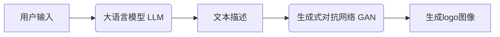

# AIGC从入门到实战：多快好省搞定各种风格的 logo 设计

## 1.背景介绍

### 1.1 logo设计的重要性

在这个视觉化时代,logo设计对于企业品牌形象的塑造起着至关重要的作用。一个出色的logo设计不仅能够吸引顾客的注意力,还能够传达企业的核心价值观和文化理念,从而在激烈的市场竞争中脱颖而出。然而,传统的logo设计过程通常耗时耗力,需要设计师投入大量的时间和精力进行创意构思、草图绘制、修改优化等环节,这不仅成本高昂,而且效率低下。

### 1.2 AIGC(AI生成式内容)技术的崛起

近年来,人工智能生成式内容(AIGC)技术取得了长足的进步,其中以大语言模型(LLM)和生成式对抗网络(GAN)为代表的AI技术,已经展现出了在图像、视频、音频等多媒体内容生成方面的强大能力。这些技术的出现,为logo设计领域带来了全新的机遇,有望彻底改变传统的logo设计流程,实现更高效、更低成本、更个性化的logo生成。

## 2.核心概念与联系

### 2.1 大语言模型(LLM)

大语言模型(LLM)是一种基于深度学习的自然语言处理(NLP)模型,能够从大量文本数据中学习语言的模式和规律。经过预训练后,LLM可以生成看似人类写作的连贯、流畅的文本内容。在logo设计过程中,LLM可以根据用户的文本描述,生成相应的logo设计概念和元素。

### 2.2 生成式对抗网络(GAN)

生成式对抗网络(GAN)是一种基于深度学习的生成模型,由一个生成器网络和一个判别器网络组成。生成器网络的目标是生成逼真的图像,而判别器网络的目标是区分生成的图像和真实图像。通过生成器和判别器之间的对抗训练,GAN可以学习到生成逼真图像的能力。在logo设计中,GAN可以根据LLM生成的文本描述,生成相应风格的logo图像。



上图展示了AIGC技术在logo设计中的核心流程:用户首先输入文本描述,大语言模型(LLM)根据输入生成详细的logo设计概念和元素描述,然后生成式对抗网络(GAN)根据文本描述生成相应风格的logo图像。

## 3.核心算法原理具体操作步骤  

### 3.1 LLM的工作原理

LLM的核心是transformer模型,它由多个编码器(Encoder)和解码器(Decoder)堆叠而成。编码器的作用是将输入的文本序列编码为向量表示,解码器则根据编码器的输出和之前生成的文本,预测下一个单词。具体操作步骤如下:

1. **输入表示**: 将输入文本转化为词汇表中的token序列,并添加位置编码,以保留单词在序列中的位置信息。

2. **编码器**: 输入token序列经过多层编码器,每一层由多头自注意力机制和前馈神经网络组成。编码器捕捉输入序列中单词之间的依赖关系,输出对应的向量表示。

3. **解码器**: 解码器的输入是特殊的开始符号[BOS],然后基于编码器的输出向量和自身的隐藏状态,通过掩码自注意力机制和前馈神经网络,预测生成下一个单词的概率分布。

4. **生成文本**: 重复步骤3,直到生成特殊的结束符号[EOS]或达到最大长度,即完成文本生成。

5. **优化训练**: 使用教师强制策略,将生成的文本与真实文本进行对比,计算损失函数,并通过反向传播算法优化模型参数。

### 3.2 GAN的工作原理

GAN包含一个生成器(Generator)和一个判别器(Discriminator),两者通过对抗训练达到生成逼真图像的目的。具体操作步骤如下:

1. **生成器**: 输入是一个随机噪声向量z,经过上采样、卷积等操作,生成一张假图像G(z)。

2. **判别器**: 输入是真实图像x和生成图像G(z),通过卷积、下采样等操作,输出一个标量D(x)和D(G(z)),分别表示输入图像为真实图像和生成图像的概率。

3. **对抗训练**:
   - 生成器的目标是最小化log(1-D(G(z))),使判别器尽可能判断生成图像为真实图像。
   - 判别器的目标是最大化log(D(x))+log(1-D(G(z))),正确区分真实图像和生成图像。

4. **优化训练**: 生成器和判别器通过反向传播算法分别优化自身的损失函数,两者相互对抗、相互促进,直至生成器生成的图像无法被判别器识别为假图像。

$$
\min\limits_G\max\limits_DV(D,G) = \mathbb{E}_{x\sim p_\text{data}(x)}\big[\log D(x)\big] + \mathbb{E}_{z\sim p_z(z)}\big[\log(1-D(G(z)))\big]
$$

上式是GAN的损失函数,G和D分别最小化和最大化这个值函数。当G生成的图像G(z)足够逼真时,D将无法判断出真伪,此时G和D的损失函数达到一个纳什均衡。

## 4.数学模型和公式详细讲解举例说明

### 4.1 LLM中的自注意力机制

自注意力机制是transformer模型的核心,它能够捕捉输入序列中任意两个单词之间的依赖关系,从而更好地建模长距离依赖。对于一个长度为n的输入序列$X = (x_1, x_2, ..., x_n)$,自注意力机制首先计算Query(Q)、Key(K)和Value(V)三个向量:

$$
\begin{aligned}
Q &= XW^Q\\
K &= XW^K\\
V &= XW^V
\end{aligned}
$$

其中$W^Q,W^K,W^V$是可训练的权重矩阵。然后计算Q和K的点积,除以缩放因子$\sqrt{d_k}$进行软化,得到注意力分数矩阵:

$$
\text{Attention}(Q,K,V) = \text{softmax}\left(\frac{QK^\top}{\sqrt{d_k}}\right)V
$$

最后将注意力分数与V相乘,即可得到对应位置的注意力表示。多头注意力机制是将多个注意力计算并行化,捕捉不同的依赖关系。

以下是一个简单的例子,假设输入序列为"The green apple is good",我们计算"apple"这个单词对应的注意力表示:

$$
\begin{aligned}
Q_\text{apple} &= [0.2,0.4,\cdots]\\ 
K &= [[0.1,\cdots],[0.6,\cdots],\cdots,[0.3,\cdots]]\\
V &= [[v_1],[v_2],\cdots,[v_n]]
\end{aligned}
$$

则"apple"对应的注意力表示为:

$$
\begin{aligned}
\text{Attention}(Q_\text{apple},K,V) &= \text{softmax}\left(\frac{Q_\text{apple}K^\top}{\sqrt{d_k}}\right)V\\
&= \text{softmax}([0.03,0.18,\cdots,0.09])[[v_1],[v_2],\cdots,[v_n]]\\
&= [0.1v_1,0.5v_2,\cdots,0.3v_n]
\end{aligned}
$$

可以看出,"apple"这个单词更多地关注了"green"一词,从而能够建模"green apple"这种长距离依赖关系。

### 4.2 GAN中的WGAN-GP损失函数

在原始GAN模型中,生成器和判别器的损失函数存在许多问题,如梯度消失、模式崩溃等,影响了GAN的训练稳定性。因此后续工作提出了改进的WGAN(Wasserstein GAN)损失函数:

$$
\begin{aligned}
\min\limits_G\max\limits_D\;\; &\mathbb{E}_{x\sim p_\text{data}}[D(x)] - \mathbb{E}_{z\sim p_z}[D(G(z))]\\
\text{s.t.}\;\; &\|D\|_L \leq 1
\end{aligned}
$$

其中$\|D\|_L \leq 1$是利普希茨约束,保证判别器满足1-Lipschitz条件,从而使得WGAN具有更好的数值稳定性。但是直接约束判别器的权重范数并不实用,因此WGAN-GP(Wasserstein GAN with Gradient Penalty)提出了梯度惩罚的方式:

$$
\begin{aligned}
\mathcal{L}_D =\;\; &\mathbb{E}_{x\sim p_\text{data}}[D(x)] - \mathbb{E}_{z\sim p_z}[D(G(z))]\\
&+ \lambda\mathbb{E}_{\hat{x}\sim p_{\hat{x}}}\big[\big(\|\nabla_{\hat{x}}D(\hat{x})\|_2 - 1\big)^2\big]
\end{aligned}
$$

其中$\hat{x}$是通过插值得到的虚拟样本,位于真实样本$x$和生成样本$G(z)$之间。判别器的目标是最大化上式,而生成器的目标是最小化$-\mathbb{E}_{z\sim p_z}[D(G(z))]$。

以下是一个简单的例子,假设真实样本$x=[1,2]$,生成样本$G(z)=[5,6]$,我们计算虚拟样本$\hat{x}$在$\epsilon=0.3$时的梯度惩罚项:

$$
\begin{aligned}
\hat{x} &= \epsilon x + (1-\epsilon)G(z) = [0.3\times 1 + 0.7\times 5, 0.3\times 2 + 0.7\times 6] = [4.2, 5.2]\\
\|\nabla_{\hat{x}}D(\hat{x})\|_2 &= \sqrt{(\frac{\partial D}{\partial x_1})^2 + (\frac{\partial D}{\partial x_2})^2}\\
&= \sqrt{0.8^2 + 1.2^2} = 1.414\\
\therefore\;\; \big(\|\nabla_{\hat{x}}D(\hat{x})\|_2 - 1\big)^2 &= (1.414 - 1)^2 = 0.172
\end{aligned}
$$

梯度惩罚项的作用是约束判别器满足1-Lipschitz条件,从而提高WGAN的训练稳定性。

## 5.项目实践:代码实例和详细解释说明

我们以StyleGAN2为例,介绍如何使用AIGC技术生成logo图像。StyleGAN2是NVIDIA提出的一种改进的GAN模型,能够生成高分辨率、高质量的图像,在人脸生成、动漫头像生成等领域表现出色。

### 5.1 环境配置

```bash
# 克隆StyleGAN2代码库
git clone https://github.com/NVlabs/stylegan2-ada-pytorch.git
cd stylegan2-ada-pytorch

# 创建conda环境并安装依赖
conda create -n stylegan2 python=3.8
conda activate stylegan2
pip install numpy ninja opencv-python PyYAML click requests tqdm pyspng

# 安装PyTorch
conda install pytorch==1.7.1 torchvision torchaudio cudatoolkit=11.0 -c pytorch

# 下载预训练模型(以logo数据集为例)
bash download_model.sh https://nvlabs-fi-cdn.nvidia.com/stylegan2-ada-pytorch/pretrained/metfaces.pkl
```

### 5.2 数据准备

StyleGAN2需要大量的logo图像数据进行训练。如果没有现成的logo数据集,可以从网上爬取logo图像,或使用一些开源的logo数据集,如Logos-32plus、BrandEmbeds等。

```python
import dnnlib
import numpy as np
from PIL import Image
from tqdm import tqdm

# 加载数据
data = dnnlib.util.open_url('https://nvlabs-fi-cdn.nvidia.com/stylegan2-ada-pytorch/datasets/metfaces.zip')

# 解压并保存图像
image_paths = []
with np.lib.utils.source_unzip(data) as unzip_dir:
    for root, _, files in os.walk(unzip_dir):
        for file in files:
            if file.endswith('.png'):
                image_path = os.path.join(root