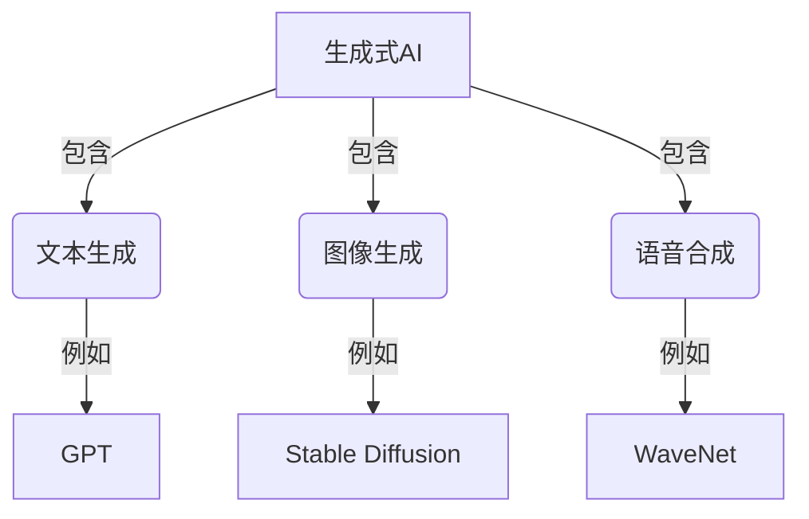
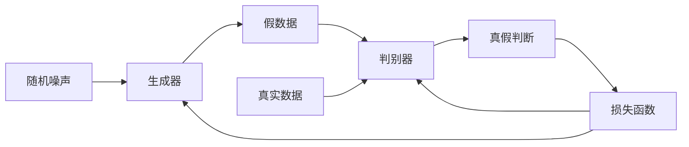
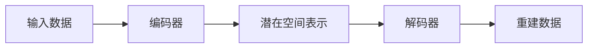
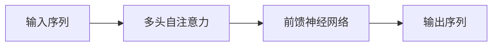
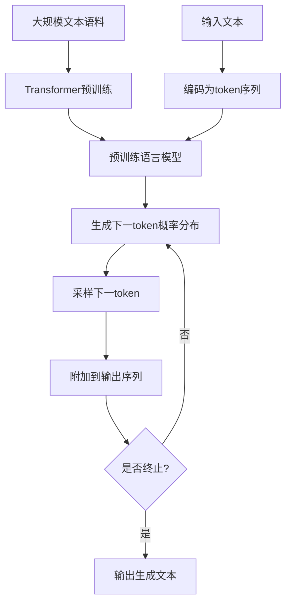
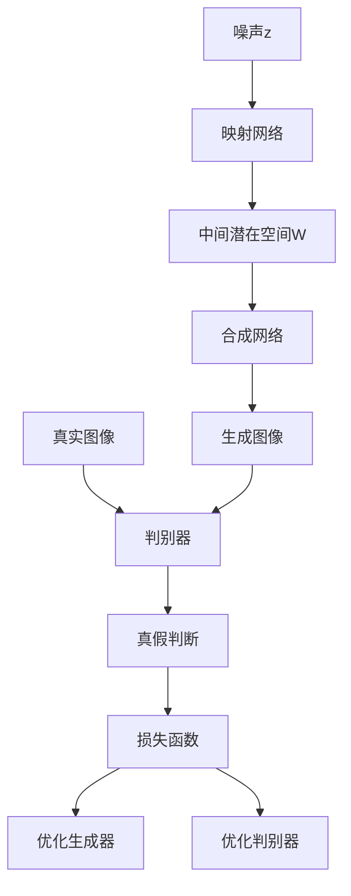
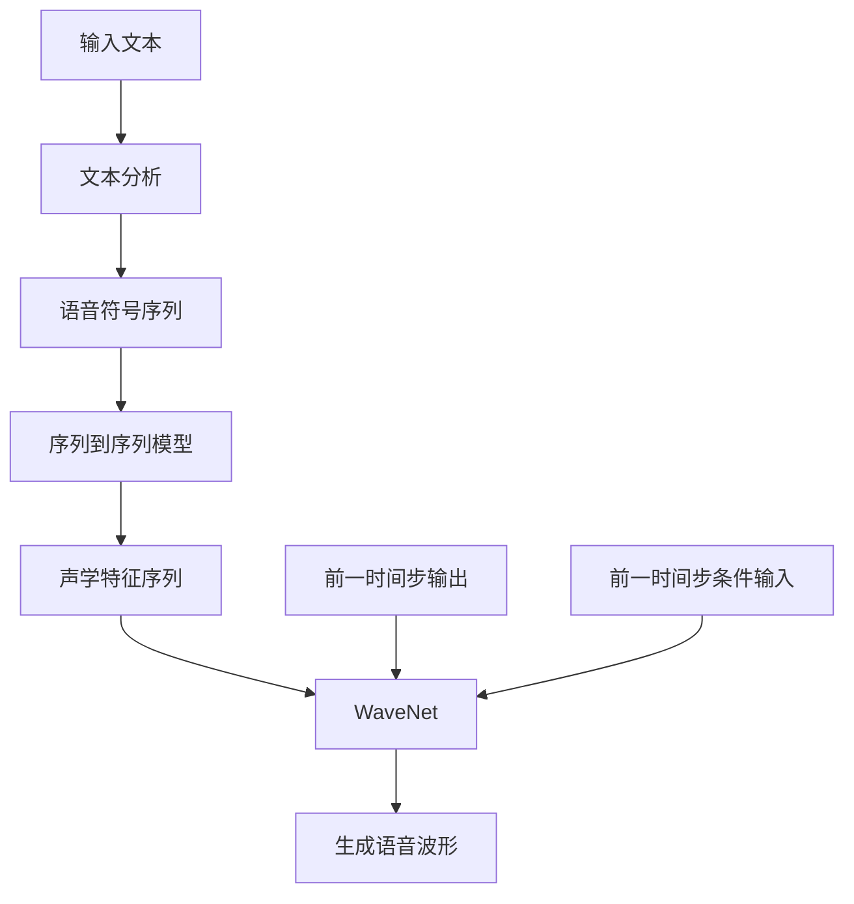

# AIGC从入门到实战：超强的"理科状元"

## 1.背景介绍

### 1.1 人工智能的崛起

人工智能(Artificial Intelligence, AI)是当代科技发展的热点领域,其影响力已经渗透到各行各业。从语音助手到自动驾驶汽车,从医疗诊断到金融分析,AI正在彻底改变我们的生活和工作方式。

### 1.2 AIGC的兴起

AIGC(AI Generated Content)是人工智能生成内容的缩写,指利用AI技术生成文本、图像、音频、视频等多种形式的内容。随着深度学习、自然语言处理等技术的飞速发展,AIGC已经展现出了强大的创作能力。

### 1.3 AIGC的重要性

AIGC有望彻底改变内容创作的方式,提高效率、降低成本,释放人类的创造力。它可以应用于广告营销、新闻报道、教育培训、娱乐创作等多个领域,为企业和个人带来巨大的生产力红利。

## 2.核心概念与联系

### 2.1 生成式AI

AIGC属于生成式人工智能(Generative AI)的范畴。生成式AI指的是利用深度学习模型从数据中学习模式,并生成新的、类似的内容。常见的生成式AI包括文本生成、图像生成、语音合成等。

### 2.2 生成对抗网络(GAN)

生成对抗网络(Generative Adversarial Networks, GAN)是生成式AI的一种核心技术。GAN由两个神经网络组成:生成器(Generator)和判别器(Discriminator)。生成器从随机噪声中生成假数据,而判别器则试图区分真实数据和假数据。两个网络相互对抗,最终达到生成高质量数据的目的。

### 2.3 变分自编码器(VAE)

变分自编码器(Variational Autoencoder, VAE)是另一种常用的生成式AI模型。VAE由编码器(Encoder)和解码器(Decoder)组成。编码器将输入数据压缩为潜在空间表示,解码器则从潜在空间重建数据。通过对潜在空间的操作,VAE可以生成新的数据。

### 2.4 Transformer

Transformer是一种革命性的神经网络架构,在自然语言处理、计算机视觉等领域有着广泛的应用。Transformer通过自注意力(Self-Attention)机制捕捉输入序列中元素之间的依赖关系,从而有效地建模长期依赖。著名的AIGC模型GPT(Generative Pre-trained Transformer)就是基于Transformer架构。

### 2.5 AIGC与传统内容创作的区别

相比传统的内容创作方式,AIGC具有以下优势:

1. 高效性:AI可以快速生成大量内容,节省人力成本。
2. 个性化:AI可根据用户需求定制化内容。
3. 多样性:AI可生成多种形式的内容,如文本、图像、视频等。
4. 持续学习:AI模型可不断从新数据中学习,提高内容质量。

但AIGC也面临着一些挑战,如版权问题、偏见风险、可解释性等,需要相关法规和技术的共同发展。

## 3.核心算法原理具体操作步骤

### 3.1 语言模型

语言模型是AIGC中生成文本内容的核心技术。常见的语言模型包括基于Transformer的GPT、BERT等。以GPT为例,其基本原理如下:

1. **预训练**:在大规模文本语料上预训练Transformer模型,学习文本的语义和语法规则。
2. **编码**:将输入文本转换为token序列,并加入特殊标记(如[BOS]、[EOS]等)。
3. **生成**:将编码后的序列输入到预训练模型,模型基于上文生成下一个token的概率分布。
4. **采样**:根据概率分布对下一个token进行采样,并将其附加到输出序列。
5. **迭代**:重复第3、4步,直至生成完整文本或达到长度限制。

### 3.2 图像生成

生成对抗网络(GAN)是图像生成的主要技术之一。以StyleGAN为例,其核心步骤包括:

1. **噪声输入**:从高斯分布或均匀分布采样一个潜在向量z,作为生成器的输入。
2. **映射网络**:将z映射到一个中间潜在空间W,以获得更好的插值性质。
3. **合成网络**:合成网络将W中的样本逐步上采样,生成最终的图像。
4. **判别器**:判别器试图区分生成图像和真实图像,并将判断结果反馈给生成器。
5. **损失函数**:根据判别器的输出计算生成器和判别器的损失函数。
6. **优化**:通过优化损失函数,不断提高生成图像的质量和真实性。

### 3.3 语音合成

基于深度学习的语音合成技术主要包括WaveNet、Tacotron等模型。以WaveNet为例,其核心步骤如下:

1. **文本分析**:将输入文本转换为语音符号序列。
2. **序列到序列模型**:将语音符号序列输入到序列到序列模型(如Tacotron),生成声学特征序列。
3. **WaveNet生成**:将声学特征序列输入到WaveNet模型,生成原始的语音波形。
4. **条件生成**:WaveNet是一个自回归模型,每个时间步的输出取决于之前的输出和条件输入(声学特征)。
5. **采样**:通过对概率分布进行采样,生成下一个语音样本点。
6. **迭代**:重复第4、5步,直至生成完整的语音波形。

上述算法原理描述了AIGC在文本、图像和语音领域的主要生成过程。实际应用中,还需要结合具体的任务和数据,对模型进行微调和优化,以获得更好的生成效果。

## 4.数学模型和公式详细讲解举例说明

### 4.1 语言模型中的自回归

语言模型的核心是对文本序列的概率进行建模,即计算一个文本序列$X = (x_1, x_2, ..., x_T)$的概率$P(X)$。根据链式法则,我们可以将$P(X)$分解为:

$$P(X) = P(x_1, x_2, ..., x_T) = \prod_{t=1}^{T}P(x_t|x_1, ..., x_{t-1})$$

其中$P(x_t|x_1, ..., x_{t-1})$表示在给定前面的词$x_1, ..., x_{t-1}$的条件下,当前词$x_t$出现的条件概率。这种基于历史预测未来的方式被称为自回归(Autoregressive)建模。

语言模型的目标是最大化训练语料库中所有序列的概率:

$$\max_{\theta}\sum_{X}{\log P_{\theta}(X)}$$

其中$\theta$表示模型参数。通过梯度下降等优化算法,可以学习到最优的参数$\theta^*$,使得模型在新的文本上也能给出较高的概率。

在实际应用中,由于词汇表通常非常大,我们通常对词进行子词分割,将单词分解为更小的token单元(如字符或字节对编码BPE),从而降低计算复杂度。

### 4.2 生成对抗网络的损失函数

生成对抗网络(GAN)由生成器G和判别器D组成。生成器的目标是生成逼真的假数据,使判别器无法区分;而判别器的目标是正确识别真实数据和生成数据。这种对抗关系可以表示为一个两人零和博弈:

$$\min_G \max_D V(D,G) = \mathbb{E}_{x\sim p_{data}(x)}[\log D(x)] + \mathbb{E}_{z\sim p_z(z)}[\log(1-D(G(z)))]$$

其中:

- $p_{data}(x)$是真实数据$x$的分布
- $p_z(z)$是噪声变量$z$的分布,通常取高斯分布或均匀分布
- $G(z)$表示生成器根据噪声$z$生成的假数据
- $D(x)$表示判别器对于输入$x$为真实数据的判断概率

在训练过程中,生成器G和判别器D通过最小化上述损失函数,达到相互对抗的目的。当训练收敛时,生成数据的分布$p_g$将与真实数据分布$p_{data}$非常接近。

### 4.3 变分自编码器的证据下界

变分自编码器(VAE)是一种基于深度学习的生成模型,它试图学习数据$x$的潜在分布$p(z|x)$。由于直接计算$p(z|x)$通常是困难的,VAE引入了一个近似分布$q(z|x)$,并最小化$q(z|x)$与$p(z|x)$之间的KL散度:

$$\min_{\phi,\theta} D_{KL}(q_{\phi}(z|x)||p_{\theta}(z|x))$$

其中$\phi$和$\theta$分别是近似分布$q$和真实分布$p$的参数。

通过一些数学推导,我们可以将上述目标函数转化为对证据下界(Evidence Lower Bound, ELBO)的最大化:

$$\mathcal{L}(\phi,\theta;x) = -D_{KL}(q_{\phi}(z|x)||p_{\theta}(z)) + \mathbb{E}_{q_{\phi}(z|x)}[\log p_{\theta}(x|z)]$$

其中第一项是近似分布与先验分布之间的KL散度,第二项是重构项,表示在给定潜在变量$z$的情况下,重构原始数据$x$的期望对数似然。

在训练过程中,VAE通过最大化ELBO来学习参数$\phi$和$\theta$。一旦模型训练完成,我们就可以从先验分布$p(z)$中采样潜在变量$z$,并通过生成网络$p_{\theta}(x|z)$生成新的数据$x$。

以上是AIGC中几种核心模型的数学原理。这些公式体现了深度学习在概率建模、优化理论等方面的应用,为AIGC的强大生成能力奠定了理论基础。

## 5.项目实践：代码实例和详细解释说明

为了更好地理解AIGC的实现细节,我们