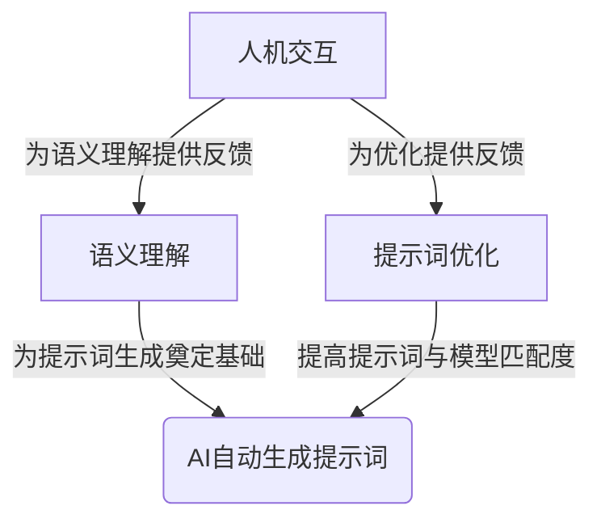

# AIGC从入门到实战：进阶：魔法打败魔法，让AI自动生成提示词

## 1.背景介绍

### 1.1 AIGC的兴起与发展

近年来,人工智能生成内容(AIGC)技术飞速发展,在文字、图像、视频、音频等多个领域展现出了强大的生成能力。以GPT-3、DALL-E等为代表的大型语言模型和多模态模型,可以根据用户提供的文本提示词(Prompt),生成高质量的内容。

AIGC技术的兴起,为内容创作者带来了全新的机遇与挑战。一方面,AIGC可以极大提高内容创作效率,缓解创作者的工作压力;另一方面,如何高效地与AIGC模型协作,生成符合预期的优质内容,成为创作者亟需解决的难题。

### 1.2 提示词在AIGC中的重要作用

在AIGC系统中,提示词(Prompt)扮演着指导生成模型输出内容的关键作用。高质量的提示词可以让模型准确把握创作者的意图,生成符合预期的内容;而低质量的提示词则可能导致模型输出与预期相去甚远的结果。

因此,掌握撰写高质量提示词的技巧,对于内容创作者而言至关重要。然而,手工撰写高质量提示词是一项极其耗时耗力的工作,需要创作者不断尝试、反复修改,才能逐步优化提示词质量。这无疑加重了创作者的工作负担。

### 1.3 AI自动生成提示词的需求与挑战

有鉴于此,业界亟需一种AI自动生成提示词的技术,来缓解创作者的工作压力。通过AI自动生成与所需内容相匹配的高质量提示词,将极大提高AIGC系统的易用性,助力创作者高效利用AIGC技术。

然而,AI自动生成提示词面临着诸多技术挑战:

1. 语义理解挑战:AI需要准确理解创作者的内容需求
2. 提示词优化挑战:AI需要针对特定AIGC模型,优化生成的提示词质量
3. 人机交互挑战:AI需要与创作者进行自然的交互,迭代优化提示词

本文将围绕这些核心挑战,介绍AI自动生成提示词的核心技术,并探讨在实际应用中的实践经验。

## 2.核心概念与联系

### 2.1 语义理解

语义理解是AI自动生成提示词的基础。AI需要从创作者的文本描述中准确捕捉内容需求,并将其转化为可被AIGC模型理解的语义表示。

常用的语义理解技术包括:

1. **词向量表示**:将文本映射到连续的向量空间,捕捉词语之间的语义关联。
2. **命名实体识别**:识别出文本中的人名、地名、组织机构名等实体。
3. **句法分析**:分析文本的句子成分和句子结构。
4. **指代消解**:将代词与其指代的实体关联起来。
5. **情感分析**:识别文本中所表达的情感倾向。
6. **主题模型**:发现文本中的潜在语义主题。

这些技术可以综合应用,全面挖掘文本的语义信息,为生成高质量提示词奠定基础。

### 2.2 提示词优化

针对不同的AIGC模型,需要优化生成的提示词质量,以获得理想的输出结果。常见的提示词优化策略包括:

1. **规则约束**:根据AIGC模型的输入规范,对提示词施加规则约束,如长度限制、词汇限制等。
2. **模板匹配**:将提示词与预先定义的高质量模板进行匹配,优化提示词结构。
3. **对抗训练**:通过对抗训练,使提示词对AIGC模型的输出更加鲁棒。
4. **强化学习**:将提示词生成过程建模为强化学习问题,不断优化以获得更高质量的输出。
5. **元学习**:利用元学习技术,使AI能够快速适应新的AIGC模型,生成匹配的高质量提示词。

不同优化策略可以根据实际需求和模型特点进行选择和组合,以获得最佳效果。

### 2.3 人机交互

人机交互是AI自动生成提示词过程中不可或缺的一环。通过与创作者的交互反馈,AI可以不断优化生成的提示词质量。常见的人机交互方式包括:

1. **文本交互**:创作者通过文本输入对生成的提示词进行评价和修改。
2. **语音交互**:创作者通过语音指令对生成的提示词进行评价和修改。
3. **图形交互**:创作者通过图形界面对生成的提示词进行评价和修改。
4. **混合交互**:综合利用文本、语音、图形等多种交互方式。

此外,交互过程中还需要考虑人机协作的效率问题,确保AI能够高效地从创作者的反馈中学习和优化。

### 2.4 核心概念关系

上述三个核心概念相互关联、环环相扣:

1. 语义理解为提示词生成奠定基础,决定了提示词质量的上限。
2. 提示词优化技术直接影响提示词与AIGC模型的匹配程度,对输出质量起决定性作用。
3. 人机交互为提示词优化提供了反馈通道,使AI能够不断学习和改进。

三者缺一不可,需要有机结合,才能构建出高效的AI自动生成提示词系统。

## 3.核心算法原理具体操作步骤

### 3.1 语义理解算法

语义理解的核心算法包括词向量表示、命名实体识别、句法分析、指代消解、情感分析和主题模型等。下面分别介绍这些算法的具体原理和操作步骤。

#### 3.1.1 词向量表示算法

词向量表示算法将文本中的词语映射到连续的向量空间中,使语义相近的词语在向量空间中彼此靠近。常用的词向量表示算法包括Word2Vec、GloVe、FastText等。以Word2Vec为例,其核心思想是通过神经网络模型学习词语的向量表示,使词向量能够编码词语在语料库中的上下文信息。Word2Vec包含两种模型:CBOW(连续词袋模型)和Skip-gram。

CBOW模型的操作步骤如下:

1. 对语料库进行预处理,构建词汇表。
2. 对每个目标词,从其上下文窗口中采样出输入词。
3. 将输入词的词向量求和,作为输入层。
4. 输入层与投影层进行点积,得到分数向量。
5. 分数向量通过Softmax函数,得到目标词的概率分布。
6. 使用负采样或者层序Softmax等技术加速训练。
7. 根据损失函数,反向传播更新词向量参数。

Skip-gram模型的操作步骤类似,不同之处在于输入是目标词的词向量,输出是上下文词的概率分布。

#### 3.1.2 命名实体识别算法

命名实体识别算法能够从文本中识别出人名、地名、组织机构名等实体。常用的命名实体识别算法包括基于规则的算法、基于统计模型的算法(如HMM、CRF)和基于深度学习的算法(如Bi-LSTM+CRF)。以Bi-LSTM+CRF为例,其操作步骤如下:

1. 对输入文本进行词向量表示,获得词向量序列。
2. 将词向量序列输入Bi-LSTM网络,获得每个词的上下文特征表示。
3. 将Bi-LSTM的输出与词向量级联,作为CRF的输入特征。
4. 使用CRF模型对每个词进行命名实体标注。
5. 使用BIO标注法,将连续的命名实体标记序列转化为最终的命名实体识别结果。

#### 3.1.3 句法分析算法

句法分析算法能够分析文本的句子成分和句子结构。常用的句法分析算法包括基于规则的算法、基于统计模型的算法(如PCFG)和基于深度学习的算法(如Seq2Seq+Attention)。以Seq2Seq+Attention为例,其操作步骤如下:

1. 将输入句子转化为词向量序列。
2. 将词向量序列输入编码器(如LSTM),获得句子的上下文特征表示。
3. 将编码器输出和目标句法树的前缀作为解码器(如LSTM)的输入。
4. 解码器根据输入,生成句法树的下一个节点标记。
5. 重复步骤4,直至生成完整的句法树。
6. 使用注意力机制,在解码时参考编码器输出的上下文特征。

#### 3.1.4 指代消解算法

指代消解算法能够将文本中的代词与其指代的实体关联起来。常用的指代消解算法包括基于规则的算法、基于统计模型的算法(如决策树)和基于深度学习的算法(如端到端神经网络模型)。以端到端神经网络模型为例,其操作步骤如下:

1. 将输入文本转化为词向量序列。
2. 使用Bi-LSTM网络获得每个词的上下文特征表示。
3. 对每个代词,根据其上下文特征与所有可能指代实体的特征计算相似度分数。
4. 选择与代词最相似的实体作为其指代目标。

#### 3.1.5 情感分析算法  

情感分析算法能够识别文本中所表达的情感倾向。常用的情感分析算法包括基于词典的算法、基于统计模型的算法(如朴素贝叶斯)和基于深度学习的算法(如LSTM+Attention)。以LSTM+Attention为例,其操作步骤如下:

1. 将输入文本转化为词向量序列。
2. 将词向量序列输入LSTM网络,获得每个词的上下文特征表示。
3. 使用注意力机制,对上下文特征序列进行加权求和,获得文本的整体特征表示。
4. 将整体特征表示输入全连接层,获得情感分类概率分布。

#### 3.1.6 主题模型算法

主题模型算法能够发现文本中的潜在语义主题。常用的主题模型算法包括PLSA、LDA等。以LDA为例,其操作步骤如下:

1. 确定主题个数k,初始化文档-主题分布和词-主题分布的参数。
2. 对每个文档:
   - 对每个词:
     - 从词-主题分布中采样一个主题z。
     - 从主题-词分布中采样一个词w。
3. 根据采样获得的词-主题分配,使用EM算法或者吉布斯采样,迭代更新文档-主题分布和词-主题分布的参数。
4. 重复步骤2-3,直至收敛。

### 3.2 提示词优化算法

提示词优化算法的目标是生成与AIGC模型更加匹配的高质量提示词。常用的提示词优化算法包括规则约束、模板匹配、对抗训练、强化学习和元学习等。

#### 3.2.1 规则约束算法

规则约束算法根据AIGC模型的输入规范,对生成的提示词施加一些硬性约束,如长度限制、词汇限制等。其操作步骤如下:

1. 定义一系列规则约束,如最大长度、禁用词表等。
2. 生成初始提示词。
3. 对初始提示词进行规则校验,如果不满足约束则进行修剪或替换。
4. 重复步骤3,直至生成的提示词满足所有约束。

#### 3.2.2 模板匹配算法

模板匹配算法将生成的提示词与预先定义的高质量模板进行匹配,优化提示词结构。其操作步骤如下:

1. 构建高质量提示词模板库。
2. 生成初始提示词。
3. 在模板库中寻找与初始提示词最