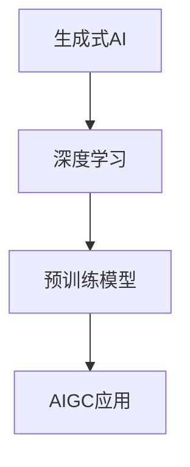

# AIGC社区与论坛：与全球AIGC爱好者交流

## 1. 背景介绍
### 1.1 AIGC的兴起与发展
#### 1.1.1 AIGC的定义与内涵
AIGC(AI-Generated Content)即人工智能生成内容,是指利用人工智能技术自动生成各种形式的内容,如文本、图像、音频、视频等。AIGC技术的出现,极大地提高了内容生产的效率和质量,为内容创作带来了革命性的变革。

#### 1.1.2 AIGC的发展历程
AIGC技术的发展可以追溯到上世纪50年代,早期的AIGC主要集中在自动文本生成领域。近年来,随着深度学习等人工智能技术的突破,AIGC进入了快速发展阶段。以DALL-E、GPT-3、Stable Diffusion等为代表的AIGC模型不断涌现,生成能力不断提升,应用场景日益丰富。

#### 1.1.3 AIGC的应用现状
目前,AIGC技术已经在内容创作、教育培训、游戏娱乐、营销广告等诸多领域得到广泛应用。一方面,AIGC降低了内容生产的门槛,使得个人创作者和中小企业能够低成本地制作高质量内容。另一方面,AIGC也为传统内容行业注入了新的活力,催生了一批创新应用和商业模式。

### 1.2 AIGC社区的重要性
#### 1.2.1 连接AIGC爱好者
AIGC社区为全球AIGC爱好者提供了一个交流互动的平台。在这里,不同背景的AIGC爱好者可以分享彼此的见解和经验,探讨AIGC技术的最新进展,共同推动AIGC事业的发展。

#### 1.2.2 促进知识共享
AIGC社区是AIGC知识和资源共享的重要渠道。社区成员可以在此发布AIGC相关的教程、文章、开源项目等,帮助更多人学习和掌握AIGC技术。同时,社区还会定期举办讲座、研讨会等活动,邀请业界专家分享真知灼见。

#### 1.2.3 推动产业发展
AIGC社区汇聚了大量的开发者、创作者、投资人等产业力量,是AIGC产业发展的重要推动力。通过社区,AIGC从业者可以寻找合作伙伴,对接商业资源,探索更多创新可能。一些AIGC初创公司也将社区作为早期用户招募和产品推广的重要阵地。

## 2. 核心概念与联系
### 2.1 AIGC的核心概念
#### 2.1.1 生成式AI
生成式AI(Generative AI)是AIGC的理论基础。它指的是能够生成全新内容的AI系统,与此相对的是判别式AI,后者只能对已有内容进行分类和识别。生成式AI的核心是对数据分布进行建模,从而可以从分布中采样生成新的数据。

#### 2.1.2 深度学习
深度学习是当前AIGC的主流技术范式。它通过构建多层神经网络,利用海量数据进行训练,从而让机器掌握高层次的特征表示和抽象能力。在AIGC领域,以生成对抗网络(GAN)、变分自编码器(VAE)、扩散模型等为代表的深度生成模型取得了广泛成功。

#### 2.1.3 预训练模型
预训练模型(Pre-trained Model)是AIGC的重要工具。它指的是在大规模通用数据集上预先训练的模型,可以作为下游任务的基础模型,大大减少了任务特定数据的需求。以GPT、BERT、CLIP等大型语言模型为代表的预训练模型,极大地促进了AIGC技术的发展。

### 2.2 AIGC核心概念之间的联系
AIGC的核心概念之间存在紧密的联系。生成式AI为AIGC提供了理论基础,阐明了如何从数据中学习并生成新的内容。深度学习则是生成式AI的具体实现路径,使用神经网络来拟合复杂的数据分布。预训练模型进一步提升了深度学习的效率和效果,使得AIGC模型可以在更少的数据和计算资源下取得更好的生成效果。三者相辅相成,共同推动了AIGC技术的飞速发展。

### 2.3 AIGC核心概念示意图

## 3. 核心算法原理具体操作步骤
### 3.1 生成对抗网络(GAN)
#### 3.1.1 GAN的基本原理
GAN由生成器(Generator)和判别器(Discriminator)两部分组成,两者通过博弈训练来不断提升生成效果。生成器负责生成假样本,判别器负责判断样本的真假,两者互为对抗,最终达到纳什均衡,生成器生成的样本无法被判别器分辨。

#### 3.1.2 GAN的训练步骤
1. 随机初始化生成器和判别器的参数
2. 固定生成器,训练判别器:
   - 从真实数据中采样一批样本,标记为真
   - 用生成器生成一批假样本,标记为假
   - 将真假样本输入判别器,计算损失并更新判别器参数
3. 固定判别器,训练生成器:
   - 用生成器生成一批假样本
   - 将假样本输入判别器,计算损失并更新生成器参数
4. 重复步骤2-3,直到模型收敛

#### 3.1.3 GAN的改进与扩展
GAN存在训练不稳定、生成多样性不足等问题。研究者提出了WGAN、CGAN、StyleGAN等一系列改进方案,从损失函数、网络结构、训练技巧等方面增强GAN的性能。同时,GAN也被拓展到文本、音频、视频等不同模态,催生了大量衍生模型。

### 3.2 变分自编码器(VAE) 
#### 3.2.1 VAE的基本原理
VAE是一种基于概率图模型的生成模型,由编码器(Encoder)和解码器(Decoder)组成。编码器将输入映射到隐空间的概率分布,解码器从隐空间采样并重构出输入。VAE通过最大化边际似然并加入KL散度正则化,来学习数据的隐空间表示。

#### 3.2.2 VAE的训练步骤
1. 随机初始化编码器和解码器的参数
2. 从数据集中采样一批样本作为输入
3. 将输入送入编码器,得到隐变量的均值和方差
4. 从隐变量的后验分布中采样,得到隐向量
5. 将隐向量送入解码器,重构出输入
6. 计算重构损失和KL散度,并更新编码器和解码器的参数
7. 重复步骤2-6,直到模型收敛

#### 3.2.3 VAE的应用与局限
VAE可以学习数据的低维流形结构,在数据压缩、去噪、插值等任务中有广泛应用。但VAE生成的样本质量和多样性通常不如GAN,且后验分布假设也限制了其表达能力。为此,研究者提出了β-VAE、VQ-VAE等改进模型,进一步增强了VAE的性能。

### 3.3 扩散模型(Diffusion Model)
#### 3.3.1 扩散模型的基本原理
扩散模型是一种基于马尔可夫链的生成模型。它将数据分布看作一个扩散过程的终点,通过迭代地添加高斯噪声,将数据逐步扩散到先验分布。生成过程则相反,通过逐步去噪,从先验分布恢复出数据分布。扩散模型通过优化噪声估计器,来学习这一逆扩散过程。

#### 3.3.2 扩散模型的训练步骤
1. 随机初始化噪声估计器的参数
2. 从数据集中采样一批样本作为输入
3. 对每个样本,按照扩散过程加入不同程度的高斯噪声
4. 将加噪后的样本输入噪声估计器,预测去噪方向
5. 计算噪声估计器的预测误差,并更新其参数
6. 重复步骤2-5,直到模型收敛

#### 3.3.3 扩散模型的优势与挑战
扩散模型具有训练稳定、样本质量高、适应任意数据分布等优点,近年来在图像、语音等领域取得了瞩目成绩。但扩散模型的采样速度较慢,生成一个样本需要上百步迭代,这限制了其在实时应用中的表现。为此,研究者提出了DDIM、Latent Diffusion等加速采样的方法,在保证质量的同时大幅提升了生成效率。

## 4. 数学模型和公式详细讲解举例说明
### 4.1 GAN的数学模型
GAN的目标是学习数据分布 $p_{data}(x)$,其中 $x$ 为真实样本。生成器 $G(z)$ 将随机噪声 $z$ 映射为生成样本,判别器 $D(x)$ 判断样本的真假。GAN的优化目标可以表示为:

$$\min_G \max_D V(D,G) = \mathbb{E}_{x \sim p_{data}(x)}[\log D(x)] + \mathbb{E}_{z \sim p_z(z)}[\log (1-D(G(z)))]$$

其中 $p_z(z)$ 为噪声的先验分布,通常为标准正态分布。训练过程中,生成器和判别器轮流优化,最终达到纳什均衡点:

$$p_g = p_{data}$$

此时,生成器可以生成与真实数据无法区分的样本。

### 4.2 VAE的数学模型
VAE通过最大化边际似然来学习数据分布 $p(x)$。它引入了隐变量 $z$,并假设数据由隐变量生成,即 $p(x|z)$。VAE的目标是最大化数据的对数似然:

$$\log p(x) = \log \int p(x|z)p(z)dz$$

由于边际似然的计算是不可解的,VAE引入了变分推断,用变分分布 $q(z|x)$ 来近似真实后验分布 $p(z|x)$。根据Jensen不等式,可以得到边际似然的下界(ELBO):

$$\log p(x) \geq \mathbb{E}_{q(z|x)}[\log p(x|z)] - D_{KL}(q(z|x)||p(z))$$

VAE通过最大化ELBO来近似最大化边际似然。其中,第一项为重构损失,鼓励解码器从隐变量重构出输入;第二项为KL散度,鼓励后验分布接近先验分布,起到正则化的作用。

### 4.3 扩散模型的数学模型
扩散模型将数据分布 $q(x_0)$ 看作一个扩散过程的终点,通过迭代地添加高斯噪声,将数据逐步扩散到先验分布 $p(x_T)$:

$$q(x_t|x_{t-1}) = \mathcal{N}(x_t; \sqrt{1-\beta_t}x_{t-1}, \beta_tI)$$

其中 $\beta_t$ 为噪声强度,随时间步 $t$ 递增。扩散过程满足马尔可夫性,因此有:

$$q(x_t|x_0) = \mathcal{N}(x_t; \sqrt{\bar{\alpha}_t}x_0, (1-\bar{\alpha}_t)I)$$

其中 $\alpha_t = 1- \beta_t$,$\bar{\alpha}_t = \prod_{s=1}^t \alpha_s$。

生成过程则相反,通过逐步去噪,从先验分布恢复出数据分布:

$$p_\theta(x_{t-1}|x_t) = \mathcal{N}(x_{t-1}; \mu_\theta(x_t,t), \Sigma_\theta(x_t,t))$$

其中 $\mu_\theta,\Sigma_\theta$ 为噪声估计器预测的均值和方差。扩散模型通过最小化噪声估计误差,来学习这一逆扩散过程:

$$L_{diffusion} = \mathbb{E}_{t,x_0,\epsilon}[\| \epsilon - \epsilon_\theta(\sqrt{\bar{\alpha}_t}x_0+\sqrt{1-\bar{\alpha}_t}\epsilon, t) \|^2]$$

其中 $\epsilon \sim \mathcal{N}(