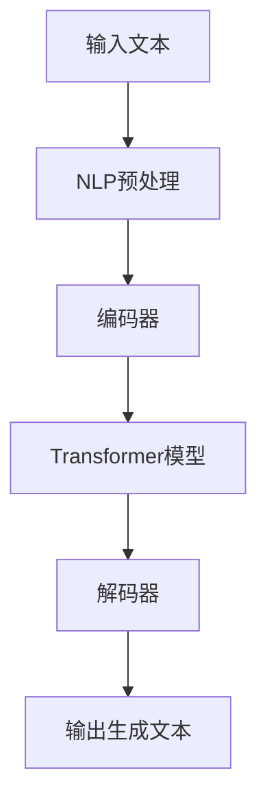
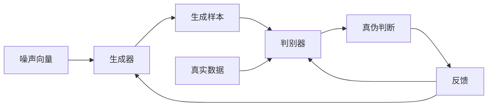
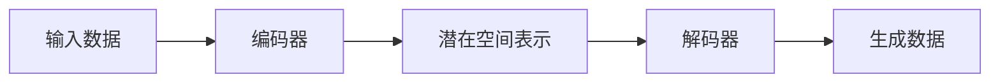
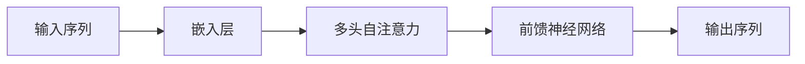

# AIGC面试指南：应对求职挑战

## 1.背景介绍

随着人工智能(AI)和生成式人工智能(Generative AI)技术的飞速发展,AIGC(AI Generated Content,AI生成内容)已经成为了一个备受关注的热门话题。AIGC技术可以自动生成各种形式的内容,包括文本、图像、音频和视频等,为各行各业带来了巨大的机遇和挑战。

在就业市场上,AIGC技术的应用也越来越广泛。许多公司开始利用AIGC工具来优化招聘流程,提高效率和质量。同时,AIGC技术也为求职者带来了新的机遇和挑战。一方面,AIGC可以帮助求职者更好地准备面试,提高竞争力;另一方面,求职者也需要了解AIGC技术,以应对潜在的就业市场变化。

## 2.核心概念与联系

### 2.1 人工智能(AI)

人工智能(AI)是一门研究如何使机器具有智能的科学,旨在开发能够模仿人类智能行为的系统和算法。AI技术包括机器学习、深度学习、自然语言处理、计算机视觉等多个领域。

### 2.2 生成式人工智能(Generative AI)

生成式人工智能(Generative AI)是指能够基于输入数据生成全新内容的AI系统。常见的Generative AI技术包括生成对抗网络(GAN)、变分自编码器(VAE)、transformer等。这些技术可以生成各种形式的内容,如文本、图像、音频和视频。

### 2.3 AIGC(AI Generated Content)

AIGC(AI Generated Content)指通过AI技术自动生成的内容,包括文本、图像、音频、视频等多种形式。AIGC技术可以极大地提高内容生产效率,降低成本,并为创作者提供新的工具和方法。

### 2.4 AIGC与求职面试

在求职面试过程中,AIGC技术可以发挥多方面的作用:

1. **简历和求职信优化**: AIGC可以根据职位要求自动生成或优化简历和求职信,提高内容质量和针对性。

2. **面试准备**: AIGC可以生成模拟面试问题和答案,帮助求职者更好地准备面试。

3. **AI面试官**: 一些公司开始使用AI面试官进行初步面试,AIGC技术可以提高AI面试官的准确性和自然度。

4. **AI职位推荐**: AIGC可以根据求职者的背景和偏好,推荐合适的职位。

5. **AI简历筛选**: 公司可以使用AIGC技术自动筛选简历,提高招聘效率。

## 3.核心算法原理具体操作步骤

AIGC技术的核心算法原理主要包括以下几个方面:

### 3.1 自然语言处理(NLP)

自然语言处理(Natural Language Processing,NLP)是AI的一个重要分支,旨在使计算机能够理解和生成人类语言。NLP技术包括词法分析、句法分析、语义分析、语音识别、机器翻译等。

在AIGC中,NLP技术被广泛应用于文本生成、文本摘要、问答系统等任务。常用的NLP模型包括BERT、GPT、XLNet等。这些模型通过预训练和微调的方式,可以生成高质量的自然语言内容。



### 3.2 生成对抗网络(GAN)

生成对抗网络(Generative Adversarial Networks,GAN)是一种用于生成式建模的深度学习架构。GAN由两个网络组成:生成器(Generator)和判别器(Discriminator)。生成器的目标是生成逼真的数据样本,而判别器的目标是区分生成的样本和真实数据。两个网络相互对抗,最终达到生成器生成的样本无法被判别器识别的状态。

GAN被广泛应用于图像生成、视频生成、语音合成等领域。在AIGC中,GAN可以生成高质量的图像和视频内容。



### 3.3 变分自编码器(VAE)

变分自编码器(Variational Autoencoder,VAE)是一种基于深度学习的生成模型。VAE由两部分组成:编码器(Encoder)和解码器(Decoder)。编码器将输入数据压缩为低维潜在空间表示,解码器则从潜在空间重构原始数据。

VAE在AIGC中可以用于文本生成、图像生成等任务。通过对潜在空间的操作,VAE可以生成多样化的内容。



### 3.4 Transformer

Transformer是一种基于注意力机制的序列到序列(Seq2Seq)模型,被广泛应用于机器翻译、文本生成、图像描述等任务。Transformer的核心是多头自注意力(Multi-Head Attention)机制,可以有效捕获输入序列中的长距离依赖关系。

在AIGC中,Transformer模型可以生成高质量的文本、图像描述等内容。著名的Transformer模型包括GPT、BERT、ViT等。



## 4.数学模型和公式详细讲解举例说明

在AIGC技术中,数学模型和公式扮演着重要的角色,为算法提供理论基础和计算框架。以下是一些常见的数学模型和公式:

### 4.1 softmax函数

softmax函数用于将一个实数向量转换为概率分布,常用于分类任务的输出层。对于一个实数向量 $\vec{z} = (z_1, z_2, \dots, z_K)$,softmax函数定义为:

$$\text{softmax}(\vec{z})_i = \frac{e^{z_i}}{\sum_{j=1}^K e^{z_j}}$$

其中,$i=1,2,\dots,K$。softmax函数的输出是一个 K 维概率向量,每个分量的值介于 0 和 1 之间,且所有分量之和为 1。

### 4.2 交叉熵损失函数

交叉熵损失函数(Cross-Entropy Loss)是一种常用的衡量模型预测和真实标签之间差异的函数,广泛应用于分类任务。对于一个样本 $x$ 和其真实标签 $y$,交叉熵损失函数定义为:

$$\mathcal{L}(x, y) = -\sum_{i=1}^K y_i \log p_i(x)$$

其中,$p_i(x)$ 是模型预测样本 $x$ 属于第 $i$ 类的概率,$y_i$ 是真实标签的 one-hot 编码,当 $i=y$ 时,$y_i=1$,否则为 0。目标是最小化损失函数,使模型预测尽可能接近真实标签。

### 4.3 注意力机制

注意力机制(Attention Mechanism)是一种计算模型,可以自适应地捕获输入序列中不同位置的信息,并对它们赋予不同的权重。注意力机制在机器翻译、文本生成等序列到序列任务中发挥着关键作用。

对于一个查询向量 $q$ 和一组键值对 $(k_1, v_1), (k_2, v_2), \dots, (k_n, v_n)$,注意力机制计算出一个加权和向量:

$$\text{Attention}(q, K, V) = \sum_{i=1}^n \alpha_i v_i$$

其中,权重 $\alpha_i$ 由查询向量 $q$ 和键向量 $k_i$ 计算得到:

$$\alpha_i = \frac{\exp(f(q, k_i))}{\sum_{j=1}^n \exp(f(q, k_j))}$$

$f$ 是一个评分函数,常用的有点积或加性函数。注意力机制可以自适应地关注输入序列中的重要部分,提高模型的性能。

### 4.4 生成对抗网络(GAN)

生成对抗网络(Generative Adversarial Networks,GAN)是一种用于生成式建模的深度学习架构。GAN由生成器(Generator)和判别器(Discriminator)两个网络组成,它们相互对抗,最终达到生成器生成的样本无法被判别器识别的状态。

GAN的目标函数可以表示为:

$$\min_G \max_D V(D, G) = \mathbb{E}_{x \sim p_\text{data}(x)}[\log D(x)] + \mathbb{E}_{z \sim p_z(z)}[\log (1 - D(G(z)))]$$

其中,$G$ 是生成器,$D$ 是判别器,$p_\text{data}$ 是真实数据分布,$p_z$ 是噪声分布。生成器 $G$ 的目标是最小化 $V(D, G)$,使生成的样本 $G(z)$ 尽可能逼真;判别器 $D$ 的目标是最大化 $V(D, G)$,以更好地区分真实样本和生成样本。

GAN 在图像生成、视频生成等领域取得了卓越的成果,是 AIGC 技术的重要组成部分。

## 5.项目实践:代码实例和详细解释说明

为了更好地理解 AIGC 技术,我们将通过一个实际的代码示例来展示如何使用 Transformer 模型生成文本。这个示例使用 Python 和 Hugging Face 的 Transformers 库。

### 5.1 安装依赖

首先,我们需要安装所需的依赖库:

```bash
pip install transformers
```

### 5.2 导入所需模块

```python
from transformers import pipeline, set_seed
```

### 5.3 初始化文本生成管道

我们将使用预训练的 GPT-2 模型进行文本生成。

```python
set_seed(42)  # 设置随机种子以获得可重复结果
generator = pipeline('text-generation', model='gpt2')
```

### 5.4 生成文本

现在,我们可以调用 `generator` 函数来生成文本。我们将提供一个起始文本作为提示,并设置生成文本的最大长度和其他参数。

```python
prompt = "AIGC技术正在改变世界。"
output = generator(prompt, max_length=200, num_return_sequences=1, do_sample=True, top_k=50, top_p=0.95)
print(output[0]['generated_text'])
```

输出结果可能如下:

```
AIGC技术正在改变世界。这种新兴技术可以自动生成各种形式的内容,包括文本、图像、音频和视频等,为各行各业带来了巨大的机遇和挑战。在就业市场上,AIGC技术的应用也越来越广泛。许多公司开始利用AIGC工具来优化招聘流程,提高效率和质量。同时,AIGC技术也为求职者带来了新的机遇和挑战。一方面,AIGC可以帮助求职者更好地准备面试,提高竞争力;另一方面,求职者也需要了解AIGC技术,以应对潜在的就业市场变化。
```

在这个示例中,GPT-2 模型根据给定的提示继续生成了与 AIGC 技术相关的内容。我们可以看到,生成的文本是连贯且语义合理的。

通过调整参数,我们可以控制生成文本的长度、多样性等特性。例如,增加 `top_k` 和 `top_p` 的值可以提高生成文本的多样性,但可能会降低质量;减小这些值则可以提高质量,但可能会降低多样性。

### 5.5 生成文本的其他应用

除了直接生成文本,AIGC 技术还可以应用于以下场景:

- 文本续写:根据给定的文本片段,继续生成后续内容。
- 文本摘要:自动生成文本的摘要或概述。
- 问答系统:根据问题生成相关的答案。
- 内容优化:优化现有内容的语言表达、结构等。
- 创意写作:为小说、剧本等创