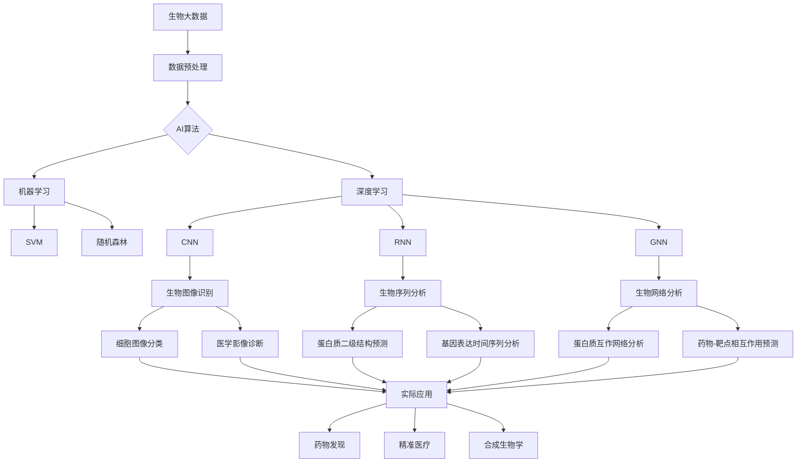

# AI与生物学交叉原理与代码实战案例讲解

## 1. 背景介绍
### 1.1 人工智能与生物学的关系
### 1.2 AI在生物学领域的应用现状
### 1.3 AI与生物学交叉的重要意义

## 2. 核心概念与联系
### 2.1 人工智能的定义与分类
#### 2.1.1 机器学习
#### 2.1.2 深度学习
#### 2.1.3 强化学习
### 2.2 生物信息学的定义与内容
#### 2.2.1 基因组学
#### 2.2.2 蛋白质组学
#### 2.2.3 系统生物学
### 2.3 AI与生物学的交叉点
#### 2.3.1 数据驱动的研究范式
#### 2.3.2 算法与模型的生物学应用
#### 2.3.3 生物学启发的AI算法

## 3. 核心算法原理具体操作步骤
### 3.1 卷积神经网络(CNN)在生物图像识别中的应用
#### 3.1.1 CNN的基本原理
#### 3.1.2 CNN在细胞图像分类中的应用步骤
#### 3.1.3 CNN在医学影像诊断中的应用步骤
### 3.2 循环神经网络(RNN)在生物序列分析中的应用  
#### 3.2.1 RNN的基本原理
#### 3.2.2 RNN在蛋白质二级结构预测中的应用步骤
#### 3.2.3 RNN在基因表达时间序列分析中的应用步骤
### 3.3 图神经网络(GNN)在生物网络分析中的应用
#### 3.3.1 GNN的基本原理
#### 3.3.2 GNN在蛋白质相互作用网络分析中的应用步骤
#### 3.3.3 GNN在药物-靶点相互作用预测中的应用步骤

## 4. 数学模型和公式详细讲解举例说明
### 4.1 支持向量机(SVM)
#### 4.1.1 SVM的数学模型
#### 4.1.2 SVM的目标函数与约束条件
#### 4.1.3 SVM在生物序列分类中的应用举例
### 4.2 隐马尔可夫模型(HMM) 
#### 4.2.1 HMM的数学模型
#### 4.2.2 HMM的三个基本问题
#### 4.2.3 HMM在基因预测中的应用举例
### 4.3 Transformer模型
#### 4.3.1 Transformer的数学模型
#### 4.3.2 Self-Attention机制的数学描述
#### 4.3.3 Transformer在蛋白质结构预测中的应用举例

## 5. 项目实践：代码实例和详细解释说明
### 5.1 使用PyTorch实现CNN用于细胞图像分类
#### 5.1.1 数据集准备与预处理
#### 5.1.2 CNN模型构建
#### 5.1.3 模型训练与评估
### 5.2 使用TensorFlow实现RNN用于蛋白质二级结构预测
#### 5.2.1 数据集准备与编码
#### 5.2.2 RNN模型构建
#### 5.2.3 模型训练与评估
### 5.3 使用DGL实现GNN用于药物-靶点相互作用预测
#### 5.3.1 构建药物-靶点相互作用网络
#### 5.3.2 GNN模型构建
#### 5.3.3 模型训练与评估

## 6. 实际应用场景
### 6.1 AI在药物发现中的应用
#### 6.1.1 虚拟筛选
#### 6.1.2 从头药物设计
#### 6.1.3 药物重定位
### 6.2 AI在精准医疗中的应用
#### 6.2.1 疾病诊断与分型
#### 6.2.2 个性化治疗方案制定
#### 6.2.3 疗效与副作用预测
### 6.3 AI在合成生物学中的应用
#### 6.3.1 基因线路设计
#### 6.3.2 代谢工程
#### 6.3.3 细胞工厂构建

## 7. 工具和资源推荐
### 7.1 深度学习框架
#### 7.1.1 TensorFlow
#### 7.1.2 PyTorch
#### 7.1.3 Keras
### 7.2 生物信息学数据库
#### 7.2.1 NCBI
#### 7.2.2 UniProt
#### 7.2.3 PDB
### 7.3 AI与生物学交叉领域的顶级会议和期刊
#### 7.3.1 ISMB (International Conference on Intelligent Systems for Molecular Biology)
#### 7.3.2 Bioinformatics
#### 7.3.3 Nature Biotechnology

## 8. 总结：未来发展趋势与挑战
### 8.1 AI与生物学交叉的发展趋势
#### 8.1.1 数据驱动的生物学研究范式将进一步深化
#### 8.1.2 AI算法将更加贴近生物学机理
#### 8.1.3 AI将加速生物学研究的自动化和高通量化
### 8.2 AI与生物学交叉面临的挑战
#### 8.2.1 生物大数据的质量与标准化问题
#### 8.2.2 AI模型的可解释性问题
#### 8.2.3 跨学科人才培养问题

## 9. 附录：常见问题与解答
### 9.1 如何选择适合的AI算法来解决生物学问题？
### 9.2 如何处理生物数据的高维度和小样本问题？
### 9.3 如何评估AI模型在生物学应用中的性能？

人工智能(AI)与生物学的交叉融合正在深刻影响着生命科学研究的方方面面。一方面，海量的生物数据为AI技术的发展提供了广阔的应用场景；另一方面，AI强大的数据分析和建模能力也为解决复杂的生物学问题提供了新的思路和方法。

传统的生物学研究主要依赖于实验科学家的经验和直觉，通过对少量样本的观察和分析来揭示生命现象背后的机理。然而，随着高通量测序、蛋白质组学、影像等技术的发展，生物学数据正以前所未有的速度和规模增长，对数据分析提出了巨大挑战。与此同时，许多生物学问题本身就具有高度的复杂性，涉及大量的分子、通路和网络，传统的研究方法难以应对。

AI恰好可以弥补这些不足。机器学习算法可以从海量数据中自动提取特征和模式，发现隐藏在数据背后的规律和知识。深度学习模型可以通过多层次的特征抽象和表示学习，构建端到端的从数据到预测的映射。图神经网络可以直接对图结构数据进行建模和推理，揭示生物网络的结构与功能关联。强化学习算法可以在复杂的生物环境中自主学习和决策，优化实验方案和流程。

本文将重点介绍AI在生物学领域的代表性应用，包括生物图像识别、生物序列分析和生物网络分析。我们将详细阐述几种核心算法的原理和数学模型，并通过代码实例来演示如何使用深度学习框架来实现这些算法。同时，我们也将讨论AI在药物发现、精准医疗、合成生物学等具体场景中的应用案例，展望AI与生物学交叉融合的未来发展趋势，并分析其面临的机遇与挑战。

生物大数据是AI与生物学交叉的基础。各类组学测序数据(如基因组、转录组、表观基因组等)、蛋白质组学数据、代谢组学数据、影像数据(如显微镜图像、医学影像等)构成了生物大数据的主要来源。然而，由于生物数据的高维度、高噪声、小样本等特点，对数据质量提出了很高的要求。因此，数据预处理(如去噪、归一化、特征选择等)是应用AI算法的重要前提。

在算法选择上，既可以使用传统的机器学习算法(如支持向量机SVM、随机森林等)，也可以采用更加先进的深度学习模型(如CNN、RNN、GNN等)。传统的机器学习算法可解释性较好，适合样本量较小的问题；而深度学习模型具有更强的特征提取和建模能力，能够处理大规模复杂数据。

卷积神经网络(CNN)主要用于生物图像数据的分析，如细胞图像分类、医学影像诊断等。CNN通过局部连接和权值共享，可以有效地提取图像的多尺度空间特征。而循环神经网络(RNN)则擅长处理序列数据，如蛋白质和DNA序列。RNN通过在时间维度上的递归连接，可以建模序列的长程依赖关系。图神经网络(GNN)最近也受到了越来越多的关注，它可以直接对图结构数据(如蛋白质互作网络、药物-靶点相互作用网络等)进行端到端的建模，揭示网络中节点的特征表示。

在具体的代码实现上，我们推荐使用主流的深度学习框架，如TensorFlow和PyTorch。这些框架提供了高层的模型构建接口和低层的数值计算库，可以帮助我们快速搭建和训练AI模型。同时，我们还需要借助一些专用的生物信息学工具和数据库，如用于序列比对的BLAST、用于基因功能注释的GO等。

AI模型在生物学中的应用需要考虑不同尺度上的生物问题。在分子层面，AI可以用于预测蛋白质结构、药物-靶点相互作用等；在细胞层面，AI可以用于细胞图像分类、细胞类型鉴定等；在组织和器官层面，AI可以用于组织病理学诊断、器官功能预测等；在个体层面，AI可以用于疾病的早期筛查、个性化治疗等。此外，AI还可以应用于群体遗传学、进化生物学等宏观尺度的研究。

当然，AI在生物学中的应用也面临着一些挑战。首先是生物数据的质量和标准化问题，不同来源和批次的数据可能存在系统偏差，需要进行仔细的校正和整合。其次是AI模型的可解释性问题，由于生物系统的高度复杂性，许多AI模型仍然是"黑箱"，需要开发新的可解释机器学习方法。最后是跨学科人才培养问题，既精通AI又了解生物学的复合型人才十分稀缺，亟需加强多学科交叉融合的教育和科研。

展望未来，AI与生物学的交叉融合必将进一步加深。一方面，数据驱动的生物学研究范式将成为主流，海量数据和AI算法将驱动生物学的新发现；另一方面，AI模型也将越来越多地借鉴生物学的概念和机制，如进化算法、免疫算法、神经拟态等。同时，AI还将促进生物学研究的自动化和高通量化，加速生命科学的发展。

总之，AI为生物学研究注入了新的活力，二者的交叉融合正在开启生命科学的新时代。作为一名计算机科学家，我对这一领域的发展充满期待，也呼吁更多的同仁投身到这一富有挑战又意义非凡的事业中来。让我们携手并进，共同探索生命的奥秘，造福人类的健康！

作者：禅与计算机程序设计艺术 / Zen and the Art of Computer Programming