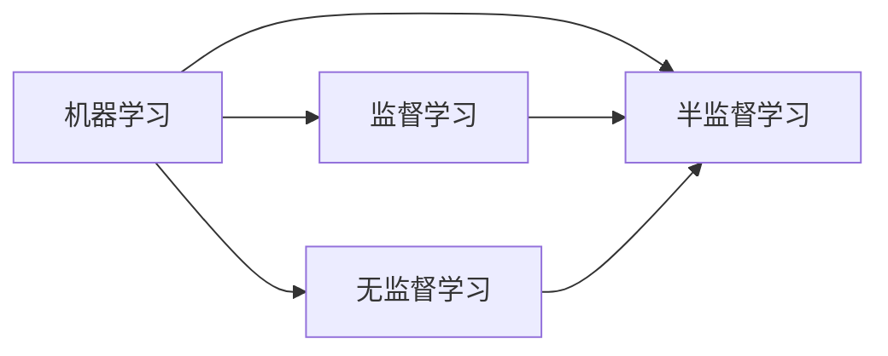

# AI人工智能 Agent：使用半监督学习进行预测

## 1. 背景介绍
### 1.1 人工智能的发展历程
#### 1.1.1 早期人工智能
#### 1.1.2 机器学习的兴起  
#### 1.1.3 深度学习的突破

### 1.2 半监督学习的意义
#### 1.2.1 标注数据的局限性
#### 1.2.2 半监督学习的优势
#### 1.2.3 半监督学习的应用前景

## 2. 核心概念与联系
### 2.1 监督学习
#### 2.1.1 监督学习的定义
#### 2.1.2 监督学习的过程
#### 2.1.3 监督学习的局限性

### 2.2 无监督学习 
#### 2.2.1 无监督学习的定义
#### 2.2.2 无监督学习的过程
#### 2.2.3 无监督学习的局限性

### 2.3 半监督学习
#### 2.3.1 半监督学习的定义  
半监督学习是介于监督学习和无监督学习之间的一种机器学习方法。它利用少量的标注数据和大量的未标注数据来训练模型，从而在标注数据不足的情况下，仍然能够取得较好的学习效果。

#### 2.3.2 半监督学习的过程
半监督学习通常分为以下几个步骤：

1. 准备少量的标注数据和大量的未标注数据。
2. 使用标注数据训练初始模型。
3. 利用初始模型对未标注数据进行预测，得到伪标签。
4. 将伪标签加入到训练集中，重新训练模型。
5. 重复步骤3和4，直到模型收敛或达到预定的迭代次数。

#### 2.3.3 半监督学习的优势
与监督学习和无监督学习相比，半监督学习具有以下优势：

1. 减少标注数据的需求，降低标注成本。
2. 利用未标注数据中的信息，提高模型的泛化能力。
3. 在标注数据不足的情况下，仍然能够取得较好的学习效果。

### 2.4 半监督学习与监督学习、无监督学习的关系

## 3. 核心算法原理具体操作步骤
### 3.1 自训练 (Self-Training)
#### 3.1.1 算法原理
自训练是一种简单而有效的半监督学习算法。其基本思想是：首先使用标注数据训练一个初始模型，然后利用该模型对未标注数据进行预测，将置信度较高的预测结果作为伪标签加入到训练集中，再重新训练模型。通过迭代这个过程，模型可以不断地利用未标注数据中的信息，提高学习效果。

#### 3.1.2 算法步骤
1. 使用标注数据训练初始模型 $f_0$。
2. 对未标注数据进行预测，得到预测结果 $\hat{y}_i=f_0(x_i)$。
3. 选择置信度较高的预测结果作为伪标签，加入到训练集中。
4. 使用新的训练集重新训练模型，得到新的模型 $f_1$。
5. 重复步骤2-4，直到模型收敛或达到预定的迭代次数。

### 3.2 协同训练 (Co-Training)
#### 3.2.1 算法原理
协同训练是另一种常用的半监督学习算法。它假设数据有两个独立的视图（如网页的文本内容和超链接），每个视图都包含足够的信息来训练一个好的分类器。协同训练利用两个视图的互补性，通过两个分类器之间的相互教学，提高学习效果。

#### 3.2.2 算法步骤
1. 将数据划分为两个视图 $V_1$ 和 $V_2$。
2. 使用标注数据在每个视图上分别训练初始模型 $f_1^0$ 和 $f_2^0$。
3. 每个模型对未标注数据进行预测，得到预测结果 $\hat{y}_i^1=f_1^0(x_i^1)$ 和 $\hat{y}_i^2=f_2^0(x_i^2)$。
4. 每个模型选择置信度较高的预测结果作为伪标签，加入到对方的训练集中。
5. 使用新的训练集重新训练两个模型，得到新的模型 $f_1^1$ 和 $f_2^1$。
6. 重复步骤3-5，直到模型收敛或达到预定的迭代次数。

### 3.3 图半监督学习 (Graph-based Semi-Supervised Learning)
#### 3.3.1 算法原理
图半监督学习利用数据之间的相似性关系来进行学习。它将数据表示为一个图，其中节点表示数据样本，边表示样本之间的相似性。通过在图上传播标签信息，可以将已知标签的样本的信息传递给未标注的样本，从而实现半监督学习。

#### 3.3.2 算法步骤
1. 构建数据的相似性图 $G=(V,E)$，其中节点 $v_i \in V$ 表示数据样本，边 $(v_i,v_j) \in E$ 表示样本之间的相似性。
2. 定义边的权重矩阵 $W$，其中 $w_{ij}$ 表示节点 $v_i$ 和 $v_j$ 之间的相似性。
3. 定义标签矩阵 $Y$，其中已知标签的样本的对应元素为1，未知标签的样本的对应元素为0。
4. 定义预测矩阵 $F$，初始化为 $Y$。
5. 迭代更新预测矩阵 $F$，使其满足以下条件：
   - 对于已知标签的样本，保持其标签不变；
   - 对于未知标签的样本，其预测值应该尽可能与其相邻节点的预测值相似。
6. 迭代更新直到 $F$ 收敛，得到最终的预测结果。

## 4. 数学模型和公式详细讲解举例说明
### 4.1 自训练的数学模型
假设我们有标注数据集 $\mathcal{L}=\{(x_1,y_1),\ldots,(x_l,y_l)\}$ 和未标注数据集 $\mathcal{U}=\{x_{l+1},\ldots,x_{l+u}\}$，其中 $x_i \in \mathcal{X}$ 表示输入特征，$y_i \in \mathcal{Y}$ 表示对应的标签。自训练的目标是学习一个分类器 $f:\mathcal{X} \rightarrow \mathcal{Y}$，使其能够对未标注数据进行预测。

自训练的数学模型可以表示为以下优化问题：

$$
\min_{f \in \mathcal{F}} \frac{1}{l} \sum_{i=1}^l L(f(x_i),y_i) + \lambda \frac{1}{u} \sum_{j=l+1}^{l+u} L(f(x_j),\hat{y}_j)
$$

其中，$\mathcal{F}$ 表示分类器的假设空间，$L(\cdot,\cdot)$ 表示损失函数，$\hat{y}_j$ 表示对未标注样本 $x_j$ 的预测结果，$\lambda$ 为平衡因子，用于控制标注数据和未标注数据的重要性。

自训练通过迭代优化上述问题来更新分类器 $f$。在每一轮迭代中，首先使用当前的分类器对未标注数据进行预测，得到伪标签 $\hat{y}_j$；然后将置信度较高的伪标签加入到训练集中，重新训练分类器。通过不断地利用未标注数据中的信息，自训练可以提高分类器的性能。

### 4.2 协同训练的数学模型
假设我们有两个视图 $V_1$ 和 $V_2$，每个视图都有对应的标注数据集 $\mathcal{L}_1=\{(x_1^1,y_1),\ldots,(x_l^1,y_l)\}$ 和 $\mathcal{L}_2=\{(x_1^2,y_1),\ldots,(x_l^2,y_l)\}$，以及未标注数据集 $\mathcal{U}_1=\{x_{l+1}^1,\ldots,x_{l+u}^1\}$ 和 $\mathcal{U}_2=\{x_{l+1}^2,\ldots,x_{l+u}^2\}$。协同训练的目标是学习两个分类器 $f_1:\mathcal{X}_1 \rightarrow \mathcal{Y}$ 和 $f_2:\mathcal{X}_2 \rightarrow \mathcal{Y}$，使它们能够互相教学，提高学习效果。

协同训练的数学模型可以表示为以下优化问题：

$$
\begin{aligned}
\min_{f_1 \in \mathcal{F}_1, f_2 \in \mathcal{F}_2} & \frac{1}{l} \sum_{i=1}^l L(f_1(x_i^1),y_i) + \frac{1}{l} \sum_{i=1}^l L(f_2(x_i^2),y_i) \\
& + \lambda_1 \frac{1}{u} \sum_{j=l+1}^{l+u} L(f_1(x_j^1),\hat{y}_j^2) + \lambda_2 \frac{1}{u} \sum_{j=l+1}^{l+u} L(f_2(x_j^2),\hat{y}_j^1)
\end{aligned}
$$

其中，$\mathcal{F}_1$ 和 $\mathcal{F}_2$ 分别表示两个视图的分类器假设空间，$\hat{y}_j^1$ 和 $\hat{y}_j^2$ 分别表示两个分类器对未标注样本的预测结果，$\lambda_1$ 和 $\lambda_2$ 为平衡因子，用于控制两个视图之间的教学强度。

协同训练通过交替优化上述问题来更新两个分类器 $f_1$ 和 $f_2$。在每一轮迭代中，每个分类器对未标注数据进行预测，得到伪标签；然后将置信度较高的伪标签加入到对方的训练集中，重新训练分类器。通过两个分类器之间的相互教学，协同训练可以有效地利用未标注数据中的信息，提高学习效果。

### 4.3 图半监督学习的数学模型
在图半监督学习中，我们将数据表示为一个无向图 $G=(V,E)$，其中节点 $v_i \in V$ 表示数据样本，边 $(v_i,v_j) \in E$ 表示样本之间的相似性。假设我们有标注数据集 $\mathcal{L}=\{(v_1,y_1),\ldots,(v_l,y_l)\}$ 和未标注数据集 $\mathcal{U}=\{v_{l+1},\ldots,v_{l+u}\}$，图半监督学习的目标是学习一个分类器 $f:V \rightarrow \mathcal{Y}$，使其能够对未标注节点进行预测。

图半监督学习的数学模型可以表示为以下优化问题：

$$
\min_F \frac{1}{2} \sum_{i,j=1}^{l+u} w_{ij} (f_i - f_j)^2 + \mu \sum_{i=1}^l (f_i - y_i)^2
$$

其中，$F=[f_1,\ldots,f_{l+u}]^T$ 表示预测矩阵，$w_{ij}$ 表示节点 $v_i$ 和 $v_j$ 之间的相似性权重，$\mu$ 为平衡因子，用于控制标注数据和图结构的重要性。

上述优化问题可以解释为：第一项要求相似的节点应该有相似的预测值，第二项要求预测值应该与已知标签尽可能一致。通过最小化这两项的加权和，图半监督学习可以在保持已知标签不变的同时，利用节点之间的相似性关系来预测未知标签。

求解上述优化问题可以得到闭式解：

$$
F = (I - \alpha S)^{-1} Y
$$

其中，$I$ 为单位矩阵，$S=D^{-1/2}WD^{-1/2}$ 为归一化的相似性矩阵，$D$ 为度矩阵，$\alpha=1/(1+\mu)$ 为平滑因子，$Y$ 为标签矩阵。

通过上述