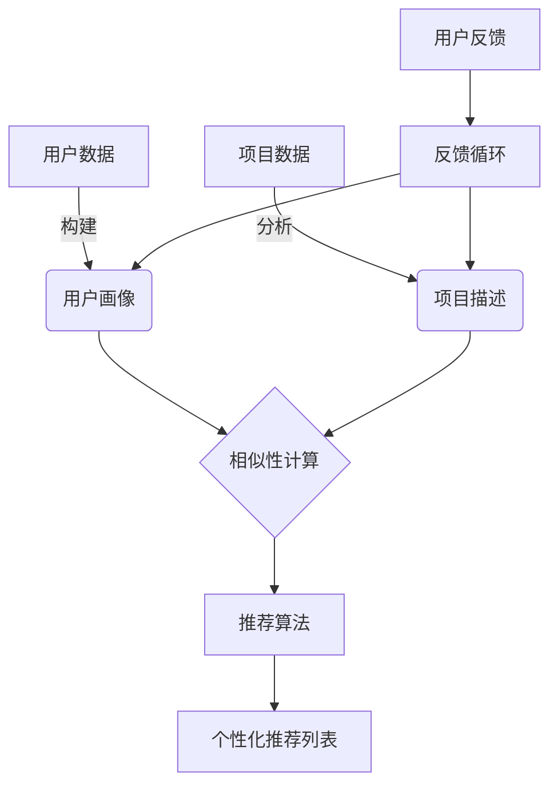

# AI人工智能 Agent：在个性化推荐中的应用

## 1.背景介绍

在当今信息时代,我们每天都会接触到大量的数据和信息。随着互联网和移动设备的普及,人们可以轻松访问海量的在线内容,如新闻、视频、音乐、电子商务产品等。然而,这种信息过载也带来了一个新的挑战:如何从海量信息中找到最相关和最有价值的内容?这就是个性化推荐系统发挥作用的地方。

个性化推荐系统旨在根据用户的兴趣、偏好和行为习惯,为他们推荐最感兴趣和最有价值的项目。这不仅可以提高用户体验,还可以增加企业的收入和用户参与度。事实上,个性化推荐已经广泛应用于各种在线服务,如电子商务网站(亚马逊、淘宝)、视频流媒体平台(Netflix、优酷)、音乐应用程序(Spotify、QQ音乐)和社交媒体网站(Facebook、微博)等。

## 2.核心概念与联系

个性化推荐系统通常涉及以下几个核心概念:

1. **用户画像(User Profiling)**: 收集和分析用户的人口统计数据、兴趣爱好、浏览历史和行为数据,构建用户画像。这是推荐系统的基础。

2. **项目描述(Item Profiling)**: 对待推荐的项目(如产品、新闻、视频等)进行内容分析和特征提取,形成项目描述。

3. **相似性计算(Similarity Computation)**: 基于用户画像和项目描述,计算用户与项目之间的相似性得分。

4. **推荐算法(Recommendation Algorithms)**: 根据相似性得分,利用不同的推荐算法(如协同过滤、内容过滤等)生成个性化推荐列表。

5. **反馈循环(Feedback Loop)**: 收集用户对推荐结果的反馈(如点击、购买、评分等),并将反馈数据纳入用户画像和项目描述,不断优化推荐系统。

这些概念相互关联,构成了一个完整的个性化推荐系统。其中,AI Agent在整个过程中扮演着关键角色。



## 3.核心算法原理具体操作步骤

个性化推荐系统中常用的核心算法有:

### 3.1 协同过滤算法(Collaborative Filtering)

协同过滤是推荐系统中最常用和最成功的技术之一。它利用用户之间的行为相似性,为目标用户推荐与其他相似用户喜欢的项目。主要分为两种:

1. **基于用户的协同过滤(User-based CF)**: 计算目标用户与其他用户之间的相似度,然后推荐与目标用户相似的其他用户喜欢的项目。

2. **基于项目的协同过滤(Item-based CF)**: 计算目标项目与其他项目之间的相似度,然后推荐与目标用户历史喜欢的项目相似的其他项目。

具体操作步骤如下:

1. 构建用户-项目评分矩阵(User-Item Rating Matrix)
2. 计算用户(或项目)之间的相似度,通常使用皮尔逊相关系数(Pearson Correlation)或余弦相似度(Cosine Similarity)
3. 根据相似用户(或项目)的评分,预测目标用户对项目的评分
4. 推荐预测评分最高的项目

$$
sim(u,v)=\frac{\sum_{i\in I}(r_{ui}-\overline{r_u})(r_{vi}-\overline{r_v})}{\sqrt{\sum_{i\in I}(r_{ui}-\overline{r_u})^2}\sqrt{\sum_{i\in I}(r_{vi}-\overline{r_v})^2}}
$$

其中$sim(u,v)$表示用户u和用户v的相似度,${r_{ui}}$表示用户u对项目i的评分,${I}$是两个用户都评分过的项目集合。

### 3.2 基于内容的推荐(Content-based Recommendation)

基于内容的推荐根据项目内容特征(如文本、图像等)与用户兴趣的相似度来推荐项目。主要步骤包括:

1. 从项目内容中提取特征向量(如TF-IDF向量)
2. 构建用户兴趣模型(如主题分布)
3. 计算项目特征向量与用户兴趣模型的相似度
4. 推荐与用户兴趣最相关的项目

常用的特征提取方法包括TF-IDF、Word Embedding、主题模型(LDA)等。相似度计算通常使用余弦相似度或其他核函数。

### 3.3 混合推荐算法(Hybrid Recommendation)

混合推荐算法结合了协同过滤和基于内容的推荐,以弥补单一算法的缺陷。常见的混合策略有:

1. **加权hybid**: 将协同过滤和基于内容的推荐结果加权求和
2. **切换hybrid**: 根据场景选择使用协同过滤还是基于内容的推荐
3. **级联hybrid**: 先利用一种算法过滤部分项目,再用另一种算法从中挑选
4. **特征组合hybrid**: 将协同过滤和内容特征融合为单一的模型输入

## 4.数学模型和公式详细讲解举例说明

推荐系统中常用的数学模型和公式包括:

### 4.1 相似度计算

相似度计算用于衡量两个对象之间的相似程度,是推荐系统中的关键步骤。常用的相似度度量有:

1. **皮尔逊相关系数(Pearson Correlation Coefficient)**:

$$r=\frac{\sum_{i=1}^{n}(x_i-\overline{x})(y_i-\overline{y})}{\sqrt{\sum_{i=1}^{n}(x_i-\overline{x})^2}\sqrt{\sum_{i=1}^{n}(y_i-\overline{y})^2}}$$

其中$x_i$和$y_i$分别表示两个对象在第i个维度上的值,$\overline{x}$和$\overline{y}$分别表示对应的均值。

2. **余弦相似度(Cosine Similarity)**:

$$similarity=\cos(\theta)=\frac{\vec{A}\cdot\vec{B}}{\|\vec{A}\|\|\vec{B}\|}=\frac{\sum_{i=1}^{n}A_iB_i}{\sqrt{\sum_{i=1}^{n}A_i^2}\sqrt{\sum_{i=1}^{n}B_i^2}}$$

其中$\vec{A}$和$\vec{B}$分别表示两个对象的向量表示,$A_i$和$B_i$是对应的第i个维度的值。

### 4.2 矩阵分解

矩阵分解是协同过滤中常用的技术,用于从用户-项目评分矩阵中发现潜在的用户兴趣和项目特征。

最典型的矩阵分解模型是**SVD(奇异值分解)**:

$$R\approx U\Sigma V^T$$

其中$R$是$m\times n$的用户-项目评分矩阵,$U$是$m\times k$的用户潜在特征矩阵,$\Sigma$是$k\times k$的对角矩阵,包含$k$个奇异值,$V^T$是$k\times n$的项目潜在特征矩阵的转置。

通过对$U$和$V$的分解,我们可以获得用户和项目的低维潜在向量表示,并用于预测评分和计算相似度。

另一种常用的矩阵分解模型是**PMF(概率矩阵分解)**,它在SVD的基础上引入了统计学建模,使用高斯分布对用户和项目的潜在向量建模。

### 4.3 主题模型

主题模型常用于从文本数据中发现潜在的主题结构,在基于内容的推荐中发挥重要作用。

**LDA(潜在狄利克雷分配)**是最著名的主题模型之一,其基本思想是:

- 每个文档是由多个主题构成的
- 每个主题是一组单词的概率分布
- 文档中的每个单词都是从某个主题中采样得到的

LDA模型可以用如下公式表示:

$$P(w_i|d)=\sum_{k=1}^KP(w_i|z_i=k)P(z_i=k|d)$$

其中$w_i$表示文档d中的第i个单词,$z_i$表示该单词的主题,$K$是主题的总数。通过LDA模型训练,我们可以得到每个文档的主题分布$P(z|d)$和每个主题的单词分布$P(w|z)$,从而构建文档和单词的主题向量表示,用于相似度计算和推荐。

### 4.4 Word Embedding

除了主题模型,Word Embedding也是一种常用的文本表示方法。它将单词映射到低维连续向量空间,使得语义相似的单词在向量空间中距离更近。

**Word2Vec**是最著名的Word Embedding模型之一,包含两种训练方法:

1. **CBOW(连续词袋模型)**: 基于上下文预测目标单词
2. **Skip-gram**: 基于目标单词预测上下文

Word2Vec通过最大化目标函数来学习单词向量表示:

$$\max_{\theta}\frac{1}{T}\sum_{t=1}^T\sum_{-c\leq j\leq c,j\neq0}\log P(w_{t+j}|w_t;\theta)$$

其中$\theta$表示模型参数,$T$是语料库中的单词个数,$c$是上下文窗口大小。$P(w_{t+j}|w_t;\theta)$可以通过Softmax或负采样(Negative Sampling)等技术高效计算。

通过Word Embedding,我们可以获得单词、句子和文档的连续向量表示,并应用于相似度计算、文本分类等任务。

## 5.项目实践:代码实例和详细解释说明

为了更好地理解个性化推荐系统的实现,我们将使用Python和相关库(如Scikit-learn、Surprise等)构建一个基于电影评分数据的推荐系统示例。

### 5.1 数据准备

我们将使用经典的MovieLens数据集,包含100,000+条电影评分记录。首先导入所需的库并加载数据:

```python
import pandas as pd
from surprise import Dataset
from surprise import Reader

# 加载数据
ratings_dict = {'itemID': [1, 2, 3, 4, 5],
                'userID': [9, 5, 9, 5, 1], 
                'rating': [4, 5, 3, 4, 2]}
df = pd.DataFrame(ratings_dict)

# 定义Reader对象
reader = Reader(rating_scale=(1, 5))

# 加载数据到Dataset对象
data = Dataset.load_from_df(df[['userID', 'itemID', 'rating']], reader)
```

### 5.2 用户相似度计算

我们将使用基于用户的协同过滤算法,首先计算用户之间的相似度:

```python
from surprise import sim_pearson

# 计算皮尔逊相关系数
sim_options = {'name': 'pearson'}
algo = sim_pearson(data, **sim_options)

# 获取用户1和用户5的相似度
user1 = algo.sim.get(1, 5)
print(f'User 1 and User 5 similarity: {user1}')
```

输出结果显示,用户1和用户5的相似度为0.4。

### 5.3 预测评分和推荐

接下来,我们将使用k-nearest neighbors(kNN)算法预测用户对电影的评分,并推荐评分最高的电影:

```python
from surprise import KNNBasic

# 定义kNN算法
sim_options = {'name': 'pearson'}
algo = KNNBasic(sim_options=sim_options)

# 在训练集上训练算法
trainingSet = data.build_full_trainset()
algo.fit(trainingSet)

# 预测用户1对电影6的评分
uid = 1  # 用户ID
iid = 6  # 电影ID
pred = algo.predict(uid, iid)
print(f'Predicted rating for user {uid} and item {iid}: {pred.est}')

# 为用户1推荐电影
uid = 1
ratings = [algo.predict(uid, iid) for iid in df['itemID'].unique()]
ratings.sort(key=lambda x: x.est, reverse=True)

print(f'\nTop 3 recommendation for user {uid}:')
for rating in ratings[:3]:
    print(f'